# Page 1

HIGHLIGHTS OF PRESCRIBING INFORMATION 
These highlights do not include all the information needed to use 
RHOPRESSA® safely and effectively.  See full prescribing information 
for RHOPRESSA®. 
RHOPRESSA® (netarsudil ophthalmic solution) 0.02%, for topical 
ophthalmic use 
Initial U.S. Approval: 2017 
----------------------------RECENT MAJOR CHANGES-------------------------­
Warnings and Precautions, Epithelial Corneal Edema (5.1) 
9/2024 
----------------------------INDICATIONS AND USAGE--------------------------­
RHOPRESSA® is a Rho kinase inhibitor indicated for the reduction of 
elevated intraocular pressure in patients with open-angle glaucoma or ocular 
hypertension. (1) 
------------------------DOSAGE AND ADMINISTRATION---------------------­
One drop into the affected eye(s) once daily in the evening. (2) 
----------------------DOSAGE FORMS AND STRENGTHS--------------------­
Ophthalmic solution containing netarsudil 0.02%. (3) 
FULL PRESCRIBING INFORMATION: CONTENTS* 
1 
INDICATIONS AND USAGE 
2 
DOSAGE AND ADMINISTRATION 
3 
DOSAGE FORMS AND STRENGTHS 
4 
CONTRAINDICATIONS 
5 
WARNINGS AND PRECAUTIONS 
5.1 
Epithelial Corneal Edema 
5.2 
Bacterial Keratitis 
5.3 
Use with Contact Lenses 
6 
ADVERSE REACTIONS 
6.1 
Clinical Trials Experience 
6.2 
Postmarketing Experience 
8 
USE IN SPECIFIC POPULATIONS 
8.1 
Pregnancy 
8.2 
Lactation 
-------------------------------CONTRAINDICATIONS-----------------------------­
None. (4) 
-------------------------------ADVERSE REACTIONS-----------------------------­
The most common adverse reaction is conjunctival hyperemia (53%). Other 
common adverse reactions, approximately 20% include: corneal verticillata, 
instillation site pain, and conjunctival hemorrhage. (6.1) 
To report SUSPECTED ADVERSE REACTIONS, contact Alcon 
Laboratories, Inc. at 1-800-757-9195, or FDA at 
1-800-FDA-1088 or www.fda.gov/medwatch. 
See 17 for PATIENT COUNSELING INFORMATION 
Revised: 9/2024 
8.4 
Pediatric Use 
8.5 
Geriatric Use 
11 
DESCRIPTION 
12 
CLINICAL PHARMACOLOGY 
12.1 
Mechanism of Action 
12.3 
Pharmacokinetics 
13 
NONCLINICAL TOXICOLOGY 
13.1 
Carcinogenesis, Mutagenesis, Impairment of Fertility 
14 
CLINICAL STUDIES 
16 
HOW SUPPLIED/STORAGE AND HANDLING 
17 
PATIENT COUNSELING INFORMATION 
*Sections or subsections omitted from the full prescribing information are not 
listed. 
Reference ID: 5448648

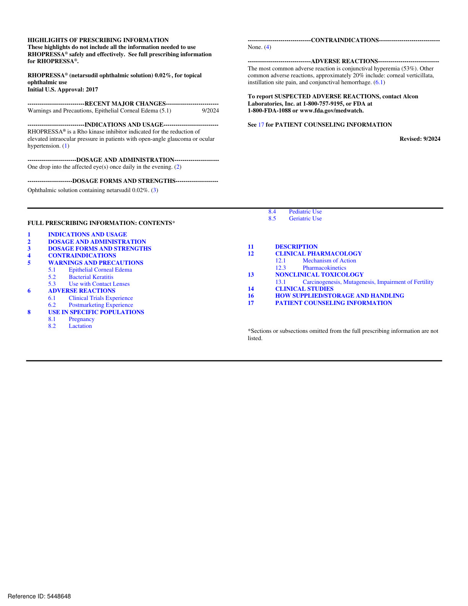

# Page 2

FULL PRESCRIBING INFORMATION 
1 
INDICATIONS AND USAGE 
RHOPRESSA is indicated for the reduction of elevated intraocular pressure (IOP) in patients with open-angle 
glaucoma or ocular hypertension. 
2 
DOSAGE AND ADMINISTRATION 
The recommended dosage is one drop in the affected eye(s) once daily in the evening. 
If one dose is missed, treatment should continue with the next dose in the evening. Twice a day dosing is not 
well tolerated and is not recommended. If RHOPRESSA is to be used concomitantly with other topical 
ophthalmic drug products to lower IOP, administer each drug product at least 5 minutes apart [see Patient 
Counseling Information (17)]. 
3 
DOSAGE FORMS AND STRENGTHS 
Ophthalmic solution containing netarsudil 0.02% (0.2 mg/mL). 
4 
CONTRAINDICATIONS 
None. 
5 
WARNINGS AND PRECAUTIONS 
5.1 Epithelial Corneal Edema 
Epithelial corneal edema, described as honeycomb or bullous, has been reported in some patients with pre­
existing corneal stromal edema or following ocular procedures that could affect corneal endothelial function.  
Epithelial corneal edema typically resolves upon discontinuation of RHOPRESSA. Advise patients to notify 
their physician if they experience eye pain or decreased vision while using RHOPRESSA. [see Adverse 
Reactions (6.2) and Patient Counselling Information (17)]. 
5.2 Bacterial Keratitis 
There have been reports of bacterial keratitis associated with the use of multiple-dose containers of topical 
ophthalmic products. These containers had been inadvertently contaminated by patients who, in most cases, had 
a concurrent corneal disease or a disruption of the ocular epithelial surface [see Patient Counseling Information 
(17)]. 
5.3 Use with Contact Lenses 
Contact lenses should be removed prior to instillation of RHOPRESSA and may be reinserted 15 minutes 
following its administration. 
ADVERSE REACTIONS 
6.1 Clinical Trials Experience 
Because clinical studies are conducted under widely varying conditions, adverse reaction rates observed in the 
clinical studies of a drug cannot be directly compared to rates in the clinical studies of another drug and may not 
reflect the rates observed in practice. 
The most common ocular adverse reaction observed in controlled clinical studies with RHOPRESSA dosed 
once daily was conjunctival hyperemia which was reported in 53% of patients. Six percent of patients 
discontinued therapy due to conjunctival hyperemia. Other common (approximately 20%) ocular adverse 
reactions reported were: corneal verticillata, instillation site pain, and conjunctival hemorrhage.  Instillation site 
Reference ID: 5448648 
6

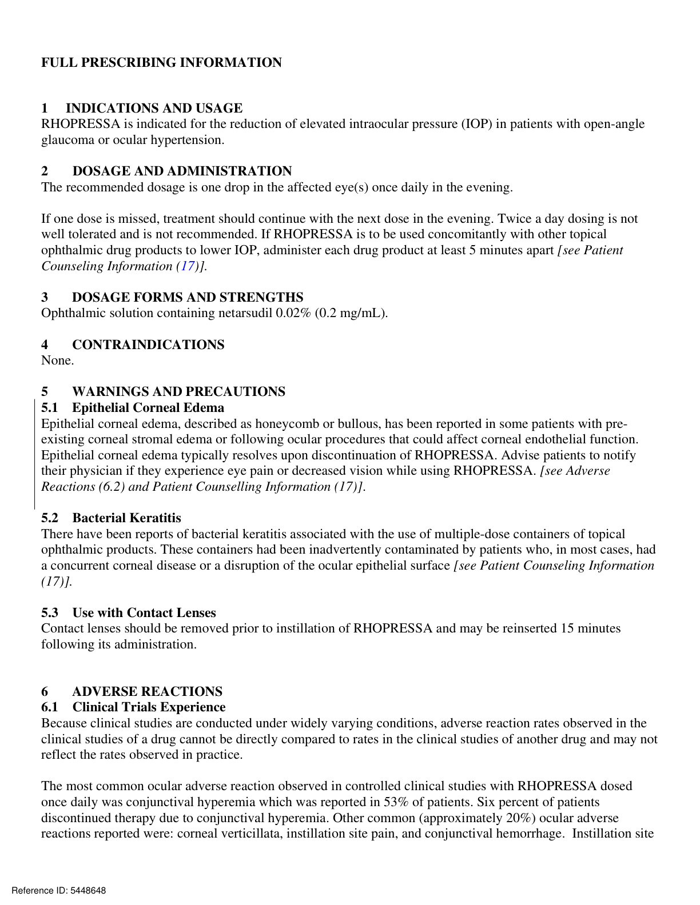

# Page 3

erythema, corneal staining, blurred vision, increased lacrimation, erythema of eyelid, and reduced visual acuity 
were reported in 5-10% of patients. 
Corneal Verticillata 
Corneal verticillata occurred in approximately 20% of the patients in controlled clinical studies. The corneal 
verticillata seen in RHOPRESSA-treated patients were first noted at 4 weeks of daily dosing. This reaction did 
not result in any apparent visual functional changes in patients. Most corneal verticillata resolved upon 
discontinuation of treatment. 
6.2 Postmarketing Experience 
The following adverse reactions have been identified during postmarketing use of RHOPRESSA.  Because 
these reactions are reported voluntarily from a population of uncertain size, it is not always possible to reliably 
estimate their frequency or establish a causal relationship to drug exposure. 
Eye disorders: Epithelial corneal edema has been reported in some patients with pre-existing corneal stromal 
edema or following ocular procedures that could affect corneal endothelial function [see Warnings and 
Precautions (5.1)]. 
8 
USE IN SPECIFIC POPULATIONS 
8.1 Pregnancy 
Risk Summary 
There are no available data on RHOPRESSA use in pregnant women to inform any drug associated risk; 
however, systemic exposure to netarsudil from ocular administration is low [see Clinical Pharmacology (12.3)]. 
Intravenous administration of netarsudil to pregnant rats and rabbits during organogenesis did not produce 
adverse embryofetal effects at clinically relevant systemic exposures (see Data). 
Data 
Animal Data 
Netarsudil administered daily by intravenous injection to rats during organogenesis caused abortions and 
embryofetal lethality at doses ≥0.3 mg/kg/day (126-fold the plasma exposure at the recommended human 
ophthalmic dose [RHOD], based on Cmax). The no-observed-adverse-effect-level (NOAEL) for embryofetal 
development toxicity was 0.1 mg/kg/day (40-fold the plasma exposure at the RHOD, based on Cmax). 
Netarsudil administered daily by intravenous injection to rabbits during organogenesis caused embryofetal 
lethality and decreased fetal weight at 5 mg/kg/day (1480-fold the plasma exposure at the RHOD, based on Cmax). 
Malformations were observed at ≥3 mg/kg/day (1330-fold the plasma exposure at the RHOD, based on Cmax), 
including thoracogastroschisis, umbilical hernia and absent intermediate lung lobe. The NOAEL for embryofetal 
development toxicity was 0.5 mg/kg/day (214-fold the plasma exposure at the RHOD, based on Cmax). 
8.2 
Lactation 
Risk Summary 
There are no data on the presence of RHOPRESSA in human milk, the effects on the breastfed infant, or the 
effects on milk production. However, systemic exposure to netarsudil following topical ocular administration is 
low [see Clinical Pharmacology (12.3)], and it is not known whether measurable levels of netarsudil would be 
present in maternal milk following topical ocular administration. 
The developmental and health benefits of breastfeeding should be considered along with the mother’s clinical 
need for RHOPRESSA and any potential adverse effects on the breast-fed child from RHOPRESSA. 
Reference ID: 5448648

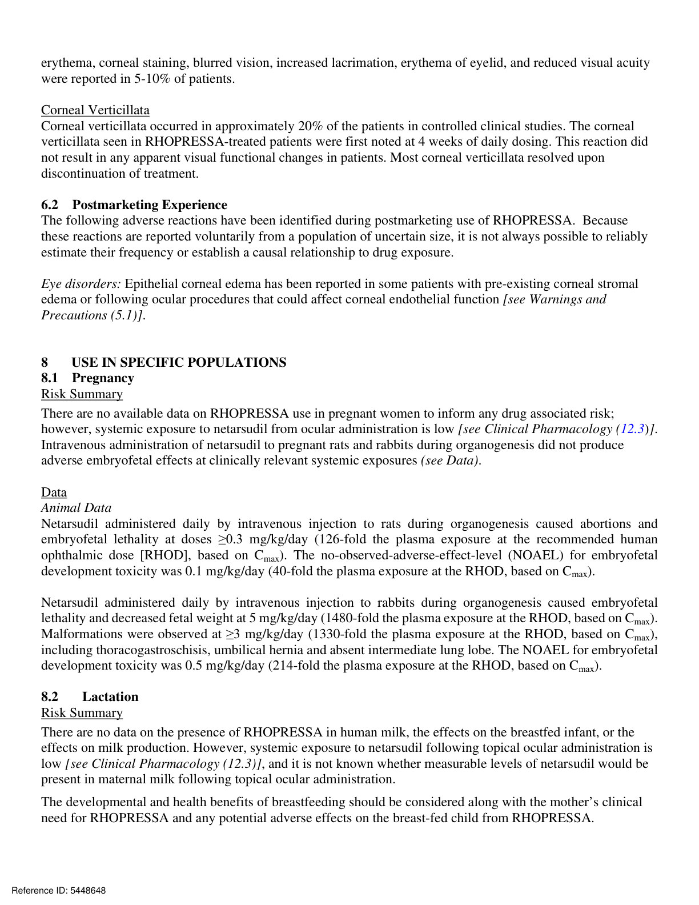

# Page 4

0 
II 
-S-OH 
II 0 
0 
II 
-S-OH 
~ 
8.4 Pediatric Use 
Safety and effectiveness in pediatric patients below the age of 18 years have not been established. 
8.5 Geriatric Use 
No overall differences in safety or effectiveness have been observed between elderly and other adult patients. 
11 
DESCRIPTION 
Netarsudil is a Rho kinase inhibitor. Its chemical name is (S)-4-(3-amino-1-(isoquinolin-6-yl-amino)-1­
oxopropan-2-yl) benzyl 2,4-dimethylbenzoate dimesylate. The molecular formula of the free base is 
C28H27N3O3 and the molecular formula of the dimesylate is C30H35N3O9S2. The molecular weight of the free 
base is 453.54 and the molecular weight of the dimesylate is 645.74.  The chemical structure is: 
Netarsudil dimesylate is a light yellow-to-white powder that is freely soluble in water, soluble in methanol, 
sparingly soluble in dimethyl formamide, and practically insoluble in dichloromethane and heptane. 
RHOPRESSA (netarsudil ophthalmic solution) 0.02% is supplied as a sterile, isotonic, buffered aqueous 
solution of netarsudil dimesylate with a pH of approximately 5 and an osmolality of approximately 295 
mOsmol/kg. It is intended for topical application in the eye. Each mL of RHOPRESSA contains 0.2 mg of 
netarsudil (equivalent to 0.28 mg of netarsudil dimesylate). Benzalkonium chloride, 0.015%, is added as a 
preservative. The inactive ingredients are: boric acid, mannitol, sodium hydroxide to adjust pH, and water for 
injection. 
12 
CLINICAL PHARMACOLOGY 
12.1 
Mechanism of Action 
Netarsudil is a rho kinase inhibitor, which is believed to reduce IOP by increasing the outflow of aqueous 
humor through the trabecular meshwork. The exact mechanism is unknown. 
12.3 
Pharmacokinetics 
Absorption 
The systemic exposures of netarsudil and its active metabolite, AR-13503, were evaluated in 18 healthy 
subjects after topical ocular administration of RHOPRESSA 0.02% once daily (one drop bilaterally in the 
morning) for 8 days. There were no quantifiable plasma concentrations of netarsudil (lower limit of quantitation 
(LLOQ) 0.100 ng/mL) post dose on Day 1 and Day 8. Only one plasma concentration at 0.11 ng/mL for the 
active metabolite was observed for one subject on Day 8 at 8 hours post-dose. 
Metabolism 
After topical ocular dosing, netarsudil is metabolized by esterases in the eye. 
Reference ID: 5448648

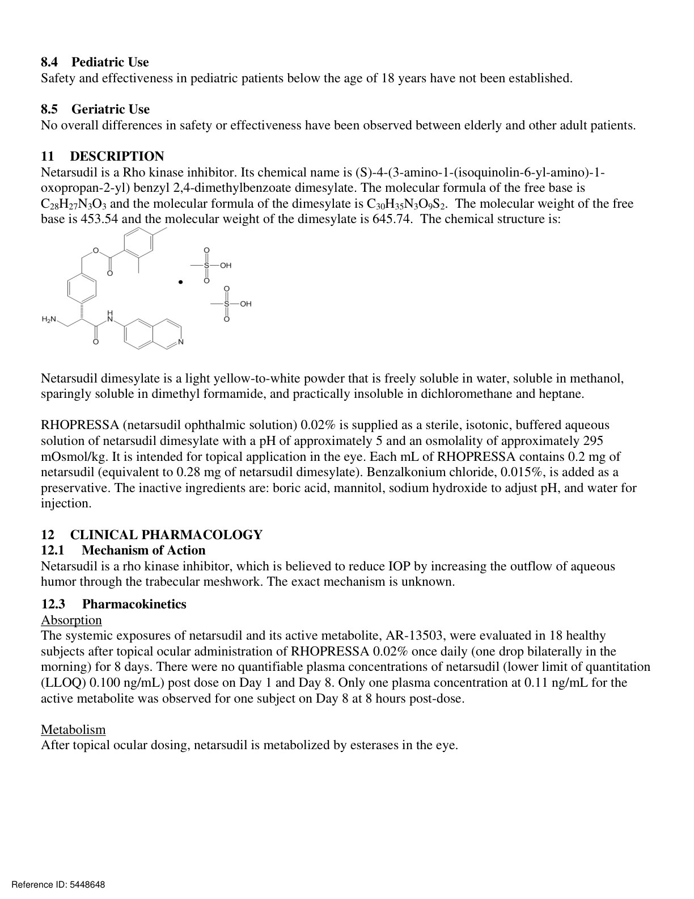

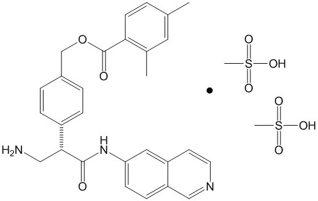

# Page 5

Study 301: Subjects with Baseline IOP < 25 mmHg 
Study 301: Subjects with Baseline IOP >= 25 and < 27 mmHg 
Visit 
Rhopressa nmolol Difference (95% Cl) 
Visit 
Rhopressa nmolol Difference (95% Cl) 
(N=113l 
(N=124l 
Rho12ressa -Timolol 
(N=69l 
(N=64l 
Rho12ressa -Timolol 
Baseline 
: 
Baseline 
Sam 
22.4 
22.5 
I 
Sam 
25.1 
25.1 
I 
10am 
21.3 
21.1 
I 
10am 
23.9 
23.6 
I 
4pm 
20.6 
20.5 
I 
4pm 
23.7 
23.3 
I 
Change From Baseline 
I 
Change From Baseline 
I 
I 
Day 15 
I 
Day 15 
I 
Sam 
-5.1 
-4.7 
-0.3 (-0.9, 0.3) 
~ 
8am 
-4.3 
-5.7 
1.3 (0.4, 2.3) 
--
10am 
-5.0 
-4.2 
-0.9 (-1.5, -0.3) 
__ , 
I 
10am 
-4.9 
-5.0 
0.1 (-0.9, 1.2) 
-+-
4pm 
-4.4 
-3.4 
-0.9 (-1.6, -0.3) 
I 
4pm 
-4.7 
-4.6 
-0.1 (-1.2, 0.9) 
I 
--, 
--
Day 43 
I 
Day 43 
I 
I 
I 
0.2 (-0.5, 0.9) 
I 
2. 7 (1.5, 3.8) 
I 
Sam 
-4.5 
-4.7 
--
8am 
-3.3 
-6.0 
I -
I 
I 
10am 
-4.3 
-4.2 
-0.2 (-0.8, 0.5) 
-el-
10am 
-3.7 
-5.3 
1.6 (0.4, 2.7) 
,_ 
I 
I 
4pm 
-4.0 
-3.3 
-0.7 (-1.4, 0.0) 
..._J 
4pm 
-3.7 
-4.8 
1.2 (0.0, 2.3) 
r-
I 
Day 90 
I 
Day 90 
I 
I 
I 
0.4 (-0.2, 1.1) 
I 
Sam 
-2.6 
-5.5 
3.0 (1.8, 4.1) 
I 
Sam 
-4.2 
-4.6 
--
I -
I 
2.5 (1.4, 3.6) 
I 
10am 
-3.9 
-3.7 
-0.2 (-0.9, 0.5) 
---
10am 
-2.2 
-4.7 
I --
I 
I 
4pm 
-3.6 
-3.2 
-0.4 (-1.0, 0.3) 
_.. 
4pm 
-2.6 
-4.9 
2.3 (1.2, 3.5) 
I --
I 
I 
I 
I 
I 
I 
I 
I 
I 
I 
I 
I 
-4 
-2 
0 
2 
4 
-4 
-2 
0 
2 
4 
13 
NONCLINICAL TOXICOLOGY 
13.1 Carcinogenesis, Mutagenesis, Impairment of Fertility 
Long-term studies in animals have not been performed to evaluate the carcinogenic potential of netarsudil.  
Netarsudil was not mutagenic in the Ames test, in the mouse lymphoma test, or in the in vivo rat micronucleus 
test. Studies to evaluate the effects of netarsudil on male or female fertility in animals have not been performed. 
14 
CLINICAL STUDIES 
RHOPRESSA 0.02% was evaluated in three randomized and controlled clinical trials, namely AR-13324­
CS301 (NCT 02207491, referred to as Study 301), AR-13324-CS302 (NCT 02207621, referred to as Study 
302), and AR-13324-CS304 (NCT 02558374, referred to as Study 304), in patients with open-angle glaucoma 
or ocular hypertension. Studies 301 and 302 enrolled subjects with baseline IOP lower than 27 mmHg and 
Study 304 enrolled subjects with baseline IOP lower than 30 mmHg. The treatment duration was 3 months in 
Study 301, 12 months in Study 302, and 6 months in Study 304. 
The three studies demonstrated up to 5 mmHg reductions in IOP for subjects treated with RHOPRESSA 0.02% 
once daily in the evening. For patients with baseline IOP < 25 mmHg, the IOP reductions with RHOPRESSA 
0.02% dosed once daily were similar to those with timolol 0.5% dosed twice daily (see Table 1).  For patients 
with baseline IOP equal to or above 25 mmHg, however, RHOPRESSA 0.02% resulted in smaller mean IOP 
reductions at the morning time points than timolol 0.5% for study visits on Days 43 and 90; the difference in 
mean IOP reduction between the two treatment groups was as high as 3 mmHg, favoring timolol. 
Table 1: Mean IOP Change from Baseline of Study Eye (mmHg) by Visit and Time  
Reference ID: 5448648

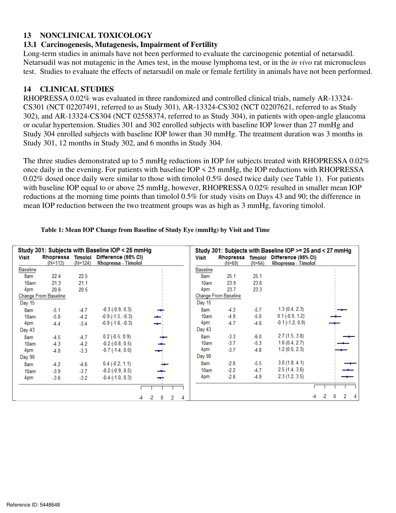

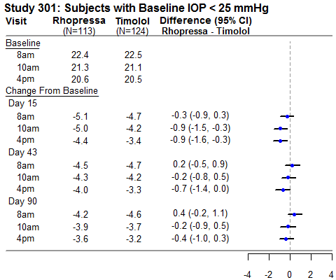

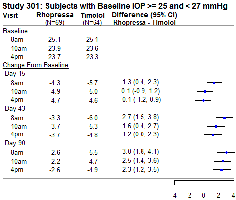

# Page 6

Study 302: Subjects with Baseline IOP < 25 mmHg 
Study 302: Subjects with Baseline IOP >= 25 and< 27 mmHg 
Visit 
Rhopressa Timolol Difference (95% Cl) 
Visit 
Rhopressa Timolol Differenc.e (95% Cl) 
(N=129l 
(N=142l 
Rho11ressa - Timolol 
(N=77l 
(N=75l 
Rho11ressa -Timolol 
Baseline 
; 
Baseline 
--
8am 
22.5 
22.5 
I 
8am 
25.1 
25.2 
I 
10am 
21 .3 
21 .3 
I 
10am 
24.0 
23.9 
I 
4pm 
20.4 
20.7 
I 
4pm 
23.5 
23.3 
I 
Change From Baseline 
I 
Change From Baseline 
I 
I 
I 
Day 15 
I 
Day 15 
I 
I 
I 
8am 
-4.5 
-4.9 
0.4 (-0.2, 1.0) 
-t-
8am 
-4.5 
-5.9 
1.4 (0.5, 2.3) 
, __ 
I 
10am 
-4.6 
-4.4 
-0.2 (-0.8, 0.4) 
-+ 
10am 
-4.5 
-5.4 
0.9 (-0.1, 1.9) 
l--
4pm 
-3.9 
-3.8 
-0.1 (-0.6, 0.5) 
I 
4pm 
-4.9 
-4.3 
-0.6 (-1.5, 0.3) 
I 
-<I"" 
._,.. 
Day 43 
I 
Day 43 
I 
I 
I 
0.5 (-0.1, 1.1) 
I 
2.6 (1.5, 3. 7) 
I 
8am 
-4.6 
-5.1 
-
8am 
-3.4 
-5.9 
I -
I 
I 
10am 
-4.4 
-4.7 
0.3 (-0.3, 0.9) 
~ 
10am 
-3.8 
-5.3 
1.5 (0.5, 2.6) 
, __ 
I 
I 
4pm 
-3.5 
-4.0 
0.5 (-0.1, 1.1) 
t--
4pm 
-3.9 
-4.9 
0.9 (0.0, 1.9) 
f--
Day 90 
I 
Day 90 
I 
I 
I 
8am 
-4.3 
-5.1 
0.8 (0.1, 1.5) 
I 
8am 
-3.4 
-5.6 
2.1 (1.1, 3.2) 
I 
, __ 
I -
0.1 (-0.5, 0.8) 
I 
1.7 (0.6, 2.8) 
I 
10am 
-4.3 
-4.4 
--
10am 
-3.5 
-5.3 
, __ 
I 
I 
4pm 
-3.4 
-3.7 
0.3 (-0.4, 1.0) 
..._ 
4pm 
-4.4 
-4.3 
-0.1 (-1.2, 1.0) 
--
I 
I 
I 
I 
I 
I 
I 
I 
I 
I 
I 
I 
-4 
-2 
0 
2 
4 
-4 
-2 
0 
2 
4 
Study 304: Subjects with Baseline IOP < 25 mmHg 
Study 304: Subjects with Baseline IOP >= 25 and < 30 mmHg 
Visit 
Rhopressa Timolol Difference (95% Cl) 
Visit 
Rhopressa Timolol Difference (95% Cl) 
(N=186l 
(N=187l 
Rho11ressa -Timolol 
(N=120l 
(N=130l 
Rho11ressa -Timolol 
Baseline 
; 
Baseline 
--
8am 
22.4 
22.4 
I 
8am 
26.3 
26.0 
I 
10am 
21.1 
21 .3 
I 
10am 
25.2 
24.9 
I 
4pm 
20.7 
20.7 
I 
4pm 
24.5 
24.0 
I 
Change From Baseline 
I 
Change From Baseline 
I 
I 
Day 15 
I 
Day 15 
I 
8am 
-4.7 
-4.9 
0.2 (-0.4, 0.8) 
-r 
Barn 
-4.7 
-5.9 
1.2 (0.3, 2.0) 
--
10am 
-4.5 
-4.5 
0.0 (-0.5, 0.5) 
+ 
10am 
-5.0 
-5.6 
0.6 (-0.2, 1.5) 
+--
4pm 
-4.4 
-3.8 
-0.6 (-1.1, -0.1) 
I 
4pm 
-4.3 
-4.9 
0.6 (-0.2, 1.3) 
I 
...., 
,-+-
Day 43 
I 
Day 43 
I 
I 
I 
0.3 (-0.3, 0.8) 
I 
1.9 (1.0, 2.8) 
I 
8am 
-4.6 
-4.8 
-
Barn 
-4.3 
-6.2 
I -
I 
I 
10am 
-4.3 
-4.3 
-0.1 (-0.6, 0.5) 
...... 
10am 
-4.7 
-5.8 
1.1 (0.2, 1.9) 
, __ 
I 
I 
4pm 
-4.1 
-4.0 
-0.1 (-0.6, 0.4) 
+ 
4pm 
-4.3 
-4.4 
0.2 (-0.6, 1.0) 
+ 
Day 90 
I 
Day 90 
I 
I 
I 
8am 
-4.5 
-5.2 
0.6 (0.0, 1.2) 
I 
Barn 
-4.5 
-6.1 
1.6 (0.6, 2.5) 
I 
r-+-
, __ 
0.4 (-0.2, 0.9) 
I 
1.8 (0.9, 2. 7) 
I 
10am 
-4.1 
-4.5 
-
10am 
-4.1 
-5.9 
I --
I 
I 
4pm 
-3.9 
-3.9 
0.0 (-0.6, 0.5) 
-+-
4pm 
-3.9 
-5.0 
1.1 (0.2, 1.9) 
, __ 
I 
I 
I 
I 
I 
I 
I 
I 
I 
I 
I 
I 
-4 
-2 
0 
2 
4 
-4 
-2 
0 
2 
4 
This table was produced based on the observed data from all randomized subjects who did not have major protocol violations. The treatment differences and two-sided CIs for 
comparing Rhopressa QD vs Timolol BID 0.5% were based on Analysis of Covariance (ANCOVA) adjusted for baseline IOP. 
16 
HOW SUPPLIED/STORAGE AND HANDLING 
RHOPRESSA® (netarsudil ophthalmic solution) 0.02% is supplied sterile in opaque white low density 
polyethylene bottles and tips with white polypropylene caps. 
2.5 mL fill in a 4 mL container 
NDC # 70727-497-25 
Storage: Store at 2°C to 8°C (36°F to 46°F) until opened. After opening, the product may be kept at 2°C to 
25°C (36°F to 77°F) for up to 6 weeks. If after opening the product is kept refrigerated at 2°C to 8°C (36°F to 
46°F), then the product can be used until the expiration date stamped on the bottle. During shipment, the bottle 
may be maintained at temperatures up to 40°C (104°F) for a period not exceeding 14 days. 
Reference ID: 5448648

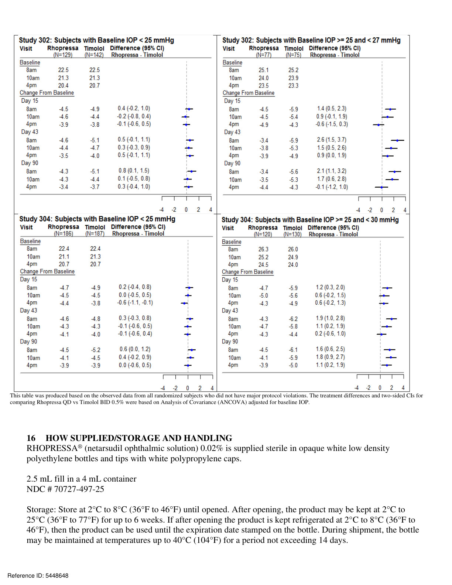

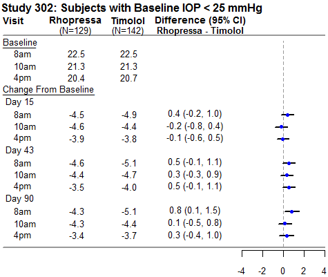

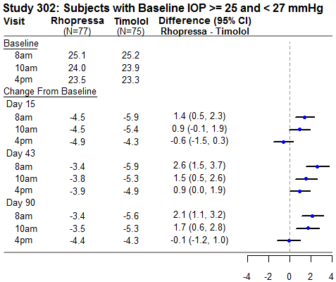

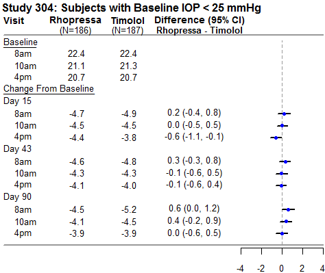

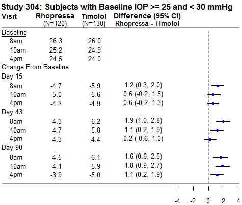

# Page 7

17 PATIENT COUNSELING INFORMATION 
Handling the Container 
Instruct patients to avoid allowing the tip of the dispensing container to contact the eye, surrounding structures, 
fingers, or any other surface in order to minimize contamination of the solution. Serious damage to the eye and 
subsequent loss of vision may result from using contaminated solutions [see Warnings and Precautions (5.2)]. 
When to Seek Physician Advice 
Advise patients that if they develop an intercurrent ocular condition (e.g., trauma,  infection, or decreased vision 
with or without eye pain), have ocular surgery, or develop any ocular reactions, particularly conjunctivitis and 
eyelid reactions, they should immediately seek their physician’s advice concerning the continued use of 
RHOPRESSA. 
Use with Contact Lenses 
Advise patients that RHOPRESSA contains benzalkonium chloride, which may be absorbed by soft contact 
lenses. Contact lenses should be removed prior to instillation of RHOPRESSA and may be reinserted 
15 minutes following its administration. 
Use with Other Ophthalmic Drugs 
Advise patients that if more than one topical ophthalmic drug is being used, the drugs should be administered at 
least 5 minutes between applications. 
Missed Dose 
Advise patients that if one dose is missed, treatment should continue with the next dose in the evening. 
© 2024 Alcon Inc. 
U.S. Pat.: www.alconpatents.com 
Manufactured for:  ALCON LABORATORIES,INC 6201 South Freeway Fort Worth, 
Texas 76134 USA 
1-800-757-9195 
Alcon.medinfo@alcon.com 
Reference ID: 5448648

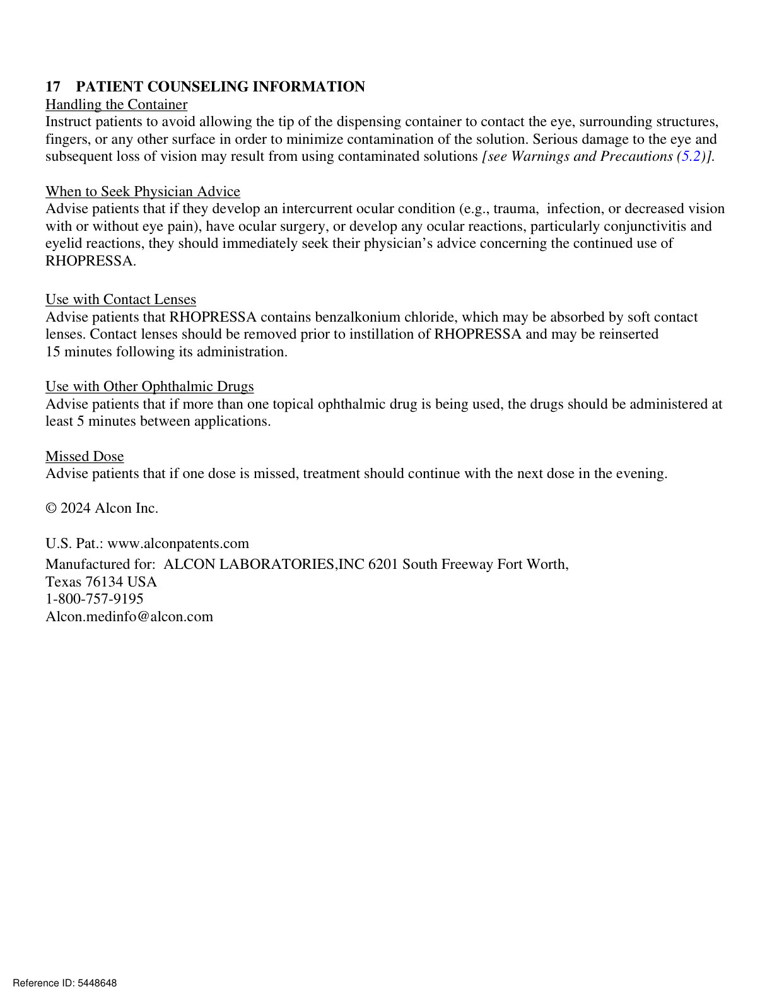
