# Page 1

NDA 208259 
Page 5 
HIGHLIGHTS OF PRESCRIBING INFORMATION 
These highlights do not include all the information needed to use 
ROCKLATAN™ safely and effectively. See full prescribing information 
for ROCKLATAN™. 
ROCKLATAN™ (netarsudil and latanoprost ophthalmic solution) 
0.02%/0.005%, for topical ophthalmic use 
Initial U.S. Approval: 2019 
-----------------------------INDICATIONS AND USAGE-----------------------­
ROCKLATAN™ 0.02%/0.005% is a fixed dose combination of a Rho 
kinase inhibitor and a prostaglandin F2α analogue indicated for the reduction 
of elevated intraocular pressure (IOP) in patients with open-angle glaucoma 
or ocular hypertension. (1) 
------------------------DOSAGE AND ADMINISTRATION-------------------­
One drop in the affected eye(s) once daily in the evening. (2) 
-----------------------DOSAGE FORMS AND STRENGTHS-----------------­
Ophthalmic solution containing netarsudil 0.2 mg/mL (0.02%) and 
latanoprost 0.05 mg/mL (0.005%). (3) 
Full Prescribing Information: Contents* 
1 
INDICATIONS AND USAGE 
2 
DOSAGE AND ADMINISTRATION 
3 
DOSAGE FORMS AND STRENGTHS 
4 
CONTRAINDICATIONS 
5 
WARNINGS AND PRECAUTIONS 
5.1 
Pigmentation 
5.2 
Eyelash Changes 
5.3 
Intraocular Inflammation 
5.4 
Macular Edema 
5.5 
Herpetic Keratitis 
5.6 
Bacterial Keratitis 
5.7 
Use with Contact Lenses 
6 
ADVERSE REACTIONS 
6.1 
Clinical Trials Experience 
7 
DRUG INTERACTIONS 
------------------------WARNINGS AND PRECAUTIONS------------------------­
  Pigmentation: Pigmentation of the iris, periorbital tissue (eyelid) and  
eyelashes can occur. Iris pigmentation likely to be permanent. (5.1)  
  Eyelash Changes: Gradual change to eyelashes including increased  
length, thickness and number of lashes. Usually reversible. (5.2)  
-------------------------------ADVERSE REACTIONS-------------------------------­
The most common adverse reaction is conjunctival hyperemia (59%). Other 
common adverse reactions were: instillation site pain (20%), corneal verticillata 
(15%), and conjunctival hemorrhage (11%). (6.1) 
To report SUSPECTED ADVERSE REACTIONS, contact Aerie 
Pharmaceuticals, Inc. at 1-855-740-1924, or FDA at 
1-800-FDA-1088 or www.fda.gov/medwatch. 
-------------------------------DRUG INTERACTIONS--------------------------------
Thimerosal: In vitro studies have shown that precipitation occurs when eye 
drops containing thimerosal are mixed with latanoprost 0.005%. If such drugs 
are used, they should be administered at least 5 minutes apart. (7) 
See 17 for PATIENT COUNSELING INFORMATION 
Revised: 03/2019 
8 
USE IN SPECIFIC POPULATIONS 
8.1 
Pregnancy 
8.2 
Lactation 
8.4 
Pediatric Use 
8.5 
Geriatric Use 
11 
DESCRIPTION 
12 
CLINICAL PHARMACOLOGY 
12.1 
Mechanism of Action 
12.3 
Pharmacokinetics 
13 
NONCLINICAL TOXICOLOGY 
13.1 
Carcinogenesis, Mutagenesis, Impairment of Fertility 
14 
CLINICAL STUDIES 
16 
HOW SUPPLIED/STORAGE AND HANDLING 
17 
PATIENT COUNSELING INFORMATION 
*Sections or subsections omitted from the full prescribing information are not 
listed. 
Reference ID: 4402790 
This label may not be the latest approved by FDA.  
For current labeling information, please visit https://www.fda.gov/drugsatfda

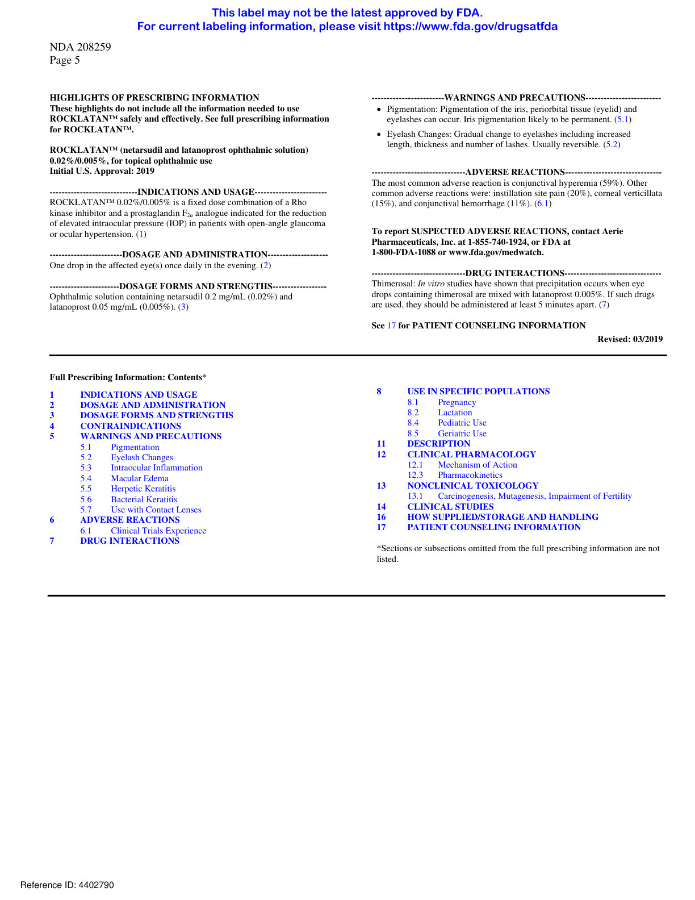

# Page 2

NDA 208259 
Page 6 
FULL PRESCRIBING INFORMATION 
1.  
INDICATIONS AND USAGE 
ROCKLATAN (netarsudil and latanoprost ophthalmic solution) 0.02%/0.005% is a fixed dose 
combination of a Rho kinase inhibitor and a prostaglandin F2α analogue indicated for the reduction of 
elevated intraocular pressure (IOP) in patients with open-angle glaucoma or ocular hypertension. 
2.  
DOSAGE AND ADMINISTRATION 
The recommended dosage is one drop in the affected eye(s) once daily in the evening. If one dose is 
missed, treatment should continue with the next dose in the evening. The dosage of ROCKLATAN should 
not exceed once daily. 
ROCKLATAN may be used concomitantly with other topical ophthalmic drug products to lower IOP.  
If more than one topical ophthalmic drug is being used, the drugs should be administered at least five (5)  
minutes apart.  
3.  
DOSAGE FORMS AND STRENGTHS 
Ophthalmic solution containing netarsudil 0.2 mg/mL and latanoprost 0.05 mg/mL. 
4.  
CONTRAINDICATIONS 
None. 
5.  
WARNINGS AND PRECAUTIONS 
5.1  Pigmentation 
ROCKLATAN contains latanoprost which has been reported to cause changes to pigmented tissues. The 
most frequently reported changes have been increased pigmentation of the iris, periorbital tissue (eyelid), 
and eyelashes. Pigmentation is expected to increase as long as latanoprost is administered. 
The pigmentation change is due to increased melanin content in the melanocytes rather than to an increase 
in the number of melanocytes. After discontinuation of latanoprost, pigmentation of the iris is likely to be 
permanent, while pigmentation of the periorbital tissue and eyelash changes have been reported to be 
reversible in some patients. Patients who receive treatment should be informed of the possibility of 
increased pigmentation. Beyond 5 years the effects of increased pigmentation are not known. 
Iris color change may not be noticeable for several months to years. Typically, the brown pigmentation 
around the pupil spreads concentrically towards the periphery of the iris and the entire iris or parts of the 
iris become more brownish. Neither nevi nor freckles of the iris appear to be affected by treatment. While 
treatment with ROCKLATAN can be continued in patients who develop noticeably increased iris 
pigmentation, these patients should be examined regularly [see Patient Counseling Information (17)]. 
5.2  Eyelash Changes 
ROCKLATAN contains latanoprost which may gradually change eyelashes and vellus hair in the treated 
eye; these changes include increased length, thickness, pigmentation, the number of lashes or hairs, and 
misdirected growth of eyelashes. Eyelash changes are usually reversible upon discontinuation of treatment 
[see Patient Counseling Information (17)]. 
5.3  Intraocular Inflammation 
ROCKLATAN contains latanoprost which should be used with caution in patients with a history of 
intraocular inflammation (iritis/uveitis) and should generally not be used in patients with active intraocular 
inflammation because it may exacerbate inflammation. 
Reference ID: 4402790 
This label may not be the latest approved by FDA.  
For current labeling information, please visit https://www.fda.gov/drugsatfda

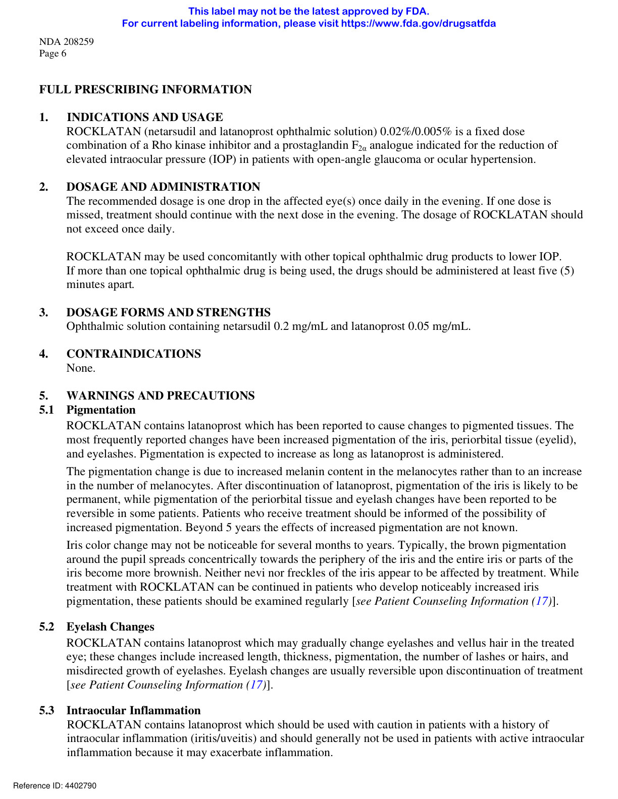

# Page 3

NDA 208259 
Page 7 
5.4    Macular Edema 
Macular edema, including cystoid macular edema, has been reported during treatment with latanoprost. 
ROCKLATAN should be used with caution in aphakic patients, in pseudophakic patients with a torn 
posterior lens capsule, or in patients with known risk factors for macular edema. 
5.5    Herpetic Keratitis 
Reactivation of Herpes Simplex keratitis has been reported during treatment with latanoprost. 
ROCKLATAN should be used with caution in patients with a history of herpetic keratitis. ROCKLATAN 
should be avoided in cases of active herpes simplex keratitis because it may exacerbate inflammation. 
5.6    Bacterial Keratitis 
There have been reports of bacterial keratitis associated with the use of multiple-dose containers of topical 
ophthalmic products. These containers had been inadvertently contaminated by patients who, in most 
cases, had a concurrent corneal disease or a disruption of the ocular epithelial surface [see Patient 
Counseling Information (17)]. 
5.7    Use with Contact Lenses 
Contact lenses should be removed prior to the administration of ROCKLATAN and may be reinserted 
15 minutes after administration. 
6 
ADVERSE REACTIONS 
6.1    Clinical Trials Experience 
Because clinical studies are conducted under widely varying conditions, adverse reaction rates observed in 
the clinical studies of a drug cannot be directly compared to rates in the clinical trials of another drug and 
may not reflect the rates observed in clinical practice. 
The most common ocular adverse reaction observed in controlled clinical studies with ROCKLATAN was 
conjunctival hyperemia which was reported in 59% of patients. Five percent of patients discontinued 
therapy due to conjunctival hyperemia. Other common ocular adverse reactions reported were: instillation 
site pain (20%), corneal verticillata (15%), and conjunctival hemorrhage (11%). Eye pruritus, visual acuity 
reduced, increased lacrimation, instillation site discomfort, and blurred vision were reported in 5-8% of 
patients. 
Other adverse reactions that have been reported with the individual components and not listed above 
include: 
Netarsudil 0.02% 
Instillation site erythema, corneal staining, increased lacrimation, and erythema of eyelid. 
 Latanoprost 0.005% 
Foreign body sensation, punctate keratitis, burning and stinging, itching, increased pigmentation of the 
iris, excessive tearing, eyelid discomfort, dry eye, eye pain, eyelid margin crusting, erythema of the eyelid, 
upper respiratory tract infection/nasopharyngitis/influenza, photophobia, eyelid edema, 
myalgia/arthralgia/back pain, and rash/allergic reactions. 
Reference ID: 4402790 
This label may not be the latest approved by FDA.  
For current labeling information, please visit https://www.fda.gov/drugsatfda

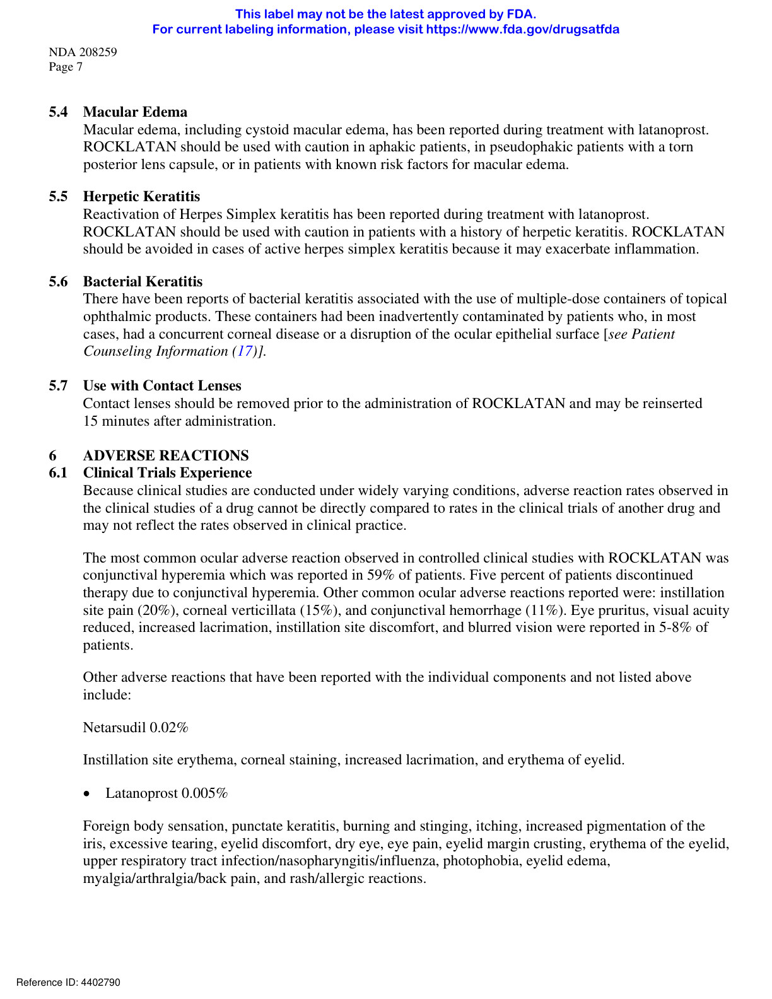

# Page 4

NDA 208259 
Page 8 
7  
DRUG INTERACTIONS 
Although specific drug interaction studies have not been conducted with ROCKLATAN, in vitro studies 
have shown that precipitation occurs when eye drops containing thimerosal are mixed with latanoprost 
ophthalmic solution 0.005%. If such drugs are used, they should be administered at least five (5) minutes 
apart. 
The combined use of two or more prostaglandins or prostaglandin analogs including latanoprost 
ophthalmic solution 0.005% is not recommended. It has been shown that administration of these 
prostaglandin drug products more than once daily may decrease the IOP lowering effect or cause 
paradoxical elevations in IOP. 
8 USE IN SPECIFIC POPULATIONS 
8.1  Pregnancy 
Risk Summary 
There are no adequate and well-controlled studies of ROCKLATAN ophthalmic solution or its 
pharmacologically active ingredients (netarsudil and latanoprost) in pregnant women to inform any drug 
associated risk. However, systemic exposure to netarsudil from ocular administration is low [see Clinical 
Pharmacology (12.3)]. 
Reproduction studies of latanoprost showed embryofetal lethality in rabbits. No embryofetal lethality was 
observed at a dose approximately 15 times higher than the recommended human ophthalmic dose 
(RHOD). Intravenous administration of netarsudil to pregnant rats and rabbits during organogenesis did 
not produce adverse embryofetal effects at clinically relevant systemic exposures. ROCKLATAN should 
be used during pregnancy only if the potential benefit justifies the potential risk to the fetus. 
Data 
Animal Data 
Netarsudil administered daily by intravenous injection to rats during organogenesis caused abortions and 
embryofetal lethality at doses ≥0.3 mg/kg/day (126-fold the plasma exposure at the RHOD, based on 
Cmax). The no-observed-adverse-effect-level (NOAEL) for embryofetal development toxicity was 
0.1 mg/kg/day (40-fold the plasma exposure at the RHOD, based on Cmax). 
Netarsudil administered daily by intravenous injection to rabbits during organogenesis caused embryofetal 
lethality and decreased fetal weight at 5 mg/kg/day (1480-fold the plasma exposure at the RHOD, based 
on Cmax). Malformations were observed at ≥3 mg/kg/day (1330-fold the plasma exposure at the RHOD, 
based on Cmax), including thoracogastroschisis, umbilical hernia and absent intermediate lung lobe. The 
NOAEL for embryofetal development toxicity was 0.5 mg/kg/day (214-fold the plasma exposure at the 
RHOD, based on Cmax). 
Reproduction studies have been performed with latanoprost in rats and rabbits. In 4 of 16 pregnant rabbits, 
no viable fetuses were present at a dose that was approximately 80 times higher than the RHOD. 
Latanoprost did not produce embryofetal lethality in rabbits at a dose approximately 15 times higher than 
the RHOD. 
8.2  Lactation 
Risk Summary 
There are no data on the presence of netarsudil or latanoprost in human milk, the effects on the breastfed 
infant, or the effects on milk production. However, systemic exposure to netarsudil following topical 
ocular administration is low, and it is not known whether measurable levels of netarsudil would be present 
in maternal milk following topical ocular administration. 
Reference ID: 4402790 
This label may not be the latest approved by FDA.  
For current labeling information, please visit https://www.fda.gov/drugsatfda

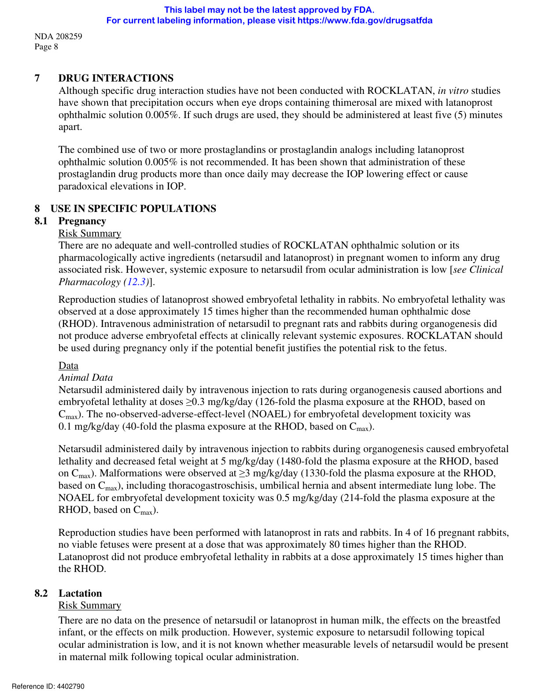

# Page 5

NDA 208259 
Page 9 
The developmental and health benefits of breastfeeding should be considered along with the mother’s 
clinical need for ROCKLATAN and any potential adverse effects on the breast-fed child from 
ROCKLATAN. 
8.4  Pediatric Use 
Safety and effectiveness in pediatric patients have not been established. 
8.5  Geriatric Use 
No overall differences in safety or effectiveness have been observed between elderly and other adult 
patients. 
11.  DESCRIPTION 
ROCKLATAN (netarsudil and latanoprost ophthalmic solution) 0.02%/0.005% is a fixed dose 
combination of a Rho kinase inhibitor and a prostaglandin F2α analogue. 
The chemical name of netarsudil dimesylate is: (S)-4-(3-amino-1-(isoquinolin-6-yl-amino)-1-oxopropan­
2-yl)benzyl 2,4-dimethylbenzoate dimesylate. Its molecular formula is C30H35N3O9S2 and its chemical 
structure is: 
Netarsudil mesylate is a light yellow to white powder that is freely soluble in water, soluble in methanol, 
sparingly soluble in dimethyl formamide, and practically insoluble in dichloromethane and heptane. 
The chemical name of latanoprost is: isopropyl-(Z)-7[1R,2R,3R,5S) 3,5-dihydroxy-2-[(3R)-3-hydroxy-5­
phenylpentyl]cyclopentyl]-5-heptenoate. Its molecular formula is C26H40O5 and its chemical structure is: 
Reference ID: 4402790 
This label may not be the latest approved by FDA.  
For current labeling information, please visit https://www.fda.gov/drugsatfda

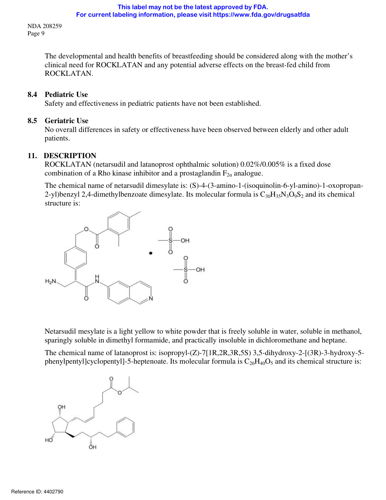

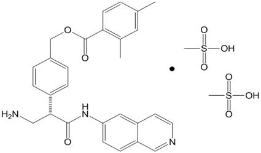

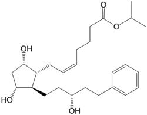

# Page 6

NDA 208259 
Page 10 
Latanoprost is a colorless to slightly yellow oil that is very soluble in acetonitrile and freely soluble in 
acetone, ethanol, ethyl acetate, isopropanol, methanol, and octanol. It is practically insoluble in water. 
ROCKLATAN (netarsudil and latanoprost ophthalmic solution) 0.02%/0.005% is supplied as a sterile, 
isotonic, buffered aqueous solution of netarsudil mesylate and latanoprost with a pH of approximately 5 
and an osmolality of approximately 295 mOsmol/kg. Each mL of ROCKLATAN contains 0.20 mg of 
netarsudil (equivalent to 0.28 mg of netarsudil dimesylate) and 0.05 mg latanoprost. Benzalkonium 
chloride, 0.02%, is added as a preservative. The inactive ingredients are: boric acid, mannitol, sodium 
hydroxide to adjust pH, and water for injection. 
12    CLINICAL PHARMACOLOGY 
12.1  Mechanism of Action 
ROCKLATAN is comprised of two components: netarsudil and latanoprost. Each of these two 
components decreases elevated IOP. Elevated IOP represents a major risk factor for glaucomatous field 
loss. The higher the level of IOP, the greater the likelihood of optic nerve damage and glaucomatous 
visual field loss. 
ROCKLATAN is believed to reduce IOP by increasing the outflow of aqueous humor. 
12.3 Pharmacokinetics 
Absorption 
The systemic exposures of netarsudil and its active metabolite, AR-13503, were evaluated in 18 healthy 
subjects after topical ocular administration of netarsudil ophthalmic solution 0.02% once daily (1 drop 
bilaterally in the morning) for 8 days. There were no quantifiable plasma concentrations of netarsudil 
(lower limit of quantitation (LLOQ) 0.100 ng/mL) post dose on Day 1 and Day 8. Only 1 plasma 
concentration at 0.11 ng/mL for the active metabolite was observed for 1 subject on Day 8 at 8 hours 
post-dose. 
Distribution 
The distribution volume in humans is 0.16 ± 0.02 L/kg. Latanoprost is absorbed through the cornea where 
the isopropyl ester prodrug is hydrolyzed to the acid form to become biologically active. The acid of 
latanoprost can be measured in aqueous humor during the first 4 hours, and in plasma only during the first 
hour after local administration. 
Metabolism  
After topical ocular dosing, netarsudil is metabolized by esterases in the eye to an active metabolite,  
AR-13503.  
Latanoprost, an isopropyl ester prodrug, is hydrolyzed by esterases in the cornea to the biologically active 
acid. The active acid of latanoprost reaching the systemic circulation is primarily metabolized by the liver 
to the 1,2-dinor and 1,2,3,4-tetranor metabolites via fatty acid β-oxidation. 
Excretion 
The elimination of the acid of latanoprost from human plasma is rapid (t½ = 17 min) after both intravenous 
and topical administration. Systemic clearance is approximately 7 mL/min/kg. Following hepatic 
β-oxidation, the metabolites are mainly eliminated via the kidneys. Approximately 88% and 98% of the 
administered dose are recovered in the urine after topical and intravenous dosing, respectively. 
Reference ID: 4402790 
This label may not be the latest approved by FDA.  
For current labeling information, please visit https://www.fda.gov/drugsatfda

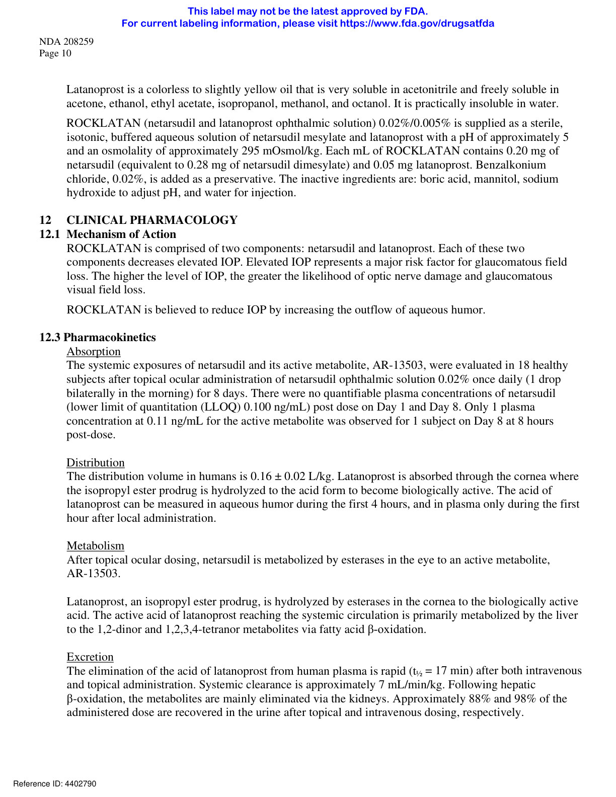

# Page 7

NDA 208259 
Page 11 
13 
NONCLINICAL TOXICOLOGY 
13.1 Carcinogenesis, Mutagenesis, Impairment of Fertility 
Carcinogenesis 
Long-term studies in animals have not been performed to evaluate the carcinogenic potential of netarsudil. 
Latanoprost was not carcinogenic in either mice or rats when administered by oral gavage at doses of up 
to 170 mcg/kg/day (approximately 2800 times the RHOD) for up to 20 and 24 months, respectively. 
Mutagenesis  
Netarsudil was not mutagenic in the Ames test, in the mouse lymphoma test, or in the in vivo rat  
micronucleus test.  
Latanoprost was not mutagenic in bacteria, in mouse lymphoma, or in mouse micronucleus tests.  
Chromosome aberrations were observed in vitro with human lymphocytes. Additional in vitro and in vivo  
studies on unscheduled DNA synthesis in rats were negative.  
Impairment of Fertility  
Studies to evaluate the effects of netarsudil on male or female fertility in animals have not been  
performed.  
Latanoprost has not been found to have effects on male or female fertility in animal studies.  
14. CLINICAL STUDIES 
ROCKLATAN (netarsudil and latanoprost ophthalmic solution) 0.02%/0.005% was evaluated in 
2 randomized and controlled clinical trials, namely PG324-CS301 (NCT 02558400, referred to as 
Study 301) and PG324-CS302 (NCT 02674854, referred to as Study 302) in patients with open-angle 
glaucoma and ocular hypertension. Studies 301 and 302 enrolled subjects with IOP < 36 mmHg and 
compared IOP lowering effect of ROCKLATAN dosed once daily to individually administered netarsudil 
0.02% once daily and latanoprost 0.005% once daily. The treatment duration was 12 months for 
Study 301 and 3 months for Study 302. 
The average IOP lowering effect of ROCKLATAN was 1 to 3 mmHg greater than monotherapy with 
either netarsudil 0.02% or latanoprost 0.005% throughout 3 months (Figures 1 and 2). In Study 301 IOP 
reductions were maintained throughout 12 months. 
Reference ID: 4402790 
This label may not be the latest approved by FDA.  
For current labeling information, please visit https://www.fda.gov/drugsatfda

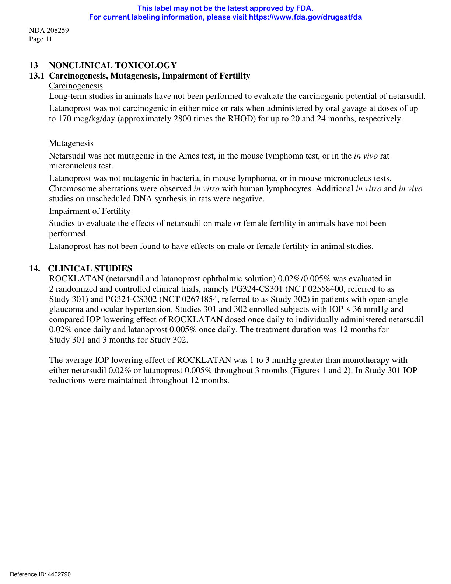

# Page 8

NDA 208259 
Page 12 
Figure 1: Study 301 Mean IOP (mmHg) by Treatment Group and Treatment Difference in Mean IOP 
14 
15 
16 
17 
18 
19 
20 
21 
22 
23 
15.6 
18.6 
17.8 
Day 15 
(8AM) 
14.9 
14.8 
17.9 
17.2
17.4 
17.2 
Day 15 
(10AM)
 Day 15 
(4PM) 
Rocklatan 
Baseline 
8AM    10AM  4PM 
24.8 
23.7
 22.6 
16.0 
15.2 
15.3 
19.1 
18.1 
17.6
17.7 
17.1 
17.0 
Day 43 
(8AM) 
Day 43 
(10AM) 
Day 43 
(4PM) 
Netarsudil 
Baseline 
8AM    10AM  4PM 
24.8 
23.5
 22.6 
16.1 
15.2 
19.3 
18.4 
17.6 
16.9 
Day 90 
(8AM) 
Day 90 
(10AM) 
Latanoprost 
Baseline 
8AM    10AM  4PM 
24.6 
23.4
 22.4 
15.4 
17.4 
16.7 
Day 90 
(4PM) 
Rocklatan vs. 
Netarsudil 
95% CI 
3.0 
(2.5, 3.6) 
3.0 
(2.4, 3.6) 
2.4 
(1.9, 3.0) 
3.2 
(2.6, 3.8) 
2.9 
(2.3, 3.5) 
2.3 
(1.7, 2.8) 
3.1 
(2.5, 3.8) 
3.2 
(2.5, 3.8) 
2.0 
(1.4, 2.6) 
Rocklatan vs. 
Latanoprost 
95% CI 
2.3 
(1.7, 2.8) 
2.6 
(2.0, 3.2) 
2.3 
(1.8, 2.9) 
1.7 
(1.1, 2.4) 
1.9 
(1.3, 2.5) 
1.7 
(1.1, 2.2) 
1.5 
(0.9, 2.1) 
1.7 
(1.1, 2.3) 
1.3 
(0.7, 1.9) 
The least square mean IOP at each post-baseline time point was derived using an analysis of covariance adjusted for baseline IOP and based on observed data for all 
randomized subjects (238 in Rocklatan group, 244 in netarsudil group, 236 in latanoprost group). 
Reference ID: 4402790 
This label may not be the latest approved by FDA.  
For current labeling information, please visit https://www.fda.gov/drugsatfda

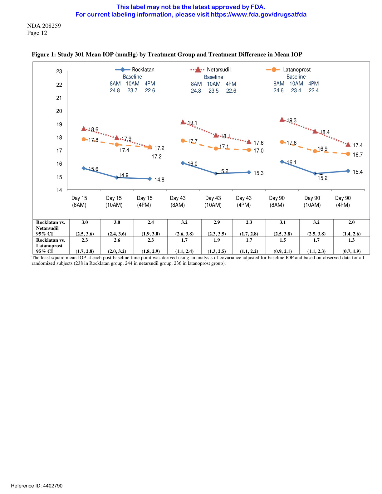

# Page 9

NDA 208259 
Page 13 
Figure 2: Study 302 Mean IOP (mmHg) by Treatment Group and Treatment Difference in Mean IOP 
14 
15 
16 
17 
18 
19 
20 
21 
22 
23 
16.1 
19.4 
18.1 
Day 15 
(8AM) 
15.3 
15.2 
18.0 
17.5
17.7 
17.1 
Day 15 
(10AM)
 Day 15 
(4PM) 
Rocklatan 
Baseline 
8AM    10AM  4PM 
24.7 
23.3
 22.4 
16.4 
15.5 
15.5 
19.6 
18.4 
17.9
17.9 
17.4 
17.1 
Day 43 
(8AM) 
Day 43 
(10AM) 
Day 43 
(4PM) 
Netarsudil 
Baseline 
8AM    10AM  4PM 
24.7 
23.4
 22.8 
16.4 
15.6 
20.0 
18.4 
17.9 
17.5 
Day 90 
(8AM) 
Day 90 
(10AM) 
Latanoprost 
Baseline 
8AM    10AM  4PM 
24.8 
23.2
 22.6 
15.6 
18.0 
17.1 
Day 90 
(4PM) 
Rocklatan vs. 
Netarsudil 
95% CI 
3.4 
(2.8, 3.9) 
2.7 
(2.2, 3.2) 
2.2 
(1.7, 2.8) 
3.2 
(2.6, 3.8) 
2.9 
(2.3, 3.4) 
2.3 
(1.8, 2.9) 
3.6 
(3.0, 4.2) 
2.8 
(2.3, 3.4) 
2.4 
(1.9, 2.9) 
Rocklatan vs. 
Latanoprost 
95% CI 
2.0 
(1.5, 2.6) 
2.4 
(1.9, 2.9) 
1.9 
(1.3, 2.4) 
1.5 
(0.9, 2.1) 
1.9 
(1.3, 2.4) 
1.6 
(1.0, 2.1) 
1.5 
(0.9, 2.2) 
2.0 
(1.4, 2.5) 
1.5 
(1.0, 2.1) 
The least square mean IOP at each post-baseline time point was derived using an analysis of covariance adjusted for baseline IOP and based on observed data for all 
randomized subjects (245 in Rocklatan group, 255 in netarsudil group, 250 in latanoprost group). 
16. HOW SUPPLIED/STORAGE AND HANDLING 
ROCKLATAN (netarsudil and latanoprost ophthalmic solution) 0.02%/0.005% is supplied sterile in clear 
low density polyethylene bottles with opaque white polyethylene dropper tips and white polypropylene 
screw caps. 
2.5 mL fill in a 4 mL container - NDC # 70727-529-25 
Storage: Protect from light. Store at 2°C to 8°C (36°F to 46°F). During shipment, the bottle may be 
maintained at temperatures up to 40°C (104°F) for a period not exceeding 14 days. After opening, 
ROCKLATAN can be used until the expiration date on the bottle. 
17. PATIENT COUNSELING INFORMATION 
Potential for Pigmentation  
Advise patients about the potential for increased brown pigmentation of the iris, which may be permanent.  
Inform patients about the possibility of eyelid skin darkening, which may be reversible after  
discontinuation of ROCKLATAN [see Warnings and Precautions (5.1)].  
Potential for Eyelash Changes 
Inform patients of the possibility of eyelash and vellus hair changes in the treated eye during treatment 
with ROCKLATAN. These changes may result in a disparity between eyes in length, thickness, 
pigmentation, number of eyelashes or vellus hairs, and/or direction of eyelash growth. Eyelash changes 
are usually reversible upon discontinuation of treatment. 
Reference ID: 4402790 
This label may not be the latest approved by FDA.  
For current labeling information, please visit https://www.fda.gov/drugsatfda

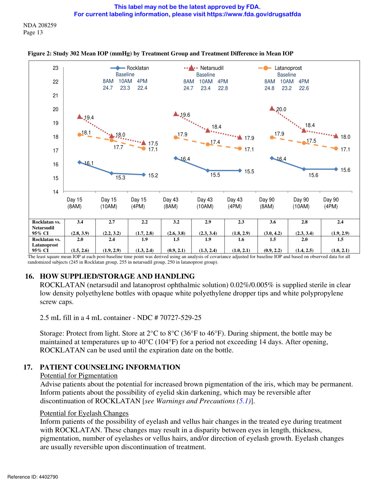

# Page 10

NDA 208259 
Page 14 
Handling the Container 
Instruct patients to avoid allowing the tip of the dispensing container to contact the eye, surrounding 
structures, fingers, or any other surface in order to minimize contamination of the solution. Serious 
damage to the eye and subsequent loss of vision may result from using contaminated solutions 
[see Warnings and Precautions (5.6)]. 
When to Seek Physician Advice 
Advise patients that if they develop an intercurrent ocular condition (e.g., trauma or infection), have ocular 
surgery, or develop any ocular reactions, particularly conjunctivitis and eyelid reactions, they should 
immediately seek their physician’s advice concerning the continued use of ROCKLATAN. 
Use with Contact Lenses 
Advise patients that ROCKLATAN contains benzalkonium chloride, which may be absorbed by soft 
contact lenses. Contact lenses should be removed prior to instillation of ROCKLATAN and may be 
reinserted 15 minutes following its administration. 
Use with Other Ophthalmic Drugs 
If more than 1 topical ophthalmic drug is being used, the drugs should be administered at least 5 minutes 
between applications. 
Missed Dose  
Advise patients that if one dose is missed, treatment should continue with the next dose in the evening.  
U.S. Patent Nos.: 8,450,344; 8,394,826; 9,096,569; 9,415,043; 9,931,336; 9,993,470  
ROCKLATAN is a trademark of Aerie Pharmaceuticals, Inc.  
Manufactured for: Aerie Pharmaceuticals, Inc., Irvine, CA 92614, U.S.A.  
Reference ID: 4402790 
This label may not be the latest approved by FDA.  
For current labeling information, please visit https://www.fda.gov/drugsatfda

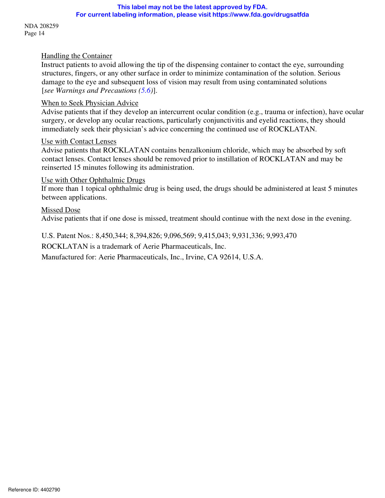
