# Page 1

August 2025
Investor Presentation

# Page 2

Disclaimer
All statements other than statements of historical facts included in this presentation that address activities, events or developments that we expect, believe or anticipate will 
or may occur in the future are forward-looking statements. These statements are based on management’s current expectations, assumptions, estimates and beliefs. 
Although we believe that we have a reasonable basis for forward-looking statements contained herein, we caution you that they are based on current expectations about 
future events affecting us and are subject to risks, uncertainties and factors relating to our operations and business environment, all of which are difficult to predict and 
many of which are beyond our control, that may cause our actual results to differ materially from those expressed or implied by forward-looking statements in this 
presentation. These potential risks and uncertainties that could cause actual results to differ materially from those described in forward-looking statements include, without 
limitation, our ability to successfully commercialize our iDose TR therapy; the impact of general macroeconomic conditions including foreign currency fluctuations and future 
health crises on our business; our ability to generate sales of our commercialized products and develop and commercialize additional products; our dependence on a limited 
number of third-party suppliers, some of which are single-source, for components of our products; the occurrence of a crippling accident, natural disaster, or other 
disruption at our primary facility, which may materially affect our manufacturing capacity and operations; securing or maintaining adequate coverage or reimbursement by 
government or third-party payors for procedures using the iStent®, the iStent inject® W, iAccess, iPRIME, iStent infinite, iDose® TR, our corneal cross-linking products or other 
products in development, and our compliance with the requirements of participation in federal healthcare programs such as Medicare and Medicaid; our ability to properly 
train, and gain acceptance and trust from, ophthalmic surgeons in the use of our products; our compliance with federal, state and foreign laws and regulations for the 
approval and sale and marketing of our products and of our manufacturing processes; the lengthy and expensive clinical trial process and the uncertainty of timing and 
outcomes from any particular clinical trial or regulatory approval processes; the risk of recalls or serious safety issues with our products and the uncertainty of patient 
outcomes; healthcare legislative or regulatory reform measures and changes in U.S. and international trade policies, including budgetary cuts and the imposition of tariffs, 
which could have a material adverse effect on our results of operations and product commercial success; our ability to protect our information systems against cyber threats 
and cybersecurity incidents, and to comply with state, federal and foreign data privacy laws and regulations; our ability to protect, and the expense and time-consuming 
nature of protecting, our intellectual property against third parties and competitors and the impact of any claims against us for infringement or misappropriation of third 
party intellectual property rights and any related litigation; and our ability to service our indebtedness. 
These and other known risks, uncertainties and factors are described in detail under the caption “Risk Factors” and elsewhere in our filings with the Securities and Exchange 
Commission (SEC), including our Quarterly Report on Form 10-Q for the quarter ended June 30, 2025, which was filed with the SEC on August 4, 2025. Our filings with the 
SEC are available in the Investor Section of our website at www.glaukos.com or at www.sec.gov. In addition, information about the risks and benefits of our products is 
available on our website at www.glaukos.com. All forward-looking statements included in this presentation are expressly qualified in their entirety by the foregoing 
cautionary statements. You are cautioned not to place undue reliance on the forward-looking statements in this presentation, which speak only as of the date hereof. We do 
not undertake any obligation to update, amend or clarify these forward-looking statements whether as a result of new information, future events or otherwise, except as 
may be required under applicable securities law.
© 2025 Glaukos Corporation   2

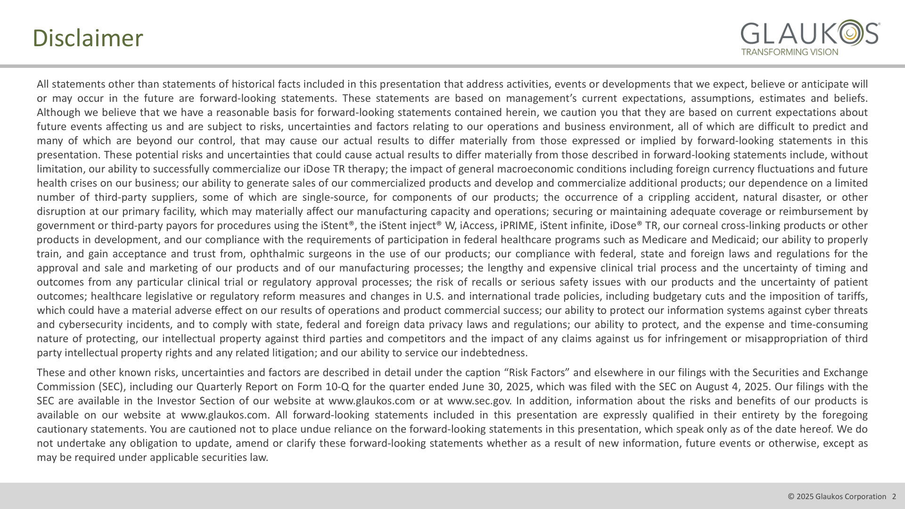

# Page 3

WE’LL GO 
FIRST
Innovation is at the core of 
everything we do. At 
Glaukos, we push the limits 
of science and technology 
to solve unmet needs in 
chronic eye diseases for the 
benefit of patients 
worldwide.   
CORE GROWTH STRATEGY 
Leading-edge 
Innovation
Pursuing big ideas that address clinical needs of 
large and/or underserved patient populations
Dropless             
Therapies
Challenging conventional paradigms to advance 
the standards of care and improve outcomes
Commercial 
Excellence
Building durable new markets to better 
serve physicians and patients worldwide 
FIVE NOVEL PLATFORMS
iStent
Micro-scale surgical devices
iDose
Sustained-release pharmaceuticals
iLink
Bio-activated pharmaceuticals
iLution 
Transdermal pharmaceuticals
Retina XR 
Bio-erodible IVT pharmaceuticals 
FOUR THERAPEUTIC AREAS
Glaucoma
Full scope of disease progression
Rare Disease
Keratoconus Ocular Cancer (OSSN)
Anterior Segment
Dry Eye, Presbyopia, Demodex              
Blepharitis, Progressive Myopia
Posterior Segment 
AMD, DME, RVO
© 2025 Glaukos Corporation   3

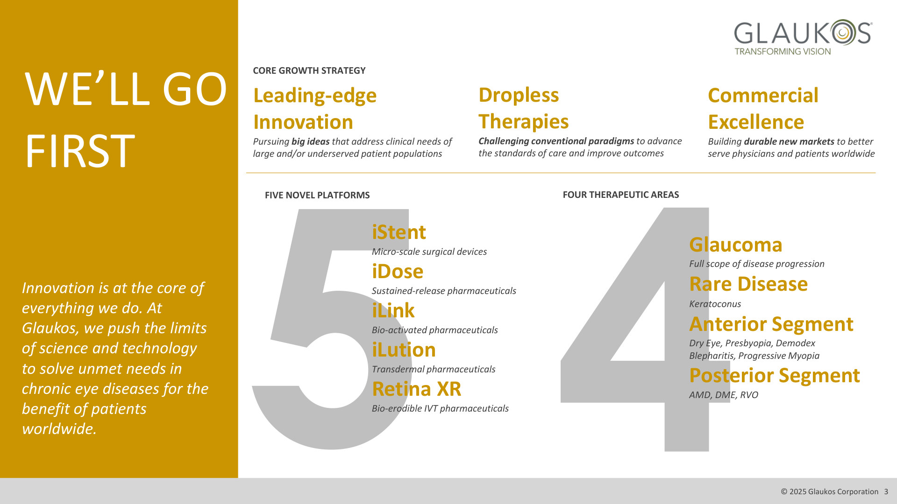

# Page 4

© 2025 Glaukos Corporation   4
INDUSTRY-
LEADING 
INNOVATION
750
$
+ Million
Invested in R&D 
since 2018
14
Disclosed pipeline 
programs in 2025 vs. 
4 in 2015
Ocular Hypertension and 
Open-Angle Glaucoma
Keratoconus
Blepharitis
Presbyopia
Glaucoma 
Dry Eye 
AMD
DME
RVO

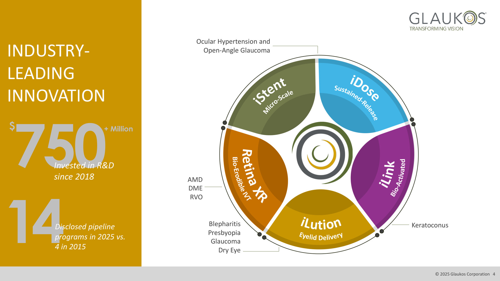

# Page 5

Keratoconus
iLinko2n  with EpioxaTM
Interventional 
Glaucoma
iDose® TR 
iStent infinite®
© 2025 Glaukos Corporation   5
2025-26 KEY 
COMMERCIAL 
CATALYSTS
Focused on establishing 
robust growth engines 
centered on proven, 
foundational therapies 
that improve the standard 
of care
iLinko2n with Epioxa is not approved by the FDA

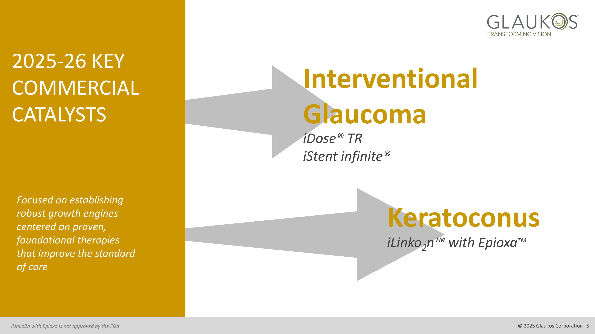

# Page 6

DISRUPTING 
THE STATUS 
QUO
© 2025 Glaukos Corporation   6
1 Nordstrom BL, Friedman DS, Mozaffari E, Quigley H, Walker AM. Persistence and adherence with topical glaucoma therapy. Am J Ophthalmol. 2005;140(4): 598-606. 
Interventional Glaucoma (IG) 
is designed to radically 
improve the legacy treatment 
paradigm with standalone 
therapies that slow 
progression and reduce drug 
burden 
ADDITIONAL 
FILTRATION 
SURGERY
ADDITIONAL 
MEDICATION(S)
FILTRATION 
SURGERY
SLT
TOPICAL 
MEDICATION
SLT
FILTRATION 
SURGERY
DRUG  DELIVERY
MIBS
MIGS
L E G A C Y  T R E A T M E N T  P A R A D I G M
A  N E W  S T A N D A R D  F O R  T H E  F U T U R E
Topical medications used as a supplement (“bridge therapy”) as needed
IT’S TIME TO CHANGE
OR
Topical meds remain the dominant glaucoma treatment but…
Complex dosing regimens, instillation difficulties and 
chronic side effects are common problems 
&
DROPS = POOR PATIENT COMPLIANCE & REDUCED QUALITY OF LIFE
90
>
%
of patients are non-
compliant with drops1 50
~
%
of patients purposely discontinue 
their drops within 6 months1
• Hyperemia
• Periorbital fat atrophy 
• Ocular surface disease 
• Hyperchromia

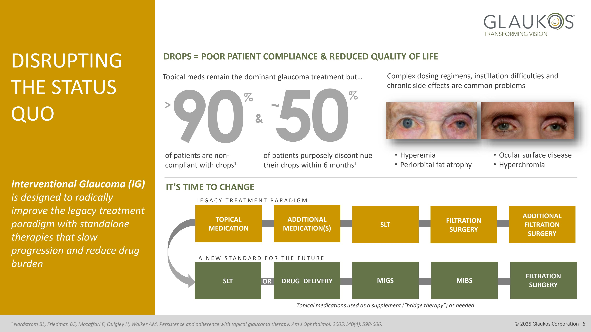

# Page 7

© 2025 Glaukos Corporation   7
IG: LED BY 
iDOSE TR, 
GROUND-
BREAKING
INNOVATION
Insertion System
Precision-engineered to facilitate 
straightforward implantation
Unique Drug Formulation
75 mcg of a novel, proprietary, preservative-free travoprost 
formulation; ~25,000x more concentrated than leading PGA 
medications (0.004% in Travatan Z)
Novel Membrane
Nanoporous, ethylene-vinyl acetate (EVA) membrane 
designed for continuous drug elution
Prostaglandin analog 
indicated for the reduction of 
IOP in patients with 
open-angle glaucoma (OAG) 
or ocular hypertension (OHT)
iDose TR is designed to provide 24/7, continuous, long-duration drug 
therapy to address ubiquitous patient non-compliance with topical 
medications
Anchored and Stable
Securely anchored into scleral tissue for 
drug elution directly into the anterior 
chamber
<0.5mm
1.8mm

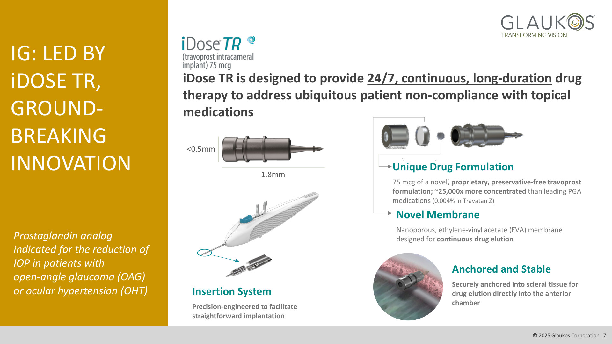

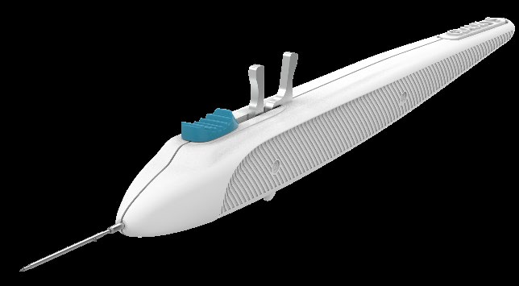

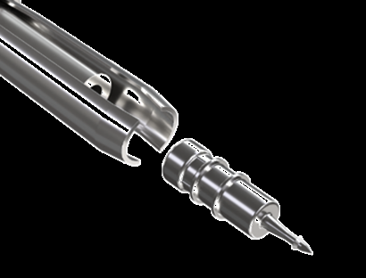

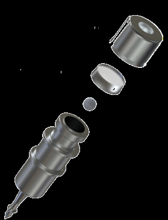

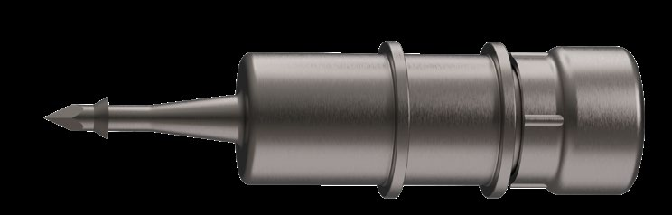

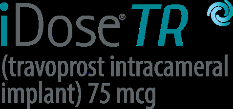

# Page 8

© 2025 Glaukos Corporation   8
OCULAR 
HYPERTENSION
MILD OAG
MODERATE OAG
ADVANCED OAG
REFRACTORY OAG
SLT
FILTRATION 
SURGERY
DRUG  DELIVERY
MIBS
MIGS
OR
Topical meds used as a 
supplemental, bridge 
therapy as needed
IG: A NEW 
PARADIGM
The workhorse; foundational therapy in algorithms 
across the disease stage spectrum 
Designed to provide 24/7 long-duration sustained release of travoprost directly into the 
anterior chamber; for full range of disease progression where goal is to reduce IOP
For patients who have failed 
surgical and medical therapy
Up to 240° of powerful outflow coverage
Creates 2 pathways of fluid 
outflow for sustained IOP 
control  
Combo-cataract 
procedures

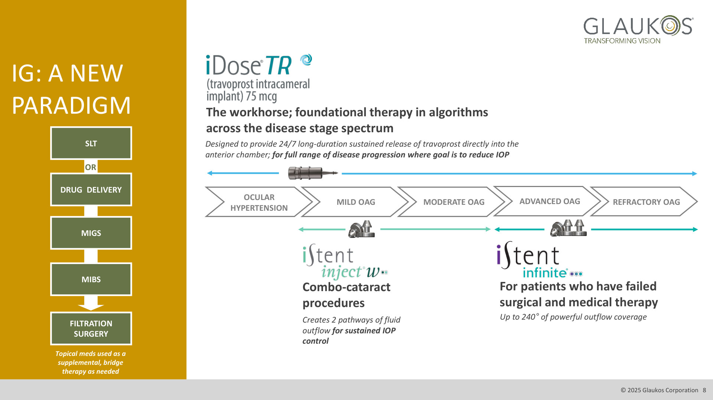

# Page 9

© 2025 Glaukos Corporation   9
DRIVING IG 
FORWARD
Major progress achieved in 
2024 and key objectives for 
2025 designed to increase 
IG awareness and adoption
2024
2025
Methodical launch; continually 
expanded trained surgeon pool  
Permanent 
J-Code 
established  
Cat III CPT codes 
established; advanced 
MAC coverage
Eight journal 
articles published
Accelerate marketing investments as 
universe of trained surgeons grows
Further broaden market access among MACs, 
commercial and Medicare Advantage (MA) payors
Expand robust body of 
clinical evidence 
Secure remaining 
commercial and MA 
coverage
Integrity study 
peer-reviewed 
publication 
Advance mild-to-
moderate label 
expansion study
Finalized APC5493 
for 0671T
Secured coverage 
through final LCDs
Established pro 
fees at all MACs

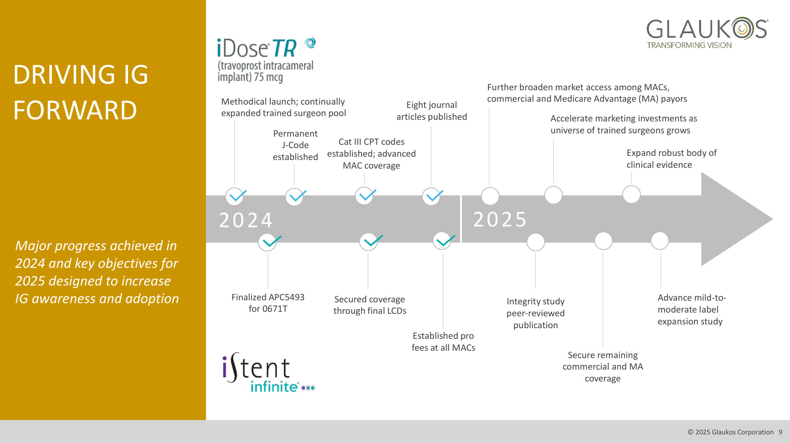

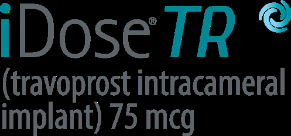

# Page 10

© 2025 Glaukos Corporation   10
IG & THE 
FOREVER 
PATIENT
The average OHT/glaucoma 
patient lives with the disease 
for 20+ years 
Optimizing referral network and 
practice administration for cataract 
and refractive care
COMPREHENSIVE OPHTHALMOLOGY PRACTICE: CONVENTIONAL MODEL
Glaucoma care predominantly single 
treatment per patient, then referred back 
to OD or glaucoma specialist 
Patients can be lost to follow-up and 
experience unnecessary disease 
progression
Care through entire patient journey, either by the MD or 
MD+OD, in a patient-centric manner
Likely to intervene multiple times over a patient’s                       
life 
Increase likelihood of patient compliance with                                                  
treatment and visits
Potential to flatten disease trajectory while                                
delivering a quality-of-life improvement 
Capacity constraints and volume increases drive 
certain IG procedures to in-office 
OD becomes increasingly important in the patient’s                                          
care as MDs perform more surgery and leave medicinal 
care and post-op follow-up to primary practitioners 
COMPREHENSIVE OPHTHALMOLOGY PRACTICE: IG/FOREVER PATIENT  MODEL
F O R E V E R  
PAT I E N T  
C A R E
iDose TREX is not approved by the FDA

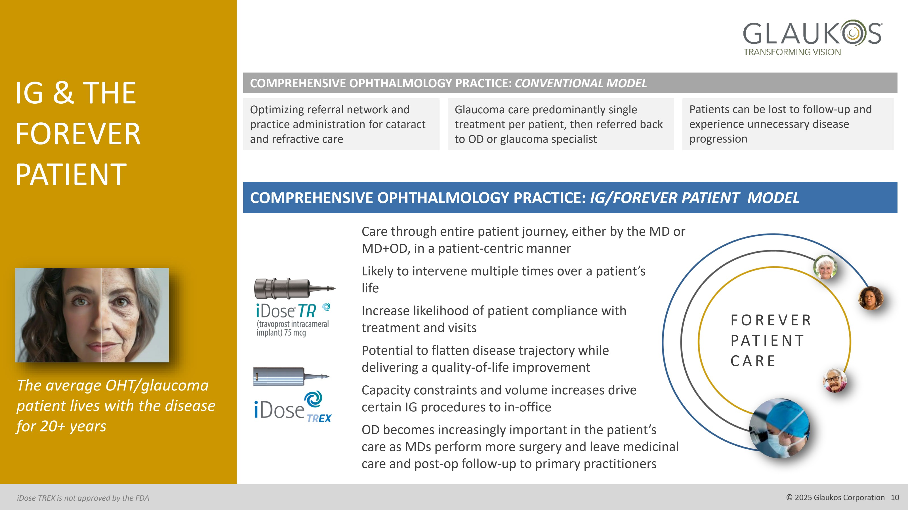

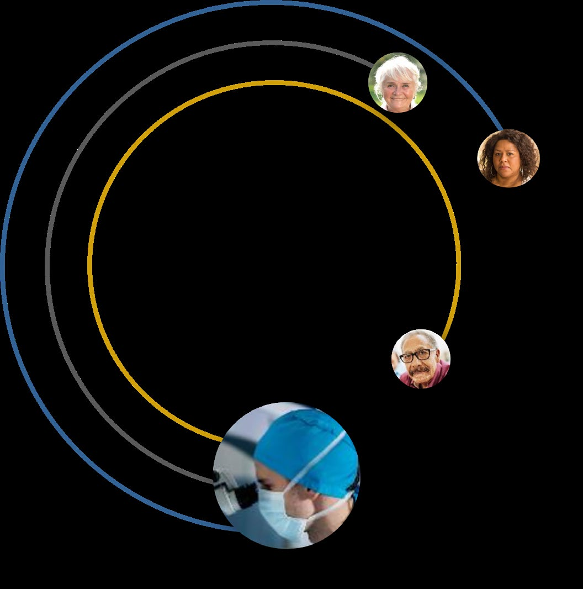

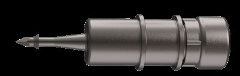

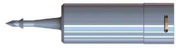

# Page 11

© 2025 Glaukos Corporation   11
STRONG IG 
CLINICAL DATA 
iDose TR: Phase 3 data confirms long duration
81
%
of iDose TR subjects 
in the Phase 3 trials 
were completely free 
of IOP-lowering 
topical medications 
at 12 months
AT 12 MONTHS
AT 36 MONTHS
PH 32,3
93%
PH 2B1 
92%
% OF iDOSE TR SUBJECTS WELL-CONTROLLED ON THE 
SAME OR FEWER IOP-LOWERING TOPICAL MEDICATIONS 
70%
69%
% PATIENTS WELL CONTROLLED ON THE SAME OR FEWER 
TOPICAL IOP-LOWERING MEDS IN PHASE 3 TRIAL AT 3 YEARS3
70%
58%
Timolol
0.5% BID
1  Berdahl JP, et al. Efficacy and Safety of the Travoprost Intraocular Implant in Reducing Topical IOP-Lowering Medication Burden in Patients with Open-Angle Glaucoma or Ocular Hypertension. Drugs. 2024;84:83–97.
2 Singh IP, et al. Long-Term Safety and Efficacy Evaluation of Travoprost Intracameral Implant Based on Pooled Analyses from Two Phase III Trials. Drugs. 2024;84:1299–1311.    3 Data on file

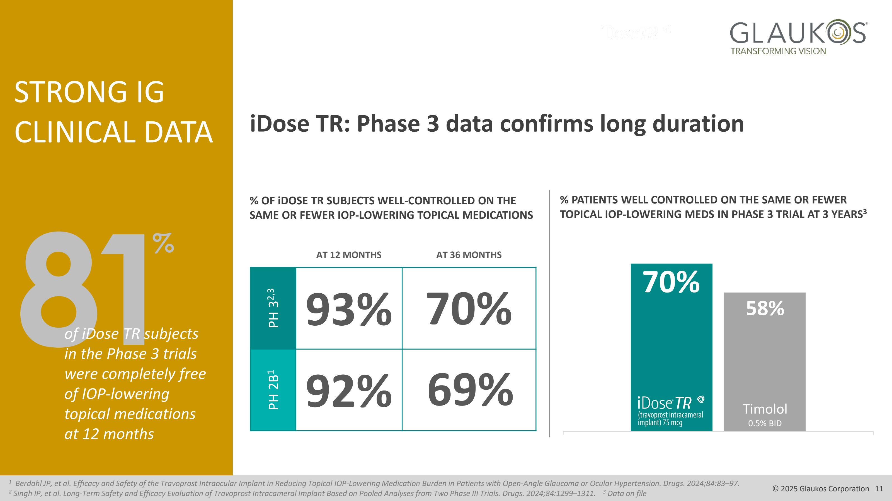

# Page 12

iDose TR: Phase 3 & Phase 2b safety data
© 2025 Glaukos Corporation   12
STRONG IG 
SAFETY DATA 
In controlled studies, the 
most common ocular 
adverse reactions in 2% to 
6% of patients were 
increases in intraocular 
pressure, iritis, dry eye, 
and visual field defects1  
1 iDose TR prescribing information; 2 Travatan Z / Lumigan package inserts 
Ph 3 Trials
3 Years
Ph 2b Trial
3 Years
Topical PGAs2
No adverse events of periorbital fat 
atrophy 
Up to 70% incidence 
Very low conjunctival hyperemia 
30%-50% incidence
No adverse events of corneal 
endothelial cell loss
Very low or no incidence of iris 
color change
~20% incidence

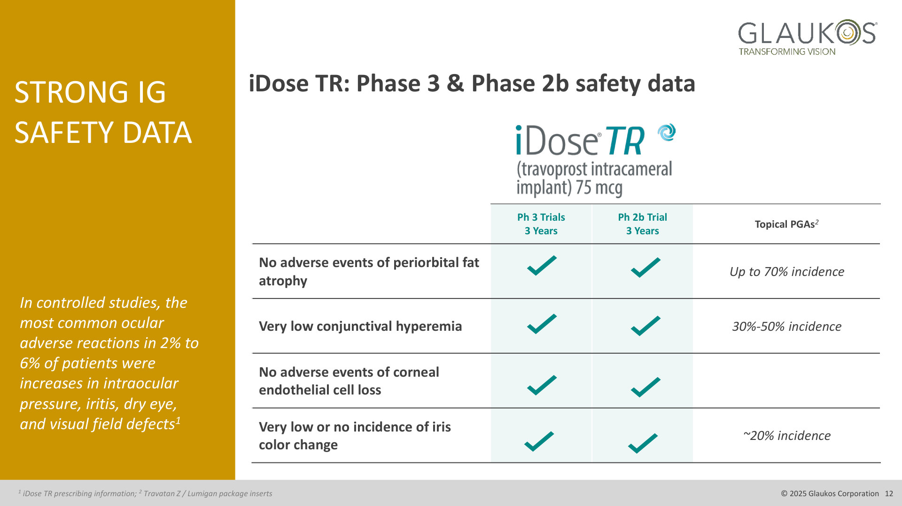

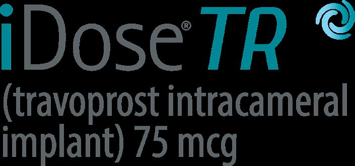

# Page 13

© 2025 Glaukos Corporation   13
POWER OF 
COMBINED 
THERAPY
Expect surgeons to 
ultimately combine IG 
therapies to better control 
IOP and slow disease 
progression
1 Med
48%
2 Meds
28%
≥3 Meds
24%
Combining multiple topical 
meds is widely used to 
manage IOP by increasing 
outflow and/or reducing fluid 
production
NUMBER OF MEDICATIONS 
BY % OF PATIENTS (US)1
Combinatorial therapy has potential to better 
control IOP with different mechanisms of action
COMBINING THERAPIES
1 Market Scope; 2 Data on file
• 44% reduction from baseline in 
IOP at Month 6
• 11.3 mmHg mean reduction in 
IOP from baseline
• Excellent safety and tolerability
KEY TRIAL TAKEAWAYS:
iDOSE TR + CATARACT AT MONTH 62

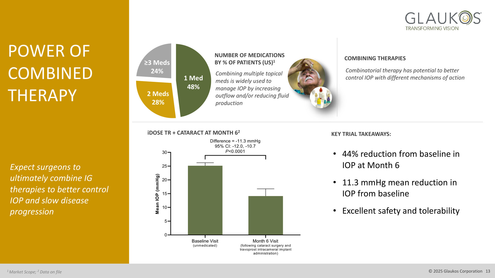

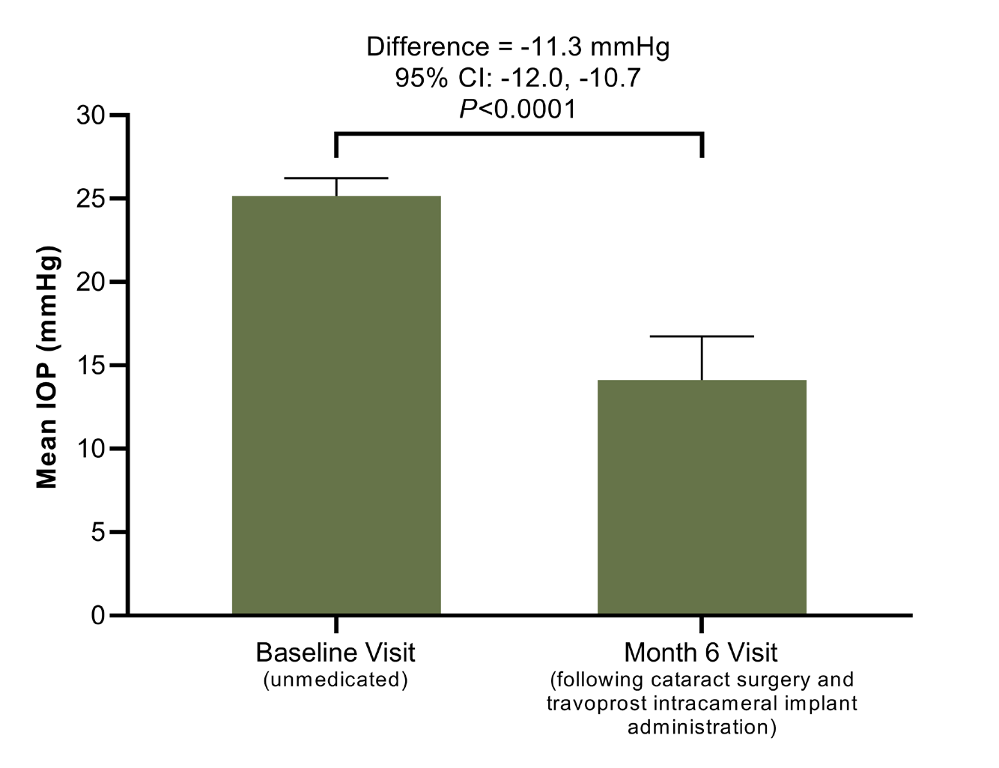

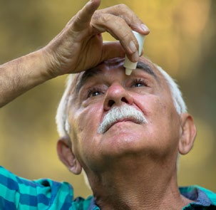

# Page 14

Are non-compliant and/or 
intolerant with topical meds
Have dry eye and/or other 
underlying co-morbidities
Have physical limitations 
that impede their ability to 
use topical meds 
Want to reduce their drug burden and/or have experienced decreased 
quality-of life related to topical med use 
Are post-SLT or post-
Durysta® patients 
© 2025 Glaukos Corporation   14
Initially focused on those 
glaucoma patients who can 
most benefit and have the 
most significant clinical need
ESTIMATING THE 
DOMESTIC IG
OPPORTUNITY 
0.5M 
eyes
MIGS + 
CATARACT
Annual 
Procedures
INTERVENTIONAL GLAUCOMA1 
22M 
eyes
13M 
eyes
12M 
eyes
Prevalence
Diagnosed
Diagnosed & 
Treated
1 Market Scope 2024 Glaucoma Pharmaceutical Report; includes glaucoma and OHT patients; assumes bilateral rate of 1.8x

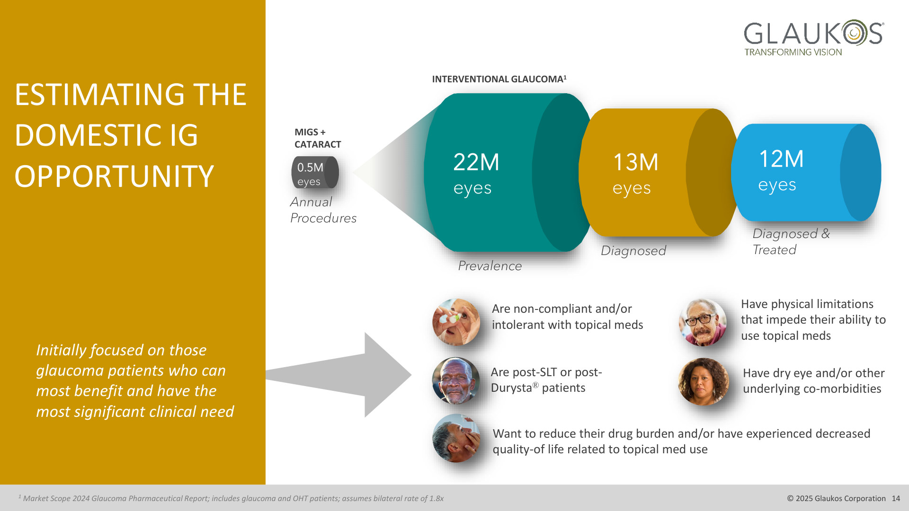

# Page 15

© 2025 Glaukos Corporation   15
IG PRODUCT 
ROADMAP 
Glaukos is uniquely 
positioned to lead 
development of the IG 
opportunity
PRODUCT
PATIENT
STATUS
iStent / iStent inject / iStent 
inject W
Mild-to-Moderate Glaucoma with Cataract
FDA Approved (2012, 2018, 2020)
iStent infinite
Glaucoma (failed on prior therapy)
FDA Cleared (2022)
iStent infinite
Glaucoma (label expansion)
Active PMA Study / EU MDR Cert (2025)
PRESERFLO MicroShunt
Advanced-Refractory Glaucoma
OUS approved / US Active IDE Study
iDose TR
Ocular Hypertension - Glaucoma
FDA Approved (2023)
iDose TREX
Ocular Hypertension - Glaucoma
Phase 2b/3
iDose Next Generation
Ocular Hypertension - Glaucoma
Pre-Clinical
iLution Travoprost (GLK-311)
Ocular Hypertension - Glaucoma
Phase 2
Radius XR
Wearable Patient Engagement & Diagnostic 
System
FDA Cleared
iAccess
Precision Goniotomy 
FDA Cleared 
Mitosol
Adjunct to Glaucoma Filtration Surgery
FDA Approved

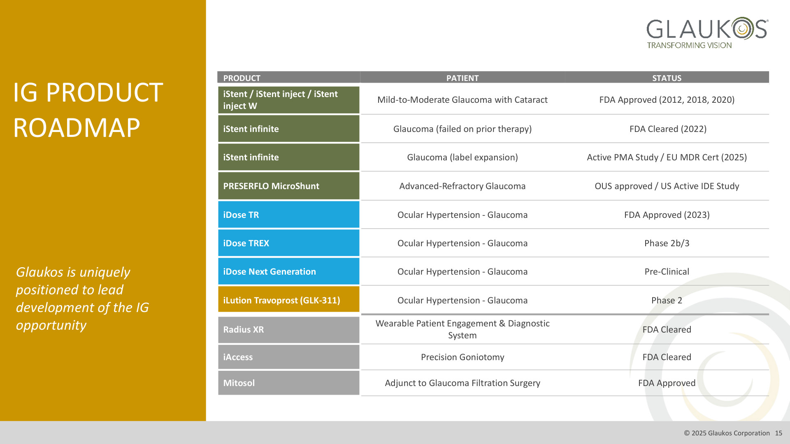

# Page 16

© 2025 Glaukos Corporation   16
IG: A VISION 
FOR THE NEXT 
10 YEARS
Multiple growth drivers can 
combine to create potential 
for a substantial and 
sustained increase in IG 
adoption over the decade
Majority of ophthalmic surgeons choose to adopt the IG algorithm, with the potential for iDose 
therapies to increasingly compete with SLT for first-line therapy 
1
3
Consistent reimbursement, surgeon confidence, patient preference and new innovations 
create opportunities for certain true, anchored sustained-release drug delivery 
procedures to transition into in-office settings
2
Combination therapy has potential to become a preferred form of IG therapy
4
New sustained-release drug delivery products designed to offer longer 
duration have potential to fuel additional IG therapy adoption
5
PE groups are likely to gravitate to IG therapy due to the significant 
clinical benefits and practice efficiency it provides
6
A new breed of IG specialist could emerge, conducting 
primarily injection therapy while vertically integrated ODs and 
OD referral networks provide preparatory patient services

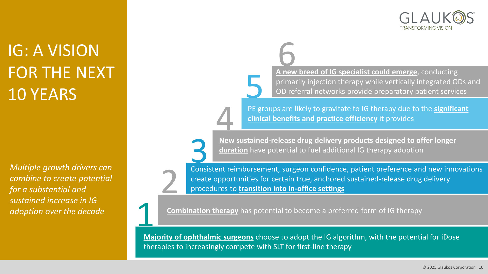

# Page 17

© 2025 Glaukos Corporation   17
RARE DISEASE: 
ADVANCES IN 
CORNEAL 
HEALTH 
• A type of corneal ectasia                                        
characterized by corneal thinning                                                        
and steepening; often marked by                                                
frequent eye rubbing
• Most cases present between puberty and age 40
• Patients may require multiple corneal transplants 
over their lifetime 
• Remains vastly undertreated due primarily to 
underdiagnosis and historical lack of an effective 
solution
Keratoconus is a serious, 
rarely diagnosed, sight-
threatening disease and the 
leading cause of full-thickness 
corneal transplants in the 
United States 
KEY KERATOCONUS (KC) FACTS 
Photrexa (Epi-off) is the first and only 
FDA-approved corneal cross-linking 
therapy shown to slow or halt KC 
progression and preserve vision

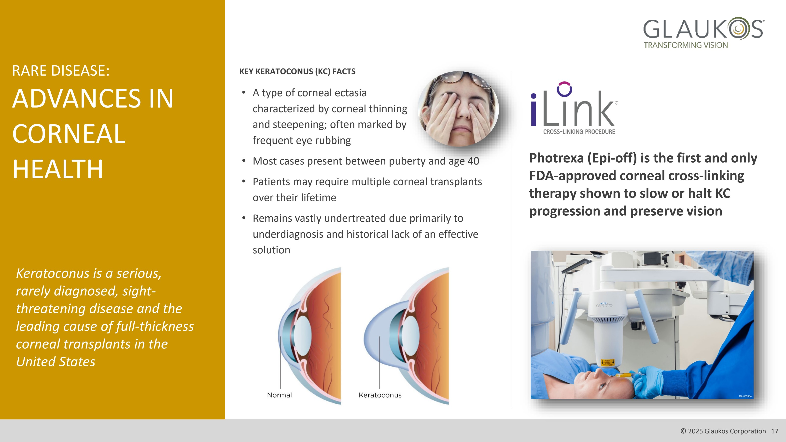

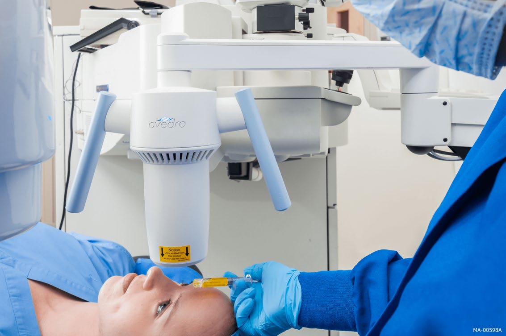

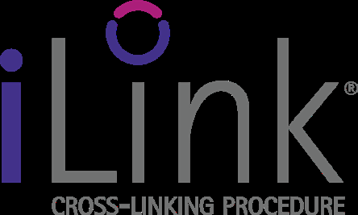

# Page 18

© 2025 Glaukos Corporation   18
EPIOXA REPRSENTS 
POTENTIALLY 
BREAKTHROUGH 
TREATMENT 
ADVANCEMENT 
FOR KC
Both Phase 3 trials met 
primary efficacy outcome 
and demonstrated favorable 
tolerability and safety
NDA submission in 
December 2024; PDUFA date 
set for October 20, 2025
Would be first FDA-approved, surgery free, 
topical drug treatment designed to:
Retain corneal epithelium
Streamline the procedure
Improve patient comfort
Shorten recovery time
Perfused oxygen is key to improved 
keratoconus therapy with Epioxa 
Supplemental oxygen is critical for efficacy
EPIOXA PHASE 3 OUTCOMES
Epioxa is not approved by the FDA

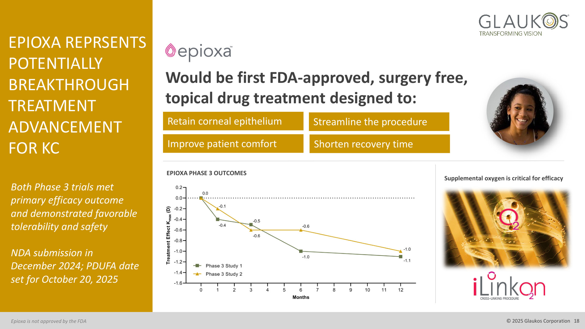

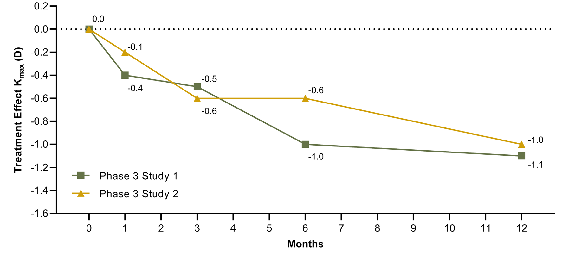

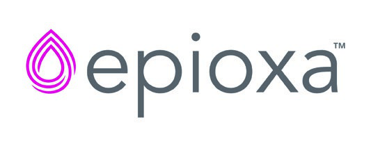

# Page 19

© 2025 Glaukos Corporation   19
WHAT IF? 
CUSTOMIZED, 
SPHERICAL 
THERAPY  
Third-generation iLink therapy 
represents another potentially 
significant advancement in 
keratoconus care
Advancing Phase 2 clinical 
program
THIRD-GENERATION iLINK THERAPY DESIGNED TO:
• Use biomechanical modeling to 
deliver customized, patterned 
treatment that matches each 
patient’s unique corneal topography 
• Use proprietary algorithm to 
precisely target UV energy for 
maximum cornea cross-linking 
efficacy 
• Build upon Epioxa advantages while 
further streamlining and enhancing 
the patient experience
3rd Gen iLink is not approved by the FDA

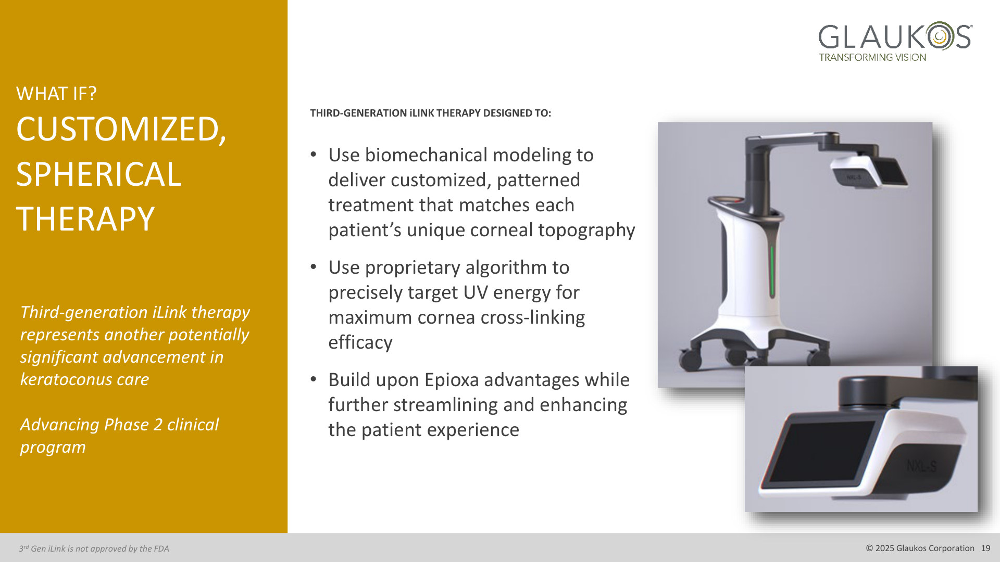

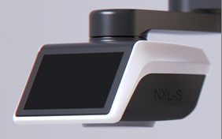

# Page 20

© 2025 Glaukos Corporation   20
iLINK / KC  
PRODUCT 
ROADMAP 
Robust pipeline is designed 
to expand and enhance 
patient care options with 
leading-edge innovations 
PRODUCT
PATIENT
STATUS
Photrexa (Epi-off)
Keratoconus
FDA Approved (2016)
Epioxa (Epi-on)
Keratoconus
NDA filed
PDUFA date: 10/20/25
iLink 3rd Generation
Keratoconus
Phase 2
iVeena (IVMED-80)
Keratoconus
Phase 1
iLinko2n Diagnostic Screening 
Tool
Keratoconus
Pre-Submission

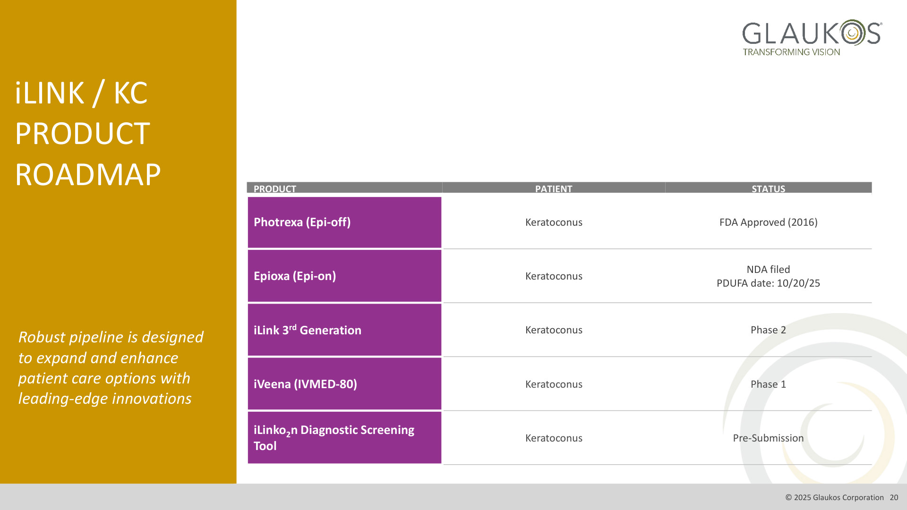

# Page 21

•
Affects an estimated 25 million1 people in the US
•
Is caused by infestation of demodex mites, a common 
ectoparasite found on human skin
•
Is characterized by eyelid                                               
inflammation and irritation                                                   
resulting in eyelid redness,                                                            
discomfort and debris
© 2025 Glaukos Corporation   21
iLUTION DEMODEX BLEPHARITIS PROGRAM 
iLUTION 
PLATFORM 
UPDATE 
Transdermal dropless 
therapy has the potential 
to treat a variety of chronic 
eye diseases and disorders 
POTENTIAL BENEFITS OF EYELID DELIVERY VS PRESCRIPTION EYE DROPS
• Easier administration 
• Faster onset of action 
• Fewer side effects
• Better compliance
 
DEMODEX BLEPHARITIS
• Pre-clinical 
• Goal to commence 
Phase 2 clinical 
trial by YE 2025
1 O'Dell L, Dierker DS, Devries DK, et al. Psychosocial Impact of Demodex Blepharitis. Clin Ophthalmol. 2022;16:2979-2987; iLution therapies are not approved by the FDA

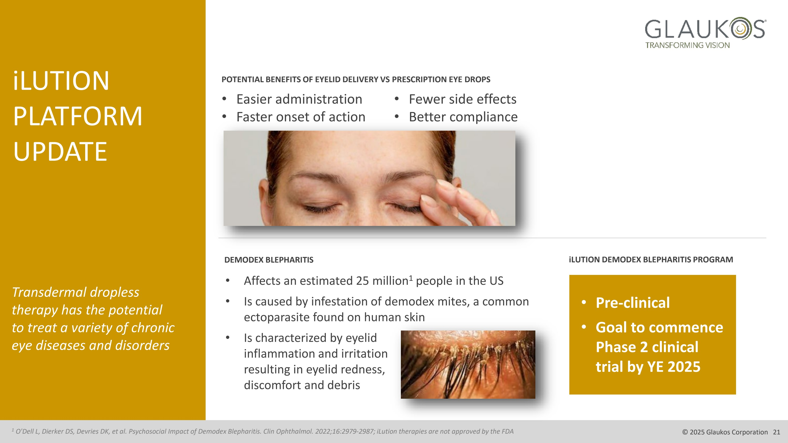

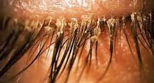

# Page 22

RETINA XR 
PLATFORM 
UPDATE 
© 2025 Glaukos Corporation   22
1 Market Scope; 2 Long-term Experience With Intravitreal Anti-VDGF Treatment in Patients with AMD: Analysis of IRIS Registry Database (presented at 39th Annual Meeting of the American 
Society of Retina Specialists by Theodore Leng, MD); 3 Planned 2025 ARVO submission; Retina XR therapies are not approved by the FDA
Monthly or bi-monthly anti-VEGF injections are standard 
of care for AMD, DME and RVO but studies show that 
 39
%
Are lost to follow-
up within 2 years2
28
+ Million
People in the US affected 
by retinal disease, 
primarily AMD and 
diabetic eye disease1
Conventional intravitreal 
injections impose tremendous 
treatment burdens on patients 
and contribute to lack of 
compliance 
 
IVT Multi-Kinase Inhibitor (GLK-401)
LEAD RETINA XR PROGRAM
•
Biodegradable, small molecule implant 
•
Designed to provide sustained efficacy 
for improved patient experience and 
compliance
•
Targets AMD, DME, RVO
•
Phase 2: Currently enrolling first-in-
human clinical development program
10 
+ Billion
Est. US market size 
in 20241
$
FLUORESCEIN ANGIOGRAPHY LEAKAGE IN A RABBIT MODEL3

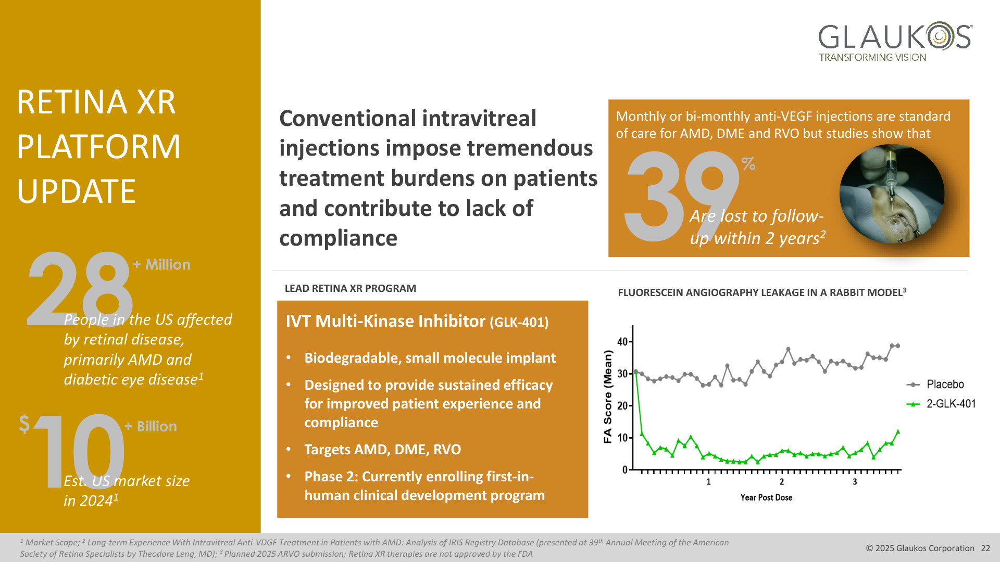

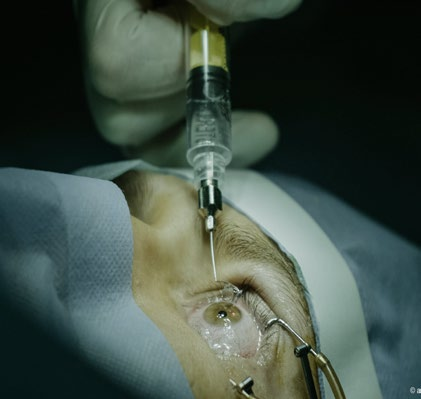

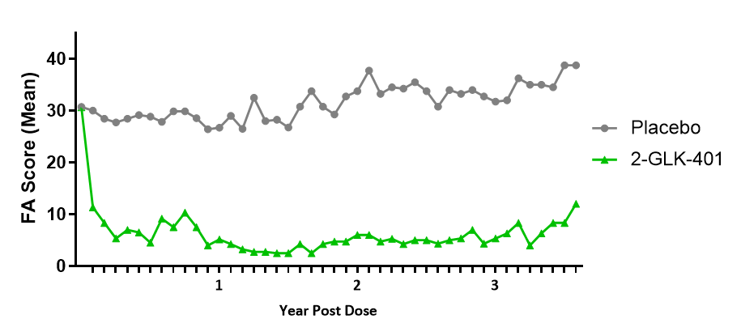

# Page 23

BUILDING   THE 
BUSINESS IN 
STAGES
Continually advancing our 
most promising opportunities 
to create a cascade of new 
products across a variety of 
disease categories over the 
next decade 
iDose
iLink
iLution
Retina
iStent & Other Surgical
BUILDING THE  
BUSINESS IN 
STAGES
© 2025 Glaukos Corporation   23
*Combination cataract 
IOP sensor, iDose TREX, iDose Gen 3, iLution TR, Epioxa, iLink Gen 3, iVeena and all anterior and posterior segment pharmaceuticals are not approved by the FDA 
iStent/iStent inject*
iStent inject W*
iStent infinite
PreserFlo
iAccess
Radius
Mitosol
IOP Sensor
iDose TR 
iDose TREX
iDose Gen 3 
iLution TR
Stage 1: 
INTERVENTIONAL 
GLAUCOMA
2012 
Photrexa (Epi-off)
Epioxa (Epi-on)
iLink Gen 3
iVeena (IVMED-80)
Screening Tool
Stage 2:
RARE DISEASE /
KERATOCONUS
2019 
iLution Blepharitis
iLution Presbyopia
iLution Dry Eye
Stage 3: 
ANTERIOR SEGMENT 
PHARMACEUTICALS
2029 
IVT Multi-Kinase 
Inhibitor (GLK-401)
IVT NCE Conjugate 
(GLK-411)
Stage 4:
POSTERIOR SEGMENT 
PHARMACEUTICALS
2030 

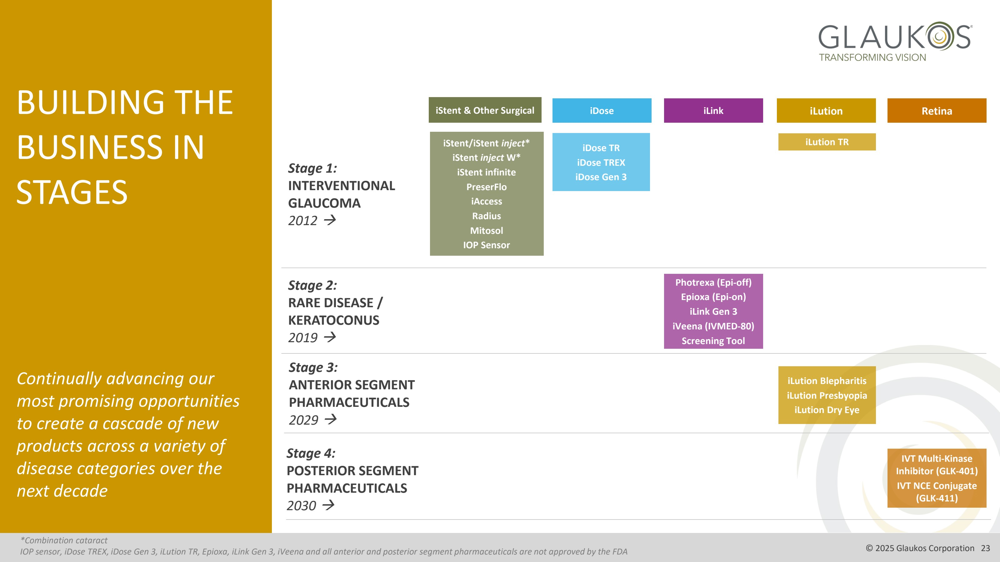

# Page 24

PRODUCT
PATIENT
STATUS
iStent / iStent inject / iStent inject W
Mild-to-Moderate Glaucoma with Cataract
FDA Approved (2012, 2018, 2020)
GLAUCOMA
iStent infinite
Glaucoma (failed on prior therapy)
FDA Cleared (2022)
iStent infinite
Glaucoma (label expansion)
Active PMA Study / EU MDR Cert (2025)
PRESERFLO MicroShunt
Advanced-Refractory Glaucoma
OUS Approved / US Active IDE Study
iDose TR
Ocular Hypertension - Glaucoma
FDA Approved (2023)
iDose TREX
Ocular Hypertension - Glaucoma
Phase 2b/3
iDose Next Generation
Ocular Hypertension - Glaucoma
Pre-Clinical
iLution Travoprost (GLK-311)
Ocular Hypertension - Glaucoma
Phase 2
Mitosol
Adjunct to Glaucoma Filtration Surgery
FDA Approved
Photrexa (Epi-off)
Keratoconus
FDA Approved (2016)
CORNEA
Epioxa (Epi-on)
Keratoconus
NDA filed; PDUFA date: 10/20/25
iLink 3rd Generation
Keratoconus
Phase 2
iVeena (IVMED-80)
Keratoconus
Phase 1
iLinko2n Diagnostic Screening Tool
Keratoconus
Pre-Submission
iLution Blepharitis
Demodex Blepharitis
Pre-Clinical
iLution Presbyopia (GLK-302)
Presbyopia
Phase 2
iLution Dry Eye (GLK-301)
Dry Eye 
Phase 2
IVT Multi-Kinase Inhibitor  (GLK-401)
AMD, DME, RVO
Phase 2
RETINA
IVT NCE Conjugate (GLK-411)
DME
Pre-Clinical
Radius XR
Wearable Patient Engagement & Diagnostic System
FDA Cleared
OTHER
iAccess
Precision Goniotomy 
FDA Cleared 
© 2025 Glaukos Corporation   24
AMONG 
INDUSTRY’S 
MOST 
FORMIDABLE 
PORTFOLIOS
Designed to disrupt treatment 
paradigms with dropless 
therapies that address 
important needs

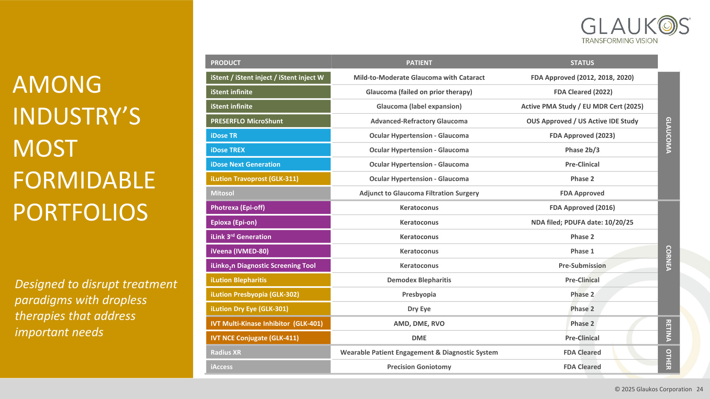

# Page 25

KEY 2025 
PIPELINE 
MILESTONES
© 2025 Glaukos Corporation   25
PROGRAM
PATIENT
INTENDED CLINICAL BENEFIT
2025 MILESTONE TARGET
GLAUCOMA
iStent infinite 
Mild-to-Moderate 
Glaucoma
MIGS therapy
Advance enrollment in PMA pivotal trial
Glaucoma
MIGS therapy
EU regulatory approval and commercial 
launch
PRESERFLO MicroShunt
Advanced-Refractory 
Glaucoma
Ab-externo device for late-stage glaucoma
Commence US IDE trial
iDose TR 
OHT-Glaucoma 
Sustained-release, 24/7 drug delivery for 
improved compliance 
Conduct Phase 4 studies
iDose TREX
OHT-Glaucoma
Increased drug payload designed to extend 
duration-of-effect
Advance Phase 2b/3 clinical program
iLution Blepharitis
Demodex Blepharitis
Transdermal drug delivery; potential for 
improved compliance vs topical drops
Commence Phase 2 trial by end of 2025 
CORNEA
Epioxa (Epi-on)
Keratoconus
Reduced treatment time and complexity for 
improved patient comfort and recovery
FDA approval by end of 2025 
(PDUFA date: 10/20/25)
iLink 3rd Generation
Keratoconus
Customized treatment algorithms and laser-
based UV light source
Advance Phase 2 clinical program
RETINA
IVT Multi-Kinase 
Inhibitor (GLK-401)
AMD, DME, RVO
Biodegradable, sustained-release implant; 
potential to reduce treatment burdens vs 
conventional therapies 
Advance enrollment in Phase 2 trial
Energy and resources are 
focused on advancing 
programs with greatest 
potential impact

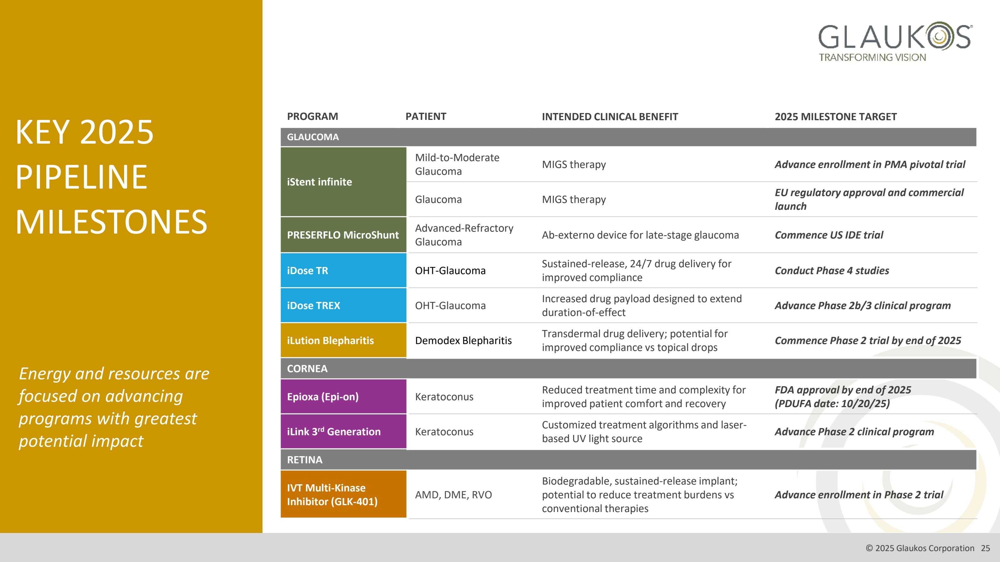

# Page 26

58%
25%
17%
BUILDING   THE 
BUSINESS IN 
STAGES
KEY 
HIGHLIGHTS
© 2025 Glaukos Corporation   26
Solid financial and 
operational footing to 
support future pipeline 
delivery and growth plans 
NET SALES1
(in millions)
2022
2023
$315
$283
20%+ 
10-year 
CAGR
$383
2024
GLOBAL INFRASTRUCTURE
17
Countries with 
direct operations
300+
Global 
commercial 
personnel
GROSS MARGIN2                                   
(2Q 2025)
83
%
SPECIALIZED MANUFACTURING
Industry leader in micro-scale 
manufacturing with +20 years’ 
experience
State-of-the-art facilities           
that meet regulatory,                         
CMC  and  ISO 7                                          
guidelines
SALES MIX               
(2Q 2025)
US Glaucoma
Corneal Health
Int’l Glaucoma
HEALTHY BALANCE SHEET
279
$
Million
Cash and equivalents; no debt       
as of 6/30/2025
1  FY2025: Net sales guidance range midpoint as of 7/30/25
2 2Q 2025 gross margin adjusted for certain acquisition-related accounting and other adjustments - see Appendix for details  
$483
2025

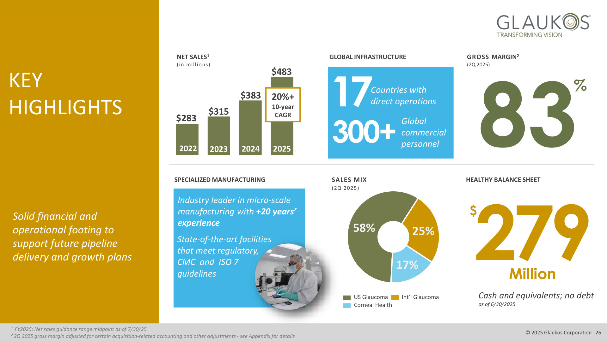

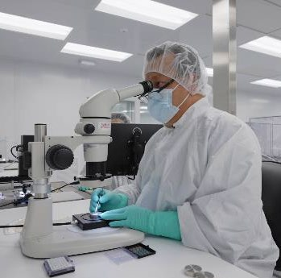

# Page 27

WE’LL GO FIRST
Innovation is at the core of everything we do. At Glaukos, we 
push the limits of science and technology to solve unmet needs 
in chronic eye diseases.   
© 2025 Glaukos Corporation   27

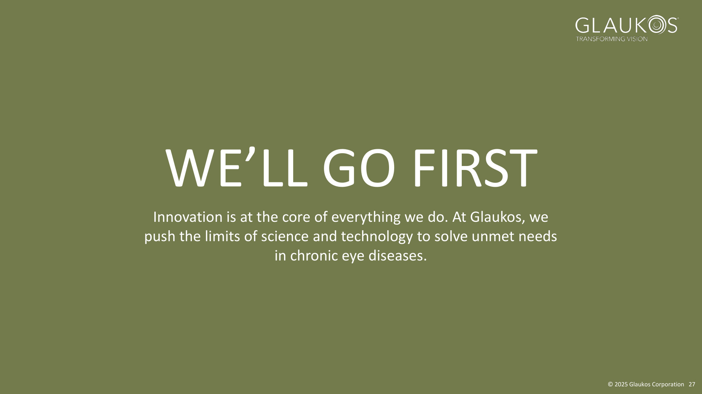

# Page 28

© 2025 Glaukos Corporation   28

# Page 29

Appendix
© 2025 Glaukos Corporation   29
2Q 2025 GAAP
Amort. of Dev 
2Q 2025 Non-GAAP
Gross Margin
Tech Intangibles, 
Dev IP, and Dist 
Rights
Gross Margin
Net Sales
124,120
$            
124,120
$                     
COGS
26,896
$              
(5,764)
$                
21,132
$                       
Gross Profit
97,224
$              
5,764
$                 
102,988
$                     
Gross Margin
78%
83%
GAAP to Non-GAAP Reconciliation - 2Q 2025 (in thousands)

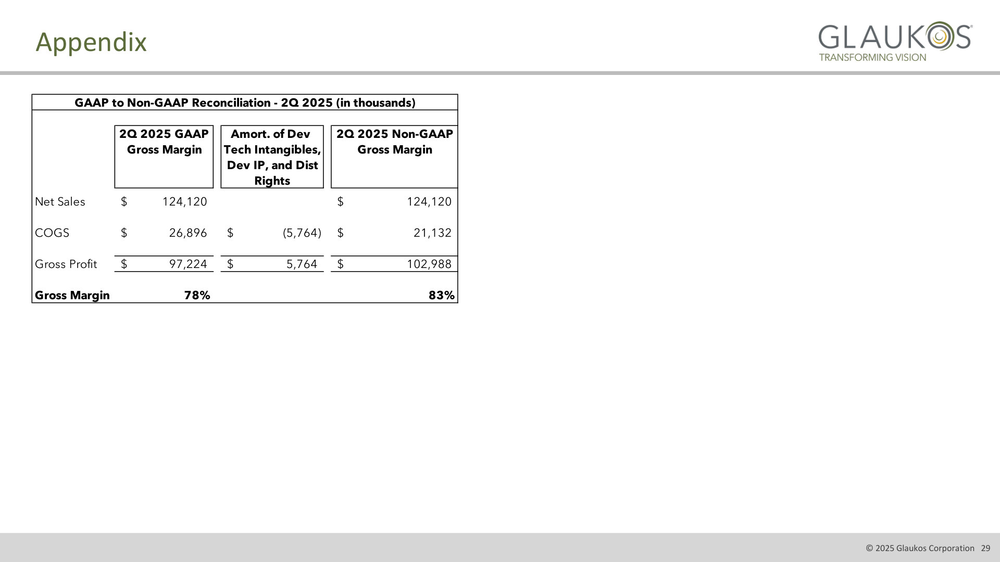

