Glaukos circular graphic element

GLAUKOS ® TRANSFORMING VISION logo

# Investor Presentation

August 2025

# Disclaimer

GLAUKOS TRANSFORMING VISION logo

All statements other than statements of historical facts included in this presentation that address activities, events or developments that we expect, believe or anticipate will or may occur in the future are forward-looking statements. These statements are based on management’s current expectations, assumptions, estimates and beliefs. Although we believe that we have a reasonable basis for forward-looking statements contained herein, we caution you that they are based on current expectations about future events affecting us and are subject to risks, uncertainties and factors relating to our operations and business environment, all of which are difficult to predict and many of which are beyond our control, that may cause our actual results to differ materially from those expressed or implied by forward-looking statements in this presentation. These potential risks and uncertainties that could cause actual results to differ materially from those described in forward-looking statements include, without limitation, our ability to successfully commercialize our iDose TR therapy; the impact of general macroeconomic conditions including foreign currency fluctuations and future health crises on our business; our ability to generate sales of our commercialized products and develop and commercialize additional products; our dependence on a limited number of third-party suppliers, some of which are single-source, for components of our products; the occurrence of a crippling accident, natural disaster, or other disruption at our primary facility, which may materially affect our manufacturing capacity and operations; securing or maintaining adequate coverage or reimbursement by government or third-party payors for procedures using the iStent®, the iStent inject® W, iAccess, iPRIME, iStent infinite, iDose® TR, our corneal cross-linking products or other products in development, and our compliance with the requirements of participation in federal healthcare programs such as Medicare and Medicaid; our ability to properly train, and gain acceptance and trust from, ophthalmic surgeons in the use of our products; our compliance with federal, state and foreign laws and regulations for the approval and sale and marketing of our products and of our manufacturing processes; the lengthy and expensive clinical trial process and the uncertainty of timing and outcomes from any particular clinical trial or regulatory approval processes; the risk of recalls or serious safety issues with our products and the uncertainty of patient outcomes; healthcare legislative or regulatory reform measures and changes in U.S. and international trade policies, including budgetary cuts and the imposition of tariffs, which could have a material adverse effect on our results of operations and product commercial success; our ability to protect our information systems against cyber threats and cybersecurity incidents, and to comply with state, federal and foreign data privacy laws and regulations; our ability to protect, and the expense and time-consuming nature of protecting, our intellectual property against third parties and competitors and the impact of any claims against us for infringement or misappropriation of third party intellectual property rights and any related litigation; and our ability to service our indebtedness.

These and other known risks, uncertainties and factors are described in detail under the caption “Risk Factors” and elsewhere in our filings with the Securities and Exchange Commission (SEC), including our Quarterly Report on Form 10-Q for the quarter ended June 30, 2025, which was filed with the SEC on August 4, 2025. Our filings with the SEC are available in the Investor Section of our website at www.glaukos.com or at www.sec.gov. In addition, information about the risks and benefits of our products is available on our website at www.glaukos.com. All forward-looking statements included in this presentation are expressly qualified in their entirety by the foregoing cautionary statements. You are cautioned not to place undue reliance on the forward-looking statements in this presentation, which speak only as of the date hereof. We do not undertake any obligation to update, amend or clarify these forward-looking statements whether as a result of new information, future events or otherwise, except as may be required under applicable securities law.

© 2025 Glaukos Corporation 2

GLAUKOS TRANSFORMING VISION logo

# WE’LL GO FIRST

CORE GROWTH STRATEGY

## Leading-edge Innovation

## Dropless Therapies

## Commercial Excellence

Pursuing big ideas that address clinical needs of large and/or underserved patient populations

Challenging conventional paradigms to advance the standards of care and improve outcomes

Building durable new markets to better serve physicians and patients worldwide

*Innovation is at the core of everything we do. At Glaukos, we push the limits of science and technology to solve unmet needs in chronic eye diseases for the benefit of patients worldwide.*

FIVE NOVEL PLATFORMS

FOUR THERAPEUTIC AREAS

**iStent**

Micro-scale surgical devices

**iDose**

Sustained-release pharmaceuticals

**iLink**

Bio-activated pharmaceuticals

**iLution**

Transdermal pharmaceuticals

**Retina XR**

Bio-erodible IVT pharmaceuticals

**Glaucoma**

Full scope of disease progression

**Rare Disease**

Keratoconus
Ocular Cancer (OSSN)

**Anterior Segment**

Dry Eye, Presbyopia, Demodex Blepharitis, Progressive Myopia

**Posterior Segment**

AMD, DME, RVO

© 2025 Glaukos Corporation 3

GLAUKOS TRANSFORMING VISION logo

# INDUSTRY-
# LEADING
# INNOVATION

**$750+ Million**
Invested in R&D since 2018

**14**
Disclosed pipeline programs in 2025 vs. 4 in 2015

| Platform                   | Associated Conditions                       |
| -------------------------- | ------------------------------------------- |
| iStent Micro-Scale         | Ocular Hypertension and Open-Angle Glaucoma |
| iDose Sustained-Release    | Ocular Hypertension and Open-Angle Glaucoma |
| iLink Bio-Activated        | Keratoconus                                 |
| iLution Eyelid Delivery    | Blepharitis, Presbyopia, Glaucoma, Dry Eye  |
| Retina XR Bio-Erodible IVT | AMD, DME, RVO                               |

© 2025 Glaukos Corporation 4

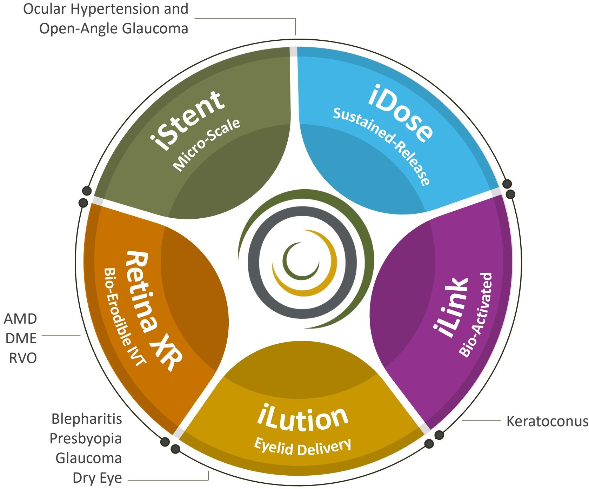

GLAUKOS TRANSFORMING VISION logo

# 2025-26 KEY COMMERCIAL CATALYSTS

*Focused on establishing robust growth engines centered on proven, foundational therapies that improve the standard of care*

## Interventional Glaucoma

iDose® TR
iStent infinite®

## Keratoconus

iLinko2n™ with Epioxa™

iLinko2n with Epioxa is not approved by the FDA

© 2025 Glaukos Corporation 5

GLAUKOS TRANSFORMING VISION logo

# DISRUPTING THE STATUS QUO

*Interventional Glaucoma (IG) is designed to radically improve the legacy treatment paradigm with standalone therapies that slow progression and reduce drug burden*

## DROPS = POOR PATIENT COMPLIANCE & REDUCED QUALITY OF LIFE

Topical meds remain the dominant glaucoma treatment but...

Complex dosing regimens, instillation difficulties and chronic side effects are common problems

> **90%** & **~50%**
> of patients are non-compliant with drops1
> of patients purposely discontinue their drops within 6 months1

Photographs showing side effects of glaucoma drops such as hyperemia and periorbital fat atrophy

* • Hyperemia
* • Periorbital fat atrophy
* • Ocular surface disease
* • Hyperchromia

## IT’S TIME TO CHANGE

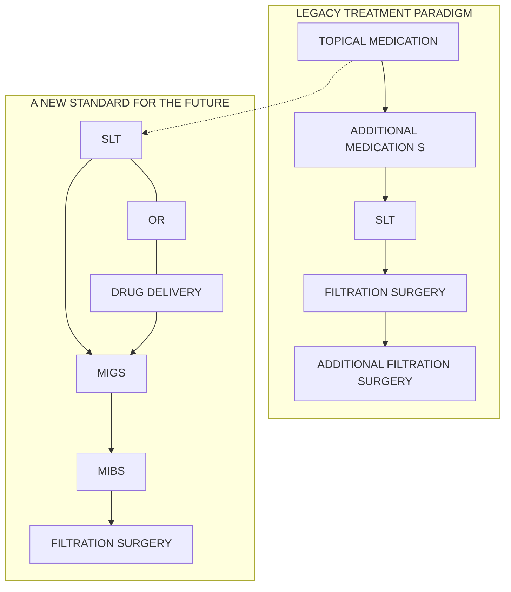
```mermaid
graph TD
    subgraph "LEGACY TREATMENT PARADIGM"
        L1[TOPICAL MEDICATION] --> L2[ADDITIONAL MEDICATION S]
        L2 --> L3[SLT]
        L3 --> L4[FILTRATION SURGERY]
        L4 --> L5[ADDITIONAL FILTRATION SURGERY]
    end

    subgraph "A NEW STANDARD FOR THE FUTURE"
        N1[SLT] --- N2[OR]
        N2 --- N3[DRUG DELIVERY]
        N1 & N3 --> N4[MIGS]
        N4 --> N5[MIBS]
        N5 --> N6[FILTRATION SURGERY]
    end

    L1 -.-> N1
```

*Topical medications used as a supplement (“bridge therapy”) as needed*

1 Nordstrom BL, Friedman DS, Mozaffari E, Quigley H, Walker AM. Persistence and adherence with topical glaucoma therapy. Am J Ophthalmol. 2005;140(4): 598-606.

© 2025 Glaukos Corporation 6

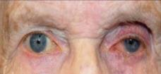

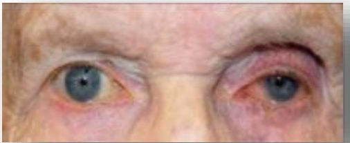

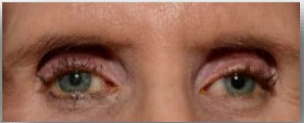

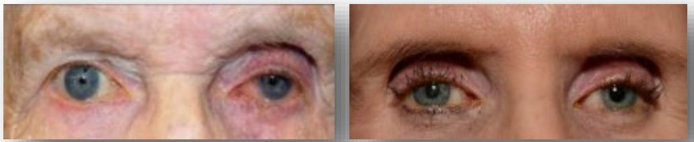

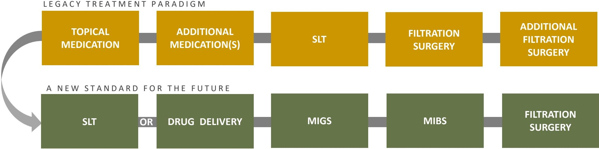

GLAUKOS TRANSFORMING VISION logo

# IG: LED BY iDOSE TR, GROUND-BREAKING INNOVATION

*Prostaglandin analog indicated for the reduction of IOP in patients with open-angle glaucoma (OAG) or ocular hypertension (OHT)*

iDose TR (travoprost intracameral implant) 75 mcg logo

**iDose TR is designed to provide <u>24/7, continuous, long-duration</u> drug therapy to address ubiquitous patient non-compliance with topical medications**

iDose TR implant dimensions: <0.5mm by 1.8mm

Exploded view of iDose TR implant components

## Unique Drug Formulation

75 mcg of a novel, **proprietary, preservative-free travoprost formulation**; ~25,000x more concentrated than leading PGA medications (0.004% in Travatan Z)

## Novel Membrane

Nanoporous, ethylene-vinyl acetate (EVA) membrane designed for **continuous drug elution**

iDose TR Insertion System

## Insertion System

Precision-engineered to facilitate straightforward implantation

iDose TR implant anchored in tissue

## Anchored and Stable

Securely anchored into scleral tissue for drug elution directly into the anterior chamber

© 2025 Glaukos Corporation 7

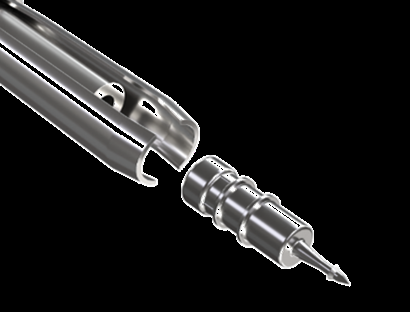

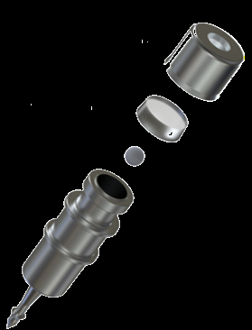

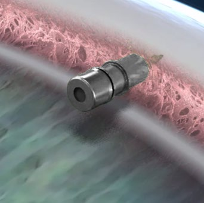

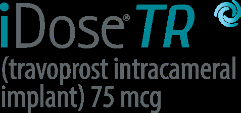

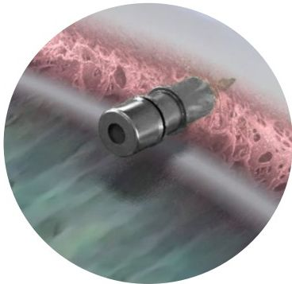

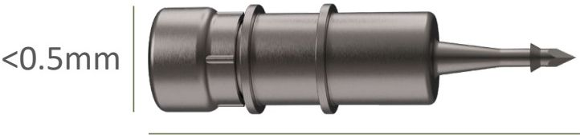

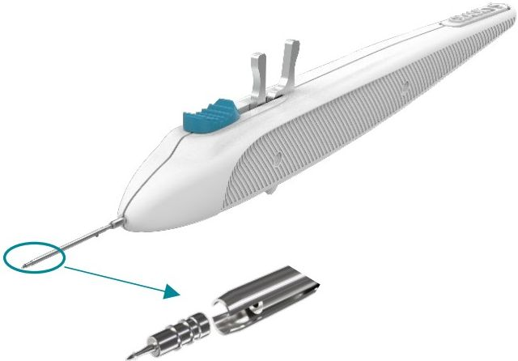

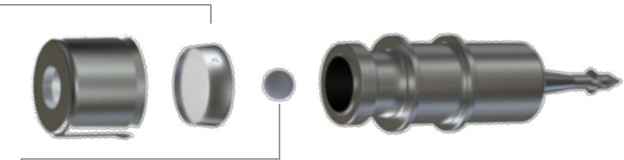

GLAUKOS TRANSFORMING VISION logo

# IG: A NEW PARADIGM

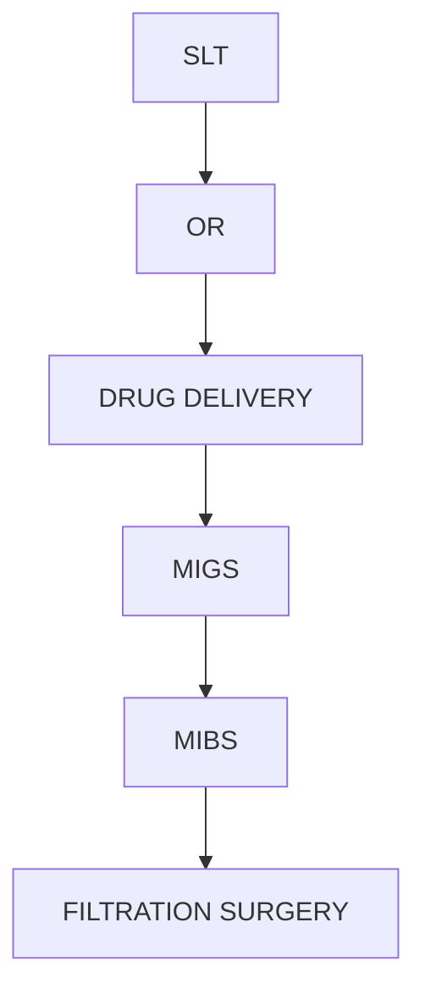
```mermaid
graph TD
    SLT[SLT] --> OR[OR]
    OR --> DRUG_DELIVERY[DRUG DELIVERY]
    DRUG_DELIVERY --> MIGS[MIGS]
    MIGS --> MIBS[MIBS]
    MIBS --> FILTRATION_SURGERY[FILTRATION SURGERY]
```

Topical meds used as a supplemental, bridge therapy as needed

# iDose® *TR*
(travoprost intracameral implant) 75 mcg

## The workhorse; foundational therapy in algorithms across the disease stage spectrum

*Designed to provide 24/7 long-duration sustained release of travoprost directly into the anterior chamber; **for full range of disease progression where goal is to reduce IOP***

```mermaid
graph LR
    OH[OCULAR HYPERTENSION] --> MOAG[MILD OAG]
    MOAG --> MODOAG[MODERATE OAG]
    MODOAG --> AOAG[ADVANCED OAG]
    AOAG --> ROAG[REFRACTORY OAG]
```

### iStent inject® *W*
**Combo-cataract procedures**
*Creates 2 pathways of fluid outflow for sustained IOP control*

### iStent infinite®
**For patients who have failed surgical and medical therapy**
*Up to 240° of powerful outflow coverage*

© 2025 Glaukos Corporation 8

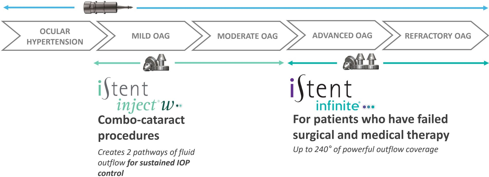

GLAUKOS TRANSFORMING VISION logo

# DRIVING IG FORWARD

iDose TR (travoprost intracameral implant) 75 mcg logo

Further broaden market access among MACs, commercial and Medicare Advantage (MA) payors
Accelerate marketing investments as universe of trained surgeons grows
Expand robust body of clinical evidence

*Major progress achieved in 2024 and key objectives for 2025 designed to increase IG awareness and adoption*

| Year | Milestone                                                                               |
| ---- | --------------------------------------------------------------------------------------- |
| 2024 | Methodical launch; continually expanded trained surgeon pool                            |
| 2024 | Permanent J-Code established                                                            |
| 2024 | Cat III CPT codes established; advanced MAC coverage                                    |
| 2024 | Eight journal articles published                                                        |
| 2024 | Finalized APC5493 for 0671T                                                             |
| 2024 | Secured coverage through final LCDs                                                     |
| 2024 | Established pro fees at all MACs                                                        |
| 2025 | Further broaden market access among MACs, commercial and Medicare Advantage (MA) payors |
| 2025 | Accelerate marketing investments as universe of trained surgeons grows                  |
| 2025 | Expand robust body of clinical evidence                                                 |
| 2025 | Integrity study peer-reviewed publication                                               |
| 2025 | Secure remaining commercial and MA coverage                                             |
| 2025 | Advance mild-to-moderate label expansion study                                          |

iStent infinite logo

© 2025 Glaukos Corporation 9

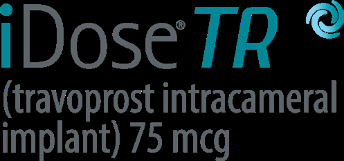

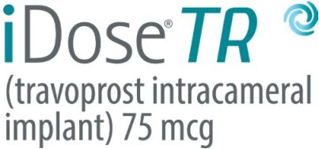

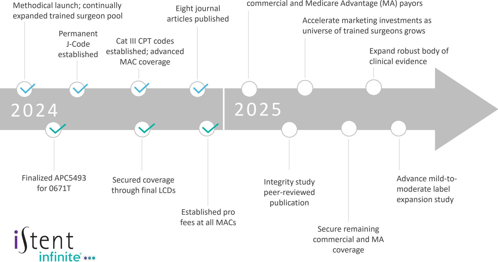

GLAUKOS TRANSFORMING VISION logo

# IG & THE FOREVER PATIENT

Photograph of a woman's face split to show aging over time

*The average OHT/glaucoma patient lives with the disease for 20+ years*

## COMPREHENSIVE OPHTHALMOLOGY PRACTICE: *CONVENTIONAL MODEL*

Optimizing referral network and practice administration for cataract and refractive care

Glaucoma care predominantly single treatment per patient, then referred back to OD or glaucoma specialist

Patients can be lost to follow-up and experience unnecessary disease progression

## COMPREHENSIVE OPHTHALMOLOGY PRACTICE: *IG/FOREVER PATIENT MODEL*

* Care through entire patient journey, either by the MD or MD+OD, in a patient-centric manner

* Likely to intervene multiple times over a patient’s life

iDose TR (travoprost intracameral implant) 75 mcg logo and product image

* Increase likelihood of patient compliance with treatment and visits

* Potential to flatten disease trajectory while delivering a quality-of-life improvement

Product image of iDose TREX

* Capacity constraints and volume increases drive certain IG procedures to in-office

iDose TREX logo

* OD becomes increasingly important in the patient’s care as MDs perform more surgery and leave medicinal care and post-op follow-up to primary practitioners

FOREVER PATIENT CARE diagram showing a circular patient journey with various healthcare provider and patient portraits

iDose TREX is not approved by the FDA

© 2025 Glaukos Corporation 10

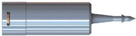

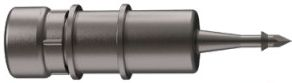

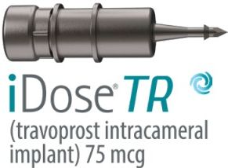

GLAUKOS TRANSFORMING VISION logo

STRONG IG
CLINICAL DATA

# iDose TR: Phase 3 data confirms long duration

81% of iDose TR subjects in the Phase 3 trials were completely free of IOP-lowering topical medications at 12 months

% OF iDOSE TR SUBJECTS WELL-CONTROLLED ON THE SAME OR FEWER IOP-LOWERING TOPICAL MEDICATIONS

|         | AT 12 MONTHS | AT 36 MONTHS |
| ------- | ------------ | ------------ |
| PH 32,3 | 93%          | 70%          |
| PH 2B1  | 92%          | 69%          |

% PATIENTS WELL CONTROLLED ON THE SAME OR FEWER TOPICAL IOP-LOWERING MEDS IN PHASE 3 TRIAL AT 3 YEARS³

| Treatment                                         | Percentage (%) |
| ------------------------------------------------- | -------------- |
| iDose TR (travoprost intracameral implant) 75 mcg | 70             |
| Timolol 0.5% BID                                  | 58             |

1 Berdahl JP, et al. Efficacy and Safety of the Travoprost Intraocular Implant in Reducing Topical IOP-Lowering Medication Burden in Patients with Open-Angle Glaucoma or Ocular Hypertension. Drugs. 2024;84:83–97.
2 Singh IP, et al. Long-Term Safety and Efficacy Evaluation of Travoprost Intracameral Implant Based on Pooled Analyses from Two Phase III Trials. Drugs. 2024;84:1299–1311. 3 Data on file

© 2025 Glaukos Corporation 11

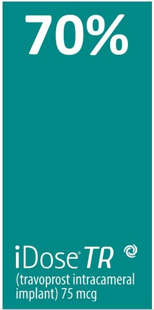

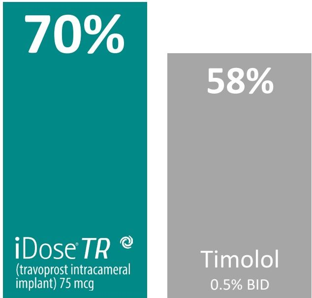

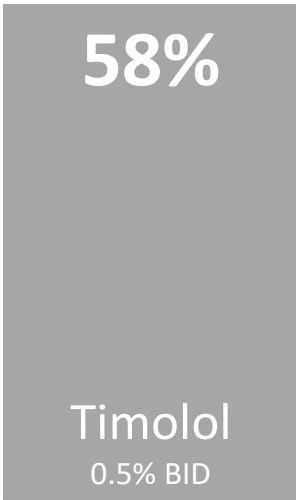

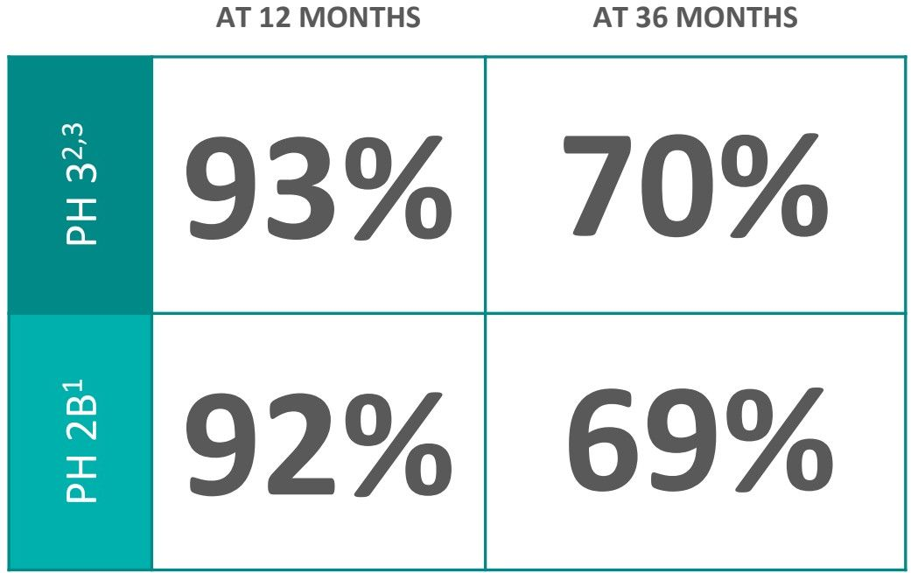

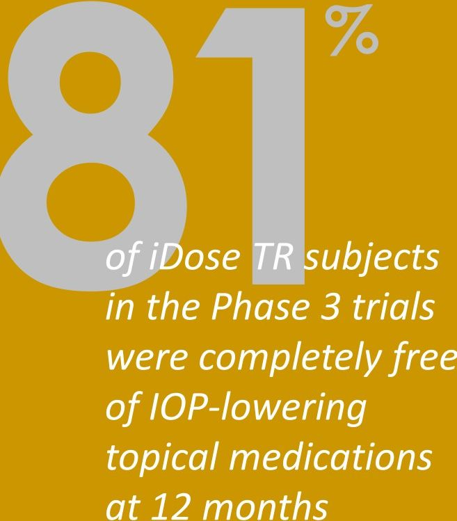

GLAUKOS TRANSFORMING VISION logo

# STRONG IG SAFETY DATA

# iDose TR: Phase 3 & Phase 2b safety data

iDose TR (travoprost intracameral implant) 75 mcg logo
**iDose TR**
(travoprost intracameral implant) 75 mcg

*In controlled studies, the most common ocular adverse reactions in 2% to 6% of patients were increases in intraocular pressure, iritis, dry eye, and visual field defects¹*

|                                                    | iDose TR(travoprost intracameral implant) 75 mcg Ph 3 Trials3 Years | iDose TR(travoprost intracameral implant) 75 mcg Ph 2b Trial3 Years | Topical PGAs²       |
| -------------------------------------------------- | ----------------------------------------------------------------------- | ----------------------------------------------------------------------- | ------------------- |
| No adverse events of periorbital fat atrophy       | \[yes]                                                                  | \[yes]                                                                  | Up to 70% incidence |
| Very low conjunctival hyperemia                    | \[yes]                                                                  | \[yes]                                                                  | 30%-50% incidence   |
| No adverse events of corneal endothelial cell loss | \[yes]                                                                  | \[yes]                                                                  |                     |
| Very low or no incidence of iris color change      | \[yes]                                                                  | \[yes]                                                                  | \~20% incidence     |

¹ iDose TR prescribing information; ² Travatan Z / Lumigan package inserts

© 2025 Glaukos Corporation 12

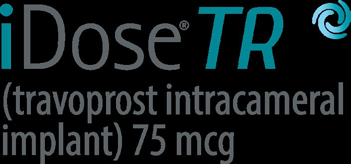

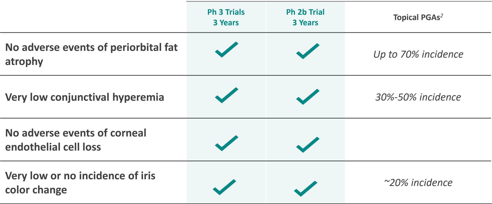

GLAUKOS TRANSFORMING VISION logo

# POWER OF COMBINED THERAPY

*Expect surgeons to ultimately combine IG therapies to better control IOP and slow disease progression*

**NUMBER OF MEDICATIONS BY % OF PATIENTS (US)¹**

Combining multiple topical meds is widely used to manage IOP by increasing outflow and/or reducing fluid production

| Medication Count | Percentage (%) |
| ---------------- | -------------- |
| 1 Med            | 48             |
| 2 Meds           | 28             |
| ≥3 Meds          | 24             |

Photograph of a person applying eye drops

## COMBINING THERAPIES

Combinatorial therapy has potential to better control IOP with different mechanisms of action

**iDOSE TR + CATARACT AT MONTH 6²**

Difference = -11.3 mmHg
95% CI: -12.0, -10.7
P<0.0001

| Visit                                                                                             | Mean IOP (mmHg) |
| ------------------------------------------------------------------------------------------------- | --------------- |
| Baseline Visit (unmedicated)                                                                  | 25              |
| Month 6 Visit (following cataract surgery and travoprost intracameral implant administration) | 14              |

## KEY TRIAL TAKEAWAYS:

* 44% reduction from baseline in IOP at Month 6

* 11.3 mmHg mean reduction in IOP from baseline

* Excellent safety and tolerability

¹ Market Scope; ² Data on file
© 2025 Glaukos Corporation 13

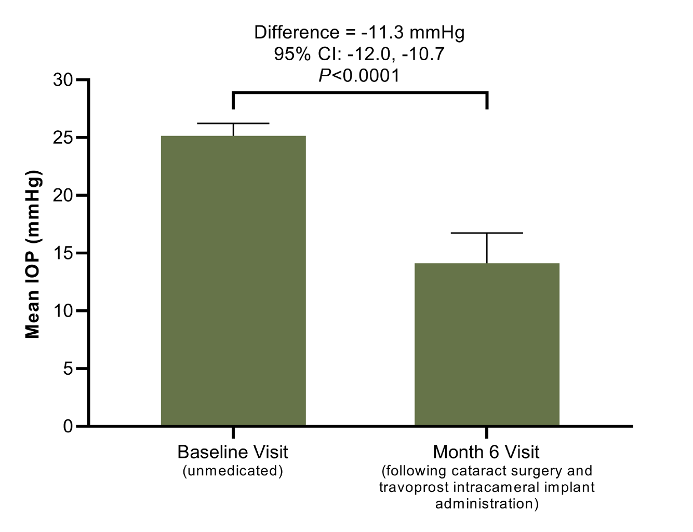

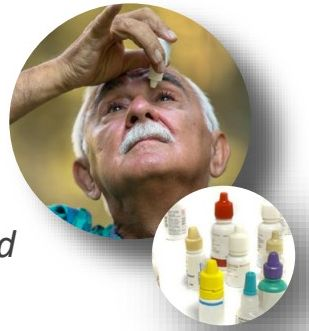

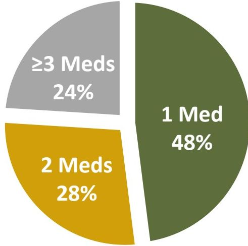

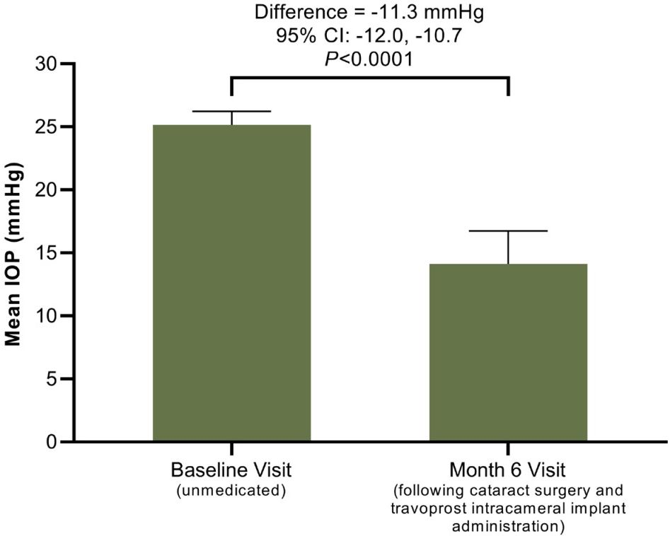

GLAUKOS TRANSFORMING VISION logo

# ESTIMATING THE
# DOMESTIC IG
# OPPORTUNITY

## INTERVENTIONAL GLAUCOMA¹

| Category            | Value     | Description       |
| ------------------- | --------- | ----------------- |
| MIGS + CATARACT     | 0.5M eyes | Annual Procedures |
| Prevalence          | 22M eyes  |                   |
| Diagnosed           | 13M eyes  |                   |
| Diagnosed & Treated | 12M eyes  |                   |

*Initially focused on those glaucoma patients who can most benefit and have the most significant clinical need* Arrow icon pointing to patient categories

* Photograph of person using eye drops Are non-compliant and/or intolerant with topical meds

* Photograph of elderly man Have physical limitations that impede their ability to use topical meds

* Photograph of elderly man Are post-SLT or post-Durysta® patients

* Photograph of woman Have dry eye and/or other underlying co-morbidities

* Photograph of person applying eye drops Want to reduce their drug burden and/or have experienced decreased quality-of life related to topical med use

¹ Market Scope 2024 Glaucoma Pharmaceutical Report; includes glaucoma and OHT patients; assumes bilateral rate of 1.8x
© 2025 Glaukos Corporation 14

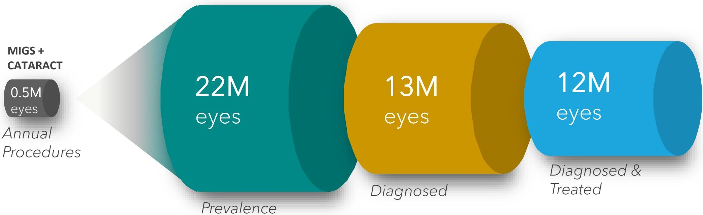

GLAUKOS TRANSFORMING VISION logo

# IG PRODUCT ROADMAP

*Glaukos is uniquely positioned to lead development of the IG opportunity*

| PRODUCT                                  | PATIENT                                         | STATUS                                |
| ---------------------------------------- | ----------------------------------------------- | ------------------------------------- |
| iStent / iStent inject / iStent inject W | Mild-to-Moderate Glaucoma with Cataract         | FDA Approved (2012, 2018, 2020)       |
| iStent infinite                          | Glaucoma (failed on prior therapy)              | FDA Cleared (2022)                    |
| iStent infinite                          | Glaucoma (label expansion)                      | Active PMA Study / EU MDR Cert (2025) |
| PRESERFLO MicroShunt                     | Advanced-Refractory Glaucoma                    | OUS approved / US Active IDE Study    |
| iDose TR                                 | Ocular Hypertension - Glaucoma                  | FDA Approved (2023)                   |
| iDose TREX                               | Ocular Hypertension - Glaucoma                  | Phase 2b/3                            |
| iDose Next Generation                    | Ocular Hypertension - Glaucoma                  | Pre-Clinical                          |
| iLution Travoprost (GLK-311)             | Ocular Hypertension - Glaucoma                  | Phase 2                               |
| Radius XR                                | Wearable Patient Engagement & Diagnostic System | FDA Cleared                           |
| iAccess                                  | Precision Goniotomy                             | FDA Cleared                           |
| Mitosol                                  | Adjunct to Glaucoma Filtration Surgery          | FDA Approved                          |

© 2025 Glaukos Corporation 15

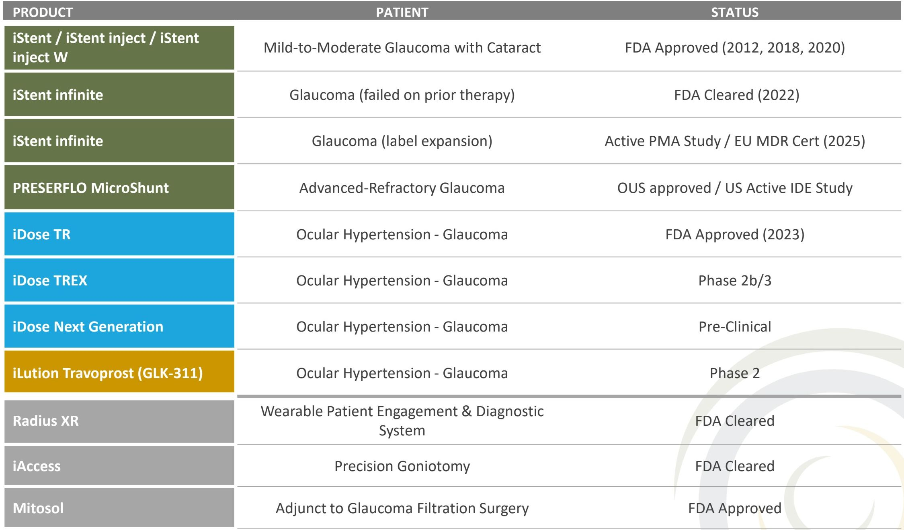

GLAUKOS TRANSFORMING VISION logo

# IG: A VISION FOR THE NEXT 10 YEARS

*Multiple growth drivers can combine to create potential for a substantial and sustained increase in IG adoption over the decade*

6 **A new breed of IG specialist could emerge**, conducting primarily injection therapy while vertically integrated ODs and OD referral networks provide preparatory patient services

5 PE groups are likely to gravitate to IG therapy due to the **significant clinical benefits and practice efficiency** it provides

4 **New sustained-release drug delivery products designed to offer longer duration** have potential to fuel additional IG therapy adoption

3 Consistent reimbursement, surgeon confidence, patient preference and new innovations create opportunities for certain true, anchored sustained-release drug delivery procedures to **<u>transition into in-office settings</u>**

2 **<u>Combination therapy</u>** has potential to become a preferred form of IG therapy

1 **<u>Majority of ophthalmic surgeons</u>** choose to adopt the IG algorithm, with the potential for iDose therapies to increasingly compete with SLT for first-line therapy

© 2025 Glaukos Corporation 16

GLAUKOS TRANSFORMING VISION logo

RARE DISEASE:

# ADVANCES IN CORNEAL HEALTH

*Keratoconus is a serious, rarely diagnosed, sight-threatening disease and the leading cause of full-thickness corneal transplants in the United States*

**KEY KERATOCONUS (KC) FACTS**

* A type of corneal ectasia characterized by corneal thinning and steepening; often marked by frequent eye rubbing

Photograph of a person rubbing their eyes

* Most cases present between puberty and age 40

* Patients may require multiple corneal transplants over their lifetime

* Remains vastly undertreated due primarily to underdiagnosis and historical lack of an effective solution

iLink CROSS-LINKING PROCEDURE logo

**Photrexa (Epi-off) is the first and only FDA-approved corneal cross-linking therapy shown to slow or halt KC progression and preserve vision**

Diagram comparing a Normal eye and an eye with Keratoconus

Photograph of the iLink procedure being performed with Avedro equipment

© 2025 Glaukos Corporation 17

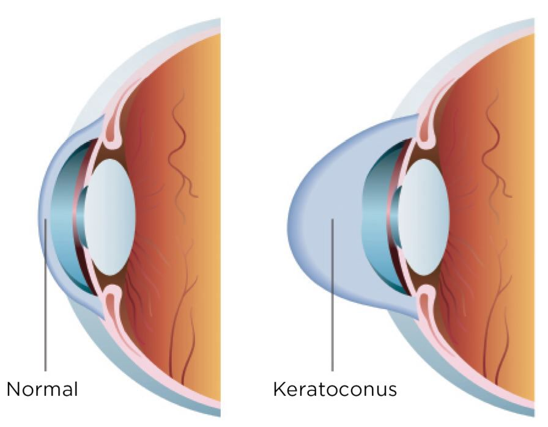

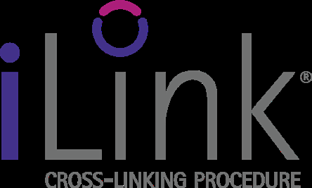

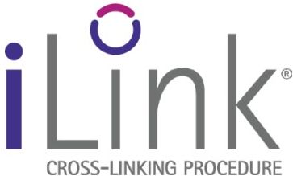

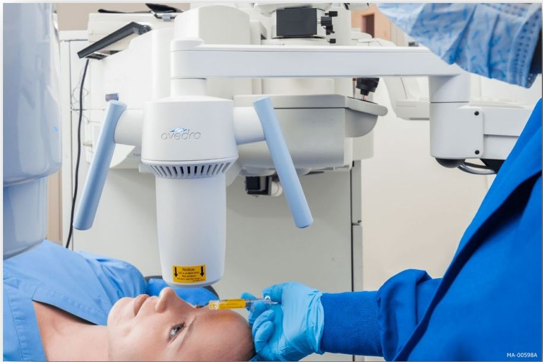

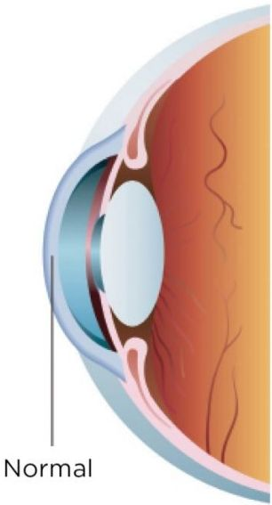

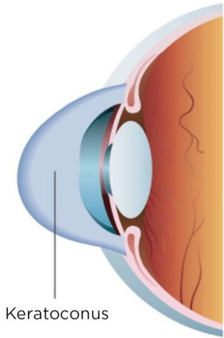

GLAUKOS TRANSFORMING VISION logo

# EPIOXA REPRSENTS POTENTIALLY BREAKTHROUGH TREATMENT ADVANCEMENT FOR KC

epioxa logo

## Would be first FDA-approved, surgery free, topical drug treatment designed to:

* Retain corneal epithelium

* Streamline the procedure

* Improve patient comfort

* Shorten recovery time

Photograph of a smiling woman

*Both Phase 3 trials met primary efficacy outcome and demonstrated favorable tolerability and safety*

*NDA submission in December 2024; PDUFA date set for October 20, 2025*

### EPIOXA PHASE 3 OUTCOMES

Perfused oxygen is key to improved keratoconus therapy with Epioxa. Supplemental oxygen is critical for efficacy.

| Months | Phase 3 Study 1 | Phase 3 Study 2 |
| ------ | --------------- | --------------- |
| 0      | 0.0             | 0.0             |
| 1      | -0.4            | -0.1            |
| 3      | -0.5            | -0.6            |
| 6      | -1.0            | -0.6            |
| 12     | -1.1            | -1.0            |

Illustration of oxygen molecules and corneal fibers

iLinkon CROSS-LINKING PROCEDURE logo

Epioxa is not approved by the FDA

© 2025 Glaukos Corporation 18

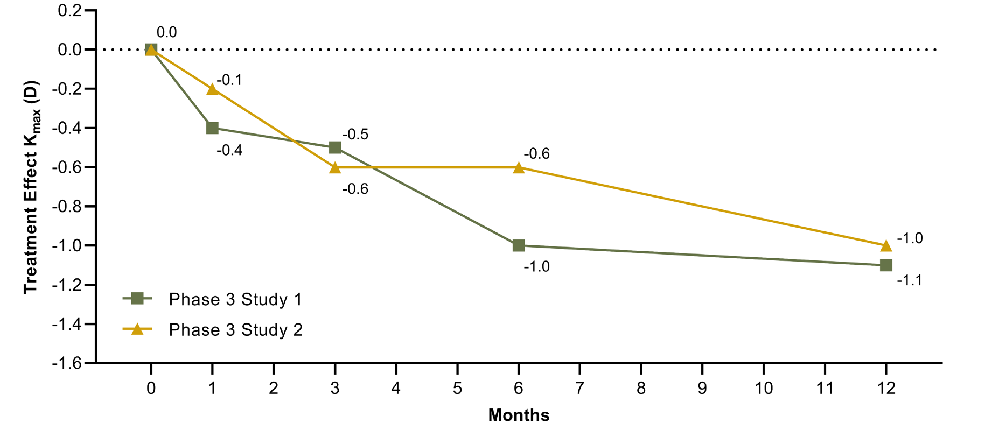

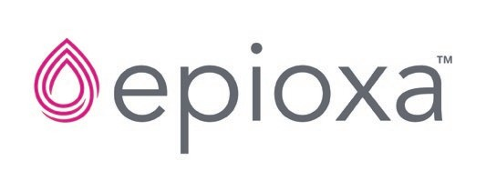

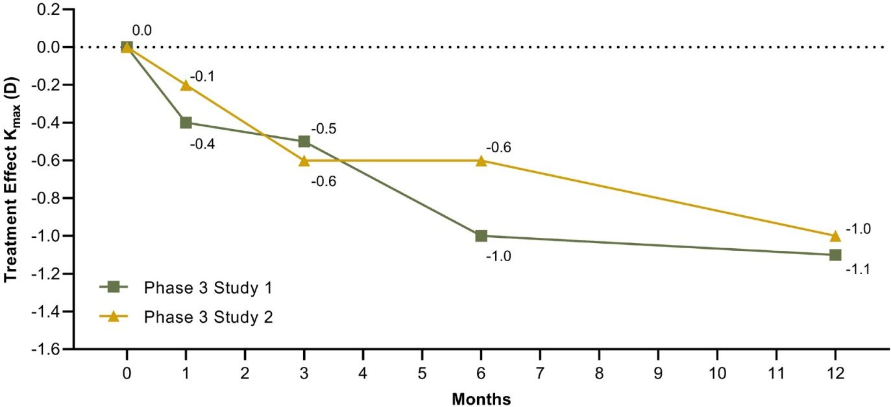

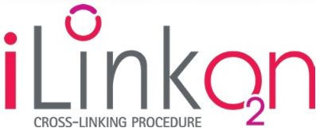

GLAUKOS TRANSFORMING VISION logo

WHAT IF?
# CUSTOMIZED, SPHERICAL THERAPY

*Third-generation iLink therapy represents another potentially significant advancement in keratoconus care*

*Advancing Phase 2 clinical program*

**THIRD-GENERATION iLINK THERAPY DESIGNED TO:**

* Use biomechanical modeling to deliver customized, patterned treatment that matches each patient’s unique corneal topography

* Use proprietary algorithm to precisely target UV energy for maximum cornea cross-linking efficacy

* Build upon Epioxa advantages while further streamlining and enhancing the patient experience

NXL-S medical device rendering and close-up of the treatment head

3ʳᵈ Gen iLink is not approved by the FDA

© 2025 Glaukos Corporation 19

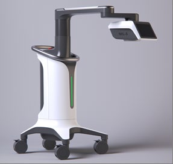

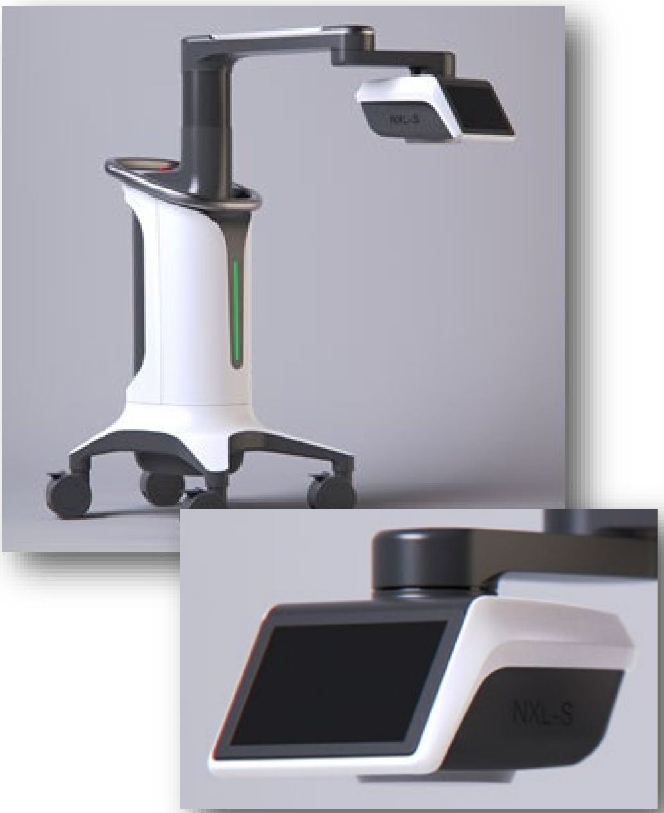

GLAUKOS TRANSFORMING VISION logo

# iLINK / KC
# PRODUCT
# ROADMAP

*Robust pipeline is designed to expand and enhance patient care options with leading-edge innovations*

| PRODUCT                            | PATIENT     | STATUS                             |
| ---------------------------------- | ----------- | ---------------------------------- |
| Photrexa (Epi-off)                 | Keratoconus | FDA Approved (2016)                |
| Epioxa (Epi-on)                    | Keratoconus | NDA filed PDUFA date: 10/20/25 |
| iLink 3ʳᵈ Generation               | Keratoconus | Phase 2                            |
| iVeena (IVMED-80)                  | Keratoconus | Phase 1                            |
| iLinko₂n Diagnostic Screening Tool | Keratoconus | Pre-Submission                     |

© 2025 Glaukos Corporation 20

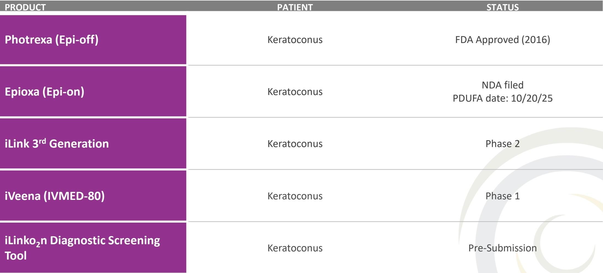

GLAUKOS TRANSFORMING VISION logo

# iLUTION PLATFORM UPDATE

**POTENTIAL BENEFITS OF EYELID DELIVERY VS PRESCRIPTION EYE DROPS**

*   Easier administration
*   Fewer side effects
*   Faster onset of action
*   Better compliance

Photograph of a person applying treatment to their eyelid

*Transdermal dropless therapy has the potential to treat a variety of chronic eye diseases and disorders*

**DEMODEX BLEPHARITIS**

*   Affects an estimated 25 million¹ people in the US

*   Is caused by infestation of demodex mites, a common ectoparasite found on human skin

*   Is characterized by eyelid inflammation and irritation resulting in eyelid redness, discomfort and debris

Close-up photograph of eyelashes with demodex mite debris

**iLUTION DEMODEX BLEPHARITIS PROGRAM**

*   Pre-clinical
*   Goal to commence Phase 2 clinical trial by YE 2025

1 O'Dell L, Dierker DS, Devries DK, et al. Psychosocial Impact of Demodex Blepharitis. Clin Ophthalmol. 2022;16:2979-2987; iLution therapies are not approved by the FDA

© 2025 Glaukos Corporation 21

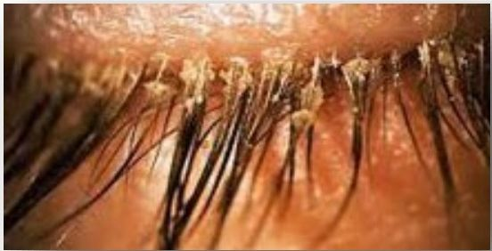

GLAUKOS TRANSFORMING VISION logo

# RETINA XR PLATFORM UPDATE

**Conventional intravitreal injections impose tremendous treatment burdens on patients and contribute to lack of compliance**

Monthly or bi-monthly anti-VEGF injections are standard of care for AMD, DME and RVO but studies show that

**28+ Million**
People in the US affected by retinal disease, primarily AMD and diabetic eye disease¹

**39%**
Are lost to follow-up within 2 years²
Photograph of an eye injection

**$10+ Billion**
Est. US market size in 2024¹
Calendar icon

LEAD RETINA XR PROGRAM

## IVT Multi-Kinase Inhibitor (GLK-401)

* Biodegradable, small molecule implant

* Designed to provide sustained efficacy for improved patient experience and compliance

* Targets AMD, DME, RVO

* Phase 2: Currently enrolling first-in-human clinical development program

FLUORESCEIN ANGIOGRAPHY LEAKAGE IN A RABBIT MODEL³

| Year Post Dose | Placebo (FA Score Mean) | 2-GLK-401 (FA Score Mean) |
| -------------- | ----------------------- | ------------------------- |
| 0              | 31                      | 31                        |
| 0.1            | 28                      | 11                        |
| 0.2            | 29                      | 8                         |
| 0.3            | 28                      | 6                         |
| 0.4            | 29                      | 7                         |
| 0.5            | 29                      | 6                         |
| 0.6            | 28                      | 5                         |
| 0.7            | 29                      | 8                         |
| 0.8            | 30                      | 7                         |
| 0.9            | 29                      | 10                        |
| 1.0            | 27                      | 7                         |
| 1.1            | 27                      | 5                         |
| 1.2            | 29                      | 4                         |
| 1.3            | 27                      | 4                         |
| 1.4            | 32                      | 3                         |
| 1.5            | 28                      | 3                         |
| 1.6            | 28                      | 3                         |
| 1.7            | 31                      | 4                         |
| 1.8            | 30                      | 5                         |
| 1.9            | 33                      | 5                         |
| 2.0            | 38                      | 5                         |
| 2.1            | 33                      | 5                         |
| 2.2            | 34                      | 4                         |
| 2.3            | 35                      | 5                         |
| 2.4            | 34                      | 5                         |
| 2.5            | 31                      | 5                         |
| 2.6            | 33                      | 7                         |
| 2.7            | 32                      | 8                         |
| 2.8            | 36                      | 5                         |
| 2.9            | 35                      | 8                         |
| 3.0            | 39                      | 12                        |

¹ Market Scope; ² Long-term Experience With Intravitreal Anti-VDGF Treatment in Patients with AMD: Analysis of IRIS Registry Database (presented at 39th Annual Meeting of the American Society of Retina Specialists by Theodore Leng, MD); ³ Planned 2025 ARVO submission; Retina XR therapies are not approved by the FDA

© 2025 Glaukos Corporation 22

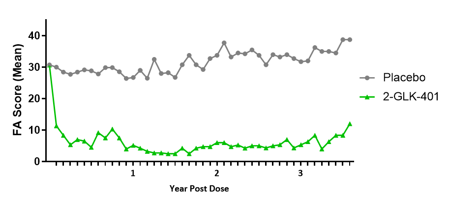

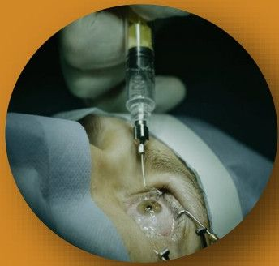

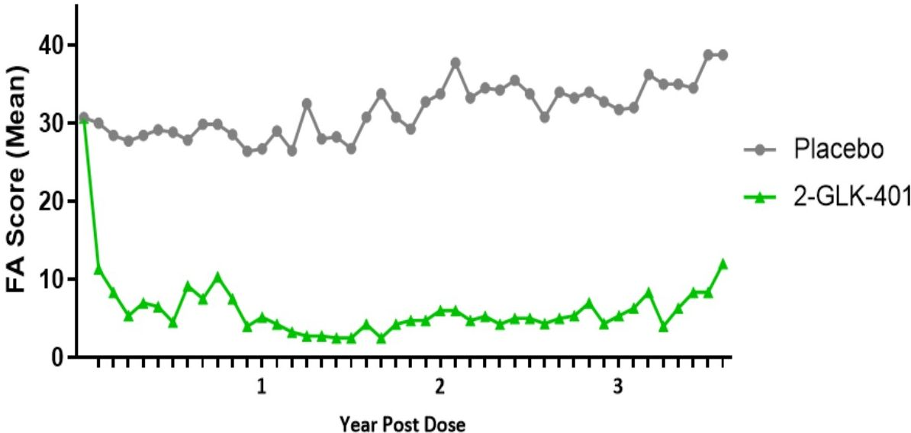

# BUILDING THE BUSINESS IN STAGES

GLAUKOS TRANSFORMING VISION logo

*Continually advancing our most promising opportunities to create a cascade of new products across a variety of disease categories over the next decade*

|                                                                           | iStent & Other Surgical                                                                                                                  | iDose                                   | iLink                                                                                           | iLution                                                        | Retina                                                                       |
| ------------------------------------------------------------------------- | ---------------------------------------------------------------------------------------------------------------------------------------- | --------------------------------------- | ----------------------------------------------------------------------------------------------- | -------------------------------------------------------------- | ---------------------------------------------------------------------------- |
| **Stage 1:** **INTERVENTIONAL** **GLAUCOMA** 2012 →           | iStent/iStent *inject*\\\* iStent *inject* W\\\* iStent infinite PreserFlo iAccess Radius Mitosol IOP Sensor | iDose TR iDose TREX iDose Gen 3 |                                                                                                 | iLution TR                                                     |                                                                              |
| **Stage 2:** **RARE DISEASE /** **KERATOCONUS** 2019 →        |                                                                                                                                          |                                         | Photrexa (Epi-off) Epioxa (Epi-on) iLink Gen 3 iVeena (IVMED-80) Screening Tool |                                                                |                                                                              |
| **Stage 3:** **ANTERIOR SEGMENT** **PHARMACEUTICALS** 2029 →  |                                                                                                                                          |                                         |                                                                                                 | iLution Blepharitis iLution Presbyopia iLution Dry Eye |                                                                              |
| **Stage 4:** **POSTERIOR SEGMENT** **PHARMACEUTICALS** 2030 → |                                                                                                                                          |                                         |                                                                                                 |                                                                | IVT Multi-Kinase Inhibitor (GLK-401) IVT NCE Conjugate (GLK-411) |

\*Combination cataract

IOP sensor, iDose TREX, iDose Gen 3, iLution TR, Epioxa, iLink Gen 3, iVeena and all anterior and posterior segment pharmaceuticals are not approved by the FDA

© 2025 Glaukos Corporation 23

GLAUKOS TRANSFORMING VISION logo

# AMONG INDUSTRY’S MOST FORMIDABLE PORTFOLIOS

*Designed to disrupt treatment paradigms with dropless therapies that address important needs*

| PRODUCT                                  | PATIENT                                         | STATUS                                |              |
| ---------------------------------------- | ----------------------------------------------- | ------------------------------------- | ------------ |
| iStent / iStent inject / iStent inject W | Mild-to-Moderate Glaucoma with Cataract         | FDA Approved (2012, 2018, 2020)       | GLAUCOMA     |
| iStent infinite                          | Glaucoma (failed on prior therapy)              | FDA Cleared (2022)                    |              |
| iStent infinite                          | Glaucoma (label expansion)                      | Active PMA Study / EU MDR Cert (2025) |              |
| PRESERFLO MicroShunt                     | Advanced-Refractory Glaucoma                    | OUS Approved / US Active IDE Study    |              |
| iDose TR                                 | Ocular Hypertension - Glaucoma                  | FDA Approved (2023)                   |              |
| iDose TREX                               | Ocular Hypertension - Glaucoma                  | Phase 2b/3                            |              |
| iDose Next Generation                    | Ocular Hypertension - Glaucoma                  | Pre-Clinical                          |              |
| iLution Travoprost (GLK-311)             | Ocular Hypertension - Glaucoma                  | Phase 2                               |              |
| Mitosol                                  | Adjunct to Glaucoma Filtration Surgery          | FDA Approved                          |              |
| Photrexa (Epi-off)                       | Keratoconus                                     | FDA Approved (2016)                   | CORNEA       |
| Epioxa (Epi-on)                          | Keratoconus                                     | NDA filed; PDUFA date: 10/20/25       |              |
| iLink 3ʳᵈ Generation                     | Keratoconus                                     | Phase 2                               |              |
| iVeena (IVMED-80)                        | Keratoconus                                     | Phase 1                               |              |
| iLinko₂n Diagnostic Screening Tool       | Keratoconus                                     | Pre-Submission                        |              |
| iLution Blepharitis                      | Demodex Blepharitis                             | Pre-Clinical                          | RETINA OTHER |
| iLution Presbyopia (GLK-302)             | Presbyopia                                      | Phase 2                               |              |
| iLution Dry Eye (GLK-301)                | Dry Eye                                         | Phase 2                               |              |
| IVT Multi-Kinase Inhibitor (GLK-401)     | AMD, DME, RVO                                   | Phase 2                               |              |
| IVT NCE Conjugate (GLK-411)              | DME                                             | Pre-Clinical                          |              |
| Radius XR                                | Wearable Patient Engagement & Diagnostic System | FDA Cleared                           |              |
| iAccess                                  | Precision Goniotomy                             | FDA Cleared                           |              |

© 2025 Glaukos Corporation 24

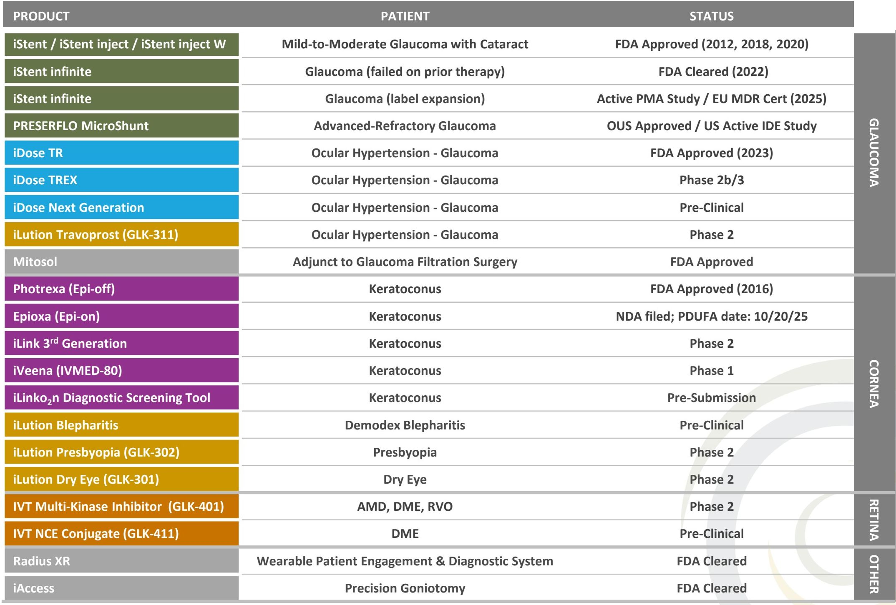

GLAUKOS TRANSFORMING VISION logo

# KEY 2025
# PIPELINE
# MILESTONES

*Energy and resources are focused on advancing programs with greatest potential impact*

| PROGRAM                              | PATIENT                      | INTENDED CLINICAL BENEFIT                                                                                 | 2025 MILESTONE TARGET                                    |
| ------------------------------------ | ---------------------------- | --------------------------------------------------------------------------------------------------------- | -------------------------------------------------------- |
| GLAUCOMA                             |                              |                                                                                                           |                                                          |
| iStent infinite                      | Mild-to-Moderate Glaucoma    | MIGS therapy                                                                                              | *Advance enrollment in PMA pivotal trial*                |
|                                      | Glaucoma                     | MIGS therapy                                                                                              | *EU regulatory approval and commercial launch*           |
| PRESERFLO MicroShunt                 | Advanced-Refractory Glaucoma | Ab-externo device for late-stage glaucoma                                                                 | *Commence US IDE trial*                                  |
| iDose TR                             | OHT-Glaucoma                 | Sustained-release, 24/7 drug delivery for improved compliance                                             | *Conduct Phase 4 studies*                                |
| iDose TREX                           | OHT-Glaucoma                 | Increased drug payload designed to extend duration-of-effect                                              | *Advance Phase 2b/3 clinical program*                    |
| iLution Blepharitis                  | Demodex Blepharitis          | Transdermal drug delivery; potential for improved compliance vs topical drops                             | *Commence Phase 2 trial by end of 2025*                  |
| CORNEA                               |                              |                                                                                                           |                                                          |
| Epioxa (Epi-on)                      | Keratoconus                  | Reduced treatment time and complexity for improved patient comfort and recovery                           | *FDA approval by end of 2025 (PDUFA date: 10/20/25)* |
| iLink 3ʳᵈ Generation                 | Keratoconus                  | Customized treatment algorithms and laser-based UV light source                                           | *Advance Phase 2 clinical program*                       |
| RETINA                               |                              |                                                                                                           |                                                          |
| IVT Multi-Kinase Inhibitor (GLK-401) | AMD, DME, RVO                | Biodegradable, sustained-release implant; potential to reduce treatment burdens vs conventional therapies | *Advance enrollment in Phase 2 trial*                    |

© 2025 Glaukos Corporation 25

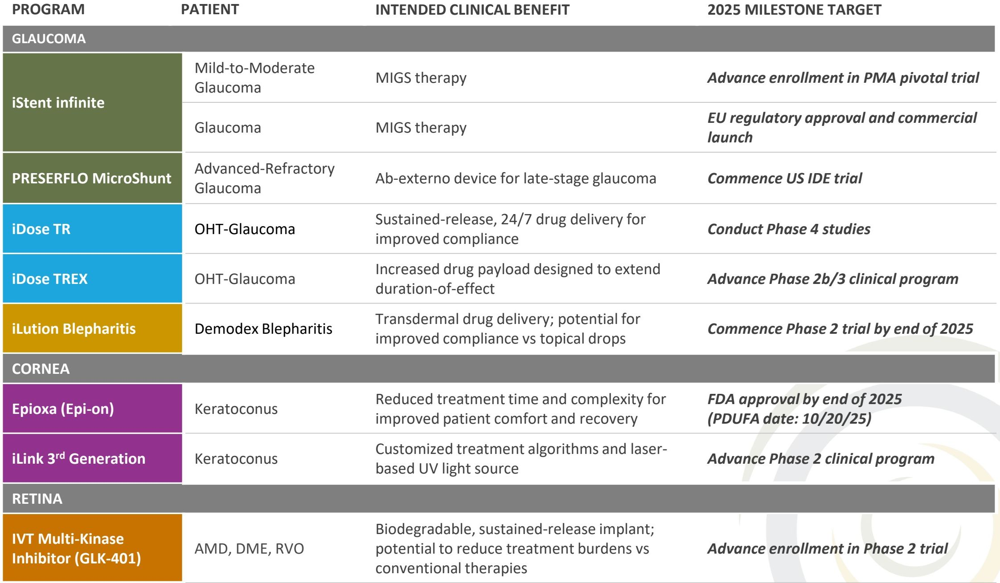

Glaukos Transforming Vision logo

BUILDING THE BUSINESS IN

# KEY HIGHLIGHTS

*Solid financial and operational footing to support future pipeline delivery and growth plans*

NET SALES¹
(in millions)

| Year | Net Sales (in millions) |
| ---- | ----------------------- |
| 2022 | $283                    |
| 2023 | $315                    |
| 2024 | $383                    |
| 2025 | $483                    |

## GLOBAL INFRASTRUCTURE

Global Infrastructure: 17 Countries with direct operations, 300+ Global commercial personnel

## GROSS MARGIN²
(2Q 2025)

Gross Margin 83%

## SPECIALIZED MANUFACTURING

*Industry leader in micro-scale manufacturing with **+20 years'** experience*

*State-of-the-art facilities that meet regulatory, CMC and ISO 7 guidelines*

Photograph of a person in a cleanroom environment using a microscope

## SALES MIX
(2Q 2025)

| Segment        | Percentage |
| -------------- | ---------- |
| US Glaucoma    | 58%        |
| Int'l Glaucoma | 25%        |
| Corneal Health | 17%        |

## HEALTHY BALANCE SHEET

# $279 Million

*Cash and equivalents; no debt as of 6/30/2025*

\*¹ FY2025: Net sales guidance range midpoint as of 7/30/25

\*² 2Q 2025 gross margin adjusted for certain acquisition-related accounting and other adjustments - see Appendix for details

© 2025 Glaukos Corporation 26

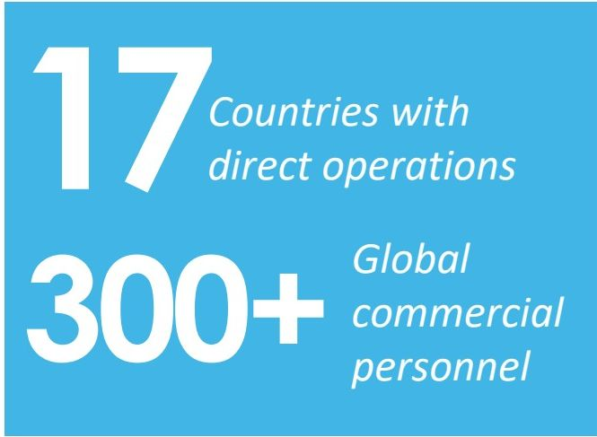

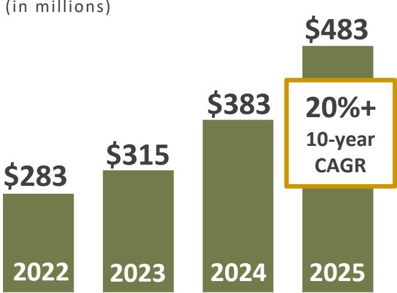

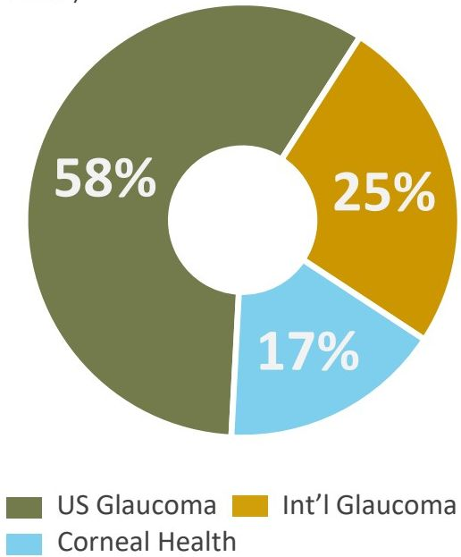

GLAUKOS TRANSFORMING VISION logo

# WE’LL GO FIRST

Innovation is at the core of everything we do. At Glaukos, we push the limits of science and technology to solve unmet needs in chronic eye diseases.

© 2025 Glaukos Corporation 27

Large stylized circular logo with green, grey, and gold concentric arcs

GLAUKOS TRANSFORMING VISION logo

© 2025 Glaukos Corporation 28

# Appendix

GLAUKOS TRANSFORMING VISION logo

| GAAP to Non-GAAP Reconciliation - 2Q 2025 (in thousands) | GAAP to Non-GAAP Reconciliation - 2Q 2025 (in thousands) 2Q 2025 GAAP Gross Margin | GAAP to Non-GAAP Reconciliation - 2Q 2025 (in thousands) Amort. of Dev Tech Intangibles, Dev IP, and Dist Rights | GAAP to Non-GAAP Reconciliation - 2Q 2025 (in thousands) 2Q 2025 Non-GAAP Gross Margin |
| -------------------------------------------------------- | -------------------------------------------------------------------------------------- | -------------------------------------------------------------------------------------------------------------------- | ------------------------------------------------------------------------------------------ |
| Net Sales                                                | $124,120                                                                               |                                                                                                                      | $124,120                                                                                   |
| COGS                                                     | $26,896                                                                                | $(5,764)                                                                                                             | $21,132                                                                                    |
| Gross Profit                                             | $97,224                                                                                | $5,764                                                                                                               | $102,988                                                                                   |
| **Gross Margin**                                         | **78%**                                                                                |                                                                                                                      | **83%**                                                                                    |

© 2025 Glaukos Corporation 29

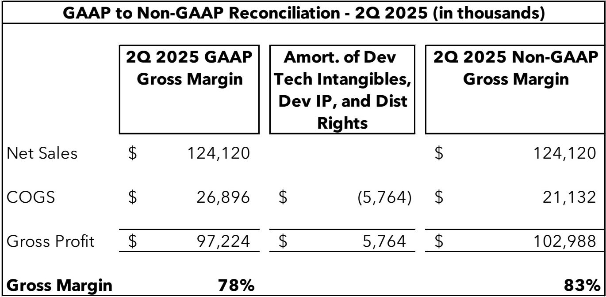
