This label may not be the latest approved by FDA.
For current labeling information, please visit https://www.fda.gov/drugsatfda

NDA 218010
Page 4

**HIGHLIGHTS OF PRESCRIBING INFORMATION**
**These highlights do not include all the information needed to use iDose® TR safely and effectively. See full prescribing information for iDose® TR.**

**iDose® TR (travoprost intracameral implant), for intracameral administration**
**Initial U.S. Approval: 2001**

* Corneal endothelial dystrophy (4.2)
* Prior corneal transplantation (4.3)
* Hypersensitivity (4.4)

-------------------INDICATIONS AND USAGE-----------------

iDose® TR is a prostaglandin analog indicated for the reduction of intraocular pressure (IOP) in patients with open-angle glaucoma (OAG) or ocular hypertension (OHT) (1)

---------------WARNINGS AND PRECAUTIONS------------

* <u>Iridocorneal Angles</u>: iDose TR should be used with caution in patients with narrow angles or other angle abnormalities (5.1)

* <u>Device Dislocation</u>: Monitor patients routinely to confirm the location of the iDose TR at the site of administration (5.2)

* <u>Pigmentation</u>: Increased pigmentation of the iris can occur. Iris pigmentation is likely to be permanent (5.5)

--------------DOSAGE AND ADMINISTRATION-------------

* For ophthalmic intracameral administration (2.1)

* The intracameral administration should be carried out under standard aseptic conditions (2.2)

----------------------ADVERSE REACTIONS--------------------

In controlled studies, the most common ocular adverse reactions reported in 2% to 6% of patients were increases in intraocular pressure, iritis, dry eye, and visual field defects (6.1)

-------------DOSAGE FORMS AND STRENGTHS------------

Intracameral implant containing 75 mcg travoprost, pre-loaded in a single-dose inserter (3)

**To report SUSPECTED ADVERSE REACTIONS, contact Glaukos Corporation at 1-888-404-1644 or FDA at 1-800-FDA-1088 or <u>www.fda.gov/medwatch</u>.**

---------------------CONTRAINDICATIONS---------------------

* Ocular or periocular infections (4.1)

Revised: 12/2023

**FULL PRESCRIBING INFORMATION: CONTENTS\***

**1 INDICATIONS AND USAGE**

**2 DOSAGE AND ADMINISTRATION**

2.1 General Dosing Information

2.2 Administration

**3 DOSAGE FORMS AND STRENGTHS**

**4 CONTRAINDICATIONS**

4.1 Ocular or Periocular Infections

4.2 Corneal Endothelial Dystrophy

4.3 Prior Corneal Transplantation

4.4 Hypersensitivity

**5 WARNINGS AND PRECAUTIONS**

5.1 Iridocorneal Angles

5.2 Device Dislocation

5.3 Macular Edema

5.4 Intraocular Inflammation

5.5 Pigmentation

5.6 Endophthalmitis

5.7 Magnetic Resonance Imaging (MRI) Conditional

**6 ADVERSE REACTIONS**

6.1 Clinical Trials Experience

**8 USE IN SPECIFIC POPULATIONS**

8.1 Pregnancy

8.2 Lactation

8.4 Pediatric Use

8.5 Geriatric Use

**11 DESCRIPTION**

**12 CLINICAL PHARMACOLOGY**

12.1 Mechanism of Action

12.3 Pharmacokinetics

**13 NONCLINICAL TOXICOLOGY**

13.1 Carcinogenesis, Mutagenesis, Impairment of Fertility

**14 CLINICAL STUDIES**

**16 HOW SUPPLIED/STORAGE AND HANDLING**

**17 PATIENT COUNSELING INFORMATION**

\* Sections or subsections omitted from the full prescribing information are not listed.

Reference ID: 5292678

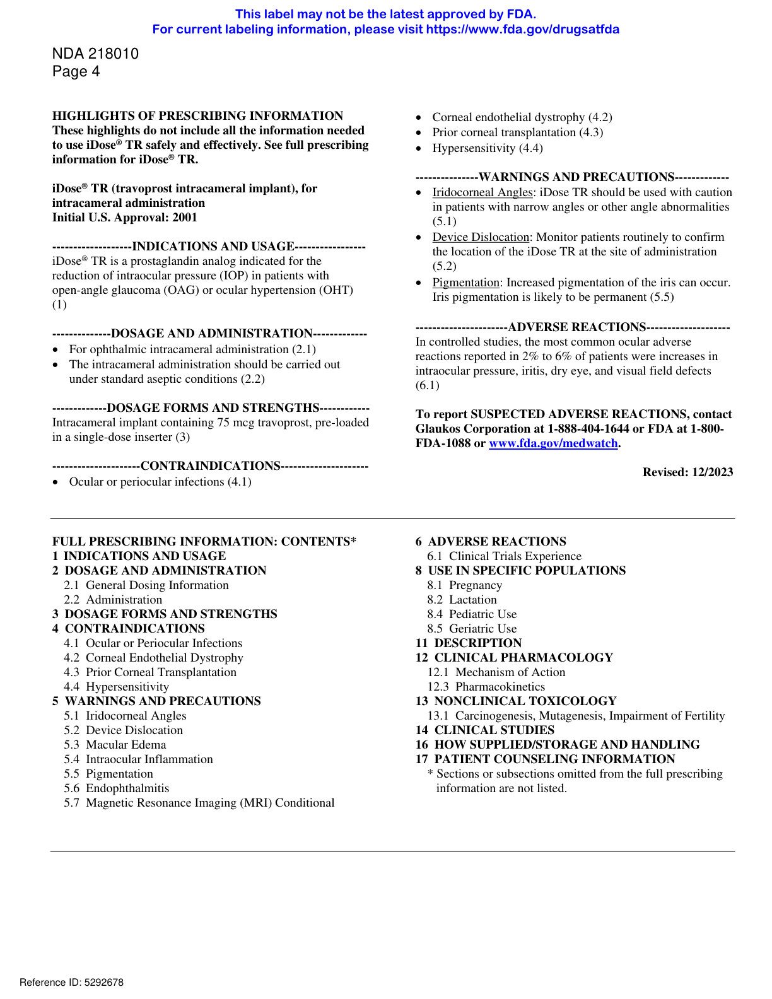

<page_number>5</page_number>
**This label may not be the latest approved by FDA.

For current labeling information, please visit https://www.fda.gov/drugsatfda**

NDA 218010

Page 5

## FULL PRESCRIBING INFORMATION

## 1 INDICATIONS AND USAGE

iDose® TR (travoprost intracameral implant) is indicated for the reduction of intraocular pressure (IOP) in patients with open-angle glaucoma (OAG) or ocular hypertension (OHT).

## 2 DOSAGE AND ADMINISTRATION

## 2.1 General Dosing Information

iDose TR is a travoprost delivery system consisting of a travoprost releasing implant pre-loaded in a sterile, single-dose inserter. iDose TR is administered intracamerally through a small, clear corneal incision and is anchored into the sclera at the iridocorneal angle. iDose TR should not be readministered to an eye that received a prior iDose TR.

## 2.2 Administration

1. The procedure must be carried out under aseptic conditions which include use of sterile gloves and a sterile drape.

2. The eye should be anesthetized using general, retrobulbar, peribulbar, or topical anesthesia per standard operating room procedures.

3. The iDose TR implantation procedure must be performed under magnification that allows clear visualization of the anterior chamber angle and angle structures including trabecular meshwork, with the patient’s head in a stabilized position. The pupil should not be dilated prior to the procedure.

4. An intracameral miotic can be injected to deepen the angle prior to insertion of the iDose TR.

5. It is recommended that the implant surgery be performed from the temporal side, using a temporal clear corneal incision. The implant will be implanted through the angle and the trabecular meshwork into the sclera on the nasal side.

6. Remove the barrier pouch from the carton and examine for damage. Open the barrier pouch, discard the oxygen scavenger packet, and remove the blister tray with Tyvek® lid. Open the Tyvek lid containing the iDose TR pre-loaded inserter and present to the surgeon. The iDose TR implant and single-dose inserter should be handled in the sterile field. **Caution:** Do not use the iDose TR if the Tyvek lid has been opened or the packaging appears damaged.

7. Prepare for gonioscopy by turning the patient’s head away from the surgeon by approximately 15° to 25° and tilt the scope toward the surgeon by approximately 35°. The total combined angle should be approximately 50° to 60°.

8. Place a small amount of viscoelastic on the cornea. Position the gonioprism on the cornea using light touch gonioscopy. Adjust the microscope to locate and focus on the trabecular meshwork.

9. Inspect the angle with a gonioprism to ensure that a good view of all angle structures is available at the nasal implant location.

10. Hold the single-dose inserter as shown in **Figure 1** with your index finger comfortably on the implant release button.

Reference ID: 5292678

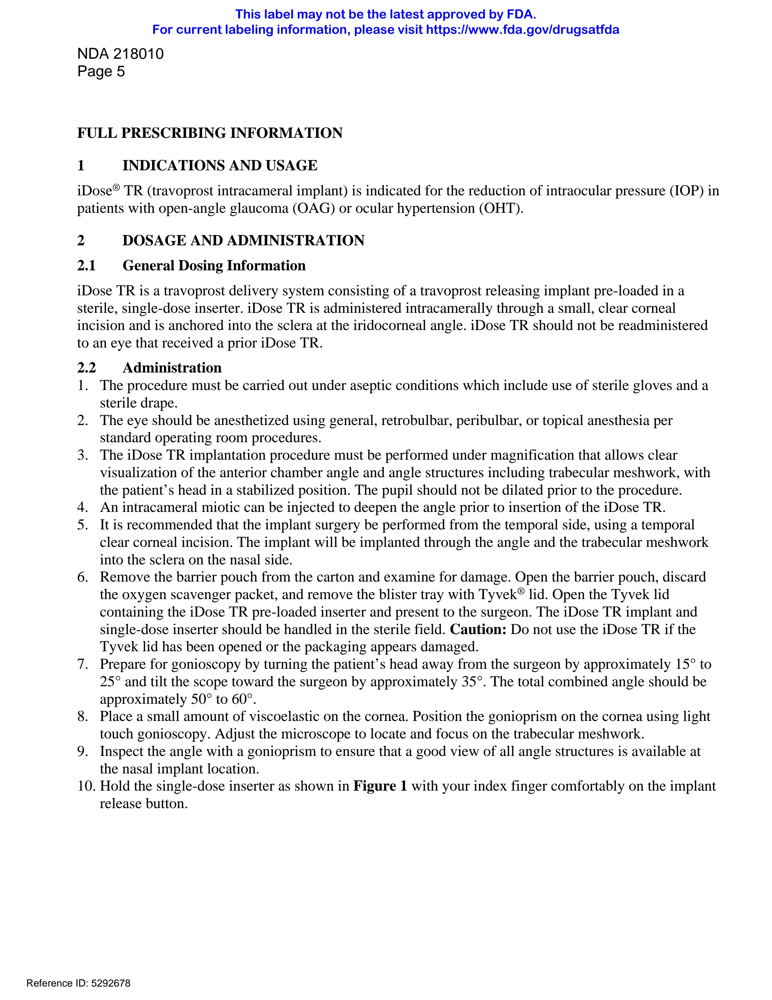

This label may not be the latest approved by FDA.
For current labeling information, please visit https://www.fda.gov/drugsatfda

NDA 218010
Page 6

Figure 1

Photograph of a gloved hand holding the sterile inserter

11. Perform a detailed inspection of the tip of the sterile inserter under magnification to ensure that the iDose TR implant is present (**Figure 2**)

Figure 2

Diagram of the sterile inserter and iDose TR implant with labels for Safety Clip, Release Button, Inserter Tip with Grasper, Implant, Implant Reservoir, and Implant Anchor

12. Create a clear corneal incision of approximately 2.4 mm at the temporal limbus location using an instrument of the surgeon’s choice.

13. Add a cohesive viscoelastic to the anterior chamber as needed to form the anterior chamber and improve visualization of the angle. Be careful not to overinflate.

Reference ID: 5292678

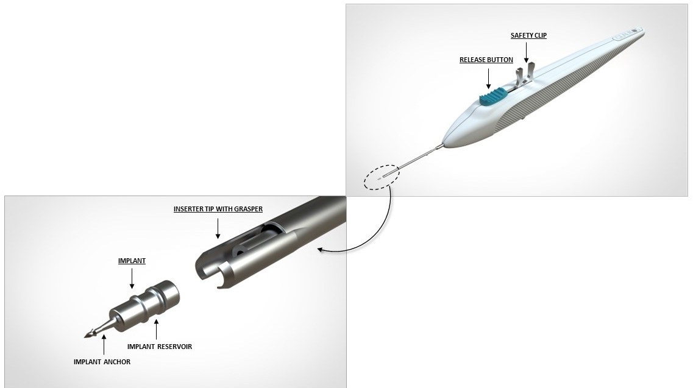

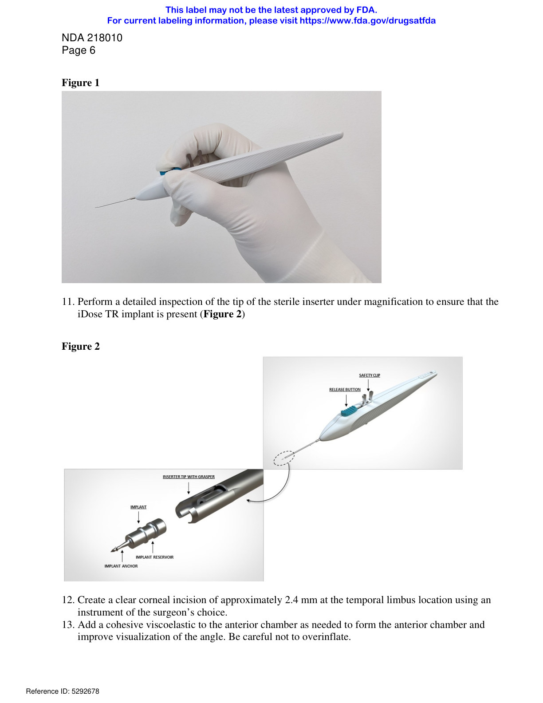

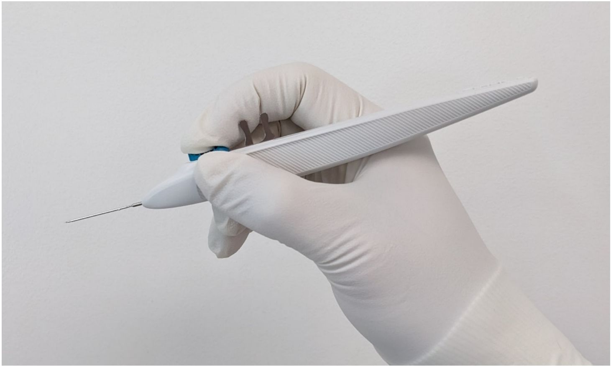

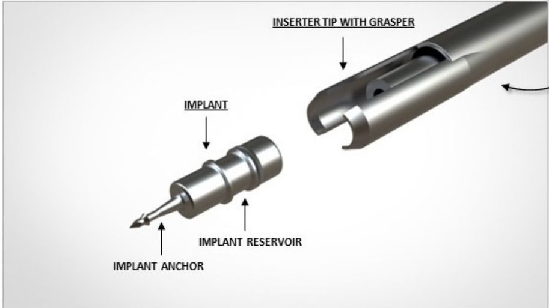

This label may not be the latest approved by FDA.

For current labeling information, please visit https://www.fda.gov/drugsatfda

NDA 218010
Page 7

**14. Insertion of the implant:**

a. When ready for implantation, remove the safety clip which holds the release button in place by squeezing and rocking the clip backwards (see **Figure 2**). Place finger on the release button to ensure it remains in the forward position and does not prematurely release the implant.

b. To smoothly enter the anterior chamber, slide the inserter tip with implant “side to side” in the incision.

c. Advance to the pupillary margin and ensure there is sufficient cohesive viscoelastic on the cornea before replacing the gonioprism onto the cornea.

d. Take care to avoid contact with the lens or cornea.

e. Advance to the anterior chamber angle and approach the trabecular meshwork (see **Figure 3**).

**Figure 3**

Illustration of an inserter tip approaching the trabecular meshwork

f. Press the implant directly through the trabecular meshwork, compressing the tissue until the implant anchor securely penetrates the sclera through the back wall of Schlemm’s canal. The base of the implant reservoir should be firmly in contact with and compressing the trabecular meshwork.

g. Once the anchor of the implant is securely embedded in sclera, pause for the tissue to relax. Carefully slide the implant release button backwards to open the inserter tip with grasper and release the implant from the inserter (**Figure 4a**). Ensuring the implant has released from the inserter grasper, slowly remove the inserter straight back (**Figure 4b**). Avoid pulling the implant out of position.

Reference ID: 5292678

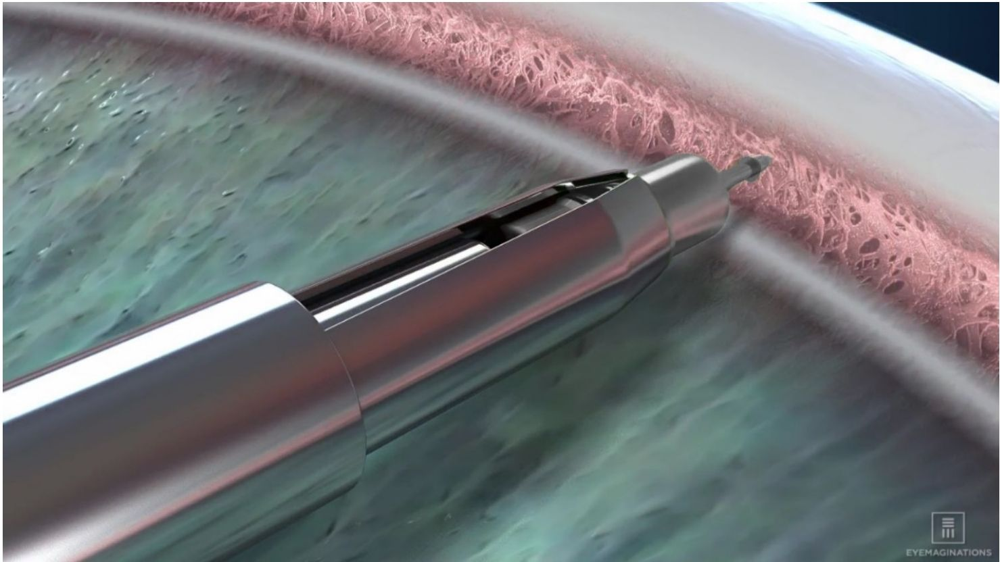

This label may not be the latest approved by FDA.
For current labeling information, please visit https://www.fda.gov/drugsatfda

NDA 218010
Page 8

**Figure 4a**

Illustration of the inserter tip applying pressure to the iDose TR implant against the trabecular meshwork.

**Figure 4b**

Illustration of the iDose TR implant anchored in the trabecular meshwork after the inserter has been withdrawn.

h. Apply slight pressure to the sides of the implant with the tip of the inserter to ensure the implant is fully anchored into scleral tissue. <u>Note</u>: If for any reason the implant appears loose or disengaged from the scleral tissue after the initial implantation, slide the implant release button back to fully open the graspers. Position the graspers between the ribs on the implant and regrasp the body of the implant between the ribs by pushing the release button forward and re-implant a minimum of ½ clock hour to either side. Do not re-implant at the same location.

i. Withdraw the inserter from the eye.

## 15. Location of iDose TR in Trabecular Meshwork

a. Perform a high-magnification examination to confirm that the implant is in proper position (i.e., the proximal end rests in the anterior chamber with an unobstructed membrane) (see Figure 5) and securely attached with the anchor thoroughly embedded in the sclera.

Reference ID: 5292678

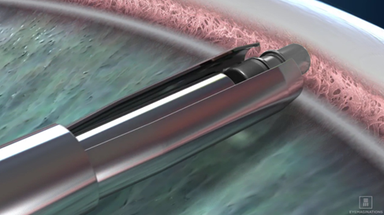

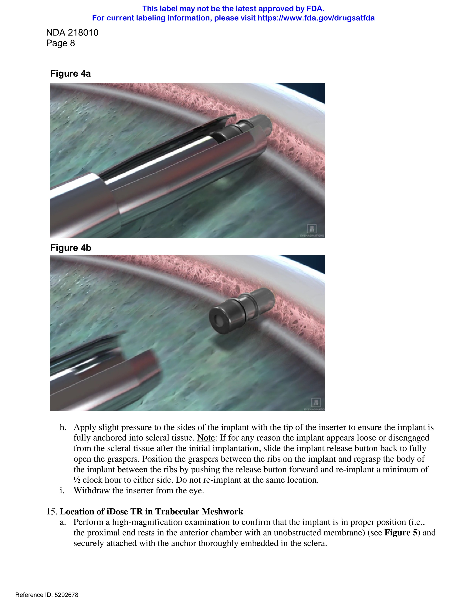

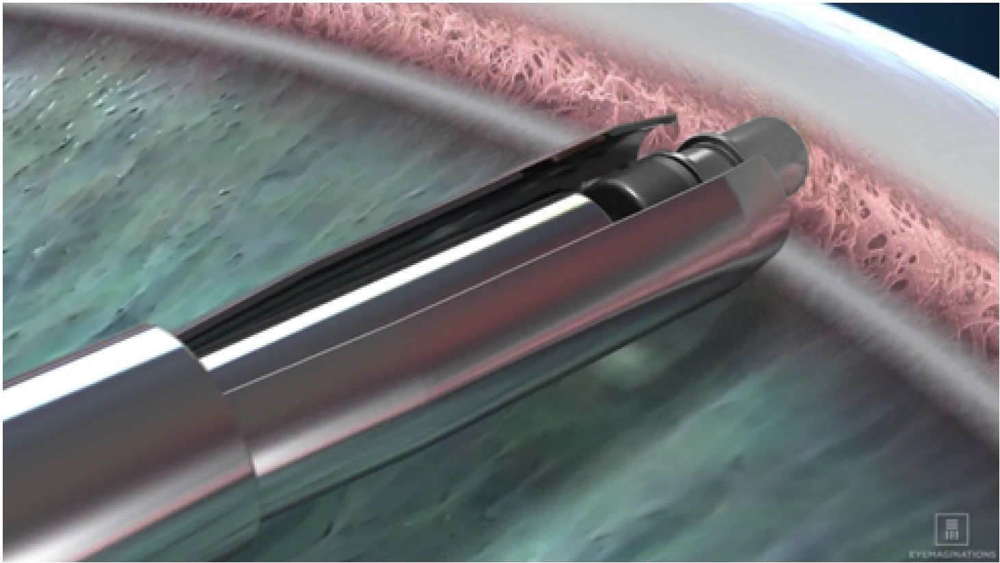

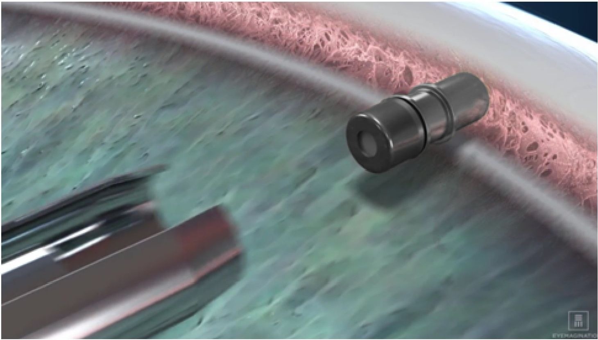

This label may not be the latest approved by FDA.
For current labeling information, please visit https://www.fda.gov/drugsatfda

NDA 218010
Page 9

Figure 5

Illustration of an intracameral implant being positioned in the eye

b. It is normal for an edge of the implant to make contact with the iris. Note: In a normal iris (no viscoelastic in the anterior chamber and non-constricted pupil), the iris may obstruct the view of a portion of the cap of the implant.

c. Irrigate and aspirate the anterior chamber with balanced salt solution to remove all viscoelastic. Press down on the posterior edge of the incision as needed to facilitate complete removal of viscoelastic.

d. Inflate the anterior chamber with saline solution as needed to achieve physiologic pressure.

# 3 DOSAGE FORMS AND STRENGTHS

Intracameral implant containing 75 mcg travoprost, pre-loaded in a single-dose inserter.

# 4 CONTRAINDICATIONS

## 4.1 Ocular or Periocular Infections

iDose TR (travoprost intracameral implant) is contraindicated in patients with active or suspected ocular or periocular infections.

## 4.2 Corneal Endothelial Dystrophy

iDose TR is contraindicated in patients with corneal endothelial cell dystrophy (e.g., Fuch’s Dystrophy, corneal guttatae).

## 4.3 Prior Corneal Transplantation

iDose TR is contraindicated in patients with prior corneal transplantation, or endothelial cell transplants (e.g., Descemet’s Stripping Automated Endothelial Keratoplasty [DSAEK]).

## 4.4 Hypersensitivity

iDose TR is contraindicated in patients with hypersensitivity to travoprost or to any other components of the product .

Reference ID: 5292678

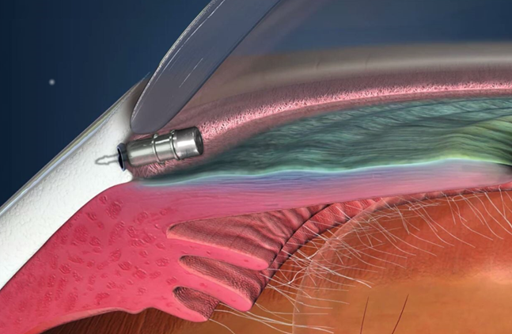

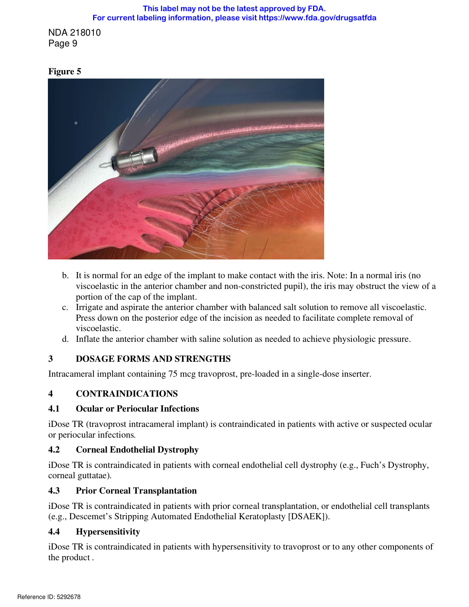

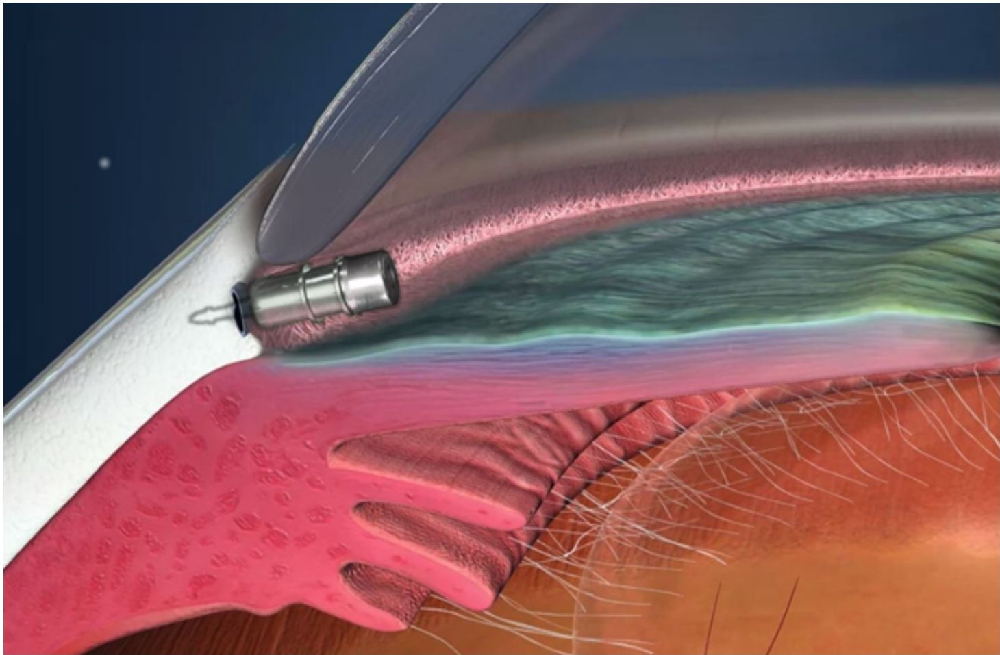

<page_number>10</page_number>
**This label may not be the latest approved by FDA.

For current labeling information, please visit https://www.fda.gov/drugsatfda**

Page 10

NDA 218010

## 5 WARNINGS AND PRECAUTIONS

## 5.1 Iridocorneal Angles

iDose TR should be used with caution in patients with narrow iridocorneal angles (Shaffer grade < 3) or other angle abnormalities (e.g., peripheral anterior synechia, rubeosis iridis) that could impair proper placement of iDose TR at the planned implantation site.

## 5.2 Device Dislocation

Dislocation of the iDose TR has been observed in clinical trials. Patients should be monitored routinely to confirm the location of the iDose TR at the site of administration. If the iDose TR implant becomes dislocated, it should be surgically removed.

## 5.3 Macular Edema

Macular edema, including cystoid macular edema, has been reported during treatment with ophthalmic travoprost, including iDose TR intracameral implant. iDose TR should be used with caution in aphakic patients, in pseudophakic patients with a torn posterior lens capsule, or in patients with known risk factors for macular edema.

## 5.4 Intraocular Inflammation

Prostaglandin analogs, including iDose TR, have been reported to cause intraocular inflammation. iDose TR should be used with caution in patients with active intraocular inflammation (e.g., uveitis) because the inflammation may be exacerbated.

## 5.5 Pigmentation

Topical ophthalmic travoprost has been reported to cause increased pigmentation to pigmented tissues. Pigmentation is expected to increase as long as travoprost is administered. The pigmentation change is due to increased melanin content in the melanocytes rather than to an increase in the number of melanocytes. After discontinuation of travoprost, pigmentation of the iris is likely to be permanent. The long-term effects of increased pigmentation are not known.

Iris color change may not be noticeable for several months to years. Typically, the brown pigmentation around the pupil spreads concentrically towards the periphery of the iris and the entire iris or parts of the iris become more brownish. Neither nevi nor freckles of the iris appear to be affected by treatment. While treatment with travoprost can be continued in patients who develop noticeably increased iris pigmentation, these patients should be examined regularly.

## 5.6 Endophthalmitis

Intraocular surgical procedures and injections have been associated with endophthalmitis. Proper aseptic technique must always be used with administering iDose TR, and patients should be monitored following the administration.

## 5.7 Magnetic Resonance Imaging (MRI) Conditional

iDose TR is MR Conditional. Patients should be informed that the implant is MR Conditional (as noted on their Patient ID card). If the patient requires magnetic resonance imaging (MRI), they should inform their healthcare provider that they have an iDose TR implanted in their eye.

A patient with the iDose TR may be safely scanned under the following conditions. Failure to follow these conditions may result in injury to the patient.

Reference ID: 5292678

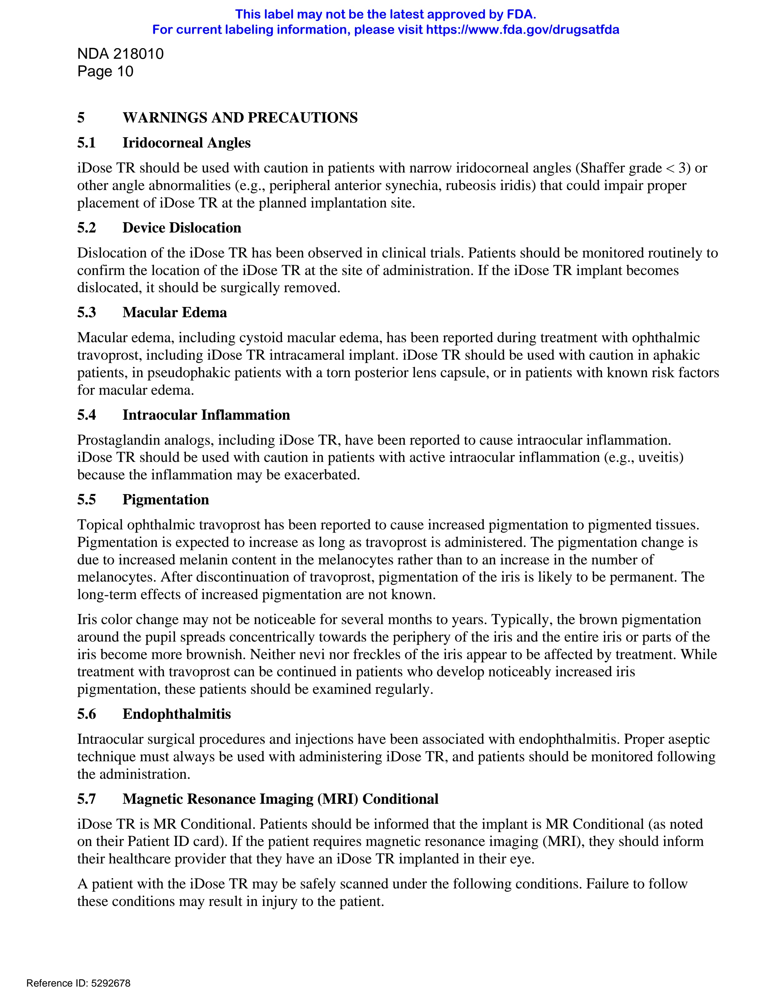

This label may not be the latest approved by FDA.
For current labeling information, please visit https://www.fda.gov/drugsatfda

NDA 218010
Page 11

| Parameter                                             | Condition of Use / Information                                                                                                                                      |
| ----------------------------------------------------- | ------------------------------------------------------------------------------------------------------------------------------------------------------------------- |
| **Nominal Values of Static Magnetic Field (T)**       | 3.0 T or less                                                                                                                                                       |
| **Maximum Spatial Field Gradient (T/m and gauss/cm)** | 40-T/m (4,000-gauss/cm)                                                                                                                                             |
| **Type of RF Excitation**                             | Circularly Polarized (CP) (i.e., Quadrature-Transmission)                                                                                                           |
| **Transmit RF Coil Information**                      | Any transmit RF coil may be used                                                                                                                                    |
| **Operating Mode of MR System**                       | Normal Operating Mode                                                                                                                                               |
| **Maximum Whole Body Averaged SAR**                   | 2-W/kg (Normal Operating Mode)                                                                                                                                      |
| **Maximum Head SAR**                                  | 3.2-W/kg (Normal Operating Mode)                                                                                                                                    |
| **Limits on Scan Duration**                           | Whole body averaged SAR of 2-W/kg for 60 minutes of continuous RF exposure (i.e., per pulse sequence or back-to-back sequences/series without breaks)               |
| **MR Image Artifact**                                 | The presence of this implant produces an imaging artifact. Therefore, carefully select pulse sequence parameters if the implant is located in the area of interest. |

# 6 ADVERSE REACTIONS

The following adverse reactions are described elsewhere in the labeling:

* Ocular or periocular infections [see Contraindications (4.1)]

* Corneal endothelial dystrophy [see Contraindications (4.2)]

* Prior corneal transplantation [see Contraindications (4.3)]

* Hypersensitivity [see Contraindications (4.4)]

* Device dislocation [see Warnings and Precautions (5.2)]

* Macular edema [see Warnings and Precautions (5.3)]

* Intraocular inflammation [see Warnings and Precautions (5.4)]

* Pigmentation [see Warnings and Precautions (5.5)]

* Endophthalmitis [see Warnings and Precautions (5.6)]

## 6.1 Clinical Trials Experience

Because clinical trials are conducted under widely varying conditions, adverse reaction rates observed in the clinical trials of a drug cannot be directly compared to rates in the clinical trials of another drug and may not reflect the rates observed in practice.

The following adverse events rates are derived from three randomized, double-masked clinical trials in which 868 patients with open angle glaucoma (OAG) or ocular hypertension (OHT) received an iDose TR and were followed for one year. The most commonly reported ocular adverse reactions (2% to 6%) were increases in intraocular pressure, iritis, dry eye, visual field defects, eye pain, ocular hyperaemia, and

Reference ID: 5292678

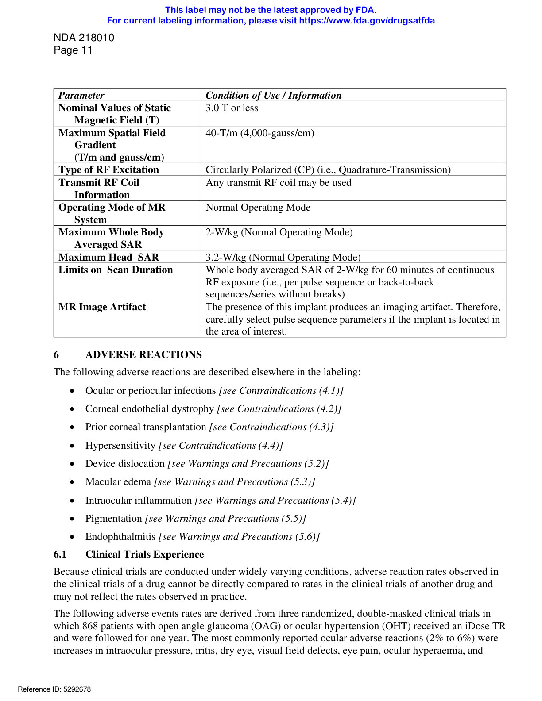

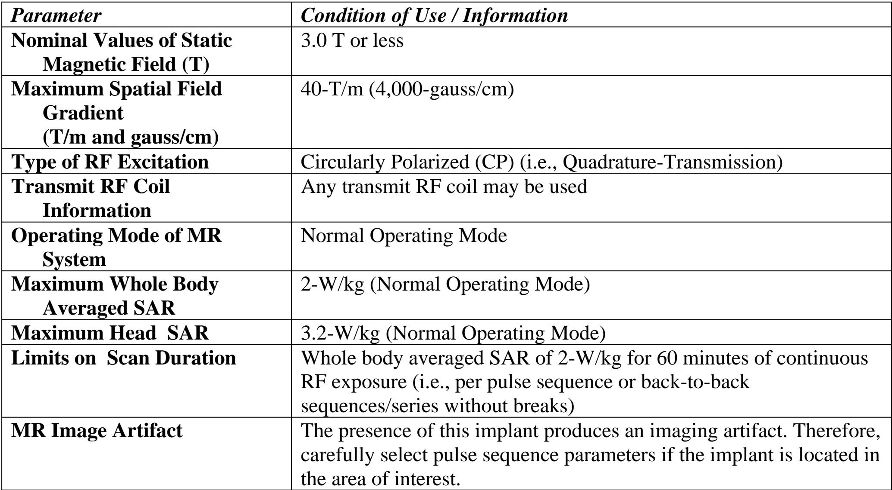

This label may not be the latest approved by FDA.
For current labeling information, please visit https://www.fda.gov/drugsatfda

NDA 218010
Page 12

reduced visual acuity. Ocular adverse reactions reported in less than 2% of patients were conjunctival hemorrhage, photophobia, punctate keratitis, blepharitis, eye irritation, corneal abrasion, device dislocation, vitreous detachment, and foreign body sensation in eyes.

# 8 USE IN SPECIFIC POPULATIONS

## 8.1 Pregnancy

<u>Risk Summary</u>

There are no adequate and well-controlled studies of iDose TR (travoprost intracameral implant) administration in pregnant women to inform a drug-associated risk. Subcutaneous administration of travoprost to pregnant mice and rats throughout the period of organogenesis produced embryo-fetal lethality, spontaneous abortion, and premature delivery at potentially clinically relevant doses.

Advise pregnant women of a potential risk to a fetus. iDose TR should be administered during pregnancy only if the potential benefit justifies the potential risk to the fetus.

<u>Data</u>

Animal Data

An embryo-fetal development study was conducted in pregnant rats administered travoprost once daily at doses up to 10 mcg/kg by subcutaneous injection from gestation day (GD) 6 to 17, to target the period of organogenesis. At 10 mcg/kg, 116 times the maximum human ocular dose (MHOD) of 1 implant *per* eye, based on body surface area (BSA), assuming sustained travoprost release from the implant for 6 months or 0.0139 mcg/kg/day, travoprost was teratogenic in rats, evidenced by an increase in the incidence of skeletal malformations as well as external and visceral malformations, including fused sternebrae, domed head and hydrocephaly. Travoprost caused post-implantation loss at 10 mcg/kg. The fetal no observed adverse effect level (NOAEL) was 3 mcg/kg (34.5 times the maximum human ocular dose (MHOD) of 1 implant *per* eye, based on BSA).

An embryo-fetal development study was conducted in pregnant mice administered travoprost once daily by subcutaneous injection at doses up to 1 mcg/kg from GD 6 to 16, to target the period of organogenesis. Travoprost induced an increase in post-implantation losses and a decrease in fetal viability in mice at subcutaneous doses > 0.3 mcg/kg. The fetal NOAEL was 0.3 mcg/kg (1.7 times the MHOD based on BSA). The maternal NOAEL was 1 mcg/kg (5.8 times the MHOD based on BSA).

Pre/postnatal development studies were conducted in rats administered travoprost once daily by subcutaneous injection from GD 7 (early embryonic period) to postnatal Day 21 (end of lactation period). At doses of greater than or equal to 0.12 mcg/kg/day (1.4 times the MHOD based on BSA), the incidence of post-natal mortality was increased, and neonatal body weight was decreased. Neonatal development was also affected, evidenced by delayed eye opening, pinna detachment and preputial separation, and by decreased motor activity.

## 8.2 Lactation

<u>Risk Summary</u>

There are no data on the effects of travoprost on the breastfed child or milk production. It is not known if travoprost is present in human milk following ophthalmic administration. The developmental and health benefits of breastfeeding should be considered, along with the mother’s clinical need for iDose TR and any potential adverse effects on the breast-fed child from iDose TR.

Reference ID: 5292678

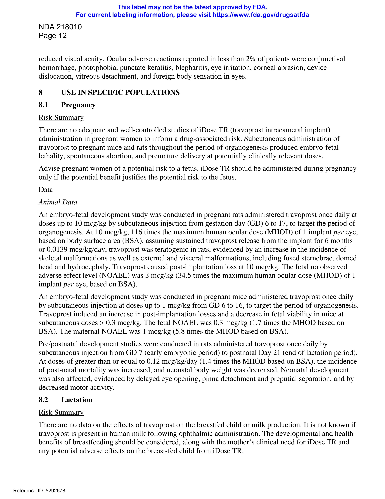

This label may not be the latest approved by FDA.

For current labeling information, please visit https://www.fda.gov/drugsatfda

NDA 218010
Page 13

## 8.4 Pediatric Use

The safety and effectiveness of iDose TR have not been established in pediatric patients.

## 8.5 Geriatric Use

No overall differences in safety or effectiveness have been observed between elderly and other adult patients.

# 11 DESCRIPTION

iDose TR (travoprost intracameral implant) is a sterile intracameral implant containing 75 mcg of travoprost. The intracameral implant consists of a titanium implant reservoir with a membrane controlling the sustained release of travoprost. The sterile implant is pre-loaded in a sterile single-dose inserter to facilitate insertion directly through the trabecular meshwork of the anterior chamber angle into the sclera.

Travoprost is a prostaglandin analog. Its chemical name is 5-heptenoic acid, 7-[(1R,2R,3R,5S)-3,5- dihydroxy-2-[(1E,3R)-3-hydroxy-4-[3-(trifluoromethyl)phenoxy]-1-buten-1-yl]cyclopentyl]-, 1- methylethyl ester, (5Z)-. Travoprost has a molecular formula of C₂₆H₃₅F₃O₆ and a molecular weight of 500.55 g/mol.

The chemical structure of travoprost is:

Chemical structure of travoprost

Travoprost is a clear, colorless to slightly yellow oil that is very soluble in acetonitrile, methanol, octanol, and chloroform. It is practically insoluble in water.

# 12 CLINICAL PHARMACOLOGY

## 12.1 Mechanism of Action

Travoprost free acid, a prostaglandin analog is a selective FP prostanoid receptor agonist, which is believed to reduce IOP by increasing uveoscleral outflow. The exact mechanism of action is unknown at this time.

## 12.3 Pharmacokinetics

Travoprost, an isopropyl ester prodrug, is hydrolyzed by esterases in the cornea and other intraocular tissues to its biologically active free acid. Systemically, travoprost free acid is metabolized to inactive metabolites via beta-oxidation of the α (carboxylic acid) chain to give the 1,2-dinor and 1,2,3,4-tetranor analogs, via oxidation of the 15-hydroxyl moiety, as well as via reduction of the 13, 14 double bond.

Reference ID: 5292678

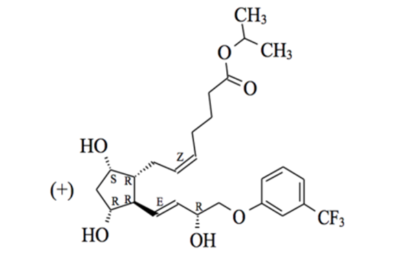

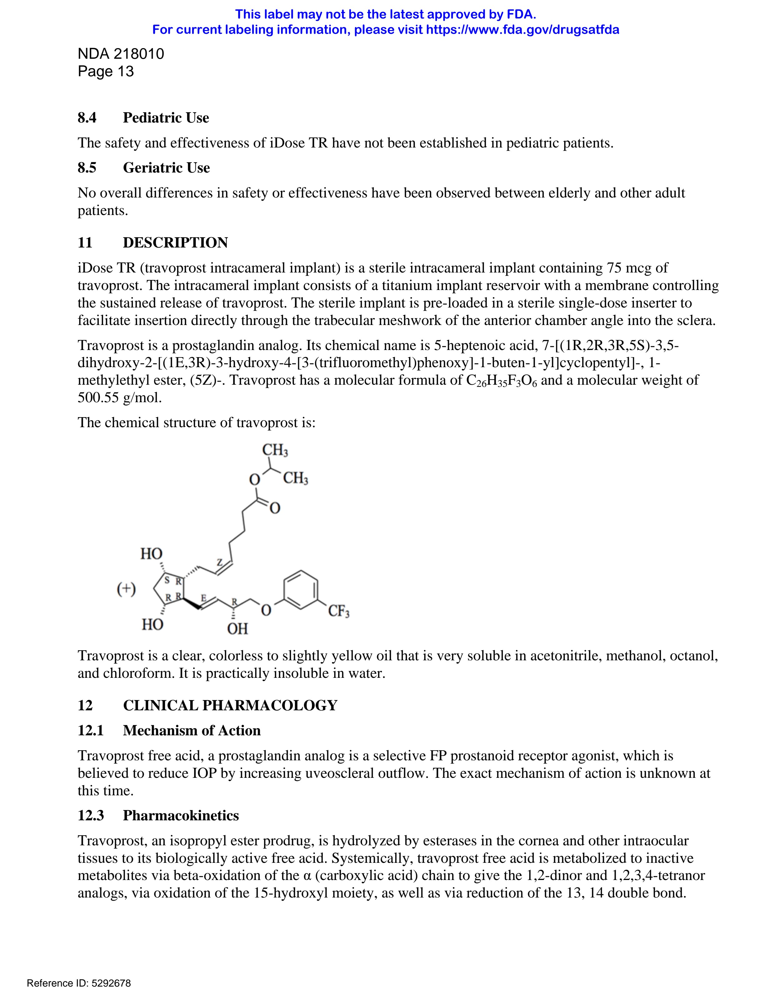

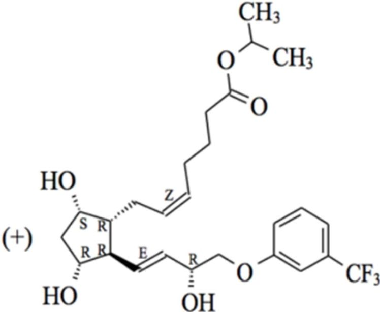

<page_number>14</page_number>
**This label may not be the latest approved by FDA.

For current labeling information, please visit https://www.fda.gov/drugsatfda**

NDA 218010

Page 14

Data from a pharmacokinetic study of 105 subjects evaluating two models of the travoprost intracameral implant with different elution rates have shown that the plasma concentrations of travoprost free acid are below 10 pg/mL (the quantitation limit of the assay, LLOQ) in all subjects at day 10, week 12 and month 12 following administration of iDose TR.

## 13 NONCLINICAL TOXICOLOGY

## 13.1 Carcinogenesis, Mutagenesis, Impairment of Fertility

## <u>Carcinogenesis</u>

Two-year carcinogenicity studies in mice and rats at subcutaneous doses of 10, 30, or 100 mcg/kg/day did not show any evidence of carcinogenic potential. However, at 100 mcg/kg/day, male rats were only treated for 82 weeks, and the maximum tolerated dose (MTD) was not reached in the mouse study. The high dose (100 mcg/kg) represents > 500 times the MHOD based on BSA.

## <u>Mutagenesis</u>

Travoprost was not mutagenic in the Ames test, mouse micronucleus test or rat chromosome aberration assay. A slight increase in the mutant frequency was observed in one of two mouse lymphoma assays in the presence of rat S-9 activation enzymes.

## <u>Fertility</u>

Travoprost did not affect mating or fertility indices in male or female rats at subcutaneous doses up to 10 mcg/kg/day (116 times the MHOD based on BSA) At 10 mcg/kg/day (116 times the MHOD based on BSA), the mean number of corpora lutea was reduced, and the post-implantation losses were increased. These effects were not observed at 3 mcg/kg/day (34.5 times the MHOD based on BSA).

## 14 CLINICAL STUDIES

iDose TR was evaluated in two multicenter, 12-month, randomized, parallel-group, double-masked, controlled clinical trials in patients with OAG or OHT. In both trials (GC-010, NCT03519386, and GC 012, NCT03868124), iDose TR was compared to twice-daily topical administration of timolol maleate ophthalmic solution, 0.5%. In the first 3 months following administration, iDose TR demonstrated an IOP change from baseline of -6.6 to -8.4 mmHg in the study eye of patients with a mean baseline IOP of 24 mmHg (see **Figure 6** ).

Reference ID: 5292678

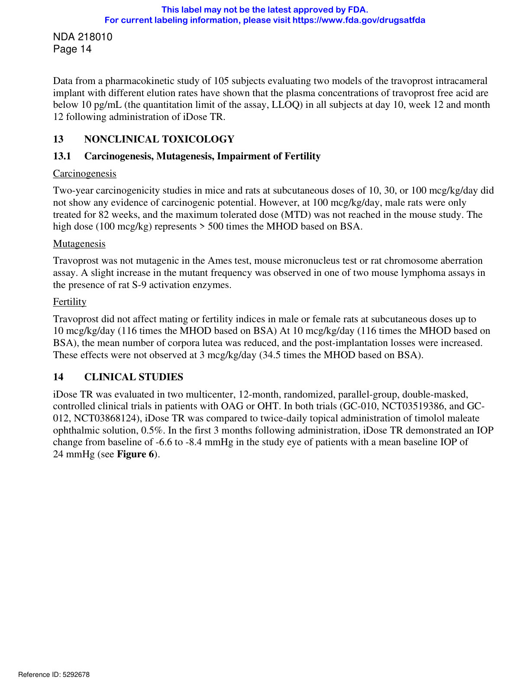

This label may not be the latest approved by FDA.For current labeling information, please visit https://www.fda.gov/drugsatfda

NDA 218010
Page 15

# Figure 6: Change from Baseline in Study Eye IOP (mmHg) and Treatment Difference

## Study GC-010

| Time Point     | iDose TR | Timolol |
| -------------- | -------- | ------- |
| Day 10 (8AM)   | -8.5     | -7.7    |
| Day 10 (10AM)  | -8.4     | -7.2    |
| Week 6 (8AM)   | -7.3     | -7.1    |
| Week 6 (10AM)  | -7.6     | -6.9    |
| Month 3 (8AM)  | -6.7     | -6.6    |
| Month 3 (10AM) | -6.7     | -6.5    |

| iDose TR minus Timolol | iDose TR minus Timolol Day 10 (8AM) | iDose TR minus Timolol Day 10 (10AM) | iDose TR minus Timolol Week 6 (8AM) | iDose TR minus Timolol Week 6 (10AM) | iDose TR minus Timolol Month 3 (8AM) | iDose TR minus Timolol Month 3 (10AM) |
| ---------------------- | --------------------------------------- | ---------------------------------------- | --------------------------------------- | ---------------------------------------- | ---------------------------------------- | ----------------------------------------- |
| Difference             | -0.79                                   | -1.24                                    | -0.18                                   | -0.77                                    | 0.10                                     | -0.16                                     |
| 95% CI                 | (-1.45, -0.13)                          | (-1.92, -0.56)                           | (-0.86, 0.51)                           | (-1.43, -0.11)                           | (-0.63, 0.82)                            | (-0.89, 0.57)                             |

## Study GC-012

| Time Point     | iDose TR | Timolol |
| -------------- | -------- | ------- |
| Day 10 (8AM)   | -8.4     | -7.2    |
| Day 10 (10AM)  | -8.3     | -7.1    |
| Week 6 (8AM)   | -7.2     | -7.2    |
| Week 6 (10AM)  | -6.8     | -7.2    |
| Month 3 (8AM)  | -6.8     | -6.7    |
| Month 3 (10AM) | -6.8     | -6.8    |

| iDose TR minus Timolol | iDose TR minus Timolol Day 10 (8AM) | iDose TR minus Timolol Day 10 (10AM) | iDose TR minus Timolol Week 6 (8AM) | iDose TR minus Timolol Week 6 (10AM) | iDose TR minus Timolol Month 3 (8AM) | iDose TR minus Timolol Month 3 (10AM) |
| ---------------------- | --------------------------------------- | ---------------------------------------- | --------------------------------------- | ---------------------------------------- | ---------------------------------------- | ----------------------------------------- |
| Difference             | -1.25                                   | -1.20                                    | -0.03                                   | 0.32                                     | 0.16                                     | -0.03                                     |
| 95% CI                 | (-1.99, -0.50)                          | (-1.88, -0.52)                           | (-0.76, 0.69)                           | (-0.37, 1.01)                            | (-0.59, 0.91)                            | (-0.77, 0.71)                             |

iDose TR demonstrated non-inferiority to timolol ophthalmic solution in IOP reduction during the first 3 months. Subsequently, iDose TR did not demonstrate non-inferiority over the next 9 months.

Reference ID: 5292678

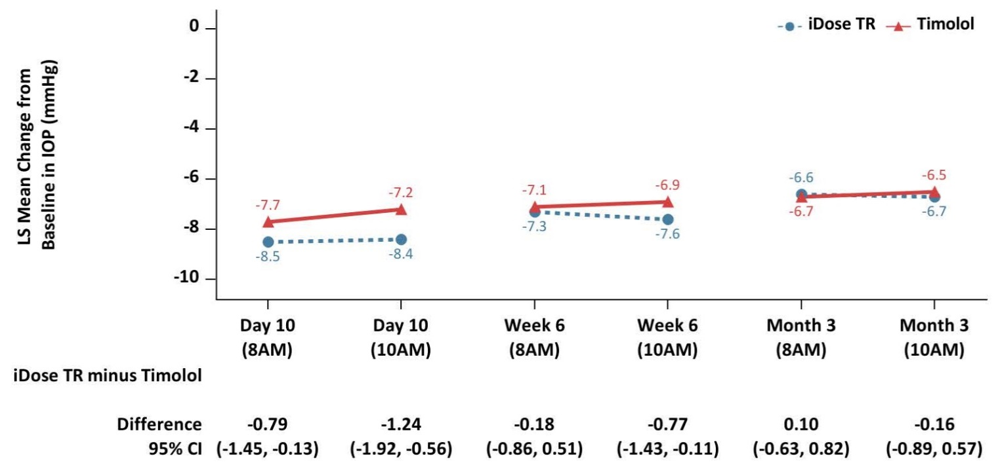

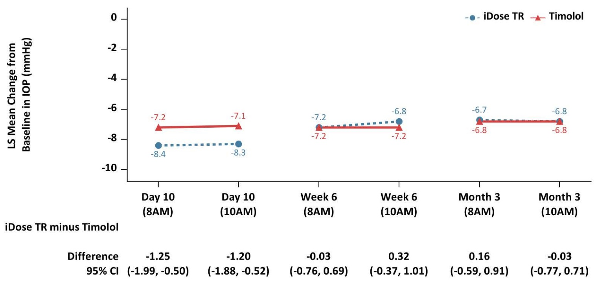

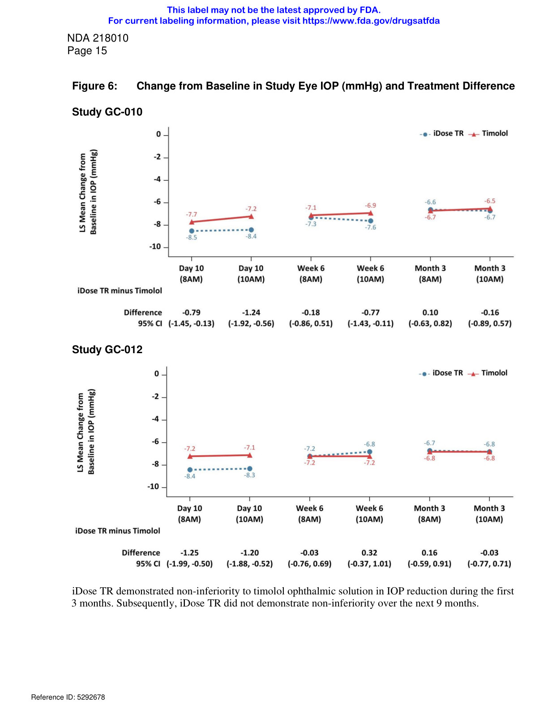

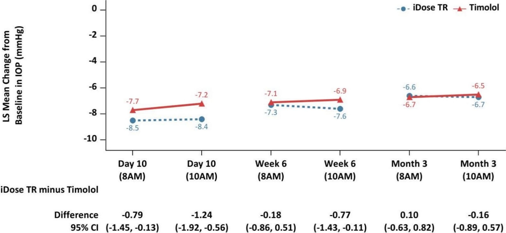

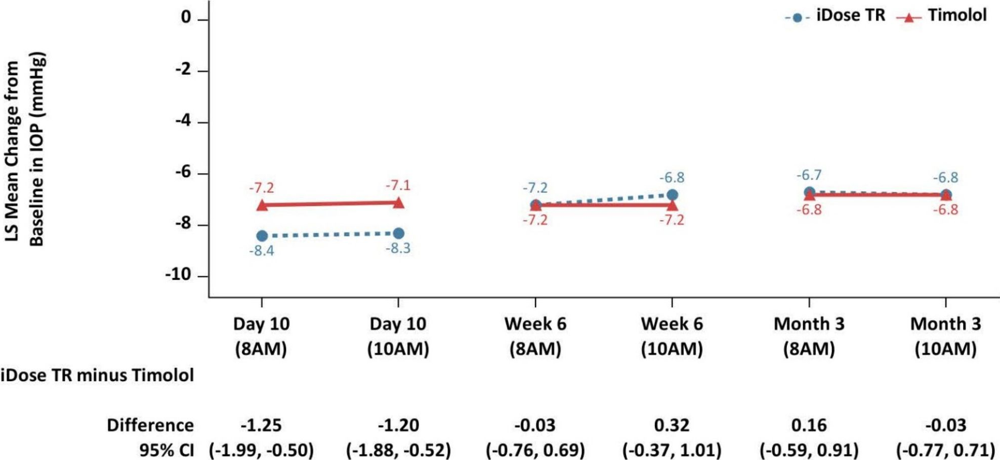

<page_number>16</page_number>
**This label may not be the latest approved by FDA.

For current labeling information, please visit https://www.fda.gov/drugsatfda**

NDA 218010

Page 16

## 16 HOW SUPPLIED/STORAGE AND HANDLING

iDose TR (travoprost intracameral implant) (NDC 25357-100-01) is provided sterile and pre-loaded in a sterile, single-dose inserter that is packaged in a blister tray sealed with a Tyvek lid. Implants are individually serialized and the serial number is provided on the tray lid.

The tray is sealed inside of a transparent plastic pouch along with an oxygen scavenger packet, which is packaged inside a unit carton. Tamper evidence is provided by a seal on both ends of the carton.

## Storage:

Store at 2°C to 25°C (36°F to 77°F). Do not freeze.

## 17 PATIENT COUNSELING INFORMATION

## <u>Intraocular Inflammation or Endophthalmitis</u>

Advise patients about the potential risk for complications including, but not limited to, the development of intraocular inflammation or endophthalmitis *[see Warnings and Precautions (5.3, 5.4, 5.6)].*

## <u>Potential for Pigmentation</u>

Advise patients about the potential for increased brown pigmentation of the iris, which may be permanent *[see Warnings and Precautions (5.5)].*

## <u>MR Conditional</u>

Advise patients that the implant is MR Conditional (as noted on their Patient ID card), and that if they require magnetic resonance imaging (MRI), they should inform their healthcare provider that they have iDose TR implanted in their eye *[see Warnings and Precautions (5.7)].*

## <u>When to Seek Physician Advice</u>

Advise patients that if the eye becomes red, sensitive to light, painful, or develops a change in vision, they should seek immediate care from an ophthalmologist *[see Warnings and Precautions (5.2, 5.4, 5.6)]* . Symbols that are included in the labeling of this product.

Reference ID: 5292678

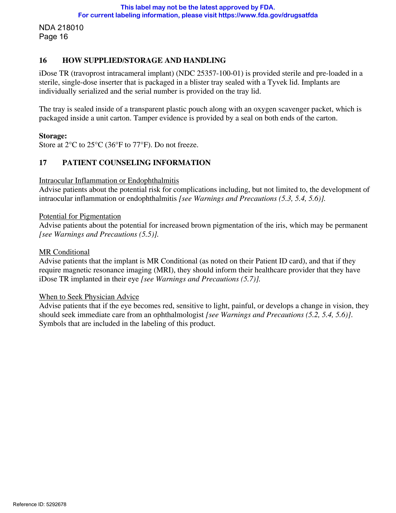

This label may not be the latest approved by FDA.

For current labeling information, please visit https://www.fda.gov/drugsatfda

NDA 218010
Page 17

| Symbol              | Definition                                              |
| ------------------- | ------------------------------------------------------- |
| REF                 | Catalogue/Model Number                                  |
| SN                  | Serial Number                                           |
| LOT                 | Lot Number                                              |
| (2)                 | Do not re-use                                           |
| ⌛ yyyy-mm           | Use-by date (year-month)                                |
| (2) STERILIZE       | Do not resterilize                                      |
| \[i]                | See package insert for Full Prescribing Information |
| 🌡️                 | Temperature limit                                       |
| STERILE R           | Sterilized by Gamma Irradiation                         |
| RX Only             | For prescription use only                               |
| 📦 (crossed out)    | Do not use if package is damaged                    |
| MR Conditional logo | MR Conditional                                          |

**Manufactured by Glaukos Corp., 229 Avenida Fabricante, San Clemente, CA 92672**

© 2023 Glaukos. All rights reserved.

All trademarks are the property of their respective owners.

Patented. U.S. Patent No. 10,206,813 and U.S. Patent No. 11,426,306.

Reference ID: 5292678

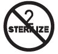

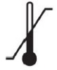

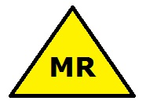

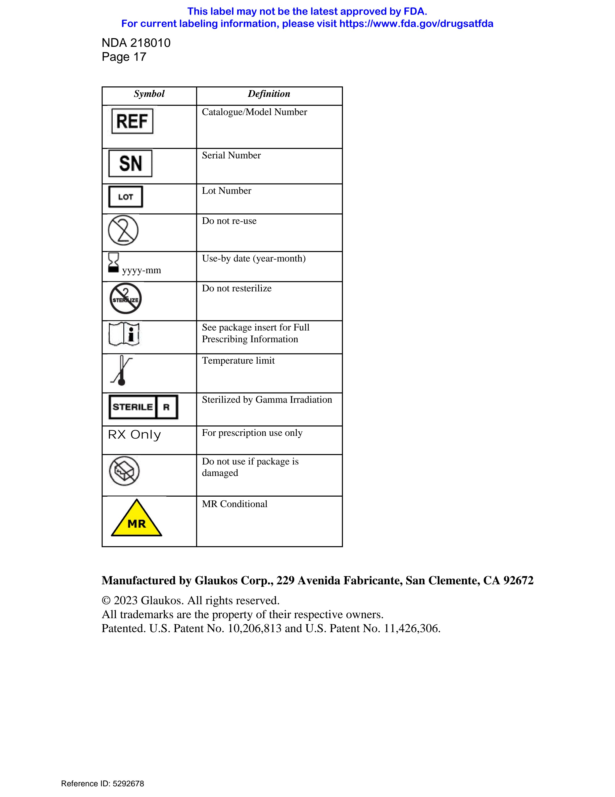

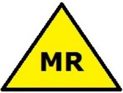

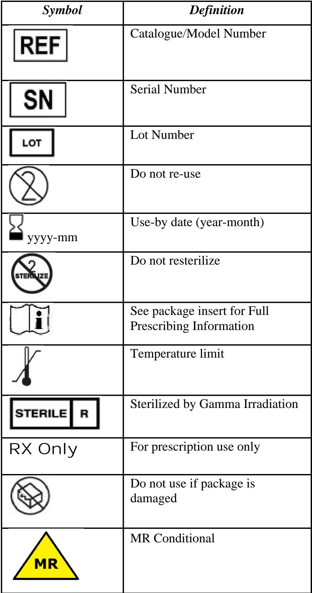
