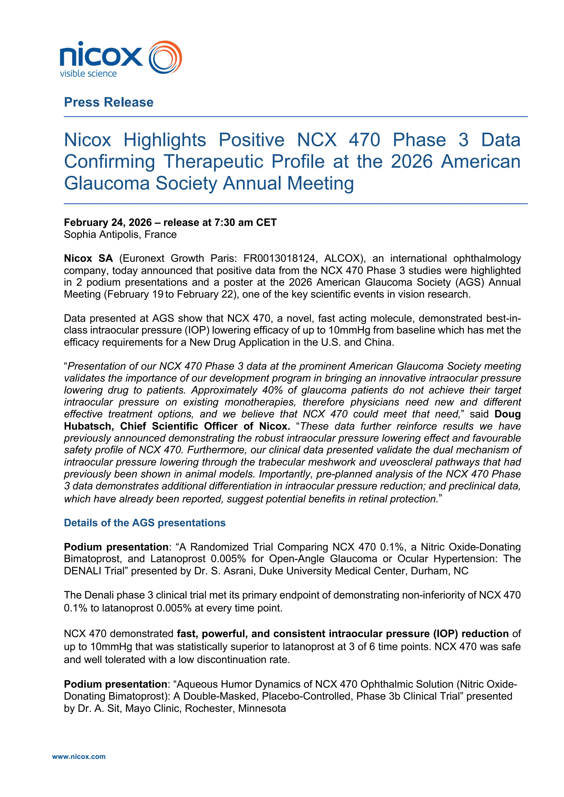
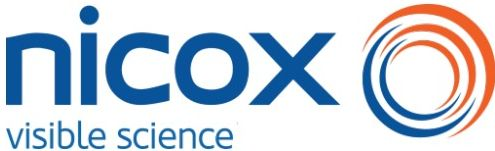
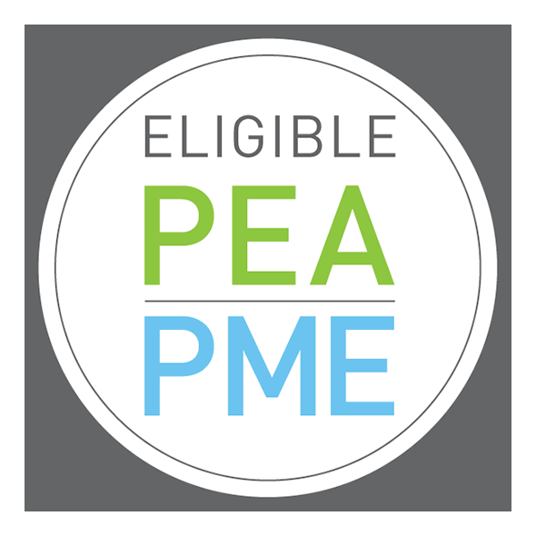
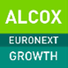
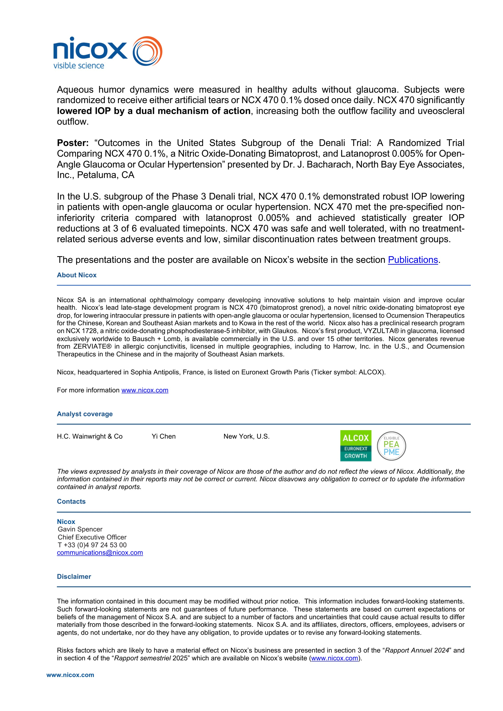
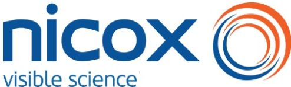
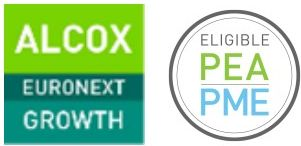
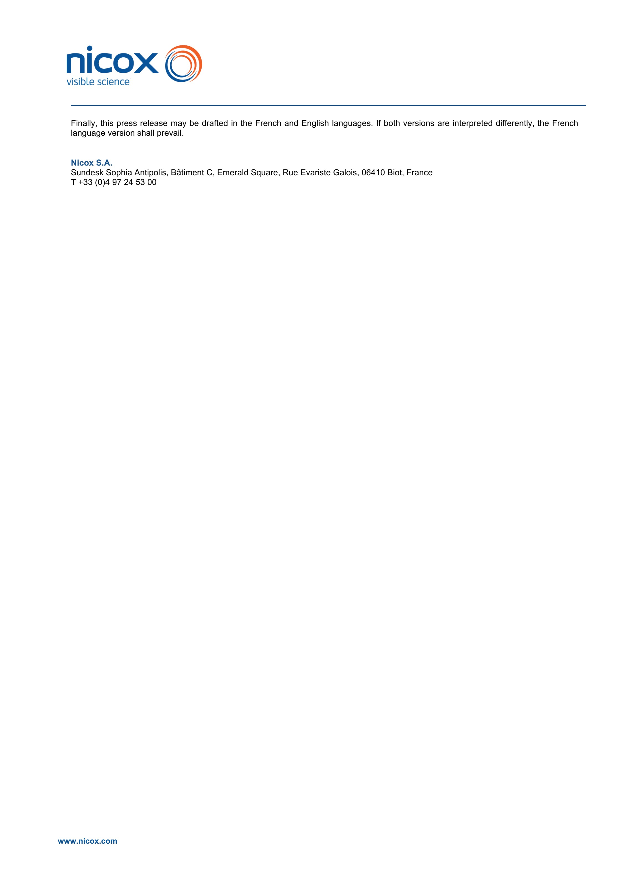
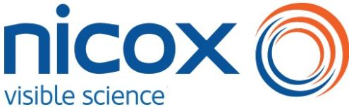

nicox visible science logo

## Press Release

# Nicox Highlights Positive NCX 470 Phase 3 Data Confirming Therapeutic Profile at the 2026 American Glaucoma Society Annual Meeting

**February 24, 2026 – release at 7:30 am CET**

Sophia Antipolis, France

**Nicox SA** (Euronext Growth Paris: FR0013018124, ALCOX), an international ophthalmology company, today announced that positive data from the NCX 470 Phase 3 studies were highlighted in 2 podium presentations and a poster at the 2026 American Glaucoma Society (AGS) Annual Meeting (February 19 to February 22), one of the key scientific events in vision research.

Data presented at AGS show that NCX 470, a novel, fast acting molecule, demonstrated best-in-class intraocular pressure (IOP) lowering efficacy of up to 10mmHg from baseline which has met the efficacy requirements for a New Drug Application in the U.S. and China.

“Presentation of our NCX 470 Phase 3 data at the prominent American Glaucoma Society meeting validates the importance of our development program in bringing an innovative intraocular pressure lowering drug to patients. Approximately 40% of glaucoma patients do not achieve their target intraocular pressure on existing monotherapies, therefore physicians need new and different effective treatment options, and we believe that NCX 470 could meet that need,” said **Doug Hubatsch, Chief Scientific Officer of Nicox.** “These data further reinforce results we have previously announced demonstrating the robust intraocular pressure lowering effect and favourable safety profile of NCX 470. Furthermore, our clinical data presented validate the dual mechanism of intraocular pressure lowering through the trabecular meshwork and uveoscleral pathways that had previously been shown in animal models. Importantly, pre-planned analysis of the NCX 470 Phase 3 data demonstrates additional differentiation in intraocular pressure reduction; and preclinical data, which have already been reported, suggest potential benefits in retinal protection.”

## Details of the AGS presentations

**Podium presentation:** “A Randomized Trial Comparing NCX 470 0.1%, a Nitric Oxide-Donating Bimatoprost, and Latanoprost 0.005% for Open-Angle Glaucoma or Ocular Hypertension: The DENALI Trial” presented by Dr. S. Asrani, Duke University Medical Center, Durham, NC

The Denali phase 3 clinical trial met its primary endpoint of demonstrating non-inferiority of NCX 470 0.1% to latanoprost 0.005% at every time point.

NCX 470 demonstrated fast, powerful, and consistent intraocular pressure (IOP) reduction of up to 10mmHg that was statistically superior to latanoprost at 3 of 6 time points. NCX 470 was safe and well tolerated with a low discontinuation rate.

**Podium presentation:** “Aqueous Humor Dynamics of NCX 470 Ophthalmic Solution (Nitric Oxide-Donating Bimatoprost): A Double-Masked, Placebo-Controlled, Phase 3b Clinical Trial” presented by Dr. A. Sit, Mayo Clinic, Rochester, Minnesota

www.nicox.com

nicox visible science logo

Aqueous humor dynamics were measured in healthy adults without glaucoma. Subjects were randomized to receive either artificial tears or NCX 470 0.1% dosed once daily. **NCX 470 significantly lowered IOP by a dual mechanism of action**, increasing both the outflow facility and uveoscleral outflow.

**Poster:** “Outcomes in the United States Subgroup of the Denali Trial: A Randomized Trial Comparing NCX 470 0.1%, a Nitric Oxide-Donating Bimatoprost, and Latanoprost 0.005% for Open-Angle Glaucoma or Ocular Hypertension” presented by Dr. J. Bacharach, North Bay Eye Associates, Inc., Petaluma, CA

In the U.S. subgroup of the Phase 3 Denali trial, NCX 470 0.1% demonstrated robust IOP lowering in patients with open-angle glaucoma or ocular hypertension. NCX 470 met the pre-specified non-inferiority criteria compared with latanoprost 0.005% and achieved statistically greater IOP reductions at 3 of 6 evaluated timepoints. NCX 470 was safe and well tolerated, with no treatment-related serious adverse events and low, similar discontinuation rates between treatment groups.

The presentations and the poster are available on Nicox’s website in the section <u>Publications</u>.

## About Nicox

Nicox SA is an international ophthalmology company developing innovative solutions to help maintain vision and improve ocular health. Nicox’s lead late-stage development program is NCX 470 (bimatoprost grenod), a novel nitric oxide-donating bimatoprost eye drop, for lowering intraocular pressure in patients with open-angle glaucoma or ocular hypertension, licensed to Ocumension Therapeutics for the Chinese, Korean and Southeast Asian markets and to Kowa in the rest of the world. Nicox also has a preclinical research program on NCX 1728, a nitric oxide-donating phosphodiesterase-5 inhibitor, with Glaukos. Nicox’s first product, VYZULTA® in glaucoma, licensed exclusively worldwide to Bausch + Lomb, is available commercially in the U.S. and over 15 other territories. Nicox generates revenue from ZERVIATE® in allergic conjunctivitis, licensed in multiple geographies, including to Harrow, Inc. in the U.S., and Ocumension Therapeutics in the Chinese and in the majority of Southeast Asian markets.

Nicox, headquartered in Sophia Antipolis, France, is listed on Euronext Growth Paris (Ticker symbol: ALCOX).

For more information <u>www.nicox.com</u>

## Analyst coverage

| H.C. Wainwright & Co | Yi Chen | New York, U.S. | ALCOX EURONEXT GROWTH logo |
| -------------------- | ------- | -------------- | -------------------------- |

The views expressed by analysts in their coverage of Nicox are those of the author and do not reflect the views of Nicox. Additionally, the information contained in their reports may not be correct or current. Nicox disavows any obligation to correct or to update the information contained in analyst reports.

## Contacts

### Nicox

Gavin Spencer
Chief Executive Officer
T +33 (0)4 97 24 53 00
<u>communications@nicox.com</u>

## Disclaimer

The information contained in this document may be modified without prior notice. This information includes forward-looking statements. Such forward-looking statements are not guarantees of future performance. These statements are based on current expectations or beliefs of the management of Nicox S.A. and are subject to a number of factors and uncertainties that could cause actual results to differ materially from those described in the forward-looking statements. Nicox S.A. and its affiliates, directors, officers, employees, advisers or agents, do not undertake, nor do they have any obligation, to provide updates or to revise any forward-looking statements.

Risks factors which are likely to have a material effect on Nicox’s business are presented in section 3 of the “Rapport Annuel 2024” and in section 4 of the “Rapport semestriel 2025” which are available on Nicox’s website (<u>www.nicox.com</u>).

www.nicox.com

nicox visible science logo

Finally, this press release may be drafted in the French and English languages. If both versions are interpreted differently, the French language version shall prevail.

**Nicox S.A.**

Sundesk Sophia Antipolis, Bâtiment C, Emerald Square, Rue Evariste Galois, 06410 Biot, France
T +33 (0)4 97 24 53 00

www.nicox.com

