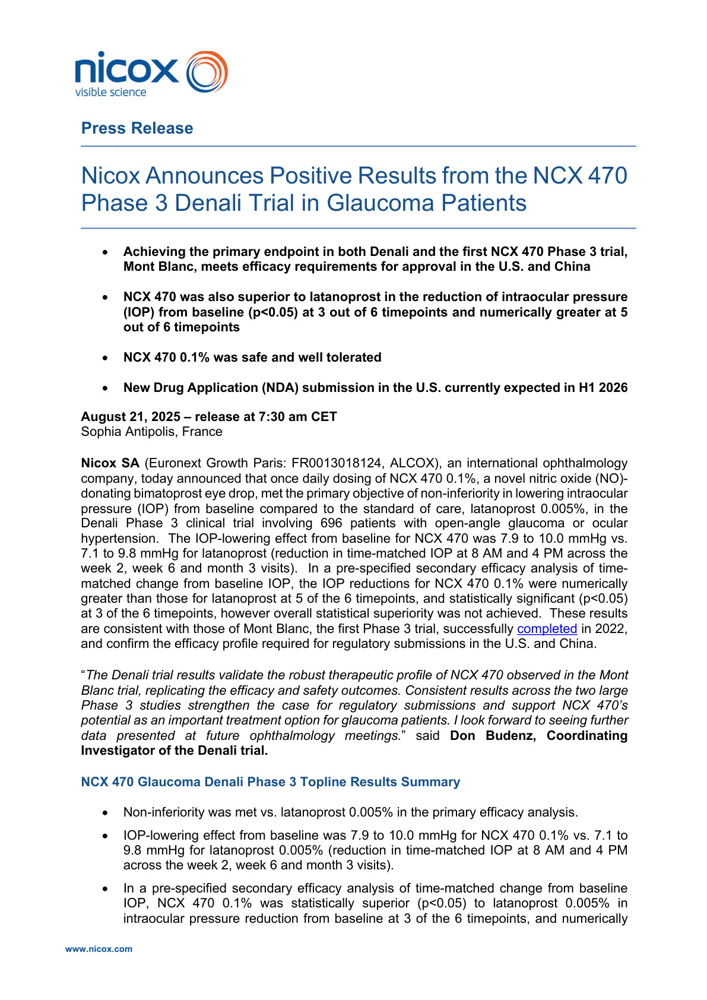
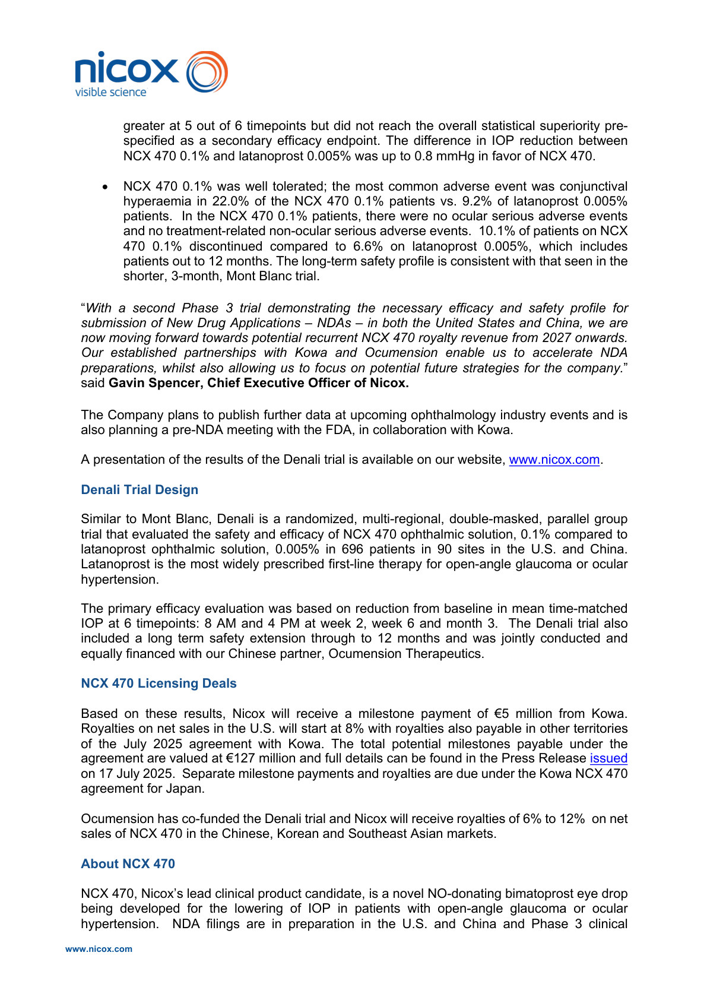
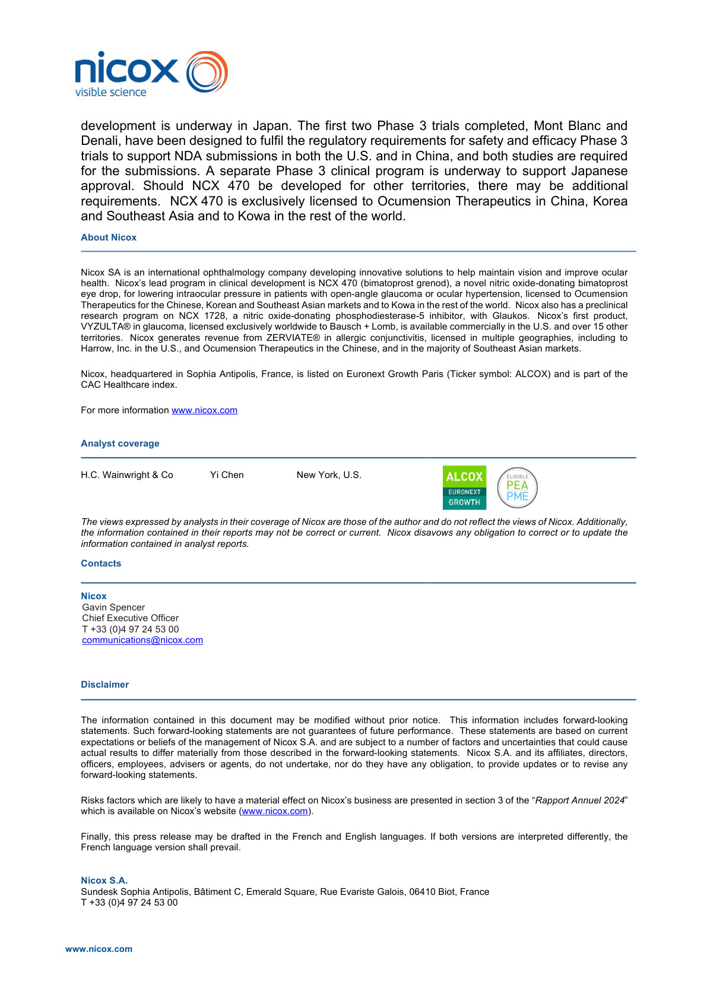
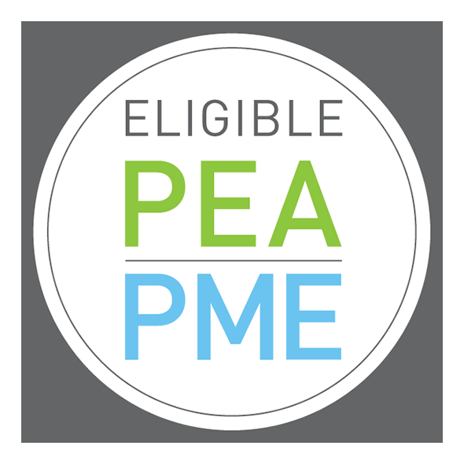

# Page 1

www.nicox.com 
 
Press Release  
Nicox Announces Positive Results from the NCX 470 
Phase 3 Denali Trial in Glaucoma Patients  
• 
Achieving the primary endpoint in both Denali and the first NCX 470 Phase 3 trial, 
Mont Blanc, meets efficacy requirements for approval in the U.S. and China 
• 
NCX 470 was also superior to latanoprost in the reduction of intraocular pressure 
(IOP) from baseline (p<0.05) at 3 out of 6 timepoints and numerically greater at 5 
out of 6 timepoints 
• 
NCX 470 0.1% was safe and well tolerated  
• 
New Drug Application (NDA) submission in the U.S. currently expected in H1 2026  
August 21, 2025 – release at 7:30 am CET 
Sophia Antipolis, France 
Nicox SA (Euronext Growth Paris: FR0013018124, ALCOX), an international ophthalmology 
company, today announced that once daily dosing of NCX 470 0.1%, a novel nitric oxide (NO)-
donating bimatoprost eye drop, met the primary objective of non-inferiority in lowering intraocular 
pressure (IOP) from baseline compared to the standard of care, latanoprost 0.005%, in the 
Denali Phase 3 clinical trial involving 696 patients with open-angle glaucoma or ocular 
hypertension.  The IOP-lowering effect from baseline for NCX 470 was 7.9 to 10.0 mmHg vs. 
7.1 to 9.8 mmHg for latanoprost (reduction in time-matched IOP at 8 AM and 4 PM across the 
week 2, week 6 and month 3 visits).  In a pre-specified secondary efficacy analysis of time-
matched change from baseline IOP, the IOP reductions for NCX 470 0.1% were numerically 
greater than those for latanoprost at 5 of the 6 timepoints, and statistically significant (p<0.05) 
at 3 of the 6 timepoints, however overall statistical superiority was not achieved.  These results 
are consistent with those of Mont Blanc, the first Phase 3 trial, successfully completed in 2022, 
and confirm the efficacy profile required for regulatory submissions in the U.S. and China.  
“The Denali trial results validate the robust therapeutic profile of NCX 470 observed in the Mont 
Blanc trial, replicating the efficacy and safety outcomes. Consistent results across the two large 
Phase 3 studies strengthen the case for regulatory submissions and support NCX 470’s 
potential as an important treatment option for glaucoma patients. I look forward to seeing further 
data presented at future ophthalmology meetings.” said Don Budenz, Coordinating 
Investigator of the Denali trial. 
NCX 470 Glaucoma Denali Phase 3 Topline Results Summary 
• 
Non-inferiority was met vs. latanoprost 0.005% in the primary efficacy analysis. 
• 
IOP-lowering effect from baseline was 7.9 to 10.0 mmHg for NCX 470 0.1% vs. 7.1 to 
9.8 mmHg for latanoprost 0.005% (reduction in time-matched IOP at 8 AM and 4 PM 
across the week 2, week 6 and month 3 visits). 
• 
In a pre-specified secondary efficacy analysis of time-matched change from baseline 
IOP, NCX 470 0.1% was statistically superior (p<0.05) to latanoprost 0.005% in 
intraocular pressure reduction from baseline at 3 of the 6 timepoints, and numerically

# Page 2

www.nicox.com 
 
greater at 5 out of 6 timepoints but did not reach the overall statistical superiority pre-
specified as a secondary efficacy endpoint. The difference in IOP reduction between 
NCX 470 0.1% and latanoprost 0.005% was up to 0.8 mmHg in favor of NCX 470.  
• 
NCX 470 0.1% was well tolerated; the most common adverse event was conjunctival 
hyperaemia in 22.0% of the NCX 470 0.1% patients vs. 9.2% of latanoprost 0.005% 
patients.  In the NCX 470 0.1% patients, there were no ocular serious adverse events 
and no treatment-related non-ocular serious adverse events.  10.1% of patients on NCX 
470 0.1% discontinued compared to 6.6% on latanoprost 0.005%, which includes 
patients out to 12 months. The long-term safety profile is consistent with that seen in the 
shorter, 3-month, Mont Blanc trial. 
“With a second Phase 3 trial demonstrating the necessary efficacy and safety profile for 
submission of New Drug Applications – NDAs – in both the United States and China, we are 
now moving forward towards potential recurrent NCX 470 royalty revenue from 2027 onwards.  
Our established partnerships with Kowa and Ocumension enable us to accelerate NDA 
preparations, whilst also allowing us to focus on potential future strategies for the company.” 
said Gavin Spencer, Chief Executive Officer of Nicox. 
The Company plans to publish further data at upcoming ophthalmology industry events and is 
also planning a pre-NDA meeting with the FDA, in collaboration with Kowa. 
 
A presentation of the results of the Denali trial is available on our website, www.nicox.com.  
 
Denali Trial Design 
Similar to Mont Blanc, Denali is a randomized, multi-regional, double-masked, parallel group 
trial that evaluated the safety and efficacy of NCX 470 ophthalmic solution, 0.1% compared to 
latanoprost ophthalmic solution, 0.005% in 696 patients in 90 sites in the U.S. and China.  
Latanoprost is the most widely prescribed first-line therapy for open-angle glaucoma or ocular 
hypertension.  
The primary efficacy evaluation was based on reduction from baseline in mean time-matched 
IOP at 6 timepoints: 8 AM and 4 PM at week 2, week 6 and month 3.  The Denali trial also 
included a long term safety extension through to 12 months and was jointly conducted and 
equally financed with our Chinese partner, Ocumension Therapeutics.  
 
NCX 470 Licensing Deals  
 
Based on these results, Nicox will receive a milestone payment of €5 million from Kowa. 
Royalties on net sales in the U.S. will start at 8% with royalties also payable in other territories 
of the July 2025 agreement with Kowa. The total potential milestones payable under the 
agreement are valued at €127 million and full details can be found in the Press Release issued 
on 17 July 2025.  Separate milestone payments and royalties are due under the Kowa NCX 470 
agreement for Japan. 
 
Ocumension has co-funded the Denali trial and Nicox will receive royalties of 6% to 12%  on net 
sales of NCX 470 in the Chinese, Korean and Southeast Asian markets. 
 
About NCX 470 
 
NCX 470, Nicox’s lead clinical product candidate, is a novel NO-donating bimatoprost eye drop 
being developed for the lowering of IOP in patients with open-angle glaucoma or ocular 
hypertension.  NDA filings are in preparation in the U.S. and China and Phase 3 clinical

# Page 3

www.nicox.com 
 
development is underway in Japan. The first two Phase 3 trials completed, Mont Blanc and 
Denali, have been designed to fulfil the regulatory requirements for safety and efficacy Phase 3 
trials to support NDA submissions in both the U.S. and in China, and both studies are required 
for the submissions. A separate Phase 3 clinical program is underway to support Japanese 
approval. Should NCX 470 be developed for other territories, there may be additional 
requirements.  NCX 470 is exclusively licensed to Ocumension Therapeutics in China, Korea 
and Southeast Asia and to Kowa in the rest of the world. 
About Nicox 
Nicox SA is an international ophthalmology company developing innovative solutions to help maintain vision and improve ocular 
health.  Nicox’s lead program in clinical development is NCX 470 (bimatoprost grenod), a novel nitric oxide-donating bimatoprost 
eye drop, for lowering intraocular pressure in patients with open-angle glaucoma or ocular hypertension, licensed to Ocumension 
Therapeutics for the Chinese, Korean and Southeast Asian markets and to Kowa in the rest of the world.  Nicox also has a preclinical 
research program on NCX 1728, a nitric oxide-donating phosphodiesterase-5 inhibitor, with Glaukos.  Nicox’s first product, 
VYZULTA® in glaucoma, licensed exclusively worldwide to Bausch + Lomb, is available commercially in the U.S. and over 15 other 
territories.  Nicox generates revenue from ZERVIATE® in allergic conjunctivitis, licensed in multiple geographies, including to 
Harrow, Inc. in the U.S., and Ocumension Therapeutics in the Chinese, and in the majority of Southeast Asian markets.    
Nicox, headquartered in Sophia Antipolis, France, is listed on Euronext Growth Paris (Ticker symbol: ALCOX) and is part of the 
CAC Healthcare index.  
For more information www.nicox.com 
Analyst coverage 
 
H.C. Wainwright & Co              Yi Chen                    New York, U.S. 
 
 
  
The views expressed by analysts in their coverage of Nicox are those of the author and do not reflect the views of Nicox. Additionally, 
the information contained in their reports may not be correct or current.  Nicox disavows any obligation to correct or to update the 
information contained in analyst reports. 
Contacts 
 
Nicox 
Gavin Spencer 
Chief Executive Officer 
T +33 (0)4 97 24 53 00 
communications@nicox.com 
 
 
Disclaimer 
The information contained in this document may be modified without prior notice.  This information includes forward-looking 
statements. Such forward-looking statements are not guarantees of future performance.  These statements are based on current 
expectations or beliefs of the management of Nicox S.A. and are subject to a number of factors and uncertainties that could cause 
actual results to differ materially from those described in the forward-looking statements.  Nicox S.A. and its affiliates, directors, 
officers, employees, advisers or agents, do not undertake, nor do they have any obligation, to provide updates or to revise any 
forward-looking statements. 
Risks factors which are likely to have a material effect on Nicox’s business are presented in section 3 of the “Rapport Annuel 2024” 
which is available on Nicox’s website (www.nicox.com). 
Finally, this press release may be drafted in the French and English languages. If both versions are interpreted differently, the 
French language version shall prevail. 
Nicox S.A. 
Sundesk Sophia Antipolis, Bâtiment C, Emerald Square, Rue Evariste Galois, 06410 Biot, France 
T +33 (0)4 97 24 53 00

