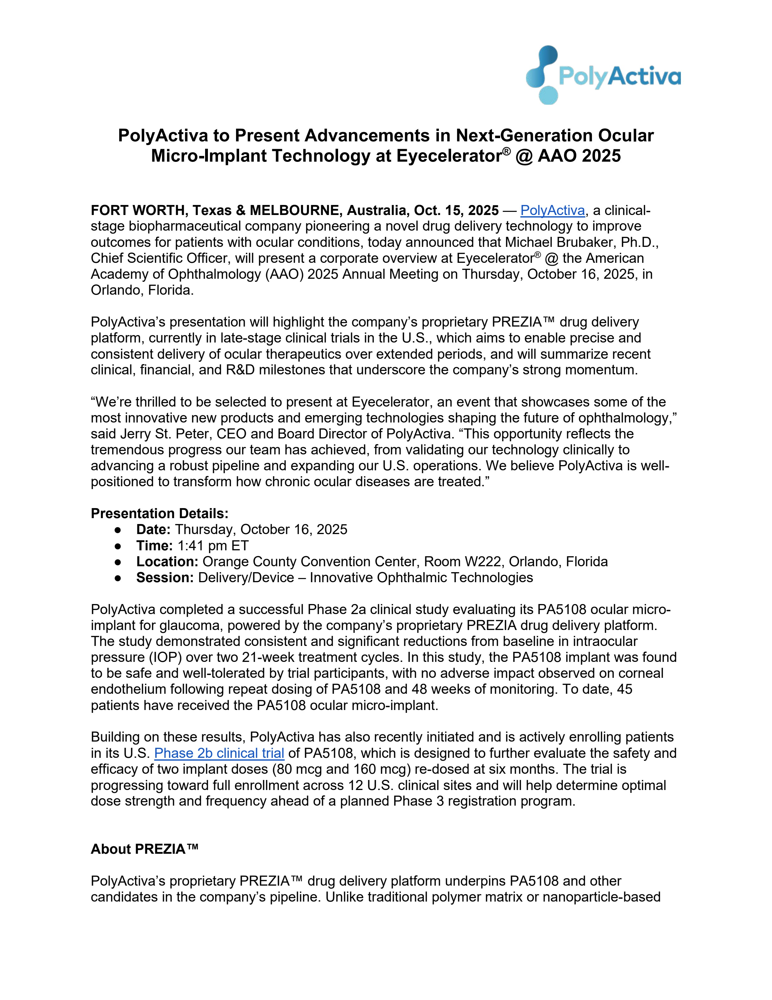
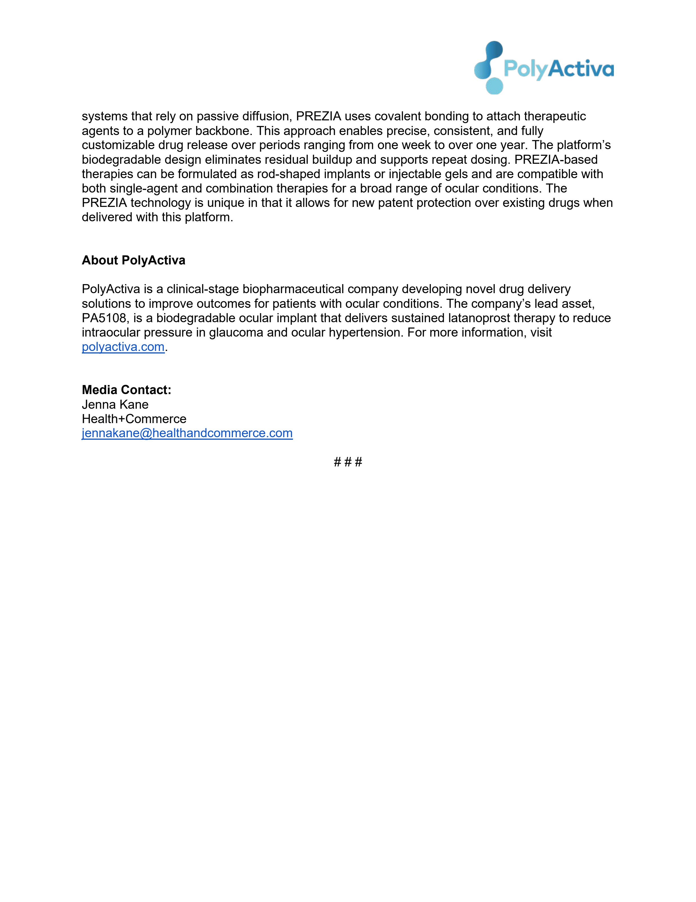

PolyActiva logo

# PolyActiva to Present Advancements in Next-Generation Ocular Micro-Implant Technology at Eyecelerator® @ AAO 2025

**FORT WORTH, Texas & MELBOURNE, Australia, Oct. 15, 2025** — <u>PolyActiva</u>, a clinical-stage biopharmaceutical company pioneering a novel drug delivery technology to improve outcomes for patients with ocular conditions, today announced that Michael Brubaker, Ph.D., Chief Scientific Officer, will present a corporate overview at Eyecelerator® @ the American Academy of Ophthalmology (AAO) 2025 Annual Meeting on Thursday, October 16, 2025, in Orlando, Florida.

PolyActiva’s presentation will highlight the company’s proprietary PREZIA™ drug delivery platform, currently in late-stage clinical trials in the U.S., which aims to enable precise and consistent delivery of ocular therapeutics over extended periods, and will summarize recent clinical, financial, and R&D milestones that underscore the company’s strong momentum.

“We’re thrilled to be selected to present at Eyecelerator, an event that showcases some of the most innovative new products and emerging technologies shaping the future of ophthalmology,” said Jerry St. Peter, CEO and Board Director of PolyActiva. “This opportunity reflects the tremendous progress our team has achieved, from validating our technology clinically to advancing a robust pipeline and expanding our U.S. operations. We believe PolyActiva is well-positioned to transform how chronic ocular diseases are treated.”

## Presentation Details:

* **Date:** Thursday, October 16, 2025
* **Time:** 1:41 pm ET
* **Location:** Orange County Convention Center, Room W222, Orlando, Florida
* **Session:** Delivery/Device – Innovative Ophthalmic Technologies

PolyActiva completed a successful Phase 2a clinical study evaluating its PA5108 ocular micro-implant for glaucoma, powered by the company’s proprietary PREZIA drug delivery platform. The study demonstrated consistent and significant reductions from baseline in intraocular pressure (IOP) over two 21-week treatment cycles. In this study, the PA5108 implant was found to be safe and well-tolerated by trial participants, with no adverse impact observed on corneal endothelium following repeat dosing of PA5108 and 48 weeks of monitoring. To date, 45 patients have received the PA5108 ocular micro-implant.

Building on these results, PolyActiva has also recently initiated and is actively enrolling patients in its U.S. <u>Phase 2b clinical trial</u> of PA5108, which is designed to further evaluate the safety and efficacy of two implant doses (80 mcg and 160 mcg) re-dosed at six months. The trial is progressing toward full enrollment across 12 U.S. clinical sites and will help determine optimal dose strength and frequency ahead of a planned Phase 3 registration program.

## About PREZIA™

PolyActiva’s proprietary PREZIA™ drug delivery platform underpins PA5108 and other candidates in the company’s pipeline. Unlike traditional polymer matrix or nanoparticle-based

PolyActiva logo

systems that rely on passive diffusion, PREZIA uses covalent bonding to attach therapeutic agents to a polymer backbone. This approach enables precise, consistent, and fully customizable drug release over periods ranging from one week to over one year. The platform’s biodegradable design eliminates residual buildup and supports repeat dosing. PREZIA-based therapies can be formulated as rod-shaped implants or injectable gels and are compatible with both single-agent and combination therapies for a broad range of ocular conditions. The PREZIA technology is unique in that it allows for new patent protection over existing drugs when delivered with this platform.

**About PolyActiva**

PolyActiva is a clinical-stage biopharmaceutical company developing novel drug delivery solutions to improve outcomes for patients with ocular conditions. The company’s lead asset, PA5108, is a biodegradable ocular implant that delivers sustained latanoprost therapy to reduce intraocular pressure in glaucoma and ocular hypertension. For more information, visit <u>polyactiva.com</u>.

**Media Contact:**

Jenna Kane
Health+Commerce

<u>jennakane@healthandcommerce.com</u>

# # #

