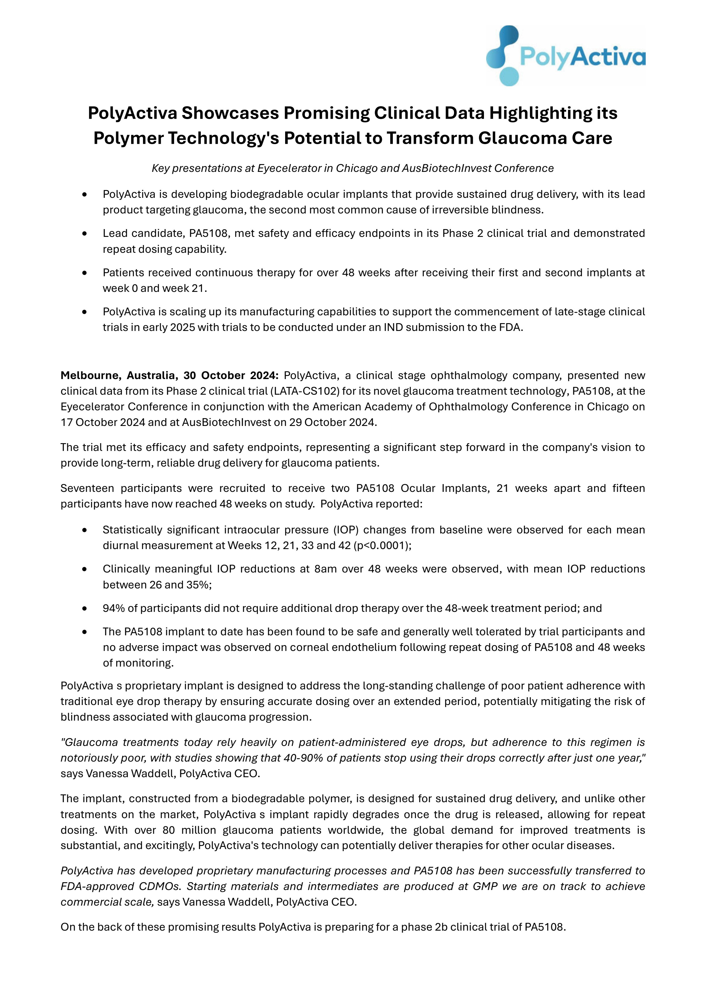
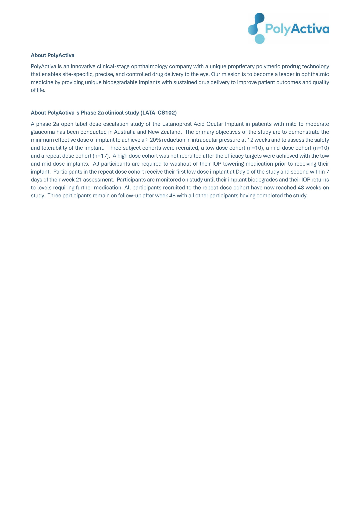

PolyActiva logo

# PolyActiva Showcases Promising Clinical Data Highlighting its Polymer Technology's Potential to Transform Glaucoma Care

*Key presentations at Eyecelerator in Chicago and AusBiotechInvest Conference*

* PolyActiva is developing biodegradable ocular implants that provide sustained drug delivery, with its lead product targeting glaucoma, the second most common cause of irreversible blindness.

* Lead candidate, PA5108, met safety and efficacy endpoints in its Phase 2 clinical trial and demonstrated repeat dosing capability.

* Patients received continuous therapy for over 48 weeks after receiving their first and second implants at week 0 and week 21.

* PolyActiva is scaling up its manufacturing capabilities to support the commencement of late-stage clinical trials in early 2025 with trials to be conducted under an IND submission to the FDA.

**Melbourne, Australia, 30 October 2024:** PolyActiva, a clinical stage ophthalmology company, presented new clinical data from its Phase 2 clinical trial (LATA-CS102) for its novel glaucoma treatment technology, PA5108, at the Eyecelerator Conference in conjunction with the American Academy of Ophthalmology Conference in Chicago on 17 October 2024 and at AusBiotechInvest on 29 October 2024.

The trial met its efficacy and safety endpoints, representing a significant step forward in the company's vision to provide long-term, reliable drug delivery for glaucoma patients.

Seventeen participants were recruited to receive two PA5108 Ocular Implants, 21 weeks apart and fifteen participants have now reached 48 weeks on study. PolyActiva reported:

* Statistically significant intraocular pressure (IOP) changes from baseline were observed for each mean diurnal measurement at Weeks 12, 21, 33 and 42 (p<0.0001);

* Clinically meaningful IOP reductions at 8am over 48 weeks were observed, with mean IOP reductions between 26 and 35%;

* 94% of participants did not require additional drop therapy over the 48-week treatment period; and

* The PA5108 implant to date has been found to be safe and generally well tolerated by trial participants and no adverse impact was observed on corneal endothelium following repeat dosing of PA5108 and 48 weeks of monitoring.

PolyActiva s proprietary implant is designed to address the long-standing challenge of poor patient adherence with traditional eye drop therapy by ensuring accurate dosing over an extended period, potentially mitigating the risk of blindness associated with glaucoma progression.

"Glaucoma treatments today rely heavily on patient-administered eye drops, but adherence to this regimen is notoriously poor, with studies showing that 40-90% of patients stop using their drops correctly after just one year," says Vanessa Waddell, PolyActiva CEO.

The implant, constructed from a biodegradable polymer, is designed for sustained drug delivery, and unlike other treatments on the market, PolyActiva s implant rapidly degrades once the drug is released, allowing for repeat dosing. With over 80 million glaucoma patients worldwide, the global demand for improved treatments is substantial, and excitingly, PolyActiva's technology can potentially deliver therapies for other ocular diseases.

PolyActiva has developed proprietary manufacturing processes and PA5108 has been successfully transferred to FDA-approved CDMOs. Starting materials and intermediates are produced at GMP we are on track to achieve commercial scale, says Vanessa Waddell, PolyActiva CEO.

On the back of these promising results PolyActiva is preparing for a phase 2b clinical trial of PA5108.

PolyActiva logo

**About PolyActiva**

PolyActiva is an innovative clinical-stage ophthalmology company with a unique proprietary polymeric prodrug technology that enables site-specific, precise, and controlled drug delivery to the eye. Our mission is to become a leader in ophthalmic medicine by providing unique biodegradable implants with sustained drug delivery to improve patient outcomes and quality of life.

**About PolyActiva s Phase 2a clinical study (LATA-CS102)**

A phase 2a open label dose escalation study of the Latanoprost Acid Ocular Implant in patients with mild to moderate glaucoma has been conducted in Australia and New Zealand. The primary objectives of the study are to demonstrate the minimum effective dose of implant to achieve a ≥ 20% reduction in intraocular pressure at 12 weeks and to assess the safety and tolerability of the implant. Three subject cohorts were recruited, a low dose cohort (n=10), a mid-dose cohort (n=10) and a repeat dose cohort (n=17). A high dose cohort was not recruited after the efficacy targets were achieved with the low and mid dose implants. All participants are required to washout of their IOP lowering medication prior to receiving their implant. Participants in the repeat dose cohort receive their first low dose implant at Day 0 of the study and second within 7 days of their week 21 assessment. Participants are monitored on study until their implant biodegrades and their IOP returns to levels requiring further medication. All participants recruited to the repeat dose cohort have now reached 48 weeks on study. Three participants remain on follow-up after week 48 with all other participants having completed the study.

