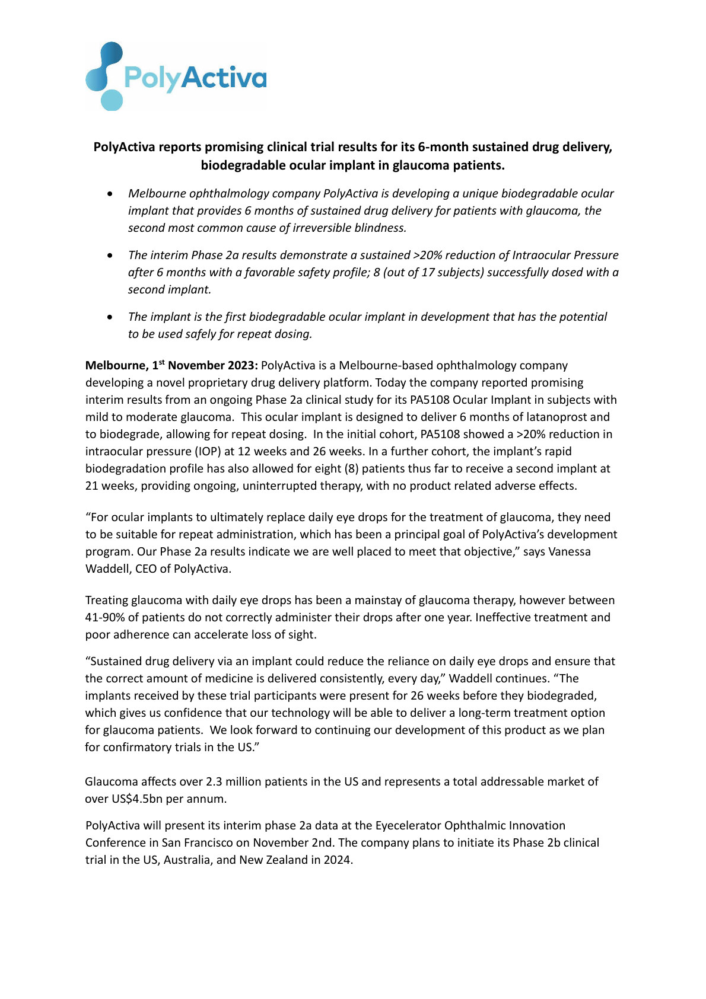
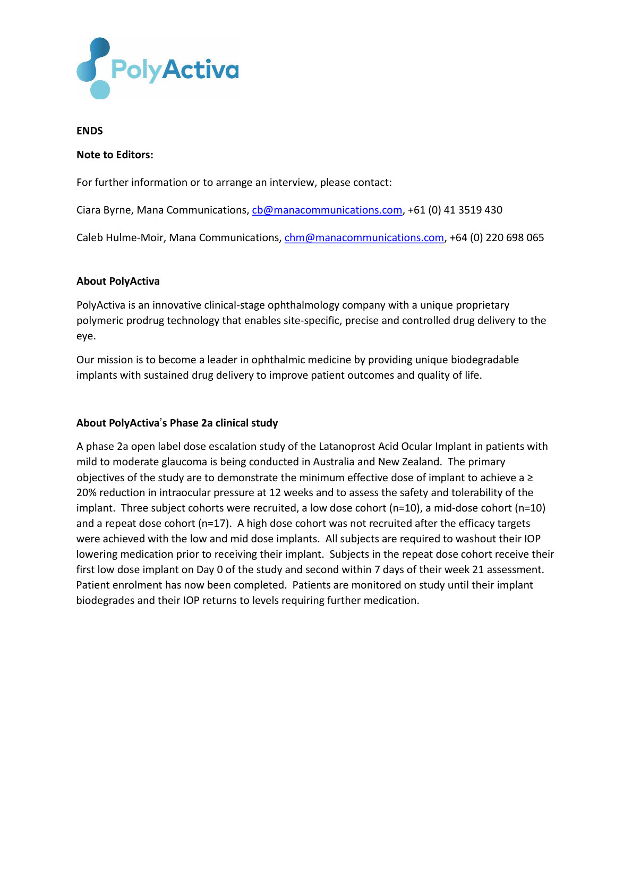

# Page 1

PolyActiva reports promising clinical trial results for its 6-month sustained drug delivery, 
biodegradable ocular implant in glaucoma patients. 
• 
Melbourne ophthalmology company PolyActiva is developing a unique biodegradable ocular 
implant that provides 6 months of sustained drug delivery for patients with glaucoma, the 
second most common cause of irreversible blindness. 
• 
The interim Phase 2a results demonstrate a sustained >20% reduction of Intraocular Pressure 
after 6 months with a favorable safety profile; 8 (out of 17 subjects) successfully dosed with a 
second implant. 
• 
The implant is the first biodegradable ocular implant in development that has the potential 
to be used safely for repeat dosing. 
Melbourne, 1st November 2023: PolyActiva is a Melbourne-based ophthalmology company 
developing a novel proprietary drug delivery platform. Today the company reported promising 
interim results from an ongoing Phase 2a clinical study for its PA5108 Ocular Implant in subjects with 
mild to moderate glaucoma.  This ocular implant is designed to deliver 6 months of latanoprost and 
to biodegrade, allowing for repeat dosing.  In the initial cohort, PA5108 showed a >20% reduction in 
intraocular pressure (IOP) at 12 weeks and 26 weeks. In a further cohort, the implant’s rapid 
biodegradation profile has also allowed for eight (8) patients thus far to receive a second implant at 
21 weeks, providing ongoing, uninterrupted therapy, with no product related adverse effects.   
“For ocular implants to ultimately replace daily eye drops for the treatment of glaucoma, they need 
to be suitable for repeat administration, which has been a principal goal of PolyActiva’s development 
program. Our Phase 2a results indicate we are well placed to meet that objective,” says Vanessa 
Waddell, CEO of PolyActiva. 
Treating glaucoma with daily eye drops has been a mainstay of glaucoma therapy, however between 
41-90% of patients do not correctly administer their drops after one year. Ineffective treatment and 
poor adherence can accelerate loss of sight. 
“Sustained drug delivery via an implant could reduce the reliance on daily eye drops and ensure that 
the correct amount of medicine is delivered consistently, every day,” Waddell continues. “The 
implants received by these trial participants were present for 26 weeks before they biodegraded, 
which gives us confidence that our technology will be able to deliver a long-term treatment option 
for glaucoma patients.  We look forward to continuing our development of this product as we plan 
for confirmatory trials in the US.” 
 
Glaucoma affects over 2.3 million patients in the US and represents a total addressable market of 
over US$4.5bn per annum. 
PolyActiva will present its interim phase 2a data at the Eyecelerator Ophthalmic Innovation 
Conference in San Francisco on November 2nd. The company plans to initiate its Phase 2b clinical 
trial in the US, Australia, and New Zealand in 2024.

# Page 2

ENDS  
Note to Editors: 
For further information or to arrange an interview, please contact:  
Ciara Byrne, Mana Communications, cb@manacommunications.com, +61 (0) 41 3519 430  
Caleb Hulme-Moir, Mana Communications, chm@manacommunications.com, +64 (0) 220 698 065 
 
About PolyActiva  
PolyActiva is an innovative clinical-stage ophthalmology company with a unique proprietary 
polymeric prodrug technology that enables site-specific, precise and controlled drug delivery to the 
eye. 
Our mission is to become a leader in ophthalmic medicine by providing unique biodegradable 
implants with sustained drug delivery to improve patient outcomes and quality of life. 
 
About PolyActiva’s Phase 2a clinical study  
A phase 2a open label dose escalation study of the Latanoprost Acid Ocular Implant in patients with 
mild to moderate glaucoma is being conducted in Australia and New Zealand.  The primary 
objectives of the study are to demonstrate the minimum effective dose of implant to achieve a ≥ 
20% reduction in intraocular pressure at 12 weeks and to assess the safety and tolerability of the 
implant.  Three subject cohorts were recruited, a low dose cohort (n=10), a mid-dose cohort (n=10) 
and a repeat dose cohort (n=17).  A high dose cohort was not recruited after the efficacy targets 
were achieved with the low and mid dose implants.  All subjects are required to washout their IOP 
lowering medication prior to receiving their implant.  Subjects in the repeat dose cohort receive their 
first low dose implant on Day 0 of the study and second within 7 days of their week 21 assessment.  
Patient enrolment has now been completed.  Patients are monitored on study until their implant 
biodegrades and their IOP returns to levels requiring further medication.

