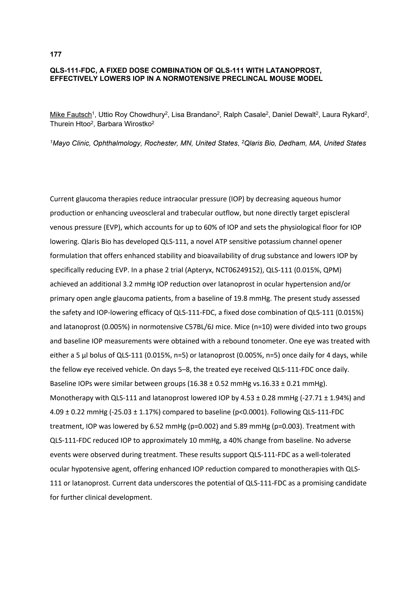

177

# QLS-111-FDC, A FIXED DOSE COMBINATION OF QLS-111 WITH LATANOPROST, EFFECTIVELY LOWERS IOP IN A NORMOTENSIVE PRECLINCAL MOUSE MODEL

<u>Mike Fautsch</u>¹, Uttio Roy Chowdhury², Lisa Brandano², Ralph Casale², Daniel Dewalt², Laura Rykard², Thurein Htoo², Barbara Wirostko²

*¹Mayo Clinic, Ophthalmology, Rochester, MN, United States, ²Qlaris Bio, Dedham, MA, United States*

Current glaucoma therapies reduce intraocular pressure (IOP) by decreasing aqueous humor production or enhancing uveoscleral and trabecular outflow, but none directly target episcleral venous pressure (EVP), which accounts for up to 60% of IOP and sets the physiological floor for IOP lowering. Qlaris Bio has developed QLS-111, a novel ATP sensitive potassium channel opener formulation that offers enhanced stability and bioavailability of drug substance and lowers IOP by specifically reducing EVP. In a phase 2 trial (Apteryx, NCT06249152), QLS-111 (0.015%, QPM) achieved an additional 3.2 mmHg IOP reduction over latanoprost in ocular hypertension and/or primary open angle glaucoma patients, from a baseline of 19.8 mmHg. The present study assessed the safety and IOP-lowering efficacy of QLS-111-FDC, a fixed dose combination of QLS-111 (0.015%) and latanoprost (0.005%) in normotensive C57BL/6J mice. Mice (n=10) were divided into two groups and baseline IOP measurements were obtained with a rebound tonometer. One eye was treated with either a 5 µl bolus of QLS-111 (0.015%, n=5) or latanoprost (0.005%, n=5) once daily for 4 days, while the fellow eye received vehicle. On days 5–8, the treated eye received QLS-111-FDC once daily. Baseline IOPs were similar between groups (16.38 ± 0.52 mmHg vs. 16.33 ± 0.21 mmHg). Monotherapy with QLS-111 and latanoprost lowered IOP by 4.53 ± 0.28 mmHg (-27.71 ± 1.94%) and 4.09 ± 0.22 mmHg (-25.03 ± 1.17%) compared to baseline (p<0.0001). Following QLS-111-FDC treatment, IOP was lowered by 6.52 mmHg (p=0.002) and 5.89 mmHg (p=0.003). Treatment with QLS-111-FDC reduced IOP to approximately 10 mmHg, a 40% change from baseline. No adverse events were observed during treatment. These results support QLS-111-FDC as a well-tolerated ocular hypotensive agent, offering enhanced IOP reduction compared to monotherapies with QLS-111 or latanoprost. Current data underscores the potential of QLS-111-FDC as a promising candidate for further clinical development.

