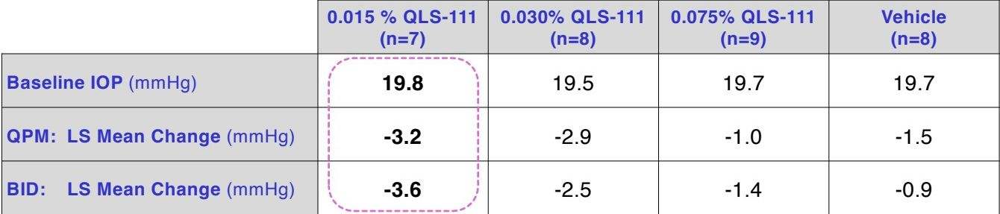
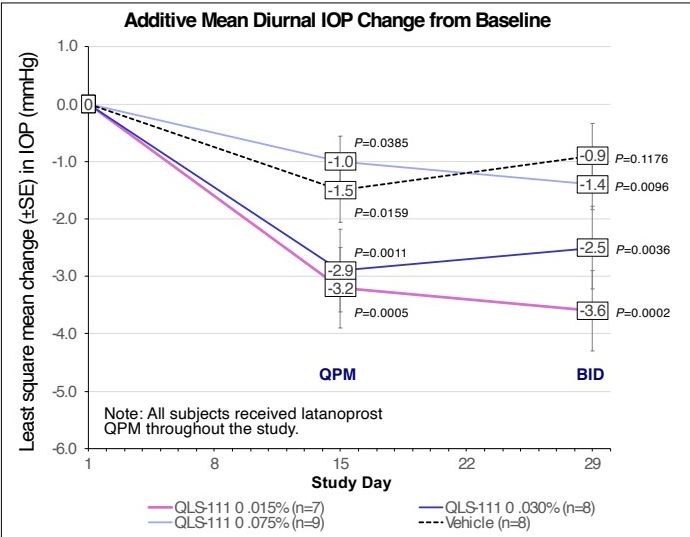
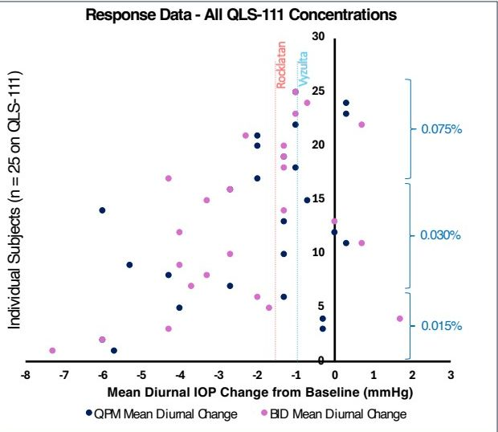

Poster no: P-PW-0395

# Safety, tolerability, and ocular hypotensive efficacy of QLS-111, a novel ATP-sensitive potassium channel opener added to latanoprost monotherapy – QC-111-203 “Apteryx” Clinical Study

B. WIROSTKO, MD, FARVO1,2, L. BRANDANO, BS1, T. HTOO, MS, MBA1, U. ROY CHOWDHURY, PhD, MBA1, M. FAUTSCH, PhD3, J. SERLE, MD4, BT NGUYEN, MD5
1Qlaris Bio, Inc., Dedham, MA; 2Moran Eye Center, University of Utah, Salt Lake City, UT; 3Department of Ophthalmology, Mayo Clinic, Rochester, MN; 4Department of Ophthalmology, Mount Sinai School of Medicine, New York, NY; 5Berkeley Eye Center, Houston, TX

QLARIS BIO logo

## INTRODUCTION

* Episcleral venous pressure (EVP) contributes up to 60% towards intraocular pressure (IOP).1

* Existing glaucoma therapies do not directly target EVP even though it sets the floor for further IOP reduction.

* ATP-sensitive potassium channel openers have been shown to lower IOP by specifically and uniquely targeting EVP and the distal outflow pathway.2-4

* Qlaris Bio, Inc. has recently developed QLS-111, a preservative-free, topical ocular formulation of an ATP-sensitive potassium channel opener, with excellent safety, tolerability, and bioavailability.

* QLS-111 lowered IOP by decreasing EVP and distal outflow resistance in multiple preclinical normotensive and ocular hypertensive animal models.

## AIM

To evaluate safety, tolerability, and ocular hypotensive efficacy of various concentrations and regimens of QLS-111 in combination with latanoprost, in subjects with open angle glaucoma (OAG) or ocular hypertension (OHT).

## METHODS

* Vehicle controlled, randomized, double masked, prospective, parallel study across 5 sites

* Both eyes of subjects with OAG or OHT were dosed with QLS-111 (0.015%, 0.030%, 0.075%) or vehicle for 14 days QPM followed by 14 days BID, concomitant to latanoprost QPM by ocular topical instillation.

**Inclusion criteria**

* >12 years of age with corrected visual acuity of +1.0 logMAR or better in each eye

* Mild to moderate OAG or OHT in at least one eye, with IOP managed with and responding to latanoprost prior to study start

* IOP ≥ 19 mmHg on PGA at 8 AM on two separate visits, by Goldmann applanation tonometry and compliant with latanoprost treatment

**Exclusion criteria**

* History of active ocular disease other than OAG/OHT, refractive surgery, cancer, ocular trauma within 6 months prior or ongoing pregnancy

* Use of ocular concomitant medications other than latanoprost or lubricating eye drops

* Use of sulfonylurea diabetic medications or MEK inhibitors

## RESULTS

Apteryx logo

**Demographics**

* Mean age 67.2 ± 10.4 years

* Males and females evenly distributed; 58.3 % white, 38.9 % of African heritage; 86.1 % non-Hispanic or Latino

**IOP changes additive to concomitant latanoprost therapy and response rate to QLS-111 treatment**

Additive Mean Diurnal IOP Change from Baseline

| Study Day | QLS-111 0.015% (n=7) | QLS-111 0.030% (n=8) | QLS-111 0.075% (n=9) | Vehicle (n=8)   |
| --------- | -------------------- | -------------------- | -------------------- | --------------- |
| 1         | 0.0                  | 0.0                  | 0.0                  | 0.0             |
| 15 (QPM)  | -3.2 (P=0.0005)      | -2.9 (P=0.0011)      | -1.0 (P=0.0385)      | -1.5 (P=0.0159) |
| 29 (BID)  | -3.6 (P=0.0002)      | -2.5 (P=0.0036)      | -0.9 (P=0.1176)      | -1.4 (P=0.0096) |

Note: All subjects received latanoprost QPM throughout the study.

Figure 1. Significant change in mean diurnal IOP from baseline to day 15 (QPM dosing) and day 29 (BID dosing) following treatment with QLS-111; SE, standard error

Response Data - All QLS-111 Concentrations

| Concentration | Mean Diurnal IOP Change (mmHg) | Dosing Regimen |
| ------------- | ------------------------------ | -------------- |
| 0.015%        | -3.5                           | QPM            |
| 0.015%        | -4.0                           | BID            |
| 0.015%        | -3.0                           | QPM            |
| 0.015%        | -3.5                           | BID            |
| 0.015%        | -4.5                           | QPM            |
| 0.015%        | -5.0                           | BID            |
| 0.030%        | -2.5                           | QPM            |
| 0.030%        | -3.0                           | BID            |
| 0.030%        | -2.0                           | QPM            |
| 0.030%        | -2.5                           | BID            |
| 0.075%        | -1.0                           | QPM            |
| 0.075%        | -1.5                           | BID            |
| 0.075%        | -0.5                           | QPM            |
| 0.075%        | -1.0                           | BID            |

*(Note: Data points are representative of the distribution shown in the scatter plot)*

Figure 2. QLS-111 demonstrated over 85% response rate; comparison against average additive IOP lowering of Rocklatan and Vyzulta depicted

|                            | 0.015 % QLS-111 (n=7) | 0.030% QLS-111 (n=8) | 0.075% QLS-111 (n=9) | Vehicle (n=8) |
| -------------------------- | --------------------- | -------------------- | -------------------- | ------------- |
| Baseline IOP (mmHg)        | 19.8                  | 19.5                 | 19.7                 | 19.7          |
| QPM: LS Mean Change (mmHg) | -3.2                  | -2.9                 | -1.0                 | -1.5          |
| BID: LS Mean Change (mmHg) | -3.6                  | -2.5                 | -1.4                 | -0.9          |

Table 1. LS mean change from baseline in mean diurnal IOP concomitant to latanoprost therapy, following QLS-111 QPM dosing (day 15) and QLS BID dosing (day 29); LS, least square mean values

**Safety and tolerability**

* Over 85% response rate across all doses

* 8 treatment emergent adverse events (TEAE) reported in 5 subjects (only 1 TEAE in 0.015%)

* No serious adverse events across all doses; adverse events did not increase after BID dosing

* All TEAEs were mild in intensity, intermittent, self reported, and did not lead to study discontinuation.

* No clinically significant findings in vital signs, best corrected visual acuity, slit lamp biomicroscopy or dilated ophthalmoscopy (no findings on slit lamp exam with no corneal findings)

* No incremental hyperemia on top of latanoprost after 28 days of dosing (conjunctival hyperemia in QLS-111 0.015% was noted in **only one patient** and was attributed to latanoprost use)

## CONCLUSIONS

* QLS-111 0.015% demonstrated the greatest efficacy with 3.2 mmHg (QPM) and 3.6 mmHg (BID) of additive IOP lowering on top of latanoprost monotherapy (p=0.0005 and p=0.0002, respectively).

* QLS-111 shows an excellent safety and tolerability profile across all doses and regimens with little to no hyperemia and no ocular changes on clinical exam.

* QLS-111 is a strong candidate as a potential new therapeutic agent for lowering IOP.

## DISCLOSURES

* Drs. Serle and Nguyen received funding for conducting the study.

* Dr. Wirostko, Dr. Roy Chowdhury, Mr. Htoo, and Mrs. Brandano are Qlaris Bio employees.

* Dr. Fautsch is an employee of Mayo Clinic, an advisor to Qlaris Bio, and an inventor on related patents.

## REFERENCES

1. Lee SS et al. J Glaucoma. 2019; 28: 846-57.

2. Roy Chowdhury U et al. PLOS ONE. 2015; 10:e0141783.

3. Roy Chowdhury U et al. Exp Eye Res. 2017; 158: 85-93.

4. Roy Chowdhury U et al. IOVS. 2017; 58: 5731-5742.

## CONTACT INFORMATION

Barbara M. Wirostko, MD, FARVO (bwirostko@qlaris.bio)
Copyright © Qlaris Bio, Inc. 2025 (www.qlaris.bio)

