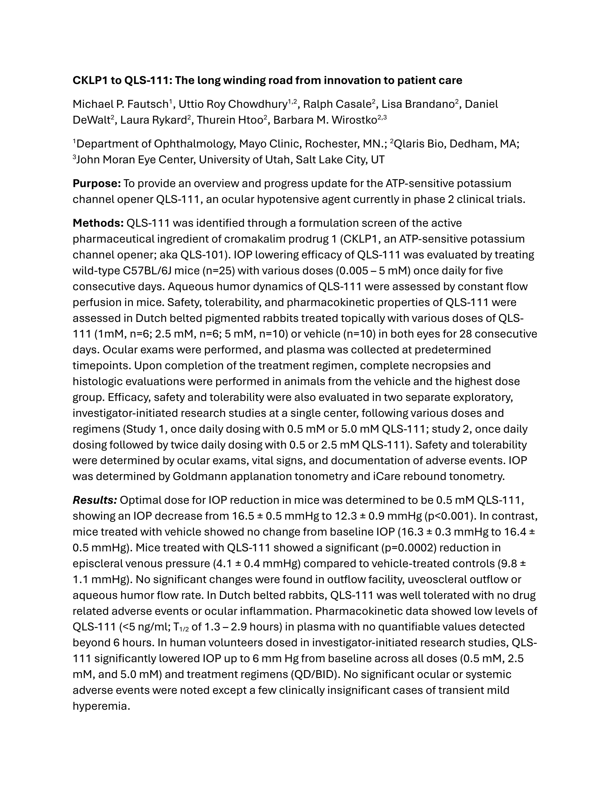
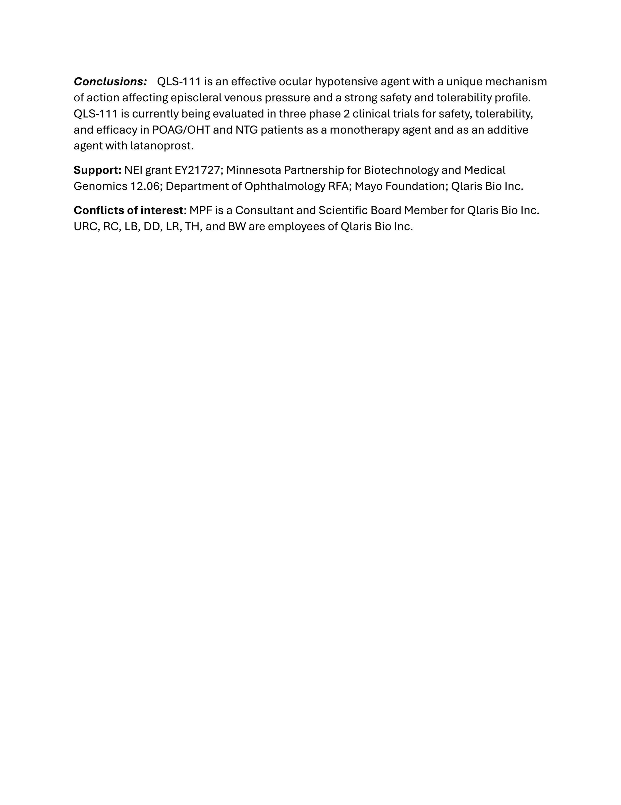

# CKLP1 to QLS-111: The long winding road from innovation to patient care

Michael P. Fautsch¹, Uttio Roy Chowdhury¹,², Ralph Casale², Lisa Brandano², Daniel DeWalt², Laura Rykard², Thurein Htoo², Barbara M. Wirostko²,³

¹Department of Ophthalmology, Mayo Clinic, Rochester, MN.; ²Qlaris Bio, Dedham, MA; ³John Moran Eye Center, University of Utah, Salt Lake City, UT

**Purpose:** To provide an overview and progress update for the ATP-sensitive potassium channel opener QLS-111, an ocular hypotensive agent currently in phase 2 clinical trials.

**Methods:** QLS-111 was identified through a formulation screen of the active pharmaceutical ingredient of cromakalim prodrug 1 (CKLP1, an ATP-sensitive potassium channel opener; aka QLS-101). IOP lowering efficacy of QLS-111 was evaluated by treating wild-type C57BL/6J mice (n=25) with various doses (0.005 – 5 mM) once daily for five consecutive days. Aqueous humor dynamics of QLS-111 were assessed by constant flow perfusion in mice. Safety, tolerability, and pharmacokinetic properties of QLS-111 were assessed in Dutch belted pigmented rabbits treated topically with various doses of QLS-111 (1mM, n=6; 2.5 mM, n=6; 5 mM, n=10) or vehicle (n=10) in both eyes for 28 consecutive days. Ocular exams were performed, and plasma was collected at predetermined timepoints. Upon completion of the treatment regimen, complete necropsies and histologic evaluations were performed in animals from the vehicle and the highest dose group. Efficacy, safety and tolerability were also evaluated in two separate exploratory, investigator-initiated research studies at a single center, following various doses and regimens (Study 1, once daily dosing with 0.5 mM or 5.0 mM QLS-111; study 2, once daily dosing followed by twice daily dosing with 0.5 or 2.5 mM QLS-111). Safety and tolerability were determined by ocular exams, vital signs, and documentation of adverse events. IOP was determined by Goldmann applanation tonometry and iCare rebound tonometry.

**Results:** Optimal dose for IOP reduction in mice was determined to be 0.5 mM QLS-111, showing an IOP decrease from 16.5 ± 0.5 mmHg to 12.3 ± 0.9 mmHg (p<0.001). In contrast, mice treated with vehicle showed no change from baseline IOP (16.3 ± 0.3 mmHg to 16.4 ± 0.5 mmHg). Mice treated with QLS-111 showed a significant (p=0.0002) reduction in episcleral venous pressure (4.1 ± 0.4 mmHg) compared to vehicle-treated controls (9.8 ± 1.1 mmHg). No significant changes were found in outflow facility, uveoscleral outflow or aqueous humor flow rate. In Dutch belted rabbits, QLS-111 was well tolerated with no drug related adverse events or ocular inflammation. Pharmacokinetic data showed low levels of QLS-111 (<5 ng/ml; T1/2 of 1.3 – 2.9 hours) in plasma with no quantifiable values detected beyond 6 hours. In human volunteers dosed in investigator-initiated research studies, QLS-111 significantly lowered IOP up to 6 mm Hg from baseline across all doses (0.5 mM, 2.5 mM, and 5.0 mM) and treatment regimens (QD/BID). No significant ocular or systemic adverse events were noted except a few clinically insignificant cases of transient mild hyperemia.

**Conclusions:** QLS-111 is an effective ocular hypotensive agent with a unique mechanism of action affecting episcleral venous pressure and a strong safety and tolerability profile. QLS-111 is currently being evaluated in three phase 2 clinical trials for safety, tolerability, and efficacy in POAG/OHT and NTG patients as a monotherapy agent and as an additive agent with latanoprost.

**Support:** NEI grant EY21727; Minnesota Partnership for Biotechnology and Medical Genomics 12.06; Department of Ophthalmology RFA; Mayo Foundation; Qlaris Bio Inc.

**Conflicts of interest:** MPF is a Consultant and Scientific Board Member for Qlaris Bio Inc. URC, RC, LB, DD, LR, TH, and BW are employees of Qlaris Bio Inc.

