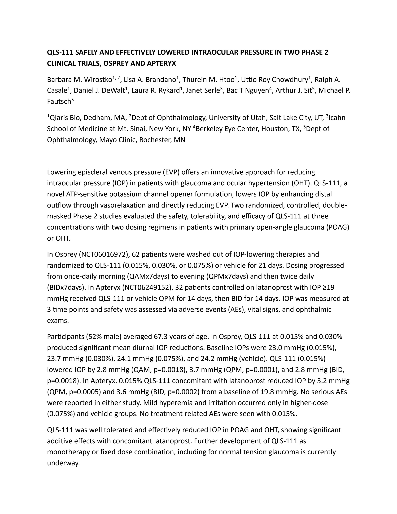

# QLS-111 SAFELY AND EFFECTIVELY LOWERED INTRAOCULAR PRESSURE IN TWO PHASE 2 CLINICAL TRIALS, OSPREY AND APTERYX

Barbara M. Wirostko1, 2, Lisa A. Brandano1, Thurein M. Htoo1, Uttio Roy Chowdhury1, Ralph A. Casale1, Daniel J. DeWalt1, Laura R. Rykard1, Janet Serle3, Bac T Nguyen4, Arthur J. Sit5, Michael P. Fautsch5

1Qlaris Bio, Dedham, MA, 2Dept of Ophthalmology, University of Utah, Salt Lake City, UT, 3Icahn School of Medicine at Mt. Sinai, New York, NY 4Berkeley Eye Center, Houston, TX, 5Dept of Ophthalmology, Mayo Clinic, Rochester, MN

Lowering episcleral venous pressure (EVP) offers an innovative approach for reducing intraocular pressure (IOP) in patients with glaucoma and ocular hypertension (OHT). QLS-111, a novel ATP-sensitive potassium channel opener formulation, lowers IOP by enhancing distal outflow through vasorelaxation and directly reducing EVP. Two randomized, controlled, double-masked Phase 2 studies evaluated the safety, tolerability, and efficacy of QLS-111 at three concentrations with two dosing regimens in patients with primary open-angle glaucoma (POAG) or OHT.

In Osprey (NCT06016972), 62 patients were washed out of IOP-lowering therapies and randomized to QLS-111 (0.015%, 0.030%, or 0.075%) or vehicle for 21 days. Dosing progressed from once-daily morning (QAMx7days) to evening (QPMx7days) and then twice daily (BIDx7days). In Apteryx (NCT06249152), 32 patients controlled on latanoprost with IOP ≥19 mmHg received QLS-111 or vehicle QPM for 14 days, then BID for 14 days. IOP was measured at 3 time points and safety was assessed via adverse events (AEs), vital signs, and ophthalmic exams.

Participants (52% male) averaged 67.3 years of age. In Osprey, QLS-111 at 0.015% and 0.030% produced significant mean diurnal IOP reductions. Baseline IOPs were 23.0 mmHg (0.015%), 23.7 mmHg (0.030%), 24.1 mmHg (0.075%), and 24.2 mmHg (vehicle). QLS-111 (0.015%) lowered IOP by 2.8 mmHg (QAM, p=0.0018), 3.7 mmHg (QPM, p=0.0001), and 2.8 mmHg (BID, p=0.0018). In Apteryx, 0.015% QLS-111 concomitant with latanoprost reduced IOP by 3.2 mmHg (QPM, p=0.0005) and 3.6 mmHg (BID, p=0.0002) from a baseline of 19.8 mmHg. No serious AEs were reported in either study. Mild hyperemia and irritation occurred only in higher-dose (0.075%) and vehicle groups. No treatment-related AEs were seen with 0.015%.

QLS-111 was well tolerated and effectively reduced IOP in POAG and OHT, showing significant additive effects with concomitant latanoprost. Further development of QLS-111 as monotherapy or fixed dose combination, including for normal tension glaucoma is currently underway.

