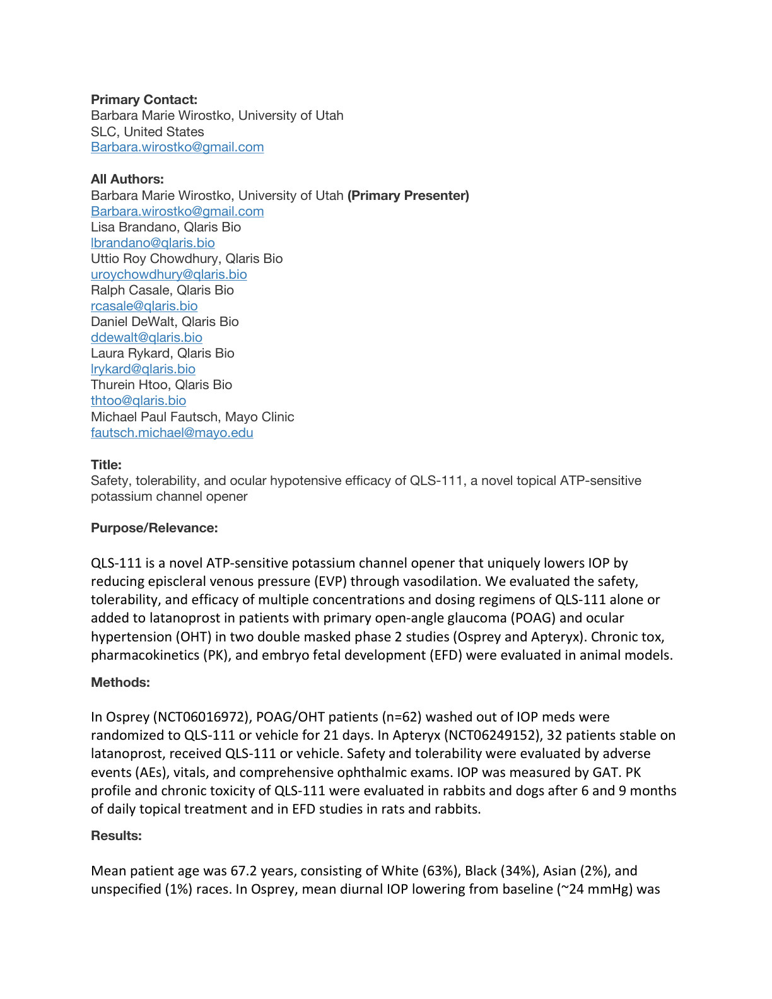
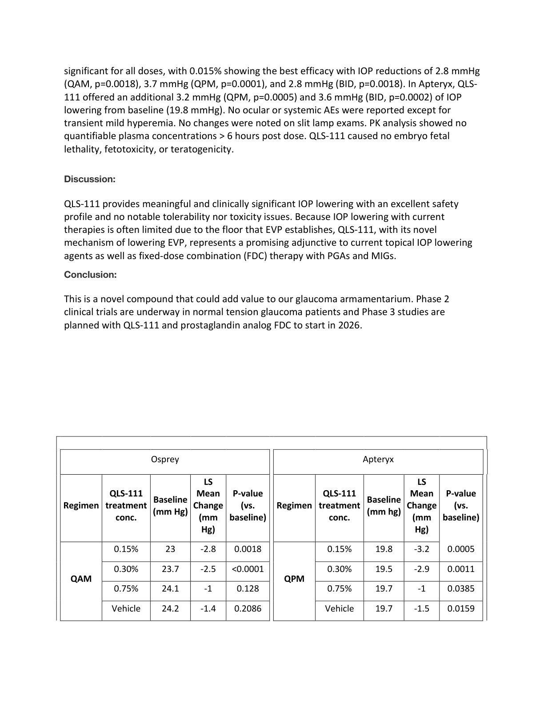
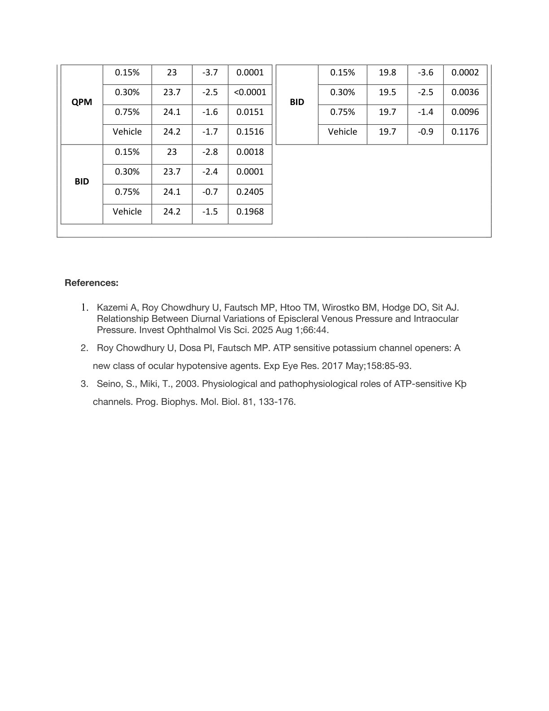

# Page 1

Primary Contact: 
Barbara Marie Wirostko, University of Utah 
SLC, United States 
Barbara.wirostko@gmail.com 
 
All Authors: 
Barbara Marie Wirostko, University of Utah (Primary Presenter) 
Barbara.wirostko@gmail.com 
Lisa Brandano, Qlaris Bio 
lbrandano@qlaris.bio 
Uttio Roy Chowdhury, Qlaris Bio 
uroychowdhury@qlaris.bio 
Ralph Casale, Qlaris Bio 
rcasale@qlaris.bio 
Daniel DeWalt, Qlaris Bio 
ddewalt@qlaris.bio 
Laura Rykard, Qlaris Bio 
lrykard@qlaris.bio 
Thurein Htoo, Qlaris Bio 
thtoo@qlaris.bio 
Michael Paul Fautsch, Mayo Clinic 
fautsch.michael@mayo.edu 
 
Title: 
Safety, tolerability, and ocular hypotensive efficacy of QLS-111, a novel topical ATP-sensitive 
potassium channel opener 
 
Purpose/Relevance: 
 
QLS-111 is a novel ATP-sensitive potassium channel opener that uniquely lowers IOP by 
reducing episcleral venous pressure (EVP) through vasodilation. We evaluated the safety, 
tolerability, and efficacy of multiple concentrations and dosing regimens of QLS-111 alone or 
added to latanoprost in patients with primary open-angle glaucoma (POAG) and ocular 
hypertension (OHT) in two double masked phase 2 studies (Osprey and Apteryx). Chronic tox, 
pharmacokinetics (PK), and embryo fetal development (EFD) were evaluated in animal models. 
Methods: 
 
In Osprey (NCT06016972), POAG/OHT patients (n=62) washed out of IOP meds were 
randomized to QLS-111 or vehicle for 21 days. In Apteryx (NCT06249152), 32 patients stable on 
latanoprost, received QLS-111 or vehicle. Safety and tolerability were evaluated by adverse 
events (AEs), vitals, and comprehensive ophthalmic exams. IOP was measured by GAT. PK 
profile and chronic toxicity of QLS-111 were evaluated in rabbits and dogs after 6 and 9 months 
of daily topical treatment and in EFD studies in rats and rabbits. 
Results: 
 
Mean patient age was 67.2 years, consisting of White (63%), Black (34%), Asian (2%), and 
unspecified (1%) races. In Osprey, mean diurnal IOP lowering from baseline (~24 mmHg) was

# Page 2

significant for all doses, with 0.015% showing the best efficacy with IOP reductions of 2.8 mmHg 
(QAM, p=0.0018), 3.7 mmHg (QPM, p=0.0001), and 2.8 mmHg (BID, p=0.0018). In Apteryx, QLS-
111 offered an additional 3.2 mmHg (QPM, p=0.0005) and 3.6 mmHg (BID, p=0.0002) of IOP 
lowering from baseline (19.8 mmHg). No ocular or systemic AEs were reported except for 
transient mild hyperemia. No changes were noted on slit lamp exams. PK analysis showed no 
quantifiable plasma concentrations > 6 hours post dose. QLS-111 caused no embryo fetal 
lethality, fetotoxicity, or teratogenicity. 
  
Discussion: 
 
QLS-111 provides meaningful and clinically significant IOP lowering with an excellent safety 
profile and no notable tolerability nor toxicity issues. Because IOP lowering with current 
therapies is often limited due to the floor that EVP establishes, QLS-111, with its novel 
mechanism of lowering EVP, represents a promising adjunctive to current topical IOP lowering 
agents as well as fixed-dose combination (FDC) therapy with PGAs and MIGs. 
Conclusion: 
 
This is a novel compound that could add value to our glaucoma armamentarium. Phase 2 
clinical trials are underway in normal tension glaucoma patients and Phase 3 studies are 
planned with QLS-111 and prostaglandin analog FDC to start in 2026. 
 
 
 
 
 
 
 
 
 
 
 
 
 
 
 
 
 
 
 
Osprey 
 
Apteryx 
 
 Regimen 
QLS-111 
treatment 
conc. 
Baseline 
(mm Hg) 
LS 
Mean 
Change 
(mm 
Hg) 
P-value 
(vs. 
baseline) 
 Regimen 
QLS-111 
treatment 
conc. 
Baseline 
(mm hg) 
LS 
Mean 
Change 
(mm 
Hg) 
P-value 
(vs. 
baseline) 
 
 
QAM 
0.15% 
23 
-2.8 
0.0018  
QPM 
0.15% 
19.8 
-3.2 
0.0005  
 
0.30% 
23.7 
-2.5 
<0.0001  
0.30% 
19.5 
-2.9 
0.0011  
 
0.75% 
24.1 
-1 
0.128 
 
0.75% 
19.7 
-1 
0.0385  
 
Vehicle 
24.2 
-1.4 
0.2086  
Vehicle 
19.7 
-1.5 
0.0159

# Page 3

QPM 
0.15% 
23 
-3.7 
0.0001  
BID 
0.15% 
19.8 
-3.6 
0.0002  
 
0.30% 
23.7 
-2.5 
<0.0001  
0.30% 
19.5 
-2.5 
0.0036  
 
0.75% 
24.1 
-1.6 
0.0151  
0.75% 
19.7 
-1.4 
0.0096  
 
Vehicle 
24.2 
-1.7 
0.1516  
Vehicle 
19.7 
-0.9 
0.1176  
 
BID 
0.15% 
23 
-2.8 
0.0018  
 
 
 
 
 
 
 
0.30% 
23.7 
-2.4 
0.0001  
 
 
 
 
 
 
 
0.75% 
24.1 
-0.7 
0.2405  
 
 
 
 
 
 
 
Vehicle 
24.2 
-1.5 
0.1968  
 
 
 
 
 
 
 
 
 
 
 
 
 
 
 
 
 
 
 
 
 
References: 
 
1. Kazemi A, Roy Chowdhury U, Fautsch MP, Htoo TM, Wirostko BM, Hodge DO, Sit AJ. 
Relationship Between Diurnal Variations of Episcleral Venous Pressure and Intraocular 
Pressure. Invest Ophthalmol Vis Sci. 2025 Aug 1;66:44. 
2. Roy Chowdhury U, Dosa PI, Fautsch MP. ATP sensitive potassium channel openers: A 
      new class of ocular hypotensive agents. Exp Eye Res. 2017 May;158:85-93. 
3. Seino, S., Miki, T., 2003. Physiological and pathophysiological roles of ATP-sensitive Kþ 
      channels. Prog. Biophys. Mol. Biol. 81, 133-176.

