QLARIS BIO logo

# Preclinical Efficacy and Safety Profile of a Novel Episcleral Venous Pressure (EVP)-Lowering Agent

Cynthia L. Steel, PhD¹; Uttio Roy Chowdhury, PhD²; J. Cameron Millar, PhD³; Hemchand K. Sookdeo¹; Thurein Htoo, MS, MBA¹; Peter I. Dosa, PhD⁴; Barbara M. Wirostko, MD1,5, Michael P. Fautsch, PhD²

1. Qlaris Bio, Inc., Wellesley, MA; 2. Mayo Clinic, Department of Ophthalmology, Mayo Clinic, Rochester, MN; 3. North Texas Eye Research Institute, University of North Texas Health Science Center, Fort Worth, TX; 4. Department of Medicinal Chemistry, Institute for Therapeutics Discovery and Development, University of Minnesota, Minneapolis, MN; 5. University of Utah, Moran Eye Center, Salt Lake City, UT

## Purpose

To summarize the ocular hypotensive effect and novel mechanism of action of cromakalim prodrug 1 (CKLP1) in normotensive preclinical models

## Introduction

* Elevated intraocular pressure (IOP) is the only treatable risk factor for glaucoma.

* Current treatments for elevated IOP target the production of aqueous humor and outflow facility through both the conventional (trabecular) and unconventional (uveoscleral) pathways.

* No treatments primarily target episcleral venous pressure (EVP), the factor that constitutes the largest percentage (approximately 50-60%) of total IOP¹ and sets the "floor" for current maximal medical therapy.

* Levcromakalim is a well-characterized ATP-sensitive potassium channel (KATP) opener with ocular hypotensive properties.²

* CKLP1 was developed as a water-soluble phosphate ester prodrug of levcromakalim.

## Methods

* **CKLP1 treatment and IOP quantification:** CKLP1 was synthesized as previously described.³ C57BL/6J mice, Dutch-belted rabbits, hound dogs, and African green monkeys (n = 10 each) were treated with either CKLP1 (5-10 mM) or PBS (vehicle). Animals were treated for 5-7 days, and IOP quantified daily (see below). Ocular safety and tolerability assessments were performed throughout.

CKLP1 treatment and IOP quantification timeline diagram

* **Aqueous humor dynamics:** After 5 days of treatment with CKLP1 (5 mM), wild-type C57BL/6J mice were anesthetized, and aqueous humor dynamics were quantified as previously described.⁴ Ocular safety and tolerability assessments were performed throughout.

* **Combinatorial drug treatment:** Dutch-belted rabbits (n = 10) per group were treated with CKLP1 (10 mM) alone or in combination with latanoprost free acid (LFA, 100 μM, Cayman Chemicals), timolol maleate (0.5%, Sigma-Millipore), or Y27632 (10 mM, Enzo Life Sciences) for five days (see below). IOP was quantified daily as indicated.

Combinatorial drug treatment timeline diagram

* **Human anterior segment perfusion:** Human donor eyes (n = 4) were obtained within 14.4 ± 9.0 hours of death, dissected, and the anterior segment was cultured in modified Petri dishes perfused with Dulbecco's Modified Eagle's medium at a rate of 2.5 μl/min for 2-4 days to achieve a stable baseline pressure. Anterior segments were treated with either vehicle (PBS) or cromakalim (2 μM), and pressure measurements were taken every 60 seconds and averaged to calculate average hourly pressure. Following perfusion, tissue wedges were isolated from each anterior segment, fixed in 10% formalin, and stained with either toluidine blue or 2% uranyl acetate/lead citrate for light or transmission electron microscopy.

* **Statistics:** All data are presented as mean ± SD and were analyzed by ANOVA with Tukey's HSD post-hoc test. In all cases, p < 0.05 was considered significant.

## Results

### Effect of CKLP1 on IOP in preclinical normotensive models

| Model                            | IOP (mmHg ± SD) | p-value  |
| -------------------------------- | --------------- | -------- |
| C57BL/6J mice ⁴                  | 2.7 ± 0.4       | < 0.001  |
| Dutch-belted pigmented rabbits ⁴ | 3.1 ± 0.8       | < 0.0001 |
| Hound dogs                       | 2.3 ± 0.5       | < 0.01   |
| African green monkeys            | 3.8 ± 1.8       | 0.01     |

> CKLP1 lowers IOP compared to contralateral vehicle-treated eyes in preclinical normotensive models

### Effect of CKLP1 on aqueous humor dynamics

| Measurement⁵                       | Contralateral Eye | Treated Eye  | p-value  |
| ---------------------------------- | ----------------- | ------------ | -------- |
| Conventional outflow (μL/min/mmHg) | 0.020 ± 0.00      | 0.017 ± 0.00 | 0.28     |
| Uveoscleral outflow (μL/min)       | 0.097 ± 0.02      | 0.091 ± 0.02 | 0.40     |
| Aqueous production rate (μL/min)   | 0.130 ± 0.02      | 0.109 ± 0.02 | 0.19     |
| EVP (mmHg)                         | 8.9 ± 0.1         | 6.2 ± 0.1    | < 0.0001 |

> CKLP1 decreases episcleral venous pressure

### Additivity of CKLP1 to current ocular hypotensive agents

| Treatment Groups⁵     | Change from Control (mmHg ± SD) | Percent Change from Control (± SD) |
| --------------------- | ------------------------------- | ---------------------------------- |
| CKLP1 + LFA group     |                                 |                                    |
| CKLP1                 | -2.5 ± 0.7\*                    | -14.3 ± 3.7%\*                     |
| CKLP1 + Latanoprost   | -3.1 ± 0.5\*                    | -17.9 ± 3.0%\*                     |
| Latanoprost           | -2.4 ± 0.2\*                    | -13.9 ± 1.1%\*                     |
| Latanoprost + CKLP1   | -3.2 ± 0.3\*                    | -18.1 ± 2.2%\*                     |
| CKLP1 + Timolol group |                                 |                                    |
| CKLP1                 | -2.5 ± 0.3\*                    | -15.7 ± 2.5%\*                     |
| CKLP1 + Timolol       | -2.8 ± 0.4\*                    | -17.7 ± 3.6%\*                     |
| Timolol               | -2.0 ± 0.4\*                    | -12.6 ± 3.2%\*                     |
| Timolol + CKLP1       | -3.1 ± 0.5\*                    | -18.7 ± 3.3%\*                     |
| CKLP1 + ROCKi group   |                                 |                                    |
| CKLP1                 | -2.3 ± 0.2\*                    | -14.0 ± 1.5%\*                     |
| CKLP1 + ROCKi         | -3.3 ± 0.4\*                    | -19.4 ± 2.7%\*                     |
| ROCKi                 | -1.4 ± 0.2\*                    | -8.60 ± 1.2%\*                     |
| ROCKi + CKLP1         | -2.4 ± 0.2\*                    | -14.6 ± 1.3%\*                     |

\* p < 0.0001, compared to vehicle-treated contralateral eyes.

> CKLP1 is additive to currently-available IOP-lowering agents

### Effect of cromakalim in human anterior segments

| Time (hr) | CKLP1 (mmHg) | Vehicle (mmHg) |
| --------- | ------------ | -------------- |
| 1         | 8            | 8              |
| 6         | 8            | 8              |
| 11        | 12           | 8              |
| 16        | 6            | 8              |
| 21        | 4            | 8              |
| 26        | 4            | 7              |
| 31        | 4            | 7              |
| 36        | 4            | 7              |

Cromakalim lowers IOP by enhancing distal outflow

## Conclusions

* CKLP1 is a potent and well-tolerated ocular hypotensive agent with a novel mechanism of action that lowers IOP by markedly reducing episcleral venous pressure.

* Based on CKLP1, Qlaris Bio, Inc. has developed QLS-101 and submitted an IND for the lowering of IOP for POAG, OHT, Normal Tension Glaucoma, and Sturge-Weber Syndrome-related glaucoma.

## References

1. Lee SS, et al. J Glaucoma. 2019;28(9): 846-57.

2. Roy Chowdhury U, et al. PLoS One. 2015;10(11):e0141783.

3. Millar JC, et al. Invest Ophthalmol Vis Sci. 2011;52:685–694.

4. Roy Chowdhury U et al., J. Med. Chem. 2016; 59(13):6221–6231

5. Roy Chowdhury U, et al. Invest Ophthalmol Vis Sci. 2017;58(13):5731-42.

## Copyright/Contact

© Qlaris Bio, Inc. 2021 (www.qlaris.bio)
Cynthia L. (Pervan) Steel, Ph.D. (csteel@qlaris.bio)

Wellesley, MA 02481
(781) 943-3519 phone
thtoo@qlaris.bio

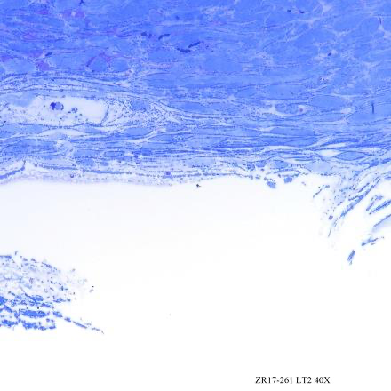

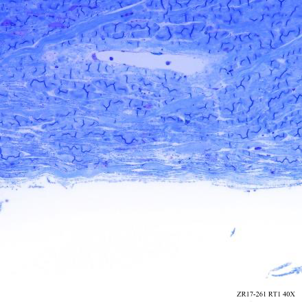

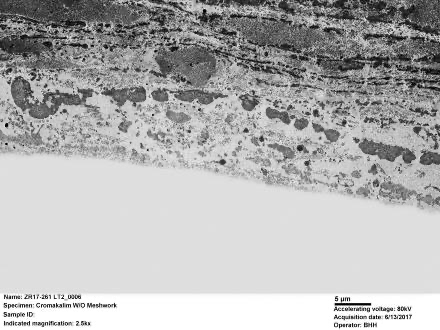

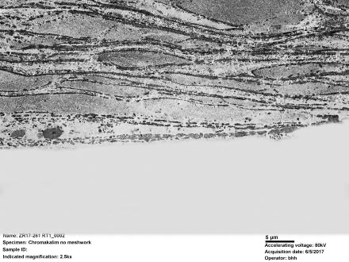

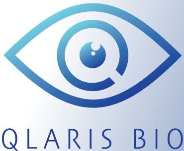

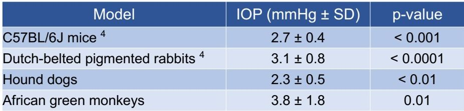

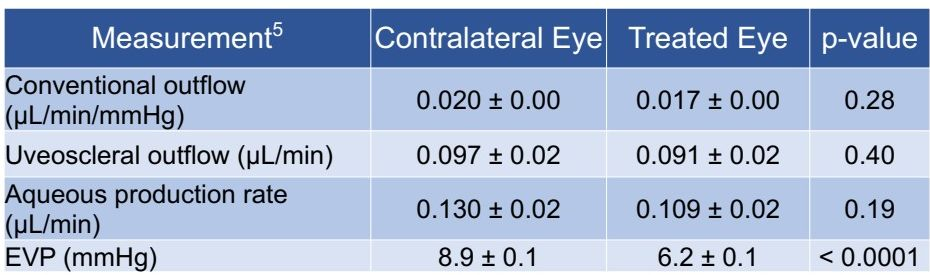

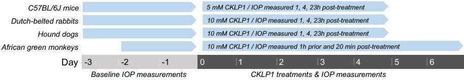

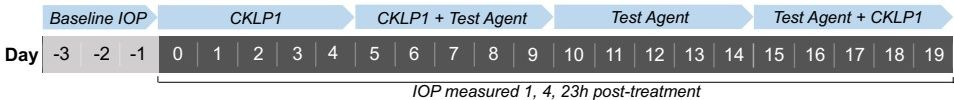

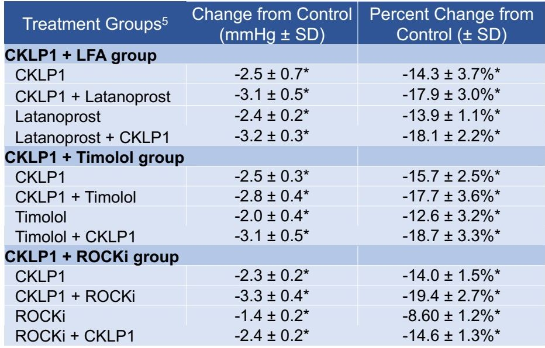

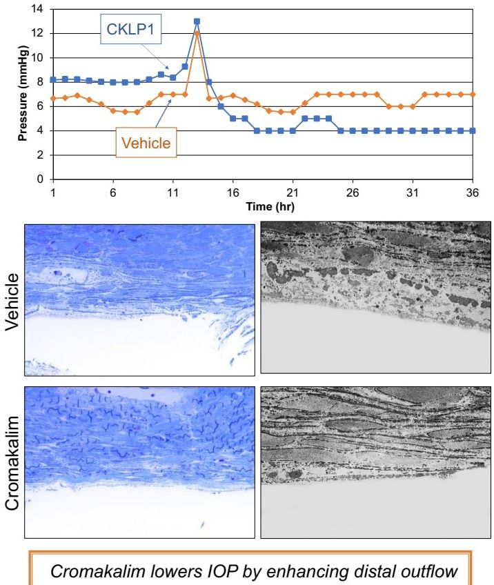
