# Ocular Tissue Conversion and Activity Profile of QLS-101, a Novel Topical IOP-Lowering Therapeutic

Cynthia L. Steel, MBA, PhD¹, Hemchand K. Sookdeo, BA¹, Thurein Htoo, MS, MBA¹, Ralph Casale, BS¹, Uttio Roy Chowdhury PhD², Michael P. Fautsch, PhD², Barbara M. Wirostko, MD, FARVO¹,³

¹Qlaris Bio, Inc., Wellesley, MA; ²Mayo Clinic, Department of Ophthalmology, Rochester, MN; ³University of Utah, Moran Eye Center, Salt Lake City, UT

## Purpose

To evaluate the conversion profile and in vitro activity of QLS-101, a novel topical IOP-lowering therapeutic, using human ocular tissues.

## Results

## Introduction

* Elevated intraocular pressure (IOP) is the only treatable risk factor for glaucoma¹

* Current treatments for elevated IOP target either aqueous humor production, or aqueous humor outflow through either the trabecular or uveoscleral outflow pathways

* Some KATP channel openers have demonstrated ocular hypotensive effects in normotensive animals²⁻⁵

* QLS-101 is being developed as a water-soluble prodrug of a KATP channel opener

* In preclinical studies, QLS-101 has an excellent tolerability profile (Abstract #353397)

* In this study, we evaluated the ability of QLS-101 to activate KATP channels, and determined whether QLS-101 can be converted to its active moiety, QLS-100

KATP channel activity of QLS-101 and QLS-100

| Compound Concentration (μM) | QLS-100 (% Activation) | QLS-101 (% Activation) |
| --------------------------- | ---------------------- | ---------------------- |
| 0.001                       | 0                      | 0                      |
| 0.01                        | -5                     | -5                     |
| 0.1                         | 10                     | -5                     |
| 1                           | 65                     | -5                     |
| 10                          | 100                    | -5                     |
| 100                         | 105                    | 10                     |
| 1000                        |                        |                        |

| Test Compound | EC₅₀ (μM)    |
| ------------- | ------------ |
| QLS-101       | >100 ± NA    |
| QLS-100       | 0.534 ± 0.05 |
| Cromakalim    | 1.35 ± 0.12  |
| Pinacidil     | 5.49 ± 0.99  |

QLS-100 activates KATP channels, but QLS-101 does not.

QLS-101 conversion in human ocular tissues

| Tissue              | Time Point (h) | Percent Conversion |
| ------------------- | -------------- | ------------------ |
| Ciliary Body        | 4              | -                  |
|                     | 24             | 2.55%              |
| Optic Nerve         | 4              | -                  |
|                     | 24             | 0.89%              |
| Iris                | 4              | 0.90%              |
|                     | 24             | 3.93%              |
| Sclera              | 4              | -                  |
|                     | 24             | 1.61%              |
| Retina              | 4              | -                  |
|                     | 24             | 0.74%              |
| Cornea              | 4              | -                  |
|                     | 24             | 0.77%              |
| Trabecular Meshwork | 4              | -                  |
|                     | 24             | 1.60%              |

QLS-101 is converted to QLS-100 in human ocular tissues with highest conversion in iris, sclera, and TM.

QLS-101 conversion in plasma

| Species             | QLS-101 Present (%) 0 h | QLS-101 Present (%) 24 h | QLS-100 Present (%) 0 h | QLS-100 Present (%) 24 h | QLS-101 T½ (hh:mm) |
| ------------------- | --------------------------- | ---------------------------- | --------------------------- | ---------------------------- | ------------------ |
| Sprague Dawley Rat  | 100%                        | 93.7%                        | 0.2%                        | 0.2%                         | 68:05              |
| Dutch-belted Rabbit | 100%                        | 97.3%                        | 0.2%                        | 0.2%                         | 100:12             |
| Beagle Dog          | 100%                        | 95.4%                        | 0.1%                        | 0.1%                         | 69:52              |
| Cynomolgus Monkey   | 100%                        | 80.3%                        | 0.2%                        | 0.2%                         | 45:37              |
| Human               | 100%                        | 81.3%                        | 0.2%                        | 0.1%                         | 32:13              |

QLS-101 is minimally converted to QLS-100 in plasma from multiple species

## Methods

### Ion Channel Activity

Human embryonic kidney cells stably expressing human Kir6.2/SUR2B KATP channel subunits were incubated with QLS-101 or QLS-100 (0.003-100 μM), and changes in channel activity were quantified by fluorescence.

### Enzymatic Conversion

QLS-101 (5 mM) was incubated at 37°C in Tris buffer (pH 7.4) with either human alkaline phosphatase (ALP), acid phosphatase (ACP), or 5’-nucleotidase (5’-NT) for 15, 30, or 120 minutes. Cleavage was detected with a phosphate detection reagent.

### QLS-101 tissue conversion

Human donor eyes (70yo Female) were obtained within 9 hours of death, various tissues were isolated, homogenized, and assayed for protein content. Equal amounts of protein were incubated with QLS-101 (10 μM) at 37°C for either 4h or 24h. Quantity of QLS-100 is expressed as a percentage of QLS-101.

### Plasma Conversion

Plasma from Sprague Dawley rat, Dutch-belted rabbit, beagle dog, cynomolgus monkey, and human were incubated with 2 μM either QLS-101 or QLS-100 at 37°C. Reactions were quenched at 0, 2h, 4h, 6h, 8h, and 24h, and drug presence quantified by HPLC.

Cleavage of QLS-101 by Various Phosphatases in vitro

Alkaline Phosphatase

| Time (min) | 0.67 nM | 1.31 nM | 2.63 nM | 5.25 nM | 10.5 nM | 21.0 nM |
| ---------- | ------- | ------- | ------- | ------- | ------- | ------- |
| 0          | 2       | 2       | 2       | 2       | 2       | 2       |
| 30         | 5       | 5       | 5       | 5       | 5       | 8       |
| 60         | 5       | 5       | 5       | 7       | 10      | 13      |
| 120        | 4       | 6       | 8       | 12      | 17      | 22      |

Acid Phosphatase

| Time (min) | 1.94 nM | 3.89 nM | 7.78 nM | 15.6 nM | 31.1 nM | 62.2 nM |
| ---------- | ------- | ------- | ------- | ------- | ------- | ------- |
| 0          | 3       | 3       | 3       | 3       | 3       | 3       |
| 30         | 3       | 3       | 3       | 3       | 3       | 3       |
| 60         | 3       | 3       | 3       | 3       | 3       | 3       |
| 120        | 3       | 3       | 3       | 3       | 3       | 3       |

5'-Nucleotidase

| Time (min) | 0.58 nM | 1.17 nM | 2.33 nM | 4.66 nM | 9.33 nM | 18.7 nM |
| ---------- | ------- | ------- | ------- | ------- | ------- | ------- |
| 0          | 3       | 3       | 3       | 3       | 3       | 3       |
| 30         | 3       | 3       | 3       | 3       | 3       | 3       |
| 60         | 3       | 3       | 3       | 3       | 3       | 3       |
| 120        | 3       | 3       | 3       | 3       | 3       | 3       |

QLS-101 is converted in vitro to QLS-100 by alkaline phosphatase, but not acid phosphatase or 5’-nucleotidase

## Conclusions

* QLS-101 is an inactive prodrug, requiring conversion to QLS-100 by alkaline phosphatase to activate KATP channels

* Conversion of QLS-101 to QLS-100 by ocular tissues supports topical application and local conversion for downstream ocular hypotensive activity

Phase 2 dose-ranging clinical trials utilizing QLS-101 in patients with POAG or NTG are currently ongoing.

## References

1. Kass MA et al., Arch Ophthalmol. 2002;120(6):701-13

2. Roy Chowdhury U et al. IOVS. 2017;58(13):5731-42.

3. Roy Chowdhury U et al., PLOS ONE. 2020; 15(4): e0231841.

4. Roy Chowdhury U et al., JOPT. 2021;Mar 30.

5. Roy Chowdhury U and Fautsch MP. Exp Eye Res 2019;178:225

## Copyright & Contact

© Qlaris Bio, Inc. 2021 (www.qlaris.bio)
Cynthia L. (Pervan) Steel, PhD (csteel@qlaris.bio)

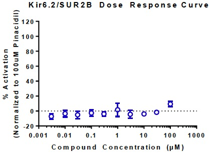

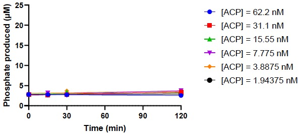

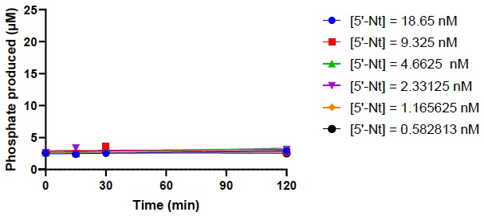

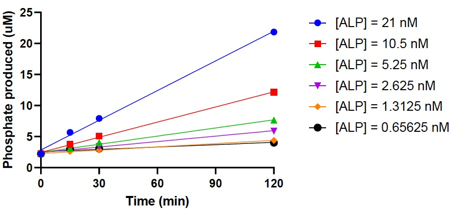

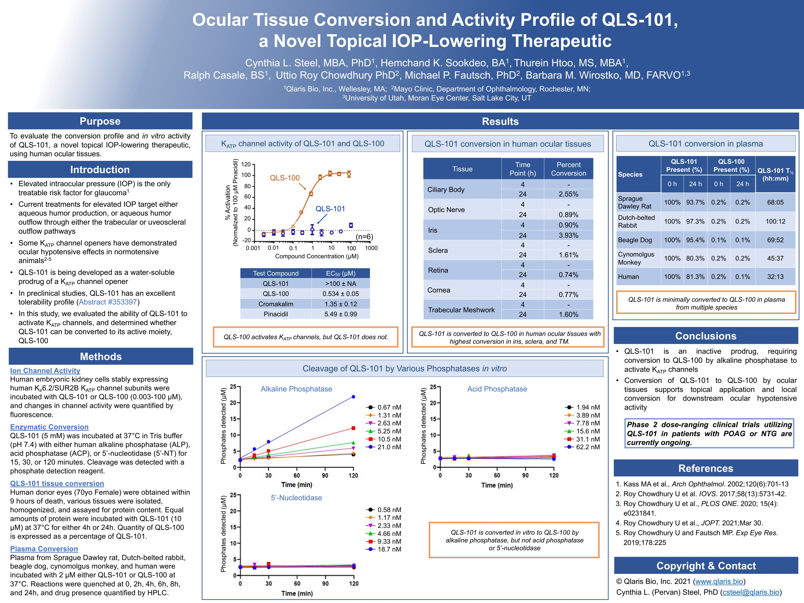

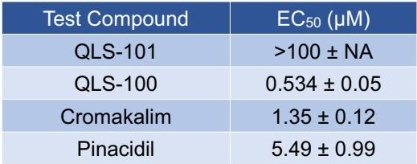

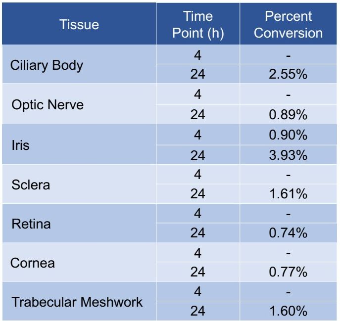

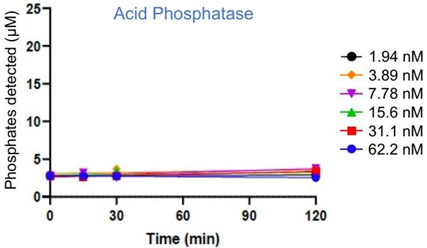

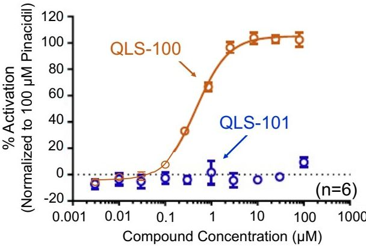

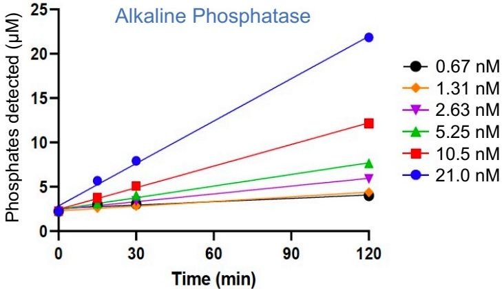

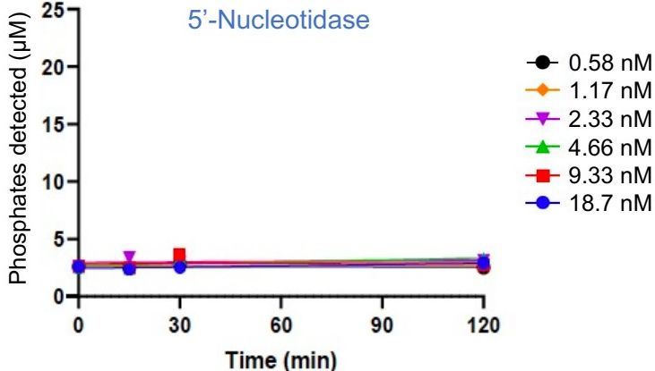

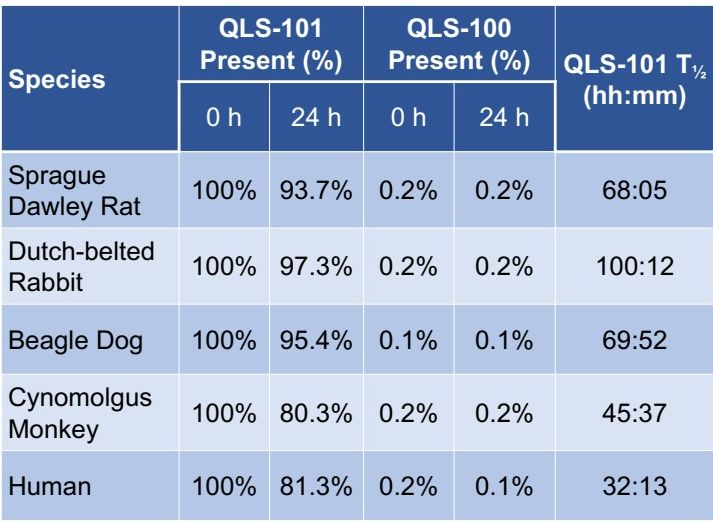
