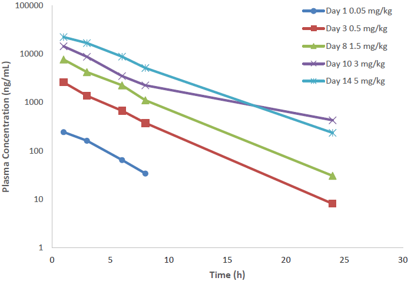
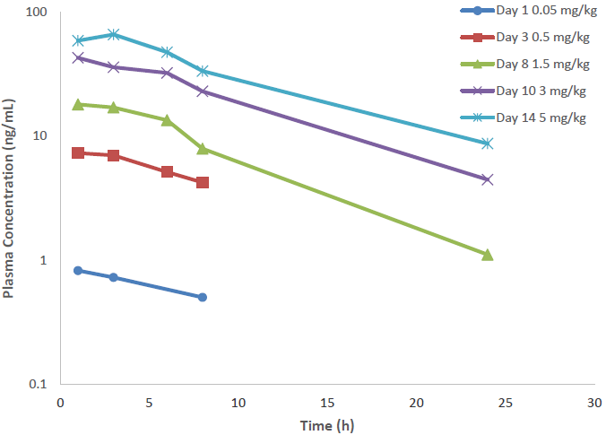
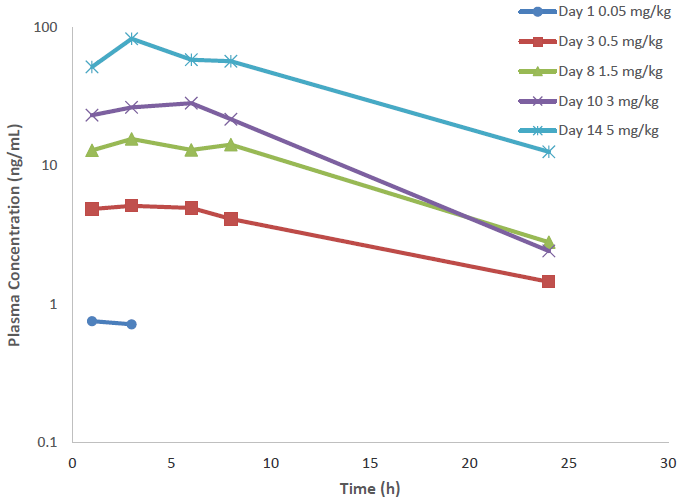
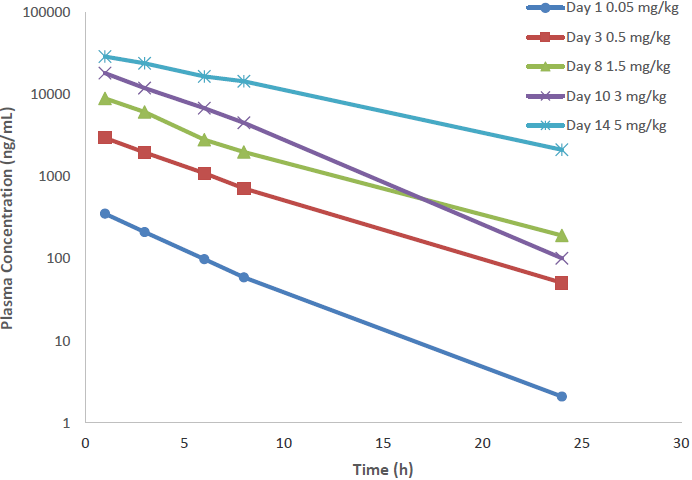

# Page 1

Tolerability assessment following topical ocular administration with 
QLS-101 
• QLS-101 or vehicle was added topically as a 40 μl drop to both eyes 
(OU) of beagle dogs (age 5-7 months, 3 males and 3 females per group), 
once daily for 28 days. 
• Vehicle: Isotonic Phosphate-Buffered Saline (pH 6.5)
• 2%: 0.8 mg/eye/dose
• 4%: 1.6 mg/eye/dose
• 8%: 3.2 mg/eye/dose
• Routine clinical assessments that included behavioral observations, food 
intake,  gross clinical observations, IOP, slit lamp, dilated fundus exams 
and ERGs were performed throughout the treatment period 
• At the end of treatment, animals were euthanized, necropsied and select 
tissues were isolated and prepared for histopathology.
Pharmacokinetic (PK) evaluation of systemically administered QLS-101 
• To evaluate systemic maximum tolerated dose (MTD), single escalating 
doses of QLS-101 (0.05-5.0 mg/kg/day) were administered by IV bolus to 
one male and one female beagle dog, with a 48h minimum observation 
period between doses.
• Plasma samples were collected at various timepoints in both studies,  
concentrations of QLS- 101 and its active moiety QLS-100 were 
determined by LC/MS-MS, and data was used to generate PK 
parameters.
© Qlaris Bio, Inc. 2021 (www.qlaris.bio)
Barbara M. Wirostko, MD, FARVO (bwirostko@qlaris.bio) 
Introduction
Methods
Conclusions
Results
• Current treatments for elevated IOP target the production of aqueous 
humor, or outflow facility through either the conventional (trabecular) or 
unconventional (uveoscleral) pathways.
• Episcleral venous pressure (EVP) constitutes the largest percentage 
(approximately 50-60%) of total IOP1 and sets the ”floor” for maximal 
medical intervention, No current treatments primarily targets EVP. In recent 
years, several ATP-sensitive potassium channel (KATP) openers have been 
shown to have ocular hypotensive properties.2-5
• QLS-101, a water-soluble prodrug of an ATP-sensitive potassium channel 
opener, is being developed by Qlaris Bio, Inc. as an ocular hypotensive 
agent.
• QLS-101 has been shown to have a novel mode of action that affects distal 
outflow resistance and episcleral venous pressure.6
• In this study, systemic and local side effects of QLS-101 was evaluated 
following topical instillation of various doses of the prodrug in both eyes of 
beagle dogs.
• QLS-101 dosed topically once daily was well-tolerated with an NOAEL of 
8.0%. 
• No mortality, change in body weight or food consumption were noted. 
• Histological examination showed no toxicity as a result of QLS-101. 
• Maximum tolerated dose was determined to be 3 mg/kg, which 
corresponded to sex-combined Cmax and AUC Tlast values of 16.4 μg/mL 
and 106.55 μg*h/mL for QLS-101, and 35.5 ng/mL and 431 ng*h/mL, for 
QLS-100.
References
1. Lee SS et al. J Glaucoma. 2019;28: 846-57
2. Roy Chowdhury U et al. PLOS ONE. 2015;10:e0141783
3. Roy Chowdhury U et al. J Med Chem 2016; 59:6221–6231
4. Roy Chowdhury U et al. Invest Ophthalmol Vis Sci. 2017;58:5731-42
5. Roy Chowdhury U et al. Exp Eye Res. 2017;158:85-93.
6. Millar JC et al. Invest Ophthalmol Vis Sci. 2011;52:685-694
Purpose
To summarize the potential systemic and ocular toxicity and pharmacokinetic 
(PK) profiles of QLS-101, a novel topical IOP-lowering therapeutic, when 
dosed topically in beagle dogs. 
Systemic Toxicity for Topical QLS-101
Ocular Toxicity for QLS-101 in Beagle Dogs 
Copyright/Contact
QLS-101 is well-tolerated systemically when dosed once daily up to 8% OU
No changes were observed with 2% QLS-101, the highest planned dose for 
clinical trials. Only at 8% QLS-101 did several clinical observations exceed 
those observed at baseline (WNL: within normal limits)
Pharmacokinetic parameters of topical QLS-101
Systemic and Ocular Toxicology and Pharmacokinetic Profiles of
QLS-101, a Novel Topical IOP- Lowering Therapeutic
Barbara M. Wirostko, MD1,3, Hemchand K. Sookdeo, BA1, Thurein Htoo, MS, MBA1, Ralph Casale, BS1,
Uttio Roy Chowdhury, PhD2, Michael P. Fautsch, PhD2, Cynthia L. Steel, MBA, PhD1
1Qlaris Bio, Inc., Wellesley, MA;  2Department of Ophthalmology, Mayo Clinic, Rochester, MN;  
3University of Utah, Moran Eye Center, Salt Lake City, UT
QLS-101 Dose
Observation
0%
2%
4%
8%
Slight redness (pre-dose)
3
0
0
0
Slight redness (dose-related)
9
3
5
10
Slight discharge
0
0
1
2
Pinpoint corneal superficial 
epitheliopathy
1
0
0
0
ERGs & Fundus Exams 
WNL
WNL
WNL
WNL
Assessments
Result
Mortality
None
Clinical Observations
None
Significant loss of body weight
None
Decreased food consumption
None
Hematology
None
Coagulation parameters
None
Clinical Chemistry
None
Macroscopic pathology
None
Organ weights
None
Pharmacokinetic 
Parameters
QLS-101 Dose
2.0%
4.0%
8.0%
Male
Female
Male
Female
Male
Female
QLS-101 (prodrug)
Cmax (ng/mL)
Day 1
36.5
55.5
73.7
129
166
156
Day 28
47.0
80.2
57.3
201
147
139
AUC0-last (ng•h/mL)
Day 1
231
496
520
1220
1520
1480
Day 28
272
545
381
1750
1260
1200
Tmax (h)
Day 1
1
2
1
2
2
2
Day 28
1
2
1
2
2
2
t½ (h)
Day 1
3.69
4.12
4.26
6.18
4.82
4.92
Day 28
3.44
3.68
3.32
4.95
5.08
5.15
QLS-100 (active moiety)
Cmax (ng/mL)
Day 1
25.3
25.1
24.4
23.2
76.0
72.2
Day 28
10.6
18.4
15.5
19.9
31.0
32.9
AUC0-last (ng•h/mL)
Day 1
99.8
92.7
133
125
361
294
Day 28
49.1
80.1
70.7
105
166
154
Tmax (h)
Day 1
2
2
4
2
2
2
Day 28
2
2
2
2
2
2
t½ (h)
Day 1
3.64
2.65
3.24
3.61
3.44
2.73
Day 28
2.35
2.51
3.12
2.06
3.38
4.90
Summary
QLS-101, when dosed topically OU QD for 28 days in beagle dogs, is a 
well-tolerated ocular hypotensive agent and may be considered for further 
trials in human subjects as a potential therapeutic for lowering IOP.
Based on these data, overall low severity levels and lack of 
noteworthy adverse effects, the no-observed-adverse-effect level 
(NOAEL) was determined to be 8%.
QLS-101 Single IV Pharmacokinetic Profile 
QLS-101 
QLS-100 
Male 
Female 
Day 1 0.05 mg/kg
Day 3 0.5 mg/kg
Day 8 1.5 mg/kg
Day 10 3 mg/kg
Day 14 5 mg/kg
LEGEND
100000
10000
1000
100
10
1
Plasma concentration (ng/ml)
0
5
10
15
20
25
Time (h)
100000
10000
1000
100
10
1
Plasma concentration (ng/ml)
0
5
10
15
20
25
Time (h)
100
10
1
0.1
Plasma concentration (ng/ml)
0
5
10
15
20
25
Time (h)
100
10
1
0.1
Plasma concentration (ng/ml)
0
5
10
15
20
25
Time (h)
IV dosing of 
QLS-101 results 
in dose-
dependent 
conversion to 
QLS-100 with no 
observable 
differences 
between sexes

