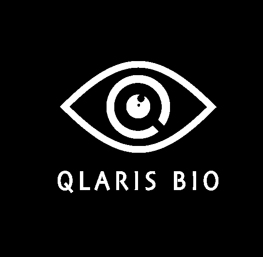
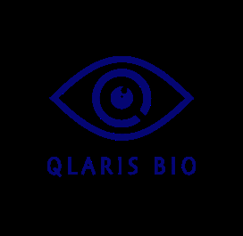
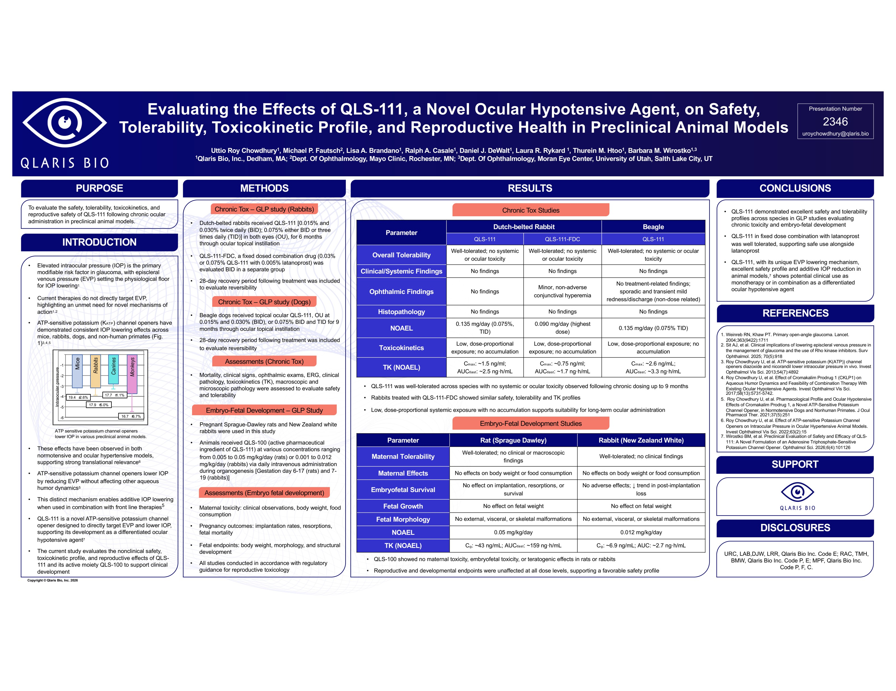
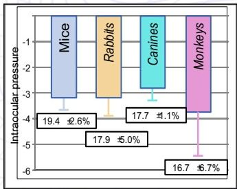
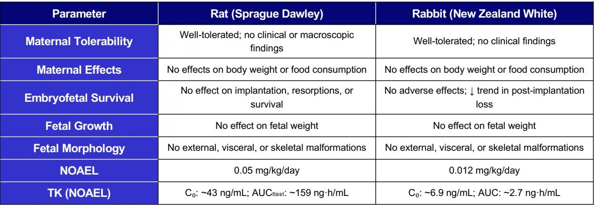
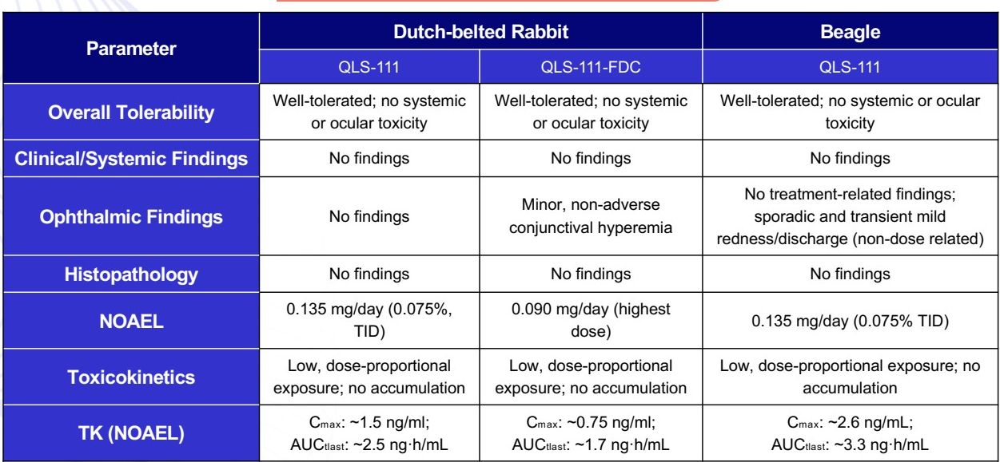

QLARIS BIO logo

# Evaluating the Effects of QLS-111, a Novel Ocular Hypotensive Agent, on Safety, Tolerability, Toxicokinetic Profile, and Reproductive Health in Preclinical Animal Models

Presentation Number
**2346**
uroychowdhury@qlaris.bio

Uttio Roy Chowdhury¹, Michael P. Fautsch², Lisa A. Brandano¹, Ralph A. Casale¹, Daniel J. DeWalt¹, Laura R. Rykard¹, Thurein M. Htoo¹, Barbara M. Wirostko¹,³
¹Qlaris Bio, Inc., Dedham, MA; ²Dept. Of Ophthalmology, Mayo Clinic, Rochester, MN; ³Dept. Of Ophthalmology, Moran Eye Center, University of Utah, Salt Lake City, UT

## PURPOSE

To evaluate the safety, tolerability, toxicokinetics, and reproductive safety of QLS-111 following chronic ocular administration in preclinical animal models.

## INTRODUCTION

* Elevated intraocular pressure (IOP) is the primary modifiable risk factor in glaucoma, with episcleral venous pressure (EVP) setting the physiological floor for IOP lowering¹

* Current therapies do not directly target EVP, highlighting an unmet need for novel mechanisms of action¹,²

* ATP-sensitive potassium (KATP) channel openers have demonstrated consistent IOP lowering effects across mice, rabbits, dogs, and non-human primates (Fig. 1)³,⁴,⁵

| Species | Intraocular pressure (% change) |
| ------- | ------------------------------- |
| Mice    | -19.4 ± 2.6%                    |
| Rabbits | -17.7 ± 1.1%                    |
| Canines | -17.9 ± 5.0%                    |
| Monkeys | -16.7 ± 6.7%                    |

ATP sensitive potassium channel openers lower IOP in various preclinical animal models.

* These effects have been observed in both normotensive and ocular hypertensive models, supporting strong translational relevance⁶

* ATP-sensitive potassium channel openers lower IOP by reducing EVP without affecting other aqueous humor dynamics⁵

* This distinct mechanism enables additive IOP lowering when used in combination with front line therapies⁵

* QLS-111 is a novel ATP-sensitive potassium channel opener designed to directly target EVP and lower IOP, supporting its development as a differentiated ocular hypotensive agent⁷

* The current study evaluates the nonclinical safety, toxicokinetic profile, and reproductive effects of QLS-111 and its active moiety QLS-100 to support clinical development

## METHODS

### Chronic Tox – GLP study (Rabbits)

* Dutch-belted rabbits received QLS-111 [0.015% and 0.030% twice daily (BID); 0.075% either BID or three times daily (TID)] in both eyes (OU), for 6 months through ocular topical instillation

* QLS-111-FDC, a fixed dosed combination drug (0.03% or 0.075% QLS-111 with 0.005% latanoprost) was evaluated BID in a separate group

* 28-day recovery period following treatment was included to evaluate reversibility

### Chronic Tox – GLP study (Dogs)

* Beagle dogs received topical ocular QLS-111, OU at 0.015% and 0.030% (BID), or 0.075% BID and TID for 9 months through ocular topical instillation

* 28-day recovery period following treatment was included to evaluate reversibility

### Assessments (Chronic Tox)

* Mortality, clinical signs, ophthalmic exams, ERG, clinical pathology, toxicokinetics (TK), macroscopic and microscopic pathology were assessed to evaluate safety and tolerability

### Embryo-Fetal Development – GLP Study

* Pregnant Sprague-Dawley rats and New Zealand white rabbits were used in this study

* Animals received QLS-100 (active pharmaceutical ingredient of QLS-111) at various concentrations ranging from 0.005 to 0.05 mg/kg/day (rats) or 0.001 to 0.012 mg/kg/day (rabbits) via daily intravenous administration during organogenesis [Gestation day 6-17 (rats) and 7-19 (rabbits)]

### Assessments (Embryo fetal development)

* Maternal toxicity: clinical observations, body weight, food consumption

* Pregnancy outcomes: implantation rates, resorptions, fetal mortality

* Fetal endpoints: body weight, morphology, and structural development

* All studies conducted in accordance with regulatory guidance for reproductive toxicology

## RESULTS

### Chronic Tox Studies

| Parameter                  | Dutch-belted Rabbit QLS-111                  | Dutch-belted Rabbit QLS-111-FDC              | Beagle QLS-111                                                                              |
| -------------------------- | ------------------------------------------------ | ------------------------------------------------ | ----------------------------------------------------------------------------------------------- |
| Overall Tolerability       | Well-tolerated; no systemic or ocular toxicity   | Well-tolerated; no systemic or ocular toxicity   | Well-tolerated; no systemic or ocular toxicity                                                  |
| Clinical/Systemic Findings | No findings                                      | No findings                                      | No findings                                                                                     |
| Ophthalmic Findings        | No findings                                      | Minor, non-adverse conjunctival hyperemia        | No treatment-related findings; sporadic and transient mild redness/discharge (non-dose related) |
| Histopathology             | No findings                                      | No findings                                      | No findings                                                                                     |
| NOAEL                      | 0.135 mg/day (0.075%, TID)                       | 0.090 mg/day (highest dose)                      | 0.135 mg/day (0.075% TID)                                                                       |
| Toxicokinetics             | Low, dose-proportional exposure; no accumulation | Low, dose-proportional exposure; no accumulation | Low, dose-proportional exposure; no accumulation                                                |
| TK (NOAEL)                 | Cₘₐₓ: \~1.5 ng/ml; AUCₜₗₐₛₜ: \~2.5 ng·h/mL       | Cₘₐₓ: \~0.75 ng/ml; AUCₜₗₐₛₜ: \~1.7 ng·h/mL      | Cₘₐₓ: \~2.6 ng/mL; AUCₜₗₐₛₜ: \~3.3 ng·h/mL                                                      |

* QLS-111 was well-tolerated across species with no systemic or ocular toxicity observed following chronic dosing up to 9 months

* Rabbits treated with QLS-111-FDC showed similar safety, tolerability and TK profiles

* Low, dose-proportional systemic exposure with no accumulation supports suitability for long-term ocular administration

### Embryo-Fetal Development Studies

| Parameter             | Rat (Sprague Dawley)                                | Rabbit (New Zealand White)                            |
| --------------------- | --------------------------------------------------- | ----------------------------------------------------- |
| Maternal Tolerability | Well-tolerated; no clinical or macroscopic findings | Well-tolerated; no clinical findings                  |
| Maternal Effects      | No effects on body weight or food consumption       | No effects on body weight or food consumption         |
| Embryofetal Survival  | No effect on implantation, resorptions, or survival | No adverse effects; ↓ trend in post-implantation loss |
| Fetal Growth          | No effect on fetal weight                           | No effect on fetal weight                             |
| Fetal Morphology      | No external, visceral, or skeletal malformations    | No external, visceral, or skeletal malformations      |
| NOAEL                 | 0.05 mg/kg/day                                      | 0.012 mg/kg/day                                       |
| TK (NOAEL)            | C₀: \~43 ng/mL; AUCₜₗₐₛₜ: \~159 ng·h/mL             | C₀: \~6.9 ng/mL; AUC: \~2.7 ng·h/mL                   |

* QLS-100 showed no maternal toxicity, embryofetal toxicity, or teratogenic effects in rats or rabbits

* Reproductive and developmental endpoints were unaffected at all dose levels, supporting a favorable safety profile

## CONCLUSIONS

* QLS-111 demonstrated excellent safety and tolerability profiles across species in GLP studies evaluating chronic toxicity and embryo-fetal development

* QLS-111 in fixed dose combination with latanoprost was well tolerated, supporting safe use alongside latanoprost

* QLS-111, with its unique EVP lowering mechanism, excellent safety profile and additive IOP reduction in animal models,⁷ shows potential clinical use as monotherapy or in combination as a differentiated ocular hypotensive agent

## REFERENCES

1. Weinreb RN, Khaw PT. Primary open-angle glaucoma. Lancet. 2004;363(9422):1711

2. Sit AJ, et al. Clinical implications of lowering episcleral venous pressure in the management of glaucoma and the use of Rho kinase inhibitors. Surv Ophthalmol. 2025; 70(5):918

3. Roy Chowdhury U, et al. ATP-sensitive potassium (K(ATP)) channel openers diazoxide and nicorandil lower intraocular pressure in vivo. Invest Ophthalmol Vis Sci. 2013;54(7):4892

4. Roy Chowdhury U, et al. Effect of Cromakalim Prodrug 1 (CKLP1) on Aqueous Humor Dynamics and Feasibility of Combination Therapy With Existing Ocular Hypotensive Agents. Invest Ophthalmol Vis Sci. 2017;58(13):5731-5742.

5. Roy Chowdhury U, et al. Pharmacological Profile and Ocular Hypotensive Effects of Cromakalim Prodrug 1, a Novel ATP-Sensitive Potassium Channel Opener, in Normotensive Dogs and Nonhuman Primates. J Ocul Pharmacol Ther. 2021;37(5):251

6. Roy Chowdhury U, et al. Effect of ATP-sensitive Potassium Channel Openers on Intraocular Pressure in Ocular Hypertensive Animal Models. Invest Ophthalmol Vis Sci. 2022;63(2):15

7. Wirostko BM, et al. Preclinical Evaluation of Safety and Efficacy of QLS-111: A Novel Formulation of an Adenosine Triphosphate-Sensitive Potassium Channel Opener. Ophthalmol Sci. 2026;6(4):101126

## SUPPORT
QLARIS BIO logo

## DISCLOSURES

URC, LAB, DJW, LRR, Qlaris Bio Inc. Code E; RAC, TMH, BMW, Qlaris Bio Inc. Code P, E; MPF, Qlaris Bio Inc. Code P, F, C.

Copyright © Qlaris Bio, Inc. 2026

ADIS RI

