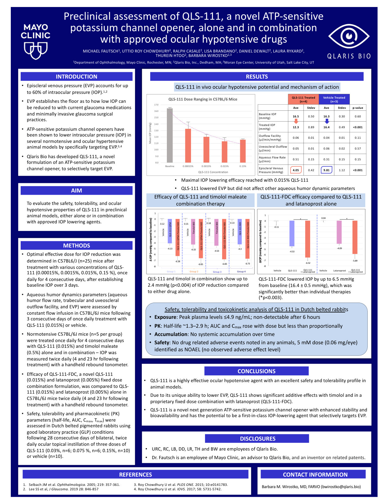

# Page 1

•
Screenshot 2025-05-14 at 4.48.08PM
ALEJANDRA URIBE VALLARTA
RESULTS
INTRODUCTION 
AIM
METHODS
CONCLUSIONS
REFERENCES 
DISCLOSURES
CONTACT INFORMATION
Preclinical assessment of QLS-111, a novel ATP-sensitive 
potassium channel opener, alone and in combination 
with approved ocular hypotensive drugs
• Episcleral venous pressure (EVP) accounts for up 
to 60% of intraocular pressure (IOP).1,2
• EVP establishes the floor as to how low IOP can 
be reduced to with current glaucoma medications 
and minimally invasive glaucoma surgical 
practices. 
• ATP-sensitive potassium channel openers have 
been shown to lower intraocular pressure (IOP) in 
several normotensive and ocular hypertensive 
animal models by specifically targeting EVP.3,4
• Qlaris Bio has developed QLS-111, a novel 
formulation of an ATP-sensitive potassium 
channel opener, to selectively target EVP.
To evaluate the safety, tolerability, and ocular 
hypotensive properties of QLS-111 in preclinical 
animal models, either alone or in combination 
with approved IOP lowering agents. 
1. Selbach JM et al. Ophthalmologica. 2005; 219: 357-361. 
 
3. Roy Chowdhury U et al. PLOS ONE. 2015; 10:e0141783. 
2. Lee SS et al, J Glaucoma. 2019 28: 846-857  
 
 
 
 
4. Roy Chowdhury U et al. IOVS. 2017; 58: 5731-5742.
•
QLS-111 is a highly effective ocular hypotensive agent with an excellent safety and tolerability profile in 
animal models.
•
Due to its unique ability to lower EVP, QLS-111 shows significant additive effects with timolol and in a 
proprietary fixed dose combination with latanoprost (QLS-111-FDC).
•
QLS-111 is a novel next generation ATP-sensitive potassium channel opener with enhanced stability and 
bioavailability and has the potential to be a first-in-class IOP-lowering agent that selectively targets EVP.
•
URC, RC, LB, DD, LR, TH and BW are employees of Qlaris Bio.
•
Dr. Fautsch is an employee of Mayo Clinic, an advisor to Qlaris Bio, and an inventor on related patents.
Barbara M. Wirostko, MD, FARVO (bwirostko@qlaris.bio)
MICHAEL FAUTSCH1, UTTIO ROY CHOWDHURY2, RALPH CASALE2, LISA BRANDANO2, DANIEL DEWALT2, LAURA RYKARD2, 
THUREIN HTOO2, BARBARA WIROSTKO2,3
• Optimal effective dose for IOP reduction was 
determined in C57BL6/J (n=25) mice after 
treatment with various concentrations of QLS-
111 (0.00015%, 0.0015%, 0.015%, 0.15 %), once 
daily for 4 consecutive days, after establishing 
baseline IOP over 3 days.
• Aqueous humor dynamics parameters (aqueous 
humor flow rate, trabecular and uveoscleral 
outflow facility, and EVP) were assessed by 
constant flow infusion in C57BL/6J mice following 
3 consecutive days of once daily treatment with 
QLS-111 (0.015%) or vehicle. 
• Normotensive C57BL/6J mice (n=5 per group) 
were treated once daily for 4 consecutive days 
with QLS-111 (0.015%) and timolol maleate 
(0.5%) alone and in combination – IOP was 
measured twice daily (4 and 23 hr following 
treatment) with a handheld rebound tonometer.
• Efficacy of QLS-111-FDC, a novel QLS-111 
(0.015%) and latanoprost (0.005%) fixed dose 
combination formulation, was compared to QLS-
111 (0.015%) and latanoprost (0.005%) alone in 
C57BL/6J mice twice daily (4 and 23 hr following 
treatment) with a handheld rebound tonometer.
• Safety, tolerability and pharmacokinetic (PK) 
parameters (half-life, AUC, Cmax, Tmax) were 
assessed in Dutch belted pigmented rabbits using 
good laboratory practice (GLP) conditions 
following 28 consecutive days of bilateral, twice 
daily ocular topical instillation of three doses of 
QLS-111 (0.03%, n=6; 0.075 %, n=6; 0.15%, n=10) 
or vehicle (n=10).
8.0
9.0
10.0
11.0
12.0
13.0
14.0
15.0
16.0
17.0
Baseline
0.00015%
0.0015%
0.015%
0.15%
Mean IOP (mmHg)
QLS-111 Concentration
QLS-111 Dose Ranging in C57BL/6 Mice
QLS-111 Treated 
(n=4)
Vehicle Treated 
(n=3)
Ave
Stdev
Ave
Stdev
p-value
Baseline IOP 
(mmHg)
16.5
0.50
16.3
0.30
0.60
Treated IOP 
(mmHg)
12.3
0.89
16.4
0.49
<0.001
Outflow Facility 
(µl/min/mmHg)
0.06
0.01
0.04
0.01
0.11
Uveoscleral Outflow 
(µl/min)
0.05
0.01
0.06
0.02
0.57
Aqueous Flow Rate 
(µl/min)
0.51
0.15
0.31
0.15
0.15
Episcleral Venous 
Pressure (mmHg)
4.05
0.42
9.81
1.12
<0.001
•
Maximal IOP lowering efficacy reached with 0.015% QLS-111
•
QLS-111 lowered EVP but did not affect other aqueous humor dynamic parameters
1Department of Ophthalmology, Mayo Clinic, Rochester, MN; 2Qlaris Bio, Inc., Dedham, MA; 3Moran Eye Center, University of Utah, Salt Lake City, UT   
Safety, tolerability and toxicokinetic analysis of QLS-111 in Dutch belted rabbits
• Exposure: Peak plasma levels ≤4.9 ng/mL; non-detectable after 6 hours
• PK: Half-life ~1.3–2.9 h; AUC and Cmax rose with dose but less than proportionally
• Accumulation: No systemic accumulation over time 
• Safety: No drug related adverse events noted in any animals, 5 mM dose (0.06 mg/eye) 
identified as NOAEL (no observed adverse effect level)
QLS-111 in vivo ocular hypotensive potential and mechanism of action 
0.12
-4.13
-6.28
0.15
-4.33
-6.65
0.18
-4.53
-6.83
-0.13
-4.3
-6.73
-8
-7
-6
-5
-4
-3
-2
-1
0
1
∆ IOP (mmHg compared to baseline)
Vehicle
QLS-111 QPM
QLS-111 QPM+Timolol BID
Vehicle
Vehicle
Timolol BID
QLS-111 QPM+Timolol BID
QLS-111 BID+Timolol BID
Timolol BID
QLS-111 BID
QLS-111 BID+Timolol BID
Group 1
Group 2
Group 3
Group 4
Vehicle
QLS-111 and timolol in combination show up to 
2.4 mmHg (p<0.004) of IOP reduction compared 
to either drug alone.
Efficacy of QLS-111 and timolol maleate 
combination therapy  
-0.11
-4.53
-6.52
0.04
-4.09
-5.89
-8
-7
-6
-5
-4
-3
-2
-1
0
1
∆IOP (mmHg compared to baseline)
QLS-111
QLS-111
+ Latanoprost
QLS-111
+ Latanoprost
Latanoprost
Vehicle
*
*
Vehicle
QLS-111-FDC efficacy compared to QLS-111 
and latanoprost alone
QLS-111-FDC lowered IOP by up to 6.5 mmHg 
from baseline (16.4 ± 0.5 mmHg), which was 
significantly better than individual therapies 
(*p<0.003).

