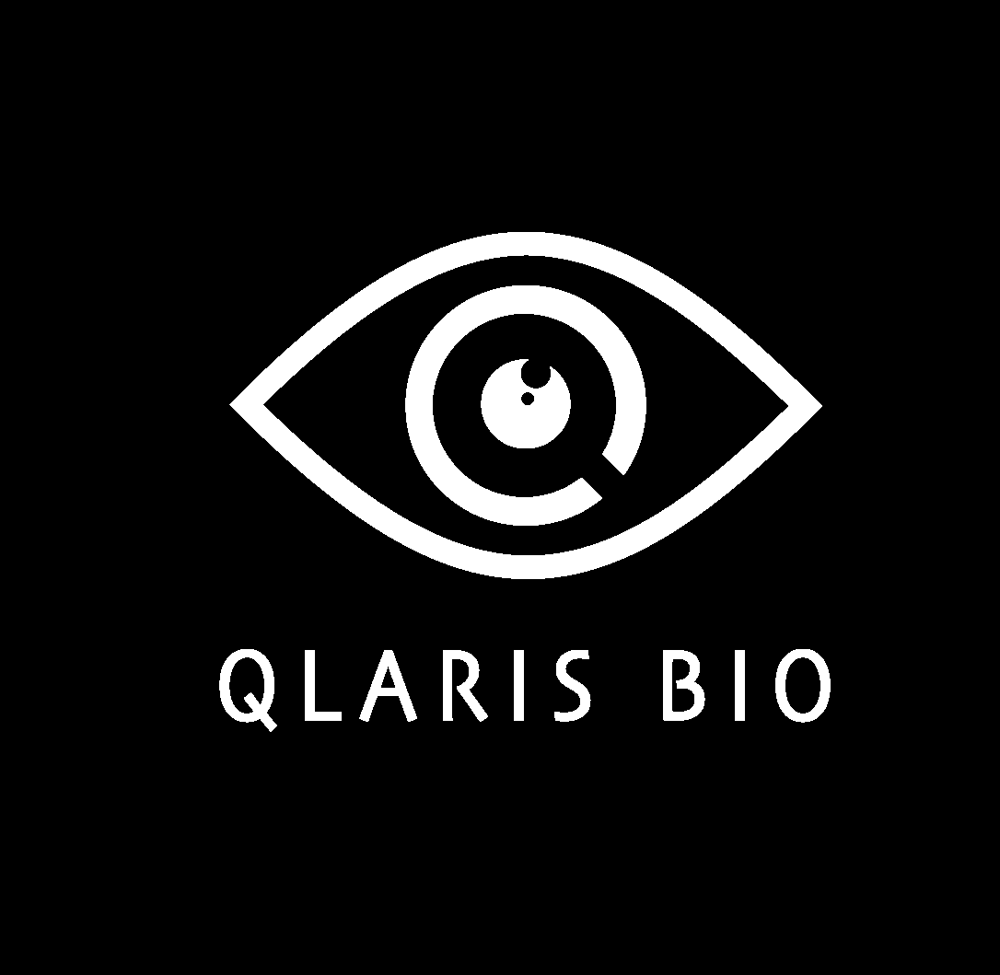
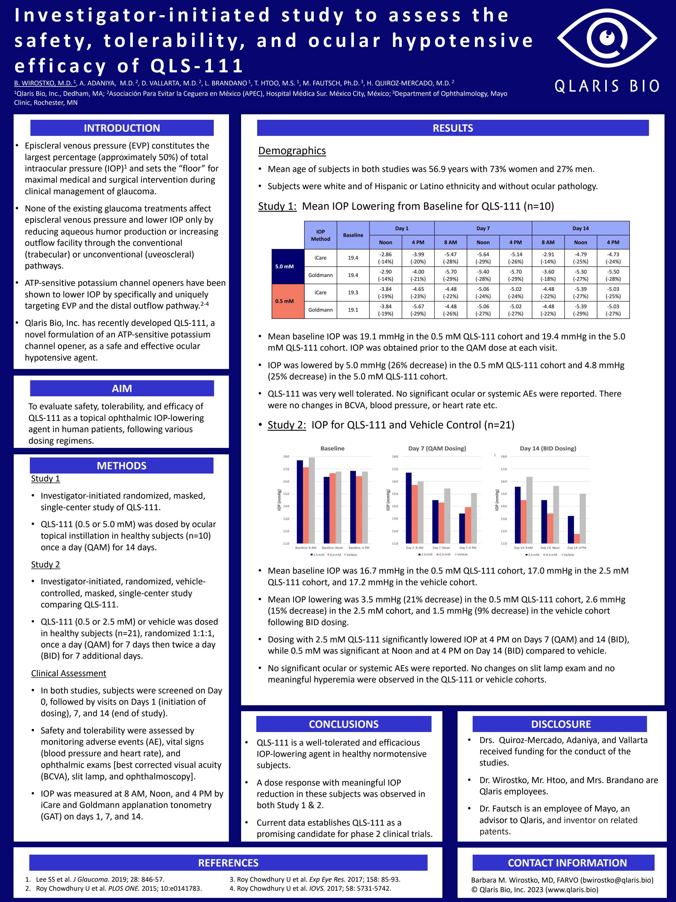
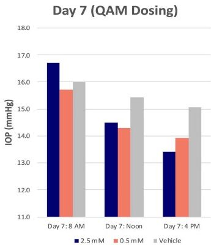
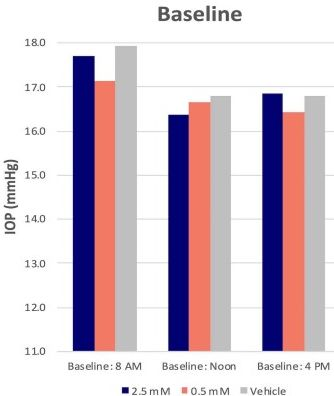
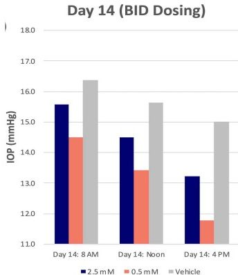
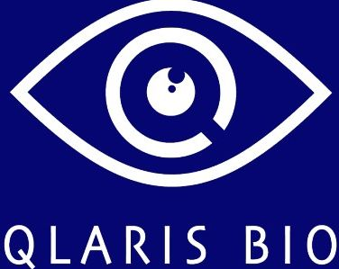
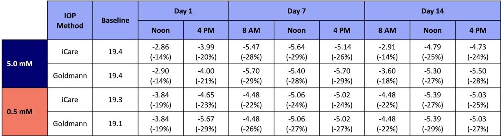

# Investigator-initiated study to assess the safety, tolerability, and ocular hypotensive efficacy of QLS-111

<u>B. WIROSTKO, M.D.1</u>, A. ADANIYA, M.D.2, D. VALLARTA, M.D.2, L. BRANDANO1, T. HTOO, M.S.1, M. FAUTSCH, Ph.D.3, H. QUIROZ-MERCADO, M.D.2
1Qlaris Bio, Inc., Dedham, MA; 2Asociación Para Evitar la Ceguera en México (APEC), Hospital Médica Sur. México City, México; 3Department of Ophthalmology, Mayo Clinic, Rochester, MN
QLARIS BIO logo

## INTRODUCTION

* Episcleral venous pressure (EVP) constitutes the largest percentage (approximately 50%) of total intraocular pressure (IOP)¹ and sets the “floor” for maximal medical and surgical intervention during clinical management of glaucoma.

* None of the existing glaucoma treatments affect episcleral venous pressure and lower IOP only by reducing aqueous humor production or increasing outflow facility through the conventional (trabecular) or unconventional (uveoscleral) pathways.

* ATP-sensitive potassium channel openers have been shown to lower IOP by specifically and uniquely targeting EVP and the distal outflow pathway.²⁻⁴

* Qlaris Bio, Inc. has recently developed QLS-111, a novel formulation of an ATP-sensitive potassium channel opener, as a safe and effective ocular hypotensive agent.

## AIM

To evaluate safety, tolerability, and efficacy of QLS-111 as a topical ophthalmic IOP-lowering agent in human patients, following various dosing regimens.

## METHODS

### Study 1

* Investigator-initiated randomized, masked, single-center study of QLS-111.

* QLS-111 (0.5 or 5.0 mM) was dosed by ocular topical instillation in healthy subjects (n=10) once a day (QAM) for 14 days.

### Study 2

* Investigator-initiated, randomized, vehicle-controlled, masked, single-center study comparing QLS-111.

* QLS-111 (0.5 or 2.5 mM) or vehicle was dosed in healthy subjects (n=21), randomized 1:1:1, once a day (QAM) for 7 days then twice a day (BID) for 7 additional days.

### Clinical Assessment

* In both studies, subjects were screened on Day 0, followed by visits on Days 1 (initiation of dosing), 7, and 14 (end of study).

* Safety and tolerability were assessed by monitoring adverse events (AE), vital signs (blood pressure and heart rate), and ophthalmic exams [best corrected visual acuity (BCVA), slit lamp, and ophthalmoscopy].

* IOP was measured at 8 AM, Noon, and 4 PM by iCare and Goldmann applanation tonometry (GAT) on days 1, 7, and 14.

## RESULTS

### Demographics

* Mean age of subjects in both studies was 56.9 years with 73% women and 27% men.

* Subjects were white and of Hispanic or Latino ethnicity and without ocular pathology.

### Study 1: Mean IOP Lowering from Baseline for QLS-111 (n=10)

| IOP Method |          | Baseline Noon | Day 1 4 PM   | Day 1 8 AM   | Day 7 Noon   | Day 7 4 PM   | Day 7 8 AM   | Day 14 Noon  | Day 14 4 PM  | Day 14 4 PM  |
| ---------- | -------- | ----------------- | ---------------- | ---------------- | ---------------- | ---------------- | ---------------- | ---------------- | ---------------- | ---------------- |
| 5.0 mM     | iCare    | 19.4              | -2.86 (-14%) | -3.99 (-20%) | -5.47 (-28%) | -5.64 (-29%) | -5.14 (-26%) | -2.91 (-14%) | -4.79 (-25%) | -4.73 (-24%) |
|            | Goldmann | 19.4              | -2.90 (-14%) | -4.00 (-21%) | -5.70 (-29%) | -5.40 (-28%) | -5.70 (-29%) | -3.60 (-18%) | -5.30 (-27%) | -5.50 (-28%) |
| 0.5 mM     | iCare    | 19.3              | -3.84 (-19%) | -4.65 (-23%) | -4.48 (-22%) | -5.06 (-24%) | -5.02 (-24%) | -4.48 (-22%) | -5.39 (-27%) | -5.03 (-25%) |
|            | Goldmann | 19.1              | -3.84 (-19%) | -5.67 (-29%) | -4.48 (-26%) | -5.06 (-27%) | -5.02 (-27%) | -4.48 (-22%) | -5.39 (-29%) | -5.03 (-27%) |

* Mean baseline IOP was 19.1 mmHg in the 0.5 mM QLS-111 cohort and 19.4 mmHg in the 5.0 mM QLS-111 cohort. IOP was obtained prior to the QAM dose at each visit.

* IOP was lowered by 5.0 mmHg (26% decrease) in the 0.5 mM QLS-111 cohort and 4.8 mmHg (25% decrease) in the 5.0 mM QLS-111 cohort.

* QLS-111 was very well tolerated. No significant ocular or systemic AEs were reported. There were no changes in BCVA, blood pressure, or heart rate etc.

### Study 2: IOP for QLS-111 and Vehicle Control (n=21)

Baseline

| Category       | 2.5 mM | 0.5 mM | Vehicle |
| -------------- | ------ | ------ | ------- |
| Baseline: 8 AM | 17.2   | 16.7   | 17.2    |
| Baseline: Noon | 16.8   | 16.6   | 17.1    |
| Baseline: 4 PM | 17.0   | 16.8   | 17.3    |

Day 7 (QAM Dosing)

| Category    | 2.5 mM | 0.5 mM | Vehicle |
| ----------- | ------ | ------ | ------- |
| Day 7: 8 AM | 16.0   | 15.8   | 16.5    |
| Day 7: Noon | 15.5   | 15.2   | 16.8    |
| Day 7: 4 PM | 14.8   | 15.4   | 16.4    |

Day 14 (BID Dosing)

| Category     | 2.5 mM | 0.5 mM | Vehicle |
| ------------ | ------ | ------ | ------- |
| Day 14: 8 AM | 15.5   | 14.5   | 16.5    |
| Day 14: Noon | 14.5   | 13.5   | 16.6    |
| Day 14: 4 PM | 13.2   | 13.2   | 15.7    |

* Mean baseline IOP was 16.7 mmHg in the 0.5 mM QLS-111 cohort, 17.0 mmHg in the 2.5 mM QLS-111 cohort, and 17.2 mmHg in the vehicle cohort.

* Mean IOP lowering was 3.5 mmHg (21% decrease) in the 0.5 mM QLS-111 cohort, 2.6 mmHg (15% decrease) in the 2.5 mM cohort, and 1.5 mmHg (9% decrease) in the vehicle cohort following BID dosing.

* Dosing with 2.5 mM QLS-111 significantly lowered IOP at 4 PM on Days 7 (QAM) and 14 (BID), while 0.5 mM was significant at Noon and at 4 PM on Day 14 (BID) compared to vehicle.

* No significant ocular or systemic AEs were reported. No changes on slit lamp exam and no meaningful hyperemia were observed in the QLS-111 or vehicle cohorts.

## CONCLUSIONS

* QLS-111 is a well-tolerated and efficacious IOP-lowering agent in healthy normotensive subjects.

* A dose response with meaningful IOP reduction in these subjects was observed in both Study 1 & 2.

* Current data establishes QLS-111 as a promising candidate for phase 2 clinical trials.

## DISCLOSURE

* Drs. Quiroz-Mercado, Adaniya, and Vallarta received funding for the conduct of the studies.

* Dr. Wirostko, Mr. Htoo, and Mrs. Brandano are Qlaris employees.

* Dr. Fautsch is an employee of Mayo, an advisor to Qlaris, and inventor on related patents.

## REFERENCES

1. Lee SS et al. J Glaucoma. 2019; 28: 846-57.

2. Roy Chowdhury U et al. PLOS ONE. 2015; 10:e0141783.

3. Roy Chowdhury U et al. Exp Eye Res. 2017; 158: 85-93.

4. Roy Chowdhury U et al. IOVS. 2017; 58: 5731-5742.

## CONTACT INFORMATION

Barbara M. Wirostko, MD, FARVO (bwirostko@qlaris.bio)
© Qlaris Bio, Inc. 2023 (www.qlaris.bio)

