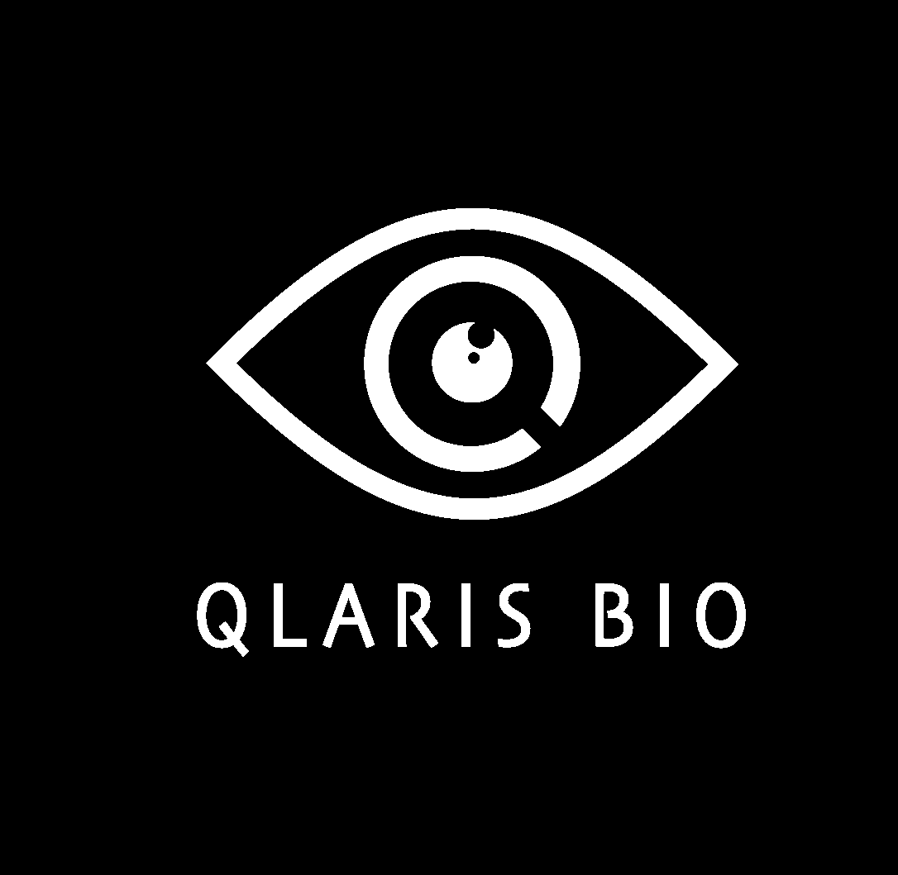
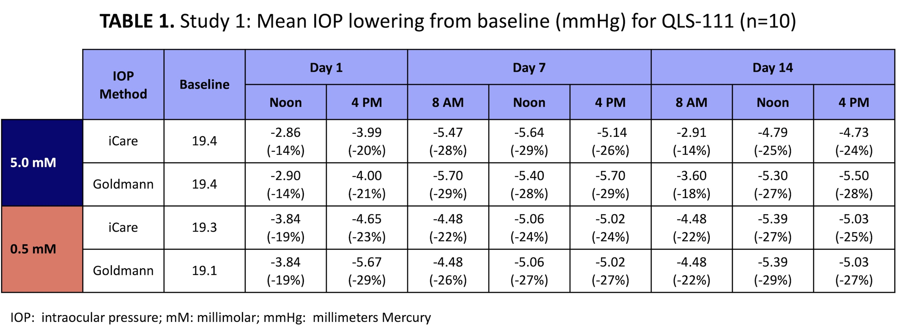
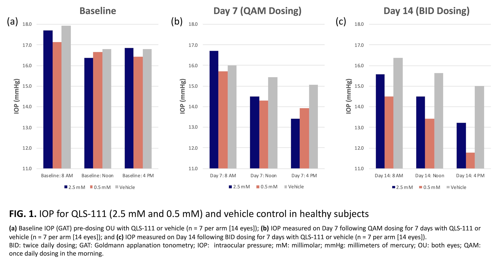

# Page 1

•
Mean age of subjects in both studies was 56.9 years with 73% women and 27% men. Subjects were white and of Hispanic or Latino ethnicity and without ocular pathology.
ALEJANDRA URIBE VALLARTA
RESULTS
INTRODUCTION
AIM
METHODS
CONCLUSIONS
REFERENCES 
DISCLOSURE
CONTACT INFORMATION
I nv e st i ga t o r- i n i t i a te d  st u d y  t o  a s s e s s  t h e  
s a fe t y,  t o l e ra b i l i t y,  a n d  o c u l a r  hy p o te n s i v e  
e f f i c a c y  o f  Q L S - 1 1 1  
• Episcleral venous pressure (EVP) constitutes the 
largest percentage (approximately 50%) of total 
intraocular pressure (IOP)1 and sets the “floor” for 
maximal medical and surgical intervention during 
clinical management of glaucoma. 
• None of the existing glaucoma treatments affect 
episcleral venous pressure and lower IOP only by 
reducing aqueous humor production or increasing 
outflow facility through the conventional 
(trabecular) or unconventional (uveoscleral) 
pathways. 
• ATP-sensitive potassium channel openers have been 
shown to lower IOP by specifically and uniquely 
targeting EVP and the distal outflow pathway.2-4
• Qlaris Bio, Inc. has recently developed QLS-111, a 
novel formulation of an ATP-sensitive potassium 
channel opener, as a safe and effective ocular 
hypotensive agent.
To evaluate safety, tolerability, and efficacy of 
QLS-111 as a topical ophthalmic IOP-lowering 
agent in human patients, following various 
dosing regimens. 
1. Lee SS et al. J Glaucoma. 2019; 28: 846-57.
3. Roy Chowdhury U et al. Exp Eye Res. 2017; 158: 85-93.
2. Roy Chowdhury U et al. PLOS ONE. 2015; 10:e0141783.
4. Roy Chowdhury U et al. IOVS. 2017; 58: 5731-5742.
•
QLS-111 is a well-tolerated and efficacious 
IOP-lowering agent in healthy normotensive 
subjects.
•
A dose response with meaningful IOP 
reduction in these subjects was observed in 
both Study 1 & 2. 
•
Current data establishes QLS-111 as a 
promising candidate for phase 2 clinical trials.
•
Drs.  Quiroz-Mercado, Adaniya, and Vallarta 
received funding for the conduct of the 
studies. 
•
Dr. Wirostko, Mr. Htoo, and Mrs. Brandano are 
Qlaris employees.
•
Dr. Fautsch is an employee of Mayo, an 
advisor to Qlaris, and inventor on related 
patents.
Barbara M. Wirostko, MD, FARVO (bwirostko@qlaris.bio)
© Qlaris Bio, Inc. 2023 (www.qlaris.bio)
B. WIROSTKO, M.D. 1, A. ADANIYA,  M.D. 2, D. VALLARTA, M.D. 2, L. BRANDANO 1, T. HTOO, M.S. 1, M. FAUTSCH, Ph.D. 3, H. QUIROZ-MERCADO, M.D. 2
1Qlaris Bio, Inc., Dedham, MA; 2Asociación Para Evitar la Ceguera en México (APEC), Hospital Médica Sur. México City, México; 3Department of Ophthalmology, Mayo 
Clinic, Rochester, MN
Study 1
• Investigator-initiated randomized, masked, 
single-center study of QLS-111. 
• QLS-111 (0.5 or 5.0 mM) was dosed by ocular 
topical instillation in healthy subjects (n=10) 
once a day (QAM) for 14 days.
Study 2
• Investigator-initiated, randomized, vehicle-
controlled, masked, single-center study 
comparing QLS-111. 
• QLS-111 (0.5 or 2.5 mM) or vehicle was dosed 
in healthy subjects (n=21), randomized 1:1:1, 
once a day (QAM) for 7 days then twice a day 
(BID) for 7 additional days.
Clinical Assessment
• In both studies, subjects were screened on Day 
0, followed by visits on Days 1 (initiation of 
dosing), 7, and 14 (end of study). 
• Safety and tolerability were assessed by 
monitoring adverse events (AE), vital signs 
(blood pressure and heart rate), and 
ophthalmic exams [best corrected visual acuity 
(BCVA), slit lamp, and ophthalmoscopy]. 
• IOP was measured at 8 AM, Noon, and 4 PM by 
iCare and Goldmann applanation tonometry 
(GAT) on days 1, 7, and 14.
• Mean baseline IOP was 19.1 mmHg in the 0.5 mM QLS-111 cohort and 19.4 mmHg in the 5.0 
mM QLS-111 cohort. IOP was obtained prior to the QAM dose at each visit.
• IOP was lowered by 5.0 mmHg (26% decrease) in the 0.5 mM QLS-111 cohort and 4.8 mmHg 
(25% decrease) in the 5.0 mM QLS-111 cohort. 
• QLS-111 was very well tolerated. No significant ocular or systemic AEs were reported. There 
were no changes in BCVA, blood pressure, or heart rate etc.
• Study 2: IOP for QLS-111 and Vehicle Control (n=21)
Demographics
• Mean age of subjects in both studies was 56.9 years with 73% women and 27% men. 
• Subjects were white and of Hispanic or Latino ethnicity and without ocular pathology.
Study 1: Mean IOP Lowering from Baseline for QLS-111 (n=10)
• Mean baseline IOP was 16.7 mmHg in the 0.5 mM QLS-111 cohort, 17.0 mmHg in the 2.5 mM 
QLS-111 cohort, and 17.2 mmHg in the vehicle cohort. 
• Mean IOP lowering was 3.5 mmHg (21% decrease) in the 0.5 mM QLS-111 cohort, 2.6 mmHg 
(15% decrease) in the 2.5 mM cohort, and 1.5 mmHg (9% decrease) in the vehicle cohort 
following BID dosing.
• Dosing with 2.5 mM QLS-111 significantly lowered IOP at 4 PM on Days 7 (QAM) and 14 (BID), 
while 0.5 mM was significant at Noon and at 4 PM on Day 14 (BID) compared to vehicle.
• No significant ocular or systemic AEs were reported. No changes on slit lamp exam and no 
meaningful hyperemia were observed in the QLS-111 or vehicle cohorts.

