FDA U.S. FOOD & DRUG ADMINISTRATION logo

March 1, 2021

Sight Sciences, Inc.
Edward Sinclair
Vice President, Regulatory Affairs
4040 Campbell Ave, Suite 100
Menlo Park, California 94025

Re: K202678
Trade/Device Name: OMNI® Surgical System
Regulation Number: 21 CFR 880.5725
Regulation Name: Infusion Pump
Regulatory Class: Class II
Product Code: MRH, HMZ
Dated: January 18, 2021
Received: January 21, 2021

Dear Edward Sinclair:

We have reviewed your Section 510(k) premarket notification of intent to market the device referenced above and have determined the device is substantially equivalent (for the indications for use stated in the enclosure) to legally marketed predicate devices marketed in interstate commerce prior to May 28, 1976, the enactment date of the Medical Device Amendments, or to devices that have been reclassified in accordance with the provisions of the Federal Food, Drug, and Cosmetic Act (Act) that do not require approval of a premarket approval application (PMA). You may, therefore, market the device, subject to the general controls provisions of the Act. Although this letter refers to your product as a device, please be aware that some cleared products may instead be combination products. The 510(k) Premarket Notification Database located at <u>https://www.accessdata.fda.gov/scripts/cdrh/cfdocs/cfpmn/pmn.cfm</u> identifies combination product submissions. The general controls provisions of the Act include requirements for annual registration, listing of devices, good manufacturing practice, labeling, and prohibitions against misbranding and adulteration. Please note: CDRH does not evaluate information related to contract liability warranties. We remind you, however, that device labeling must be truthful and not misleading.

If your device is classified (see above) into either class II (Special Controls) or class III (PMA), it may be subject to additional controls. Existing major regulations affecting your device can be found in the Code of Federal Regulations, Title 21, Parts 800 to 898. In addition, FDA may publish further announcements concerning your device in the <u>Federal Register</u>.

Please be advised that FDA's issuance of a substantial equivalence determination does not mean that FDA has made a determination that your device complies with other requirements of the Act or any Federal statutes and regulations administered by other Federal agencies. You must comply with all the Act's requirements, including, but not limited to: registration and listing (21 CFR Part 807); labeling (21 CFR Part

U.S. Food & Drug Administration
10903 New Hampshire Avenue
Silver Spring, MD 20993
<u>www.fda.gov</u>

D o c I D # 0 4 0 1 7 . 0 4 . 2 3

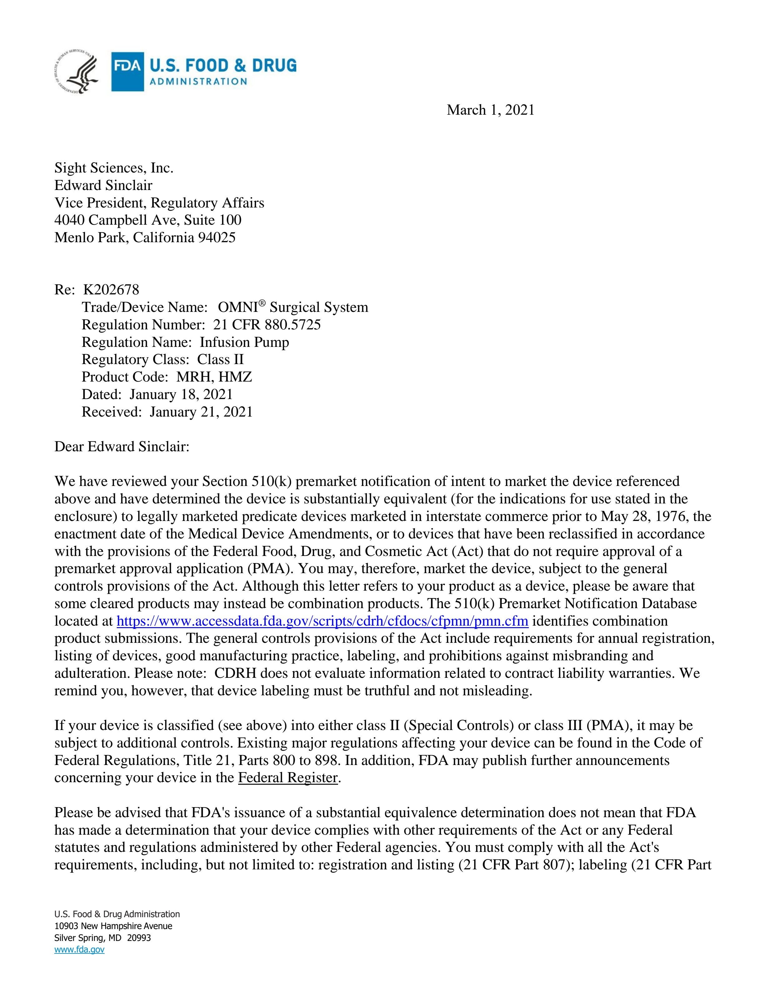

K202678 - Edward Sinclair Page 2

801); medical device reporting (reporting of medical device-related adverse events) (21 CFR 803) for devices or postmarketing safety reporting (21 CFR 4, Subpart B) for combination products (see <u>https://www.fda.gov/combination-products/guidance-regulatory-information/postmarketing-safety-reporting-combination-products</u>); good manufacturing practice requirements as set forth in the quality systems (QS) regulation (21 CFR Part 820) for devices or current good manufacturing practices (21 CFR 4, Subpart A) for combination products; and, if applicable, the electronic product radiation control provisions (Sections 531-542 of the Act); 21 CFR 1000-1050.

Also, please note the regulation entitled, "Misbranding by reference to premarket notification" (21 CFR Part 807.97). For questions regarding the reporting of adverse events under the MDR regulation (21 CFR Part 803), please go to <u>https://www.fda.gov/medical-devices/medical-device-safety/medical-device-reporting-mdr-how-report-medical-device-problems</u>.

For comprehensive regulatory information about medical devices and radiation-emitting products, including information about labeling regulations, please see Device Advice (<u>https://www.fda.gov/medical-devices/device-advice-comprehensive-regulatory-assistance</u>) and CDRH Learn (<u>https://www.fda.gov/training-and-continuing-education/cdrh-learn</u>). Additionally, you may contact the Division of Industry and Consumer Education (DICE) to ask a question about a specific regulatory topic. See the DICE website (<u>https://www.fda.gov/medical-devices/device-advice-comprehensive-regulatory-assistance/contact-us-division-industry-and-consumer-education-dice</u>) for more information or contact DICE by email (<u>DICE@fda.hhs.gov</u>) or phone (1-800-638-2041 or 301-796-7100).

Sincerely,

LT Charles Chiang
Assistant Director
DHT1A: Division of Ophthalmic Devices
OHT1: Office of Ophthalmic, Anesthesia,
Respiratory, ENT and Dental Devices
Office of Product Evaluation and Quality
Center for Devices and Radiological Health

Enclosure

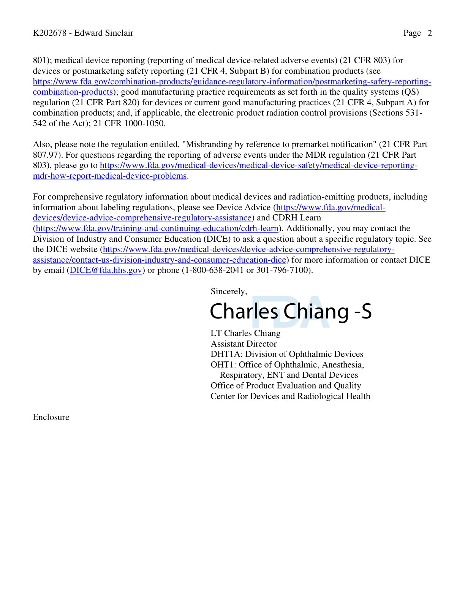

DEPARTMENT OF HEALTH AND HUMAN SERVICES
Food and Drug Administration
Form Approved: OMB No. 0910-0120
Expiration Date: 06/30/2023
See PRA Statement below.

# Indications for Use

**510(k) Number (if known)**: K202678

**Device Name**: OMNI® Surgical System

**Indications for Use (Describe)**:

The OMNI® Surgical System is indicated for canaloplasty (microcatheterization and transluminal viscodilation of Schlemm's canal) followed by trabeculotomy (cutting of trabecular meshwork) to reduce intraocular pressure in adult patients with primary open-angle glaucoma.

**Type of Use (Select one or both, as applicable)**:

* Prescription Use (Part 21 CFR 801 Subpart D) [x]

* Over-The-Counter Use (21 CFR 801 Subpart C) [ ]

**CONTINUE ON A SEPARATE PAGE IF NEEDED.**

This section applies only to requirements of the Paperwork Reduction Act of 1995.

**\*DO NOT SEND YOUR COMPLETED FORM TO THE PRA STAFF EMAIL ADDRESS BELOW.\***

The burden time for this collection of information is estimated to average 79 hours per response, including the time to review instructions, search existing data sources, gather and maintain the data needed and complete and review the collection of information. Send comments regarding this burden estimate or any other aspect of this information collection, including suggestions for reducing this burden, to:

Department of Health and Human Services
Food and Drug Administration
Office of Chief Information Officer
Paperwork Reduction Act (PRA) Staff
PRAStaff@fda.hhs.gov

"An agency may not conduct or sponsor, and a person is not required to respond to, a collection of information unless it displays a currently valid OMB number."

FORM FDA 3881 (6/20) Page 1 of 1 PSC Publishing Services (301) 443-6740 EF

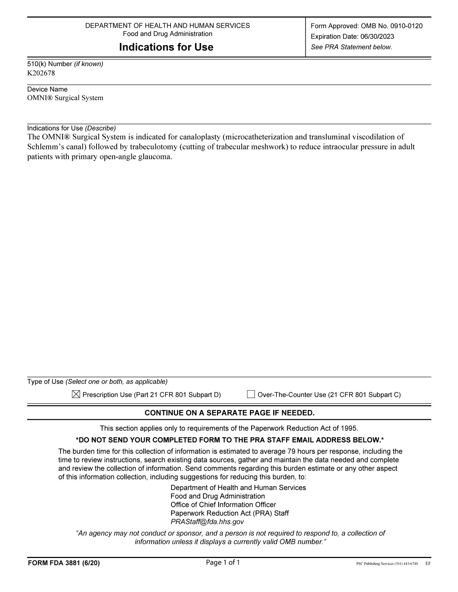

# 510(k) SUMMARY

## Submitter Information

* **510(k) Owner**: Sight Sciences, Inc.
4040 Campbell Ave., Suite 100
Menlo Park, CA 94025
Tel: (877) 266-1144

* **Contact Person**: Edward J. Sinclair
Vice President, Regulatory Affairs
4040 Campbell Ave., Suite 100
Menlo Park, CA 94025
Tel: 650-218-9149

* **Date Prepared**: March 1, 2021

## Device Name and Classification

* **Trade Name**: OMNI® Surgical System

* **Common Name**: Ophthalmic Infusion Pump

* **Classification Name**: Infusion Pump

* **Regulation Number**: 21 CFR 880.5725

* **Device Classification**: Class II

* **Primary Product Code**: MRH

* **Secondary Product Code**: HMZ

## Primary Predicate Device

* **Device Name**: OMNI® Surgical System

* **510(k) Holder**: Sight Sciences, Inc.

* **510(k) Number**: K173332

* **Clearance Date**: December 21, 2017

## Reference Device

* **Device Name**: iScience Interventional Canaloplasty Microcatheter (iTrack™ Surgical System)

* **510(k) Holder**: Ellex iScience, Inc.

* **510(k) Number**: K080067

* **Clearance Date**: July 18, 2008

## Intended Use

Page 6-1

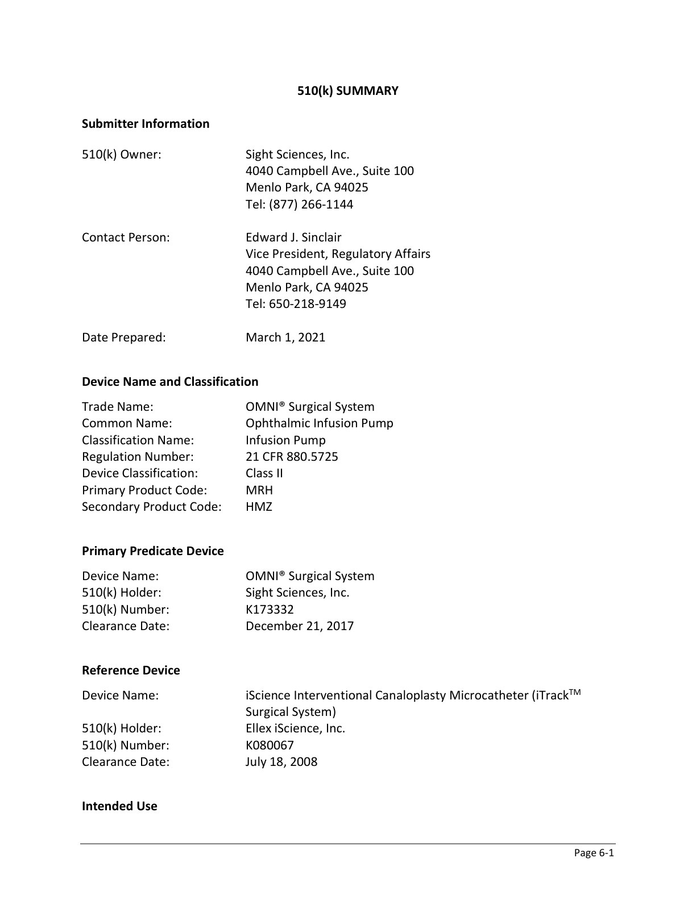

The OMNI® Surgical System is an ophthalmic surgical tool for the delivery of controlled amounts of viscoelastic fluid into the anterior segment and the cutting of trabecular meshwork when a trabeculotomy is indicated.

## Indications for Use

The OMNI® Surgical System is indicated for canaloplasty (microcatheterization and transluminal viscodilation of Schlemm’s canal) followed by trabeculotomy (cutting of trabecular meshwork) to reduce intraocular pressure in adult patients with primary open-angle glaucoma.

## Device Description

The Sight Sciences OMNI Surgical System (with modified indication) is a handheld, manually operated device used by ophthalmologists to access, microcatheterize, and viscodilate Schlemm’s canal (“canaloplasty”) and to re-access Schlemm’s canal and cut trabecular meshwork tissue (“trabeculotomy”). The OMNI Surgical System is provided sterile and disposed after single-patient use. The device is fabricated from biocompatible materials standard to the medical device industry. Each OMNI Surgical System device dispenses fluid on the principle of exchanging volumes much like a syringe and is designed to function with commercially available cohesive viscoelastic fluids (also known as ophthalmic viscosurgical device, or “OVD”).

The OMNI Surgical System device includes a stainless-steel cannula, polymeric microcatheter, removable priming lock, internal reservoir and plunger tube, a Luer fitting for direct connection with an OVD cartridge to prime the internal reservoir, and two advancement wheels. A single advancement wheel is located on each side of the handle. This allows the OMNI Surgical System device to be used in either eye (OD or OS) and in either hand of the surgeon (left or right), by turning the device 180 degrees along its vertical axis. These wheels are used to advance and retract the microcatheter.

The stainless-steel cannula has a curved shape with a beveled tip for entry through the trabecular meshwork into Schlemm’s canal. To perform the combined and sequential canaloplasty/trabeculotomy procedures, the canaloplasty is performed first, followed by trabeculotomy as explained in further detail below.

**Performing Canaloplasty First:** the microcatheter is advanced into Schlemm’s canal up to 180 degrees (one hemisphere) by rotating the advancement wheel forward until the wheel stops (about 20mm). When the device is being used to deliver viscoelastic fluid, retraction of the microcatheter causes the plunger tube to advance into the viscoelastic fluid reservoir thereby automatically dispensing viscoelastic fluid along the length of Schlemm’s canal and collector channels. The microcatheter can be advanced/retracted up to 20 mm per cycle by manually rotating the advancement wheel. The microcatheter can be fully advanced/retracted multiple times, however, viscoelastic fluid can only be dispensed during the first two advancement/retraction cycles in order to dispense viscoelastic fluid along each hemisphere of

Page 6-2

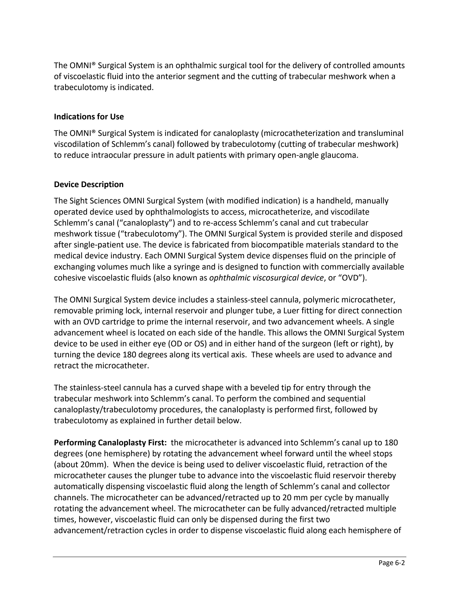

Schlemm’s canal. Thus, the OMNI Surgical System device is designed to be used twice within Schlemm’s canal to deliver a controlled volume of viscoelastic fluid along the first 180 degrees of the canal, followed by a second delivery of viscoelastic fluid along the other 180 degrees. The OMNI Surgical System delivers a total viscoelastic fluid volume of 11 microliters throughout Schlemm’s canal (approximately 5.5 microliters for each of the first two advancement/retraction cycles).

**Performing Trabeculotomy Second:** the beveled tip of the curved stainless-steel cannula is re-positioned into the same Schlemm’s canal location after finishing canaloplasty. The polymeric microcatheter is re-advanced into Schlemm’s canal up to 180 degrees (one hemisphere) by rotating the advancement wheel forward until the wheel stops (about 20 mm). With the microcatheter resting in the canal, the cannula is removed from the corneal incision and out of the eye causing the microcatheter to cut through the trabecular meshwork. This process can be repeated in the second Schlemm’s hemisphere.

## Comparison of Technological Characteristics with the Predicate

The primary predicate in this 510(k) submission is the OMNI Surgical System described in K173332 and K201953, based on substantial equivalence to the Ellex iScience Interventional Canaloplasty Microcatheter (“iTrack Surgical System”) cleared in K080067. The same iTrack Surgical System device (K080067) is also used as a reference device in this 510(k) submission.

The Sight Sciences OMNI Surgical System subject device complies with the same product design requirements and applicable standards as the predicate OMNI Surgical System and shares the identical principle of operation, intended use, and key technological characteristics.

Additionally, the technical features of the subject OMNI Surgical System are similar, but not identical to the commercially available Ellex iTrack Surgical System reference device. The different technological characteristics do not raise different questions of safety and effectiveness. The subject OMNI Surgical System with modified indications and the Ellex iTrack device are both manually operated devices that utilize a microcatheter to access Schlemm’s canal and deliver viscoelastic fluid. Fluid is dispensed from each system on the principle of exchanging volumes much like a syringe. The iTrack device serves as a reference device to support the scientific methods to assess the safety and effectiveness of the device to lower IOP in glaucoma patients. The iTrack device is used in the same anatomical location as the OMNI device and is intended for use to perform canaloplasty to lower IOP in glaucoma patients, which is similar to the intended use proposed for the OMNI device.

A comparison of the attributes of the subject OMNI Surgical System with the predicate OMNI Surgical System and the Ellex iTrack Surgical System (iScience Interventional Canaloplasty Microcatheter) reference device are listed in Table 1 below.

Table 1. Technological Characteristics Comparison

Page 6-3

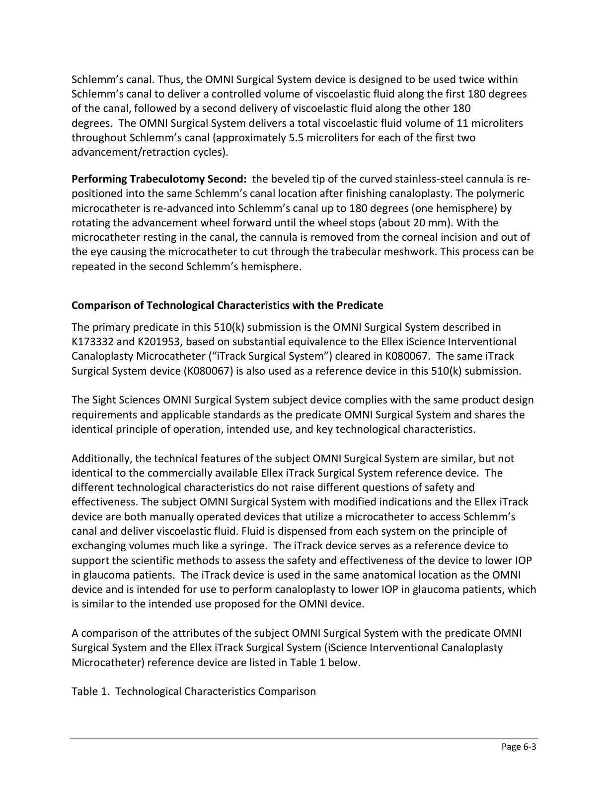

| Characteristic      | OMNI Surgical System SUBJECT DEVICE                                                                                                                                                                                                                                | OMNI Surgical System(K173332) PRIMARY PREDICATE DEVICE                                                                                                                                                                                                                                                                                       | Ellex iTrack Surgical System(iScience InterventionalCanaloplasty MicrocatheterK080067) REFERENCE DEVICE                                                                                                                                                                                                                  |
| ------------------- | ---------------------------------------------------------------------------------------------------------------------------------------------------------------------------------------------------------------------------------------------------------------------- | ------------------------------------------------------------------------------------------------------------------------------------------------------------------------------------------------------------------------------------------------------------------------------------------------------------------------------------------------ | ---------------------------------------------------------------------------------------------------------------------------------------------------------------------------------------------------------------------------------------------------------------------------------------------------------------------------- |
| Intended Use        | Ophthalmic surgical tool for delivery of controlled amounts of viscoelastic fluid into the anterior segment and used to cut trabecular meshwork when a trabeculotomy is indicated                                                                                      | Ophthalmic surgical tool for delivery of controlled amounts of viscoelastic fluid into the anterior segment and used to cut trabecular meshwork when a trabeculotomy is indicated                                                                                                                                                                | Delivery of controlled amounts of viscoelastic fluid during ophthalmic surgery                                                                                                                                                                                                                                               |
| Indications for Use | The OMNI® Surgical System is indicated for canaloplasty (micro-catheterization and transluminal viscodilation of Schlemm’s canal) followed by trabeculotomy (cutting of trabecular meshwork) to reduce intraocular pressure in adult patients with open-angle glaucoma | The OMNI® Surgical System is a manually operated device for delivery of small amounts of viscoelastic fluid, for example Healon® or Healon GV® from Abbott Medical Optics, Amvisc® from Bausch & Lomb, or PROVISC® from Alcon, during ophthalmic surgery. It is also indicated to cut trabecular meshwork tissue during trabeculotomy procedures | The iScience Interventional Canaloplasty Microcatheter is indicated for fluid infusion and aspiration during surgery. The iScience Interventional Canaloplasty Microcatheter is indicated for catheterization and viscodilation of Schlemm's canal to reduce intraocular pressure in adult patients with open angle glaucoma |
| Regulation          | 880.5725 (Infusion Pump)                                                                                                                                                                                                                                               | 880.5725 (Infusion Pump)                                                                                                                                                                                                                                                                                                                         | 886.4350 (Manual ophthalmic surgical instrument) 876.1500 (Endoscope and accessories)                                                                                                                                                                                                                                    |
| Device Class        | Class II                                                                                                                                                                                                                                                               | Class II                                                                                                                                                                                                                                                                                                                                         | Class II                                                                                                                                                                                                                                                                                                                     |
| Product Code        | Primary: MRH (Ophthalmic Infusion Pump) Secondary: HMZ (Trabeculotome)                                                                                                                                                                                             | Primary: MRH (Ophthalmic Infusion Pump) Secondary: HMZ (Trabeculotome)                                                                                                                                                                                                                                                                       | Primary: MPA (Endoscope) Secondary: HMX (Manual Ophthalmic Surgical Instrument)                                                                                                                                                                                                                                          |
| Prescription Status | Prescription use only                                                                                                                                                                                                                                                  | Prescription use only                                                                                                                                                                                                                                                                                                                            | Prescription use only                                                                                                                                                                                                                                                                                                        |
| Target Anatomy      | Schlemm’s Canal and Trabecular Meshwork                                                                                                                                                                                                                                | Schlemm’s Canal and Trabecular Meshwork                                                                                                                                                                                                                                                                                                          | Schlemm’s Canal and Trabecular Meshwork                                                                                                                                                                                                                                                                                      |
| Operating Principle | Manual                                                                                                                                                                                                                                                                 | Manual                                                                                                                                                                                                                                                                                                                                           | • Manual (microcatheter) • Powered (endoilluminator)                                                                                                                                                                                                                                                                     |

Page 6-4

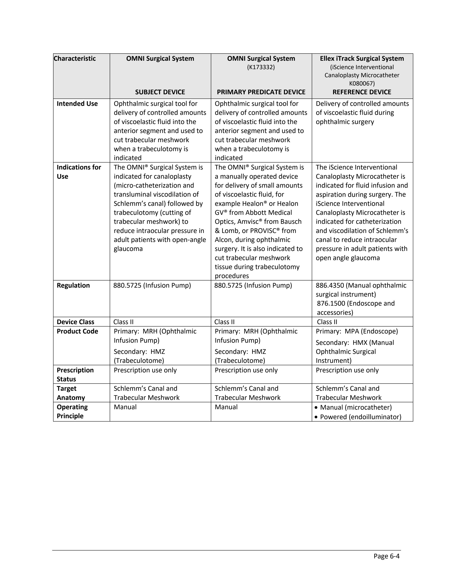

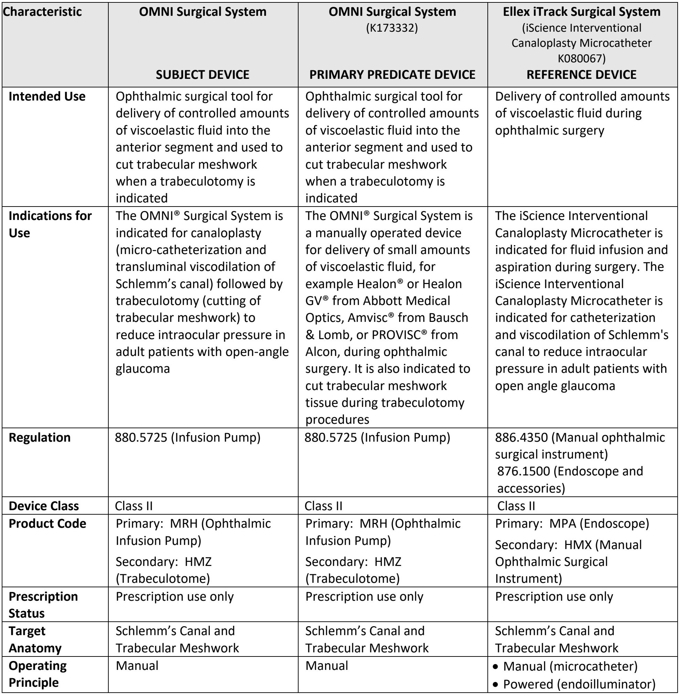

| **Design/** **Mechanism of** **Action** | \* Stainless-steel cannula has sharp tip that can be used to pierce the trabecular meshwork and provide access into Schlemm’s canal. Minor dimensional changes to cannula tip height and radius \* Flexible microcatheter with rounded, atraumatic tip for dispensing of viscoelastic \* Microcatheter is blue color to facilitate its visibility in Schlemm’s canal as it is advanced/retracted through the cannula \* Microcatheter allows access to 360° of Schlemm’s canal in two 180° segments \* Proximal handle changed to ovoid shape with elastomeric material for added grip \* Proximal handle allows ambidextrous use in either patient eye \* Internal viscoelastic reservoir and plunger tube with dimensional changes to allow dispensing of viscoelastic \* Ovoid handle shape allows advancement wheels (finger wheels) to be reduced to two for advancing and retracting microcatheter up to 20mm using a rack and pinion mechanism \* Tactile and audible clicks indicate precise advancement \* Viscoelastic dispensed during retraction of first two cycles after priming with viscoelastic fluid \* Flexible microcatheter introduced into Schlemm’s canal and pulled through to cut trabecular meshwork \* Priming Lock moved to accommodate new Luer fitting and prevents accidental dispensing during viscoelastic priming \* Changes were made to the materials in the handle, | \* Stainless-steel cannula has sharp tip that can be used to pierce the trabecular meshwork and provide access into Schlemm’s canal \* Flexible microcatheter with rounded, atraumatic tip for dispensing of viscoelastic \* Microcatheter is blue color to facilitate its visibility in Schlemm’s canal as it is advanced/retracted through the cannula \* Microcatheter allows access to 360° of Schlemm’s canal in two 180° segments \* Proximal handle has rectangular shape \* Proximal handle allows ambidextrous use in either patient eye \* Internal viscoelastic reservoir and plunger tube to allow dispensing of viscoelastic \* Four advancement wheels (finger wheels) for advancing and retracting microcatheter up to 20mm using a rack and pinion mechanism \* Tactile and audible clicks indicate precise advancement \* Viscoelastic dispensed during retraction of first two cycles after priming with viscoelastic fluid \* Flexible microcatheter introduced into Schlemm’s canal and pulled through to cut trabecular meshwork \* Priming Lock Pin prevents accidental dispensing during viscoelastic priming | \* Flexible microcatheter for dispensation of viscoelastic fluid \* Microcatheter has a round, bolus, atraumatic tip \* Microcatheter allows access to 360° of Schlemm’s canal in one pass \* Microcatheter has internal catheter support wire \* Tactile and audible clicks indicate precise advancement \* Viscoelastic manually dispensed during retraction microcatheter \* No cannula – a 27 ga needle (not included) is used to pierce the trabecular meshwork \* Centrally located hub \* Microcatheter attaches at proximal end to Ellex ViscoInjector \* Viscoelastic cartridge placed into ViscoInjector \* Microcatheter manually advanced/retracted by surgeon using microsurgical forceps (not included) \* Knob on ViscoInjector turned to dispense viscoelastic during microcatheter retraction \* Microcatheter is clear and transparent but incorporates a red light at its tip to facilitate visibility in Schlemm’s canal |
| ----------------------------------------------- | -------------------------------------------------------------------------------------------------------------------------------------------------------------------------------------------------------------------------------------------------------------------------------------------------------------------------------------------------------------------------------------------------------------------------------------------------------------------------------------------------------------------------------------------------------------------------------------------------------------------------------------------------------------------------------------------------------------------------------------------------------------------------------------------------------------------------------------------------------------------------------------------------------------------------------------------------------------------------------------------------------------------------------------------------------------------------------------------------------------------------------------------------------------------------------------------------------------------------------------------------------------------------------------------------------------------------------------------------------------------------------------------------------------------------------------------------------- | -------------------------------------------------------------------------------------------------------------------------------------------------------------------------------------------------------------------------------------------------------------------------------------------------------------------------------------------------------------------------------------------------------------------------------------------------------------------------------------------------------------------------------------------------------------------------------------------------------------------------------------------------------------------------------------------------------------------------------------------------------------------------------------------------------------------------------------------------------------------------------------------------------------------------------------------------------------------------------------------------------------------------------------------------------------------------------------------------------------------------------------------------------------------------------- | -------------------------------------------------------------------------------------------------------------------------------------------------------------------------------------------------------------------------------------------------------------------------------------------------------------------------------------------------------------------------------------------------------------------------------------------------------------------------------------------------------------------------------------------------------------------------------------------------------------------------------------------------------------------------------------------------------------------------------------------------------------------------------------------------------------------------------------------------------------------------------------------------------------------------------------------------------------------------------------------- |

Page 6-5

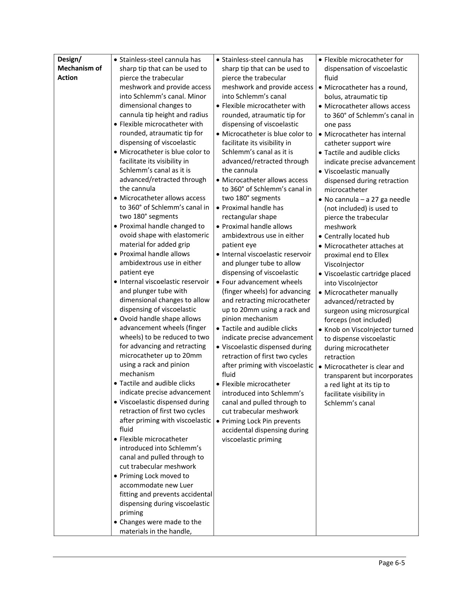

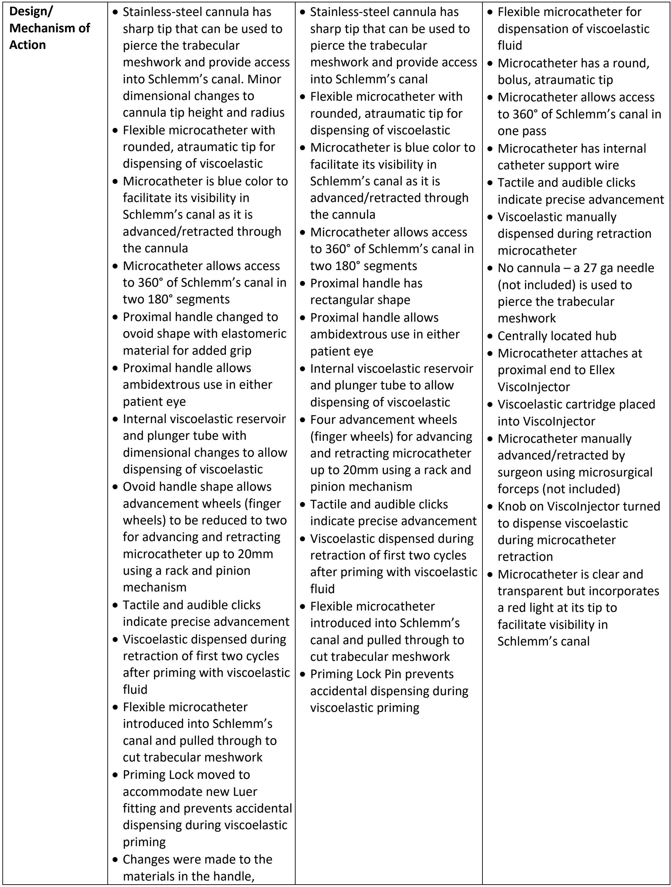

| Characteristic                              | OMNI Surgical System SUBJECT DEVICE                                                                                                                                                                                                                                                  | OMNI Surgical System(K173332) PRIMARY PREDICATE DEVICE                                                                                                                                                                                                       | Ellex iTrack Surgical System(iScience InterventionalCanaloplasty MicrocatheterK080067) REFERENCE DEVICE                                                      |
| ------------------------------------------- | ---------------------------------------------------------------------------------------------------------------------------------------------------------------------------------------------------------------------------------------------------------------------------------------- | ---------------------------------------------------------------------------------------------------------------------------------------------------------------------------------------------------------------------------------------------------------------- | ---------------------------------------------------------------------------------------------------------------------------------------------------------------- |
|                                             | reservoir, Luer fitting and a new bonding adhesive was used                                                                                                                                                                                                                              |                                                                                                                                                                                                                                                                  |                                                                                                                                                                  |
| Dispensing Control                          | After priming, viscoelastic dispensing control occurs through manual rotation of either advancement wheel at the distal end of the device. Synchronization of the two wheels was reversed for ease of use                                                                                | After priming, viscoelastic dispensing control occurs through manual rotation of either of the advancement wheels at the distal end of the device                                                                                                                | Rotational action via a knob on the ViscoInjector to dispense viscoelastic fluid                                                                                 |
| Dispensing Mechanism                        | Internal reservoir with plunger tube (syringe-like volume exchange). Three internal component dimensions modified to reduce air bubble formation during priming                                                                                                                          | Internal reservoir with plunger tube (syringe-like volume exchange).                                                                                                                                                                                             | OVD cartridge attaches to the device inside the Ellex ViscoInjector (syringe-like volume exchange)                                                               |
| Viscoelastic Fluid (OVD) and Priming Method | Cohesive viscoelastic fluid (OVD or ophthalmic viscosurgical device) is supplied separately. Viscoelastic loaded into device (primed) prior to use by attaching OVD cartridge directly to a Luer fitting that replaces the cap on proximal end of OMNI device handle for ease of priming | Cohesive viscoelastic fluid (OVD or ophthalmic viscosurgical device) is supplied separately. Viscoelastic loaded into device (primed) prior to use by attaching OVD cartridge to a supplied Nozzle that is inserted into a on proximal end of OMNI device handle | Cohesive viscoelastic fluid (OVD or ophthalmic viscosurgical device) is supplied separately. OVD cartridge attaches to the device inside the Ellex ViscoInjector |
| OVD Volume Dispensed                        | 11 µL                                                                                                                                                                                                                                                                                    | 9 µL                                                                                                                                                                                                                                                             | Not stated                                                                                                                                                       |
| Materials                                   | Medical grade materials, including ABS, polycarbonate, stainless steel, silicone, parylene coating, cyanoacrylate, acrylated urethane, polyimide                                                                                                                                         | Medical grade materials, including ABS, polycarbonate, stainless steel, silicone, parylene coating, cyanoacrylate, acrylated urethane, polyimide                                                                                                                 | Microcatheter – polyimide tubing and an outer sheath of polyethylene terephthalate (PET) shrink tubing, with a lubricious coating                                |
| User Interface                              | Handheld                                                                                                                                                                                                                                                                                 | Handheld                                                                                                                                                                                                                                                         | Handheld                                                                                                                                                         |
| Microcatheter Shaft Outer Diameter          | 200 microns                                                                                                                                                                                                                                                                              | 200 microns                                                                                                                                                                                                                                                      | 200 microns                                                                                                                                                      |
| Microcatheter Tip Outer Diameter Range      | 0.0090 to 0.0110 inches                                                                                                                                                                                                                                                                  | 0.0095 to 0.0110 inches                                                                                                                                                                                                                                          | 0.0098 inches                                                                                                                                                    |
| Sterile and Single Use                      | Provided sterile. Single patient use                                                                                                                                                                                                                                                     | Provided sterile. Single patient use                                                                                                                                                                                                                             | Provided sterile. Single patient use                                                                                                                             |

Page 6-6

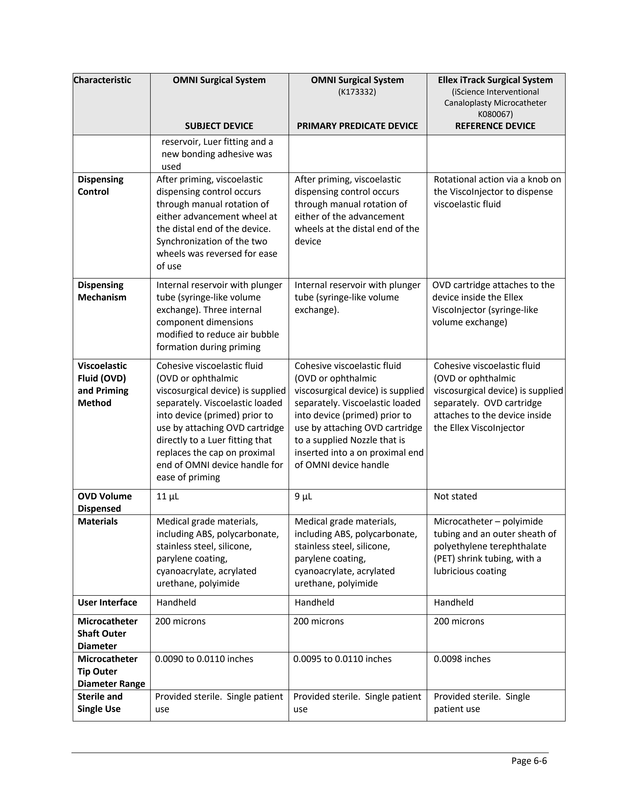

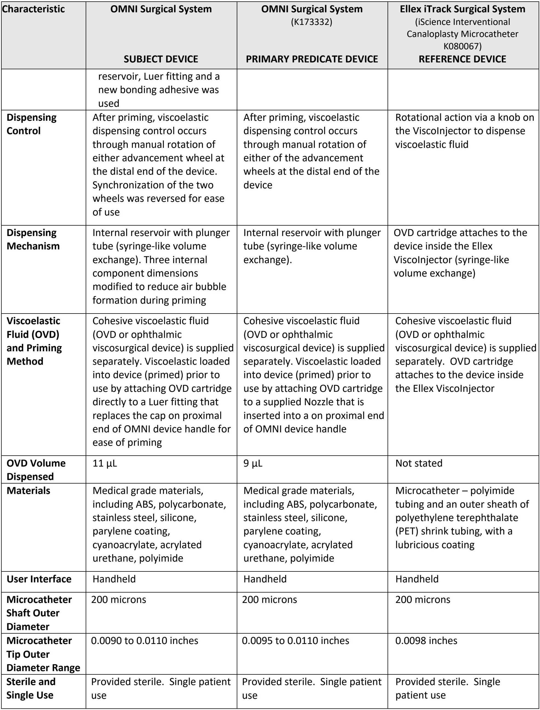

| Characteristic                | OMNI Surgical System SUBJECT DEVICE              | OMNI Surgical System(K173332) PRIMARY PREDICATE DEVICE | Ellex iTrack Surgical System(iScience InterventionalCanaloplasty MicrocatheterK080067) REFERENCE DEVICE |
| ----------------------------- | ---------------------------------------------------- | ---------------------------------------------------------- | ----------------------------------------------------------------------------------------------------------- |
| **Sterilization Method**      | Gamma radiation                                      | Gamma radiation                                            | Gamma radiation                                                                                             |
| **Sterility Assurance Level** | 10-6                                                 | 10-6                                                       | 10-6                                                                                                        |
| **Packaging**                 | Thermoformed plastic tray with heat-sealed Tyvek lid | Tyvek pouch with a polymer tray card                       | Tray inside a sealed pouch                                                                                  |
| **Shelf Life**                | 13 Months                                            | 6 Months                                                   | Unknown                                                                                                     |

## Risk Analysis

The risk management process at Sight Sciences complies with EN ISO 14971:2012 “*Medical devices -- Application of risk management to medical devices.*” As required by this standard, risk analyses are conducted according to defined procedures, using experienced, qualified personnel from multiple functions throughout the organization with prior experience in risk assessment.

Risk analysis activities were first documented in a Risk Management Plan. This plan specified the risk management activities to be conducted based on labeling changes to the cleared OMNI Surgical System. The following activities were completed:

* The Clinical Hazards for the OMNI Surgical System were assessed by qualified personnel with respect to the proposed changes in indications for use. The result of this analysis indicated that no new hazards were identified.

* In accordance with the Plan, all Failure Modes Effect Analyses (FMEA) were assessed by the qualified team of personnel. This included a review of the design FMEA, process FMEA and Use FMEA. In order to evaluate the hazards related to the proposed changes to indications for use, it was determined that design control activities, including bench performance testing and clinical performance testing, were required to verify that potential harm and effects resulting from the previously identified hazards did not result in any new failure modes, causes or effects and did not change the severity and occurrence rankings.

* Design control verification activities resulting from assessment of the FMEA’s included non-clinical bench performance testing according to a written protocol with appropriate sample sizes and pre-determined acceptance criteria. Clinical performance testing was performed according to a written protocol.

Based on the risk management documentation and supported by successful non-clinical bench performance testing and clinical performance testing, all identified clinical hazards remained mitigated to an acceptable level of residual risk. The review of the design, process and use FMEA’s determined that no changes to the risk management file were required in order to

Page 6-7

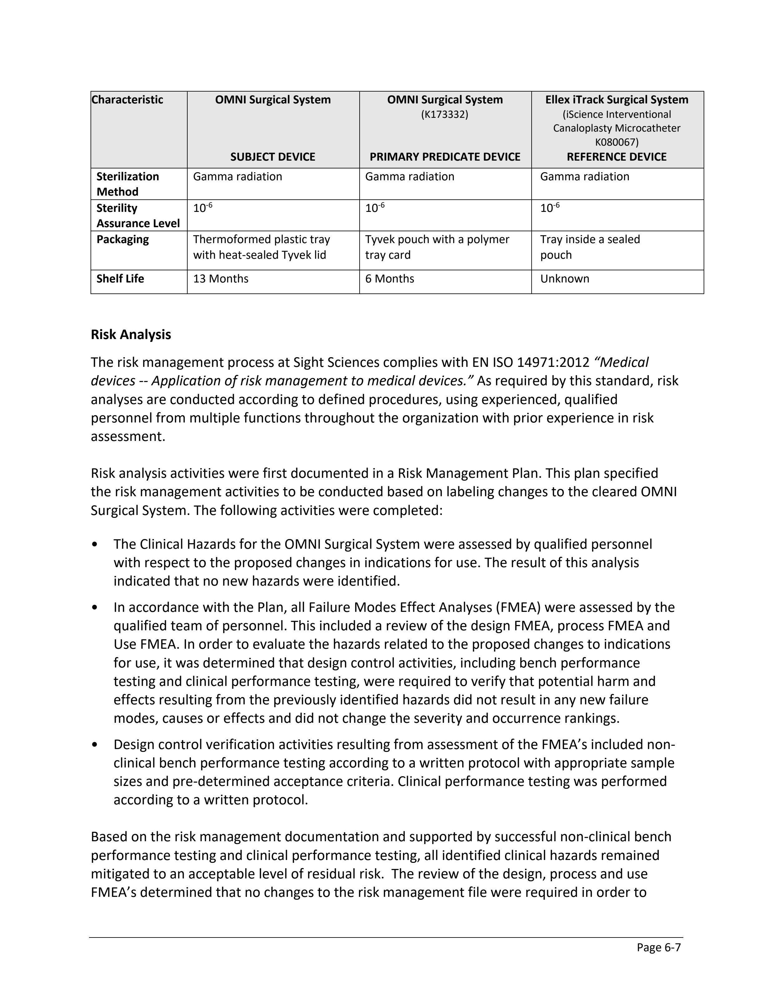

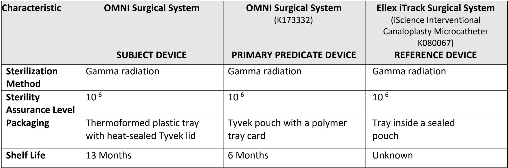

implement the changes to the indications for use. Taking into account the modified indications of the OMNI Surgical System, the potential benefits to patients outweigh the low residual risk.

**Performance Data**

## A. Bench Testing

Design verification was already established and did not need to be repeated. Based on the risk analysis, bench simulated use testing and clinical performance testing were determined to be needed. Simulated use testing in human cadaver eyes was performed using the OMNI Surgical System. The results of this nonclinical testing demonstrate that the OMNI Surgical System meets the defined specifications and functioned as intended.

**Simulated Use – Cadaver Eye Testing**

The changes to the indications for use were supported by simulated use testing in human cadaver eyes. Cadaver eyes were used to validate the OMNI Surgical System’s ability to perform its indicated use, including viscodilation of Schlemm’s canal followed by trabeculotomy. The study was performed by an ophthalmologist along with a physician assistant. A total of eight OMNI Surgical System devices were tested in four cadaver eyes. Following the *Instructions For Use* (with the modified indications) the surgeon was able to consistently access, microcatheterize, and viscodilate Schlemm’s canal (“canaloplasty”) and re‐access, microcatheterize, and cut trabecular meshwork (“trabeculotomy”) in human cadaveric tissue.

**Conclusions of Bench Performance Testing**

The human eye performance testing results demonstrate the ability of the surgeon’s assistant to prepare the OMNI Surgical System device, and the ophthalmic surgeon to (a) access Schlemm’s canal, (b) navigate Schlemm’s canal with the microcatheter, (c) deliver viscoelastic fluid into Schlemm’s canal upon retraction of the microcatheter from the canal, and (d) regain access to Schlemm’s canal and perform a trabeculotomy.

## B. Clinical Evidence Supporting Substantial Equivalence

A retrospective, observational, multi‐center, single‐arm, consecutive case series study (“ROMEO”) was conducted at 11 sites throughout the U.S. where surgeons used the OMNI Surgical System for the microcatheterization and viscodilation of Schlemm’s canal (“canaloplasty”) followed by trabeculotomy as a standalone procedure or in combination with cataract extraction. Results from this study were compared with a literature control.¹ In this study, a prior iteration of the OMNI device was used. Minor system technological differences between the device used in this study (the predicate device K173332) and the

\*¹ Lewis RA, von Wolff K, Tetz M, Korber N, Kearney JR, Shingleton B, Samuelson TW. Canaloplasty: circumferential viscodilation and tensioning of Schlemm's canal using a flexible microcatheter for the treatment of open‐angle glaucoma in adults: interim clinical study analysis. J Cataract Refract Surg. 2007 Jul;33(7):1217‐26.

Page 6‐8

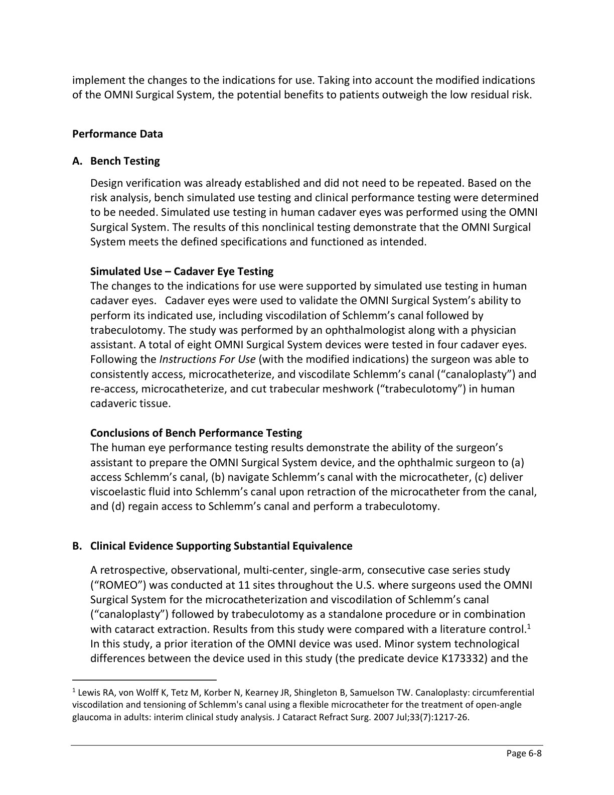

subject device are described in Table 1. Each site had collected data on intraocular pressure (IOP), the use of ocular hypotensive medications, and safety outcomes in adult patients with open angle glaucoma. Endpoint stratification was performed by type of procedure; combined with cataract extraction, or stand-alone. A total of 129 patients with a single qualifying eye were treated with the OMNI Surgical System and followed post-operatively at months 1, 6 and 12. There were 81 (63%) procedures combined with cataract surgery, and 48 (37%) standalone procedures.

## Effectiveness Results

Descriptive statistics were assessed over time for the subgroup of patients who met the entry criteria of the literature control (i.e. a baseline IOP ≥ 16 mmHg).

| Table 2. OMNI +Cataract and Standalone Results (Subgroup using the Lewis 2007 eligibility, baseline IOP ≥ 16 mmHg) Visit | Table 2. OMNI +Cataract and Standalone Results (Subgroup using the Lewis 2007 eligibility, baseline IOP ≥ 16 mmHg) +Cataract Mean IOP ± SD | Table 2. OMNI +Cataract and Standalone Results (Subgroup using the Lewis 2007 eligibility, baseline IOP ≥ 16 mmHg) +Cataract Range | Table 2. OMNI +Cataract and Standalone Results (Subgroup using the Lewis 2007 eligibility, baseline IOP ≥ 16 mmHg) +Cataract n | Table 2. OMNI +Cataract and Standalone Results (Subgroup using the Lewis 2007 eligibility, baseline IOP ≥ 16 mmHg) Standalone Mean IOP ± SD | Table 2. OMNI +Cataract and Standalone Results (Subgroup using the Lewis 2007 eligibility, baseline IOP ≥ 16 mmHg) Standalone Range | Table 2. OMNI +Cataract and Standalone Results (Subgroup using the Lewis 2007 eligibility, baseline IOP ≥ 16 mmHg) Standalone n |
| ---------------------------------------------------------------------------------------------------------------------------- | -------------------------------------------------------------------------------------------------------------------------------------------------- | ------------------------------------------------------------------------------------------------------------------------------------------ | -------------------------------------------------------------------------------------------------------------------------------------- | --------------------------------------------------------------------------------------------------------------------------------------------------- | ------------------------------------------------------------------------------------------------------------------------------------------- | --------------------------------------------------------------------------------------------------------------------------------------- |
| Baseline                                                                                                                     | 19.5 ± 3.8                                                                                                                                         | 16.0-33.0                                                                                                                                  | 45                                                                                                                                     | 20.0 ± 3.6                                                                                                                                          | 16.0-31.0                                                                                                                                   | 38                                                                                                                                      |
| 1 month                                                                                                                      | 15.7 ± 4.0                                                                                                                                         | 6.7-25.0                                                                                                                                   | 44                                                                                                                                     | 15.3 ± 4.4                                                                                                                                          | 8.0-27.0                                                                                                                                    | 36                                                                                                                                      |
| 6 month                                                                                                                      | 15.1 ± 2.9                                                                                                                                         | 10.0-22.0                                                                                                                                  | 40                                                                                                                                     | 15.6 ± 3.0                                                                                                                                          | 9.0-20.0                                                                                                                                    | 37                                                                                                                                      |
| 12 month                                                                                                                     | 15.2 ± 3.0                                                                                                                                         | 10.0-22.0                                                                                                                                  | 42                                                                                                                                     | 15.3 ± 2.7                                                                                                                                          | 7.0-19.5                                                                                                                                    | 36                                                                                                                                      |

| Table 3. Number of Medications Required Over Time (ROMEO – All patients) Visit | Table 3. Number of Medications Required Over Time (ROMEO – All patients) Mean ± SD | Table 3. Number of Medications Required Over Time (ROMEO – All patients) Range | Table 3. Number of Medications Required Over Time (ROMEO – All patients) n |
| ---------------------------------------------------------------------------------- | -------------------------------------------------------------------------------------- | ---------------------------------------------------------------------------------- | ------------------------------------------------------------------------------ |
| Baseline                                                                           | 1.8 ± 1.3                                                                              | 0-4                                                                                | 129                                                                            |
| 1 month                                                                            | 1.3 ± 1.3                                                                              | 0-5                                                                                | 125                                                                            |
| 6 month                                                                            | 1.1 ± 1.2                                                                              | 0-5                                                                                | 115                                                                            |
| 12 month                                                                           | 1.1 ± 1.2                                                                              | 0-5                                                                                | 120                                                                            |

A post-hoc responder analysis was also performed to assess the proportion of patients who experienced a ≥ 20% reduction in IOP at Month 12, no increase in medication, no secondary surgery. Refer to Table 4 for results in patients who had OMNI performed as a Standalone procedure and Table 5 for results in patients who had OMNI performed in conjunction with cataract surgery.

| Table 4. Proportion of Standalone Subjects with ≥ 20% Reduction in IOP at Month 12, no increase in medication, no secondary surgery Group | Table 4. Proportion of Standalone Subjects with ≥ 20% Reduction in IOP at Month 12, no increase in medication, no secondary surgery n | Table 4. Proportion of Standalone Subjects with ≥ 20% Reduction in IOP at Month 12, no increase in medication, no secondary surgery Proportion |
| --------------------------------------------------------------------------------------------------------------------------------------------- | ----------------------------------------------------------------------------------------------------------------------------------------- | -------------------------------------------------------------------------------------------------------------------------------------------------- |
|                                                                                                                                               |                                                                                                                                           |                                                                                                                                                    |

Page 6-9

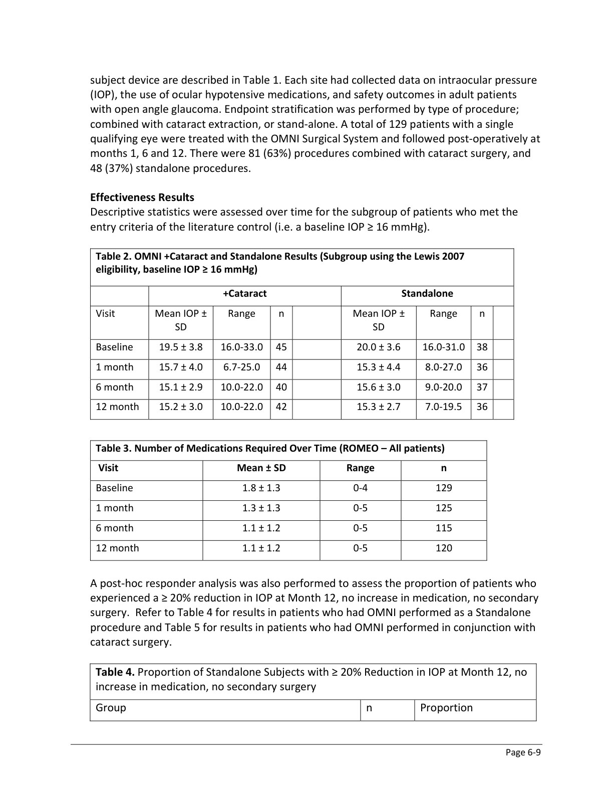

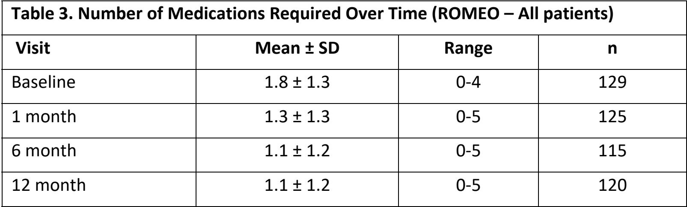

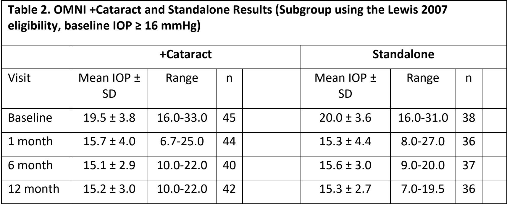

| **Pre-op IOP > 18 mmHg**                         | **14/24** | **58.3%** |
| ------------------------------------------------ | --------- | --------- |
| Pre-op IOP ≤ 18 mmHg                             | 4/24      | 16.7%\*   |
| All Standalone                                   | 18/48     | 37.5%\*   |
| All meeting Lewis criteria (Pre-Op IOP ≥16 mmHg) | 16/35     | 45.7%\*   |

\* 20% responder analysis is not appropriate for patients with baseline IOP ≤ 18 mmHg because baseline IOP was controlled.

Table 5. Proportion of +Cataract Subjects with ≥ 20% Reduction in IOP at Month 12, no increase in medication, no secondary surgery

| Group                                    | n         | Proportion |
| ---------------------------------------- | --------- | ---------- |
| **BL > 18 mmHg**                         | **15/24** | **62.5%**  |
| BL ≤ 18 mmHg                             | 10/57     | 17.5%\*    |
| All Combined with cataract               | 25/81     | 30.9%\*    |
| All meeting Lewis criteria (BL ≥16 mmHg) | 20/46     | 43.5%\*    |

\* 20% responder analysis is not appropriate for patients with baseline IOP ≤ 18 mmHg because baseline IOP was controlled.

## Safety Results

All 129 patients treated with the OMNI Surgical system were included in the safety analyses. Adverse events were generally infrequent, mild, non-serious, transient in nature, resolved with or without treatment and were consistent with those expected in the target population. The most common adverse events reported prior to and including the 12-month visit were: posterior capsular opacity, mild anterior chamber inflammation, secondary surgical intervention for IOP control, cystoid macular edema, corneal edema, IOP spike, and hyphema, as listed in Table 6. There were no serious adverse events or serious device-related adverse events reported in the study.

Table 6. Adverse Events, by Procedure Sub-Group

| Adverse Event                                                    | Standalone (n=48)n (%) | +Cataract (n=81)n (%) | ALL Adverse Events (n=129)n (%) |
| ---------------------------------------------------------------- | ---------------------- | --------------------- | ------------------------------- |
| **Posterior capsule opacity**                                    | 5 (10.4)               | 14 (17.3)             | 19 (14.7)                       |
| **Mild anterior chamber inflammation**                           | 6 (12.5)               | 8 (9.9)               | 14 (10.9)                       |
| **Cystoid macular edema**                                        | 3 (6.3)                | 4 (4.9)               | 7 (5.4)                         |
| **Corneal edema**                                                | 2 (4.2)1               | 4 (4.9)2              | 6 (4.7)                         |
| **IOP increase ≥ 10 mmHg above baseline >30 days postoperative** | 3 (6.3)                | 3 (3.7)               | 6 (4.7)                         |
| **Hyphema > 1 mm**                                               | 2 (4.2)                | 3 (3.7)               | 5 (3.9)                         |

Page 6-10

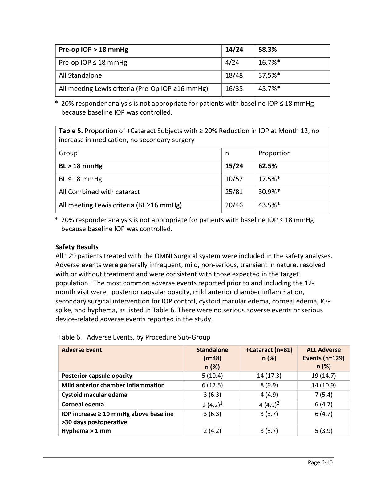

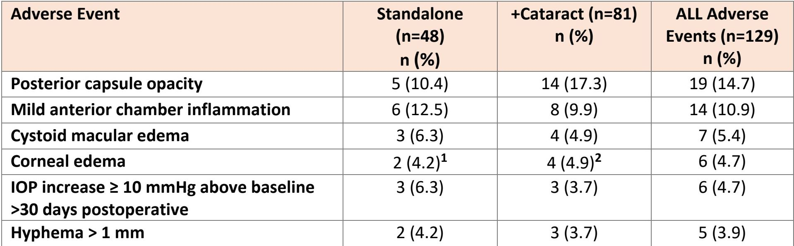

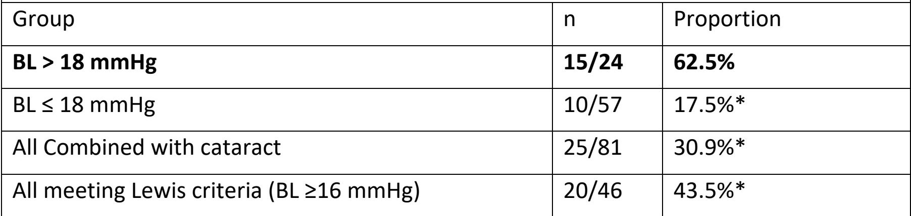

| Adverse Event                                                   | Standalone(n=48)n (%) | +Cataract (n=81)n (%) | ALL AdverseEvents (n=129)n (%) |
| --------------------------------------------------------------- | --------------------- | --------------------- | ------------------------------ |
| **Worsening of visual field mean deviation ≥ 2 dB**             | 3 (6.3)               | 1 (1.2)               | 4 (3.1)                        |
| **BCVA loss of ≥ 2 lines Snellen at or after 3 months post-op** | 2 (4.2)               | 1 (1.2)               | 3 (2.3)                        |
| **Cataract surgery complication**                               | 1 (2.1)3              | 1 (1.2)4              | 2 (1.6)                        |
| **Choroidal effusion**                                          | 0                     | 1 (1.2)               | 1 (0.8)                        |
| **Macular degeneration (dry)**                                  | 1 (2.1)               | 0                     | 1 (0.8)                        |
| **Epiretinal membrane peel**                                    | 1 (2.1)               | 0                     | 1 (0.8)                        |
| **Ocular allergic reaction**                                    | 0                     | 1 (1.2)               | 1 (0.8)                        |
| **Posterior vitreous detachment**                               | 0                     | 1 (1.2)               | 1 (0.8)                        |
| **Vitreous hemorrhage**                                         | 1 (2.1)5              | 0                     | 1 (0.8)                        |
| **Cyclodialysis**                                               | 0                     | 1 (1.2)               | 1 (0.8)                        |
| **Lid edema**                                                   | 1 (2.1)               | 0                     | 1 (0.8)                        |
| **Late hypotony**                                               | 0                     | 1 (1.2)6              | 1 (0.8)                        |
| **Loss of light perception**                                    | 0                     | 0                     | 0                              |
| **Chronic anterior iritis as defined in the FDA MIGS guidance** | 0                     | 0                     | 0                              |
|                                                                 |                       |                       |                                |
| **TOTAL**                                                       | **31**                | **43**                | **74**                         |

\*1 One subject developed corneal edema at 4-6 months post-procedure which was noted to have resolved one year later.

\*2 Pre-existing Fuch’s dystrophy in one subject which worsened required a DSAEK.

\*3 AE was an IOL dislocation from prior cataract surgery.

\*4 AE was lens fragment.

\*5 Vitreous hemorrhage verbatim description was “peripheral retinal hemorrhage” and resolved without treatment in 32 days by the Investigator.

\*6 One subject underwent post-surgical anterior chamber reformation with Healon viscoelastic fluid for a shallow chamber with failed laser cycloplexy for a related cyclodialysis cleft; multiple paracentesis was performed to remove viscoelastic causing an IOP spike and subsequent surgical cycloplexy to repair the cleft. Small choroidal effusions resolved with closure of the cleft.

## Secondary Surgical Interventions

There were 9/129 eyes (7.0%) required a secondary surgical intervention to reduce IOP in the medical judgment of the Investigator. There were 4/81 secondary surgical interventions in the +cataract group (4.9%) and 5/48 in the standalone group (10.4%). The reinterventions were SLT (n=3/9, 33%), glaucoma drainage device (tube or valve) (n=3/9, 33%), trabeculectomy including Express device (n=2/9, 22%), and paracentesis (n=1/9, 11%).

In addition to secondary surgical intervention for IOP, two subjects underwent additional interventions in the follow-up period, one in the standalone OMNI group (n=1/48, 2.1%)

Page 6-11

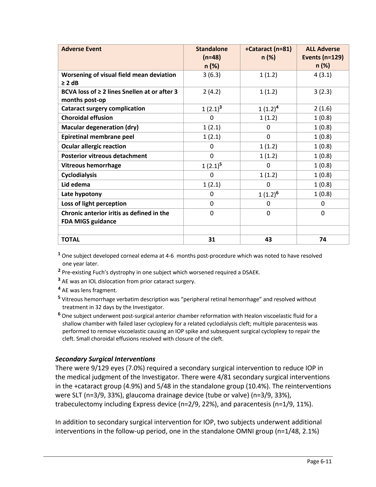

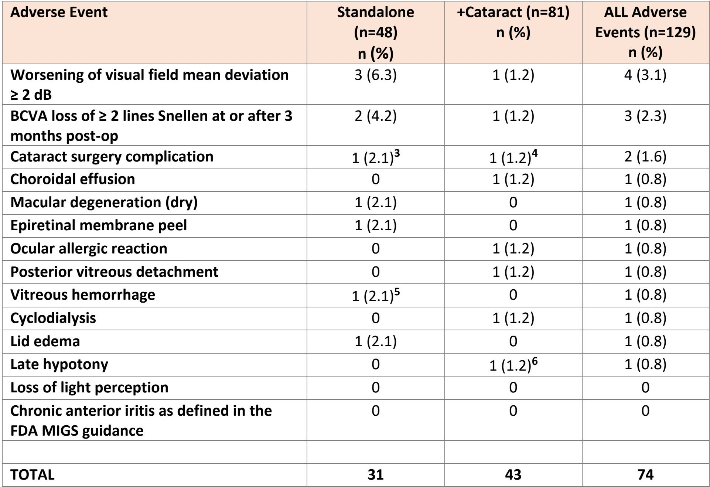

and one in combined Omni with cataract extraction group (n=1/81, 1.2%). The subject in the standalone OMNI group had pre-existing Fuch’s dystrophy and experienced a worsening requiring a Descemet Stripping Automated Endothelial Keratoplasty (DSAEK) procedure which resolved the corneal edema. The second subject who underwent a combined cataract extraction and OMNI procedure was noted to have a shallow, but not a flat chamber. Small choroidal effusions were noted as well as a cyclodialysis cleft which was not notable on exam due to the shallow chamber. Chamber reformation using Healon was performed , partially for therapeutic reasons but mostly to facilitate view of the angle. This allowed gonioscopic visualization of the angle which revealed the location of the cleft and laser cycloplexy was attempted to close the cleft. An IOP spike ≥ 10 mmHg above baseline was secondary to the Healon injection and paracentesis were performed to remove viscoelastic material from the eye. When laser cycloplexy failed to close the cleft, the surgeon performed a surgical cycloplexy. Small choroidal effusions resolved with closure of the cleft.

**Clinical Study Conclusions**

The conclusions drawn from the nonclinical and clinical tests demonstrate that the device is substantially equivalent to the legally marketed OMNI Surgical System.

The clinical performance data collected in the ROMEO study for the OMNI Surgical System suggest clinically significant IOP reduction in both the cataract and standalone arms for up to 12 months for the intended population of adult patients with primary open-angle glaucoma.

# Conclusions

The Sight Sciences OMNI Surgical System subject device complies with the same product design requirements and applicable standards as the predicate OMNI Surgical System and shares the identical principle of operation, intended use, and key technological characteristics. The indications for use differ from that of the predicate OMNI Surgical System, however, the differences do not alter the intended use and are supported by bench simulated use and clinical performance data that demonstrate the ability of the OMNI Surgical System to access Schlemm’s canal, navigate the canal with the microcatheter, perform canaloplasty by delivering commercially available viscoelastic fluid upon retraction of the microcatheter from the canal, and regain access to Schlemm’s canal with the microcatheter to perform a trabeculotomy.

The conclusions drawn from the nonclinical and clinical tests demonstrate that the device is substantially equivalent to the legally marketed OMNI Surgical System.

The clinical performance data collected in the ROMEO study for the OMNI Surgical System suggest clinically significant IOP reduction in both the cataract and standalone arms for up to 12 months for the intended population of adult patients with primary open-angle glaucoma.

The OMNI Surgical System is substantially equivalent to the legally-marketed OMNI Surgical System predicate device cleared under 510(k) K173332.

Page 6-12

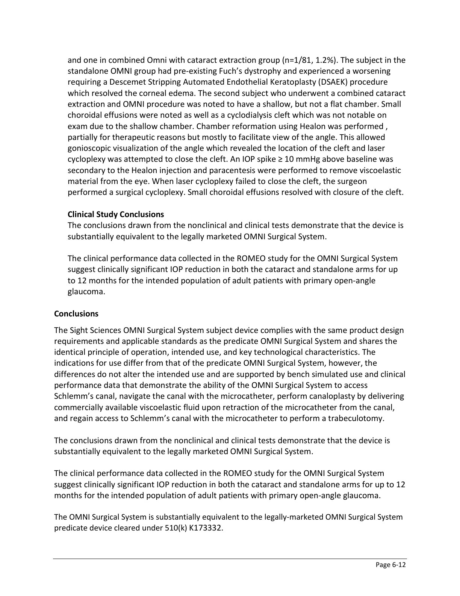

Page 6-13

