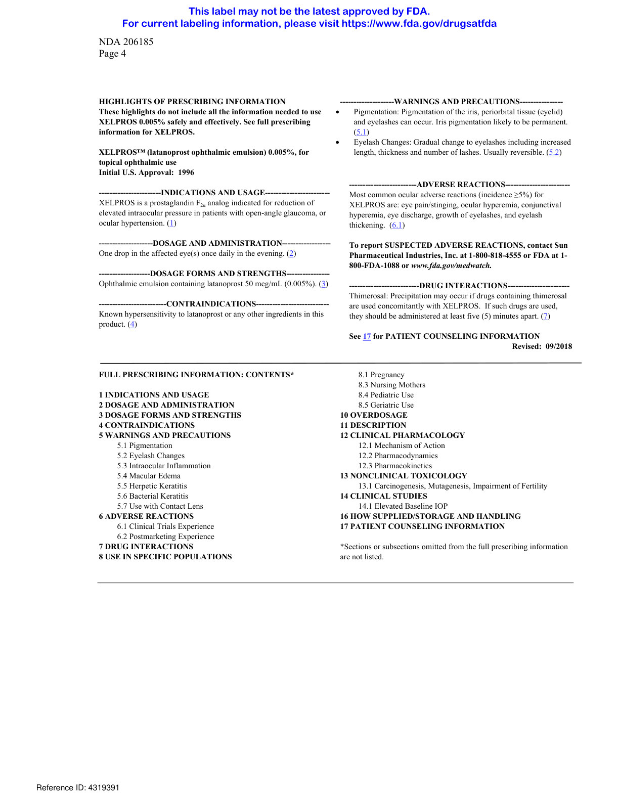
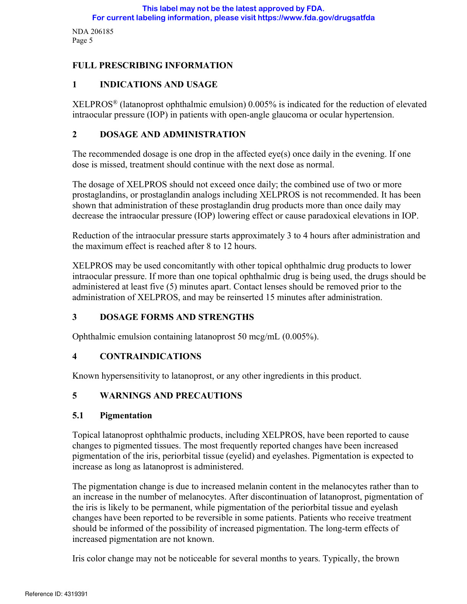
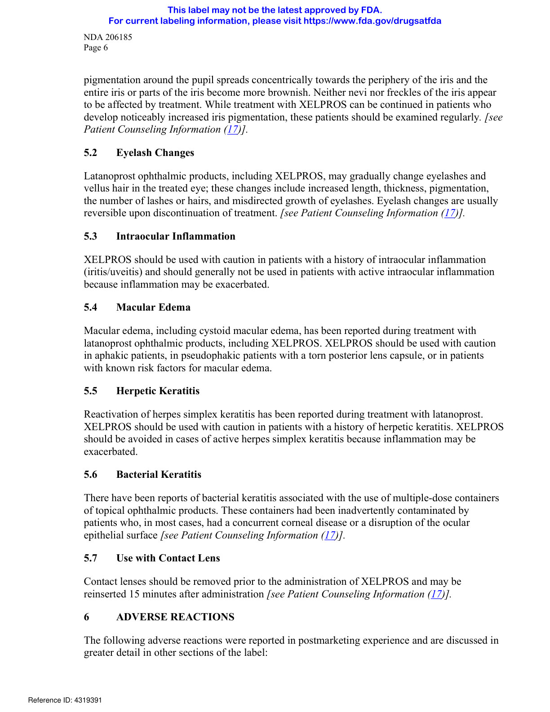
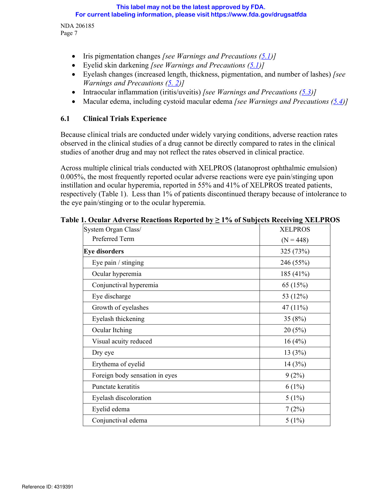
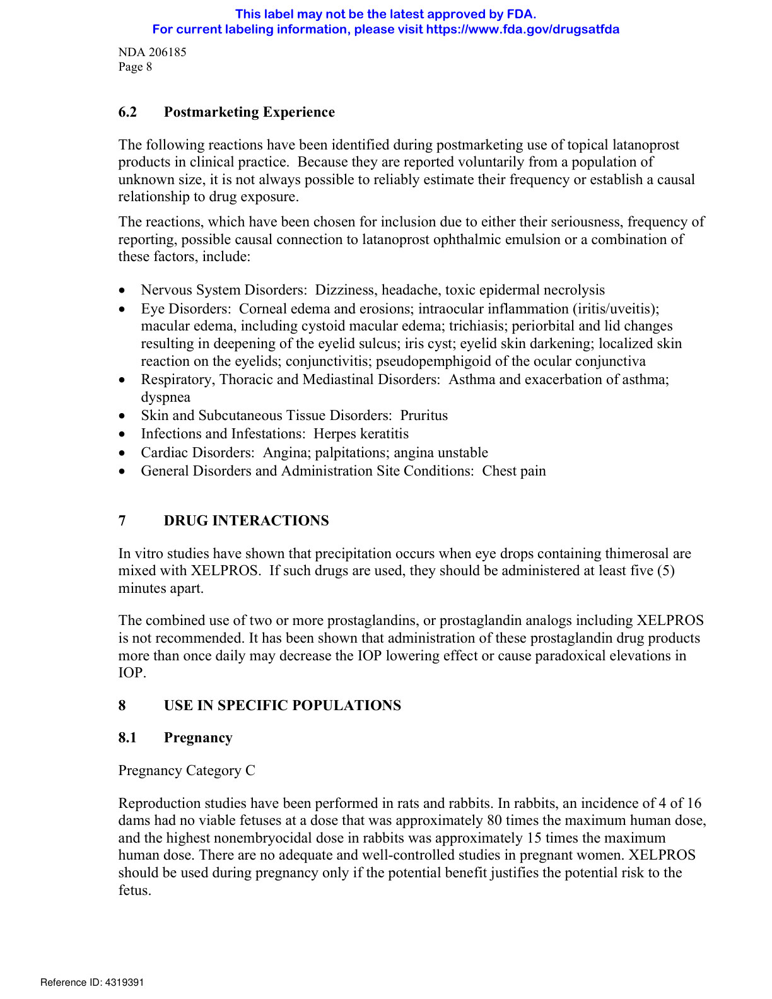
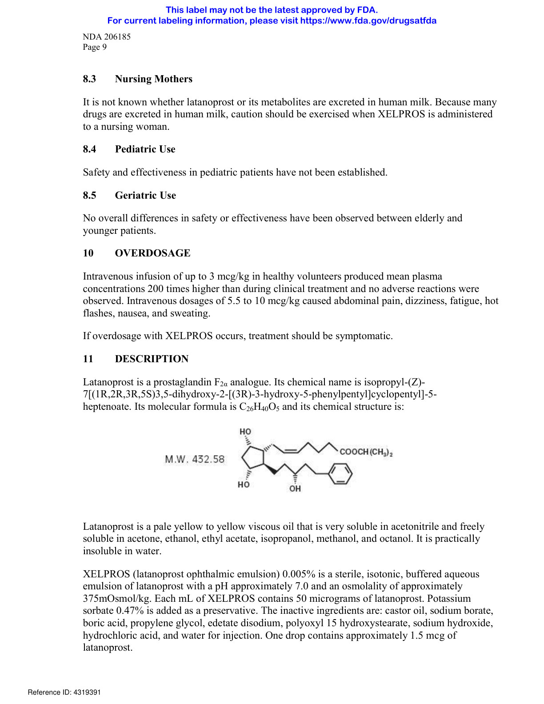
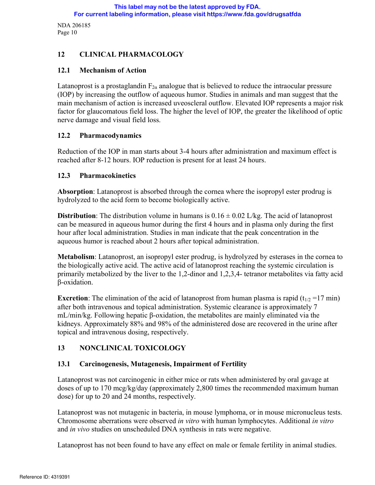
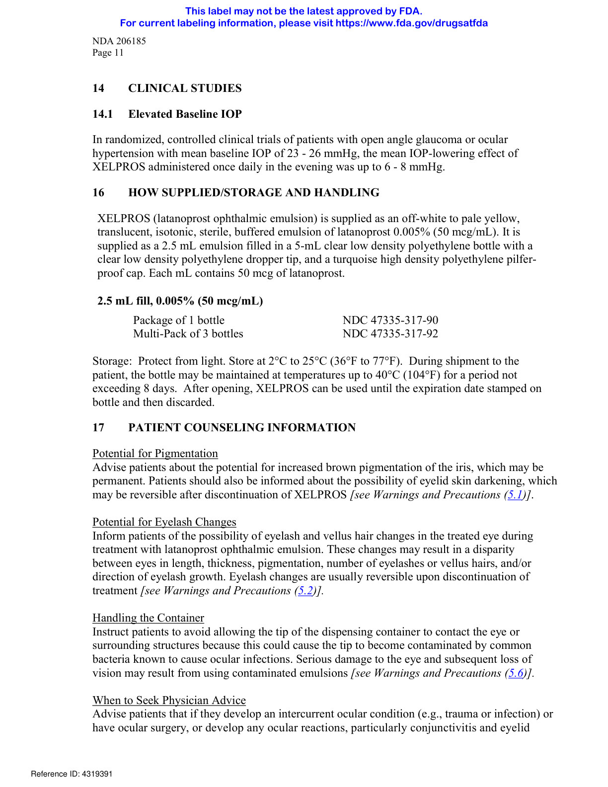
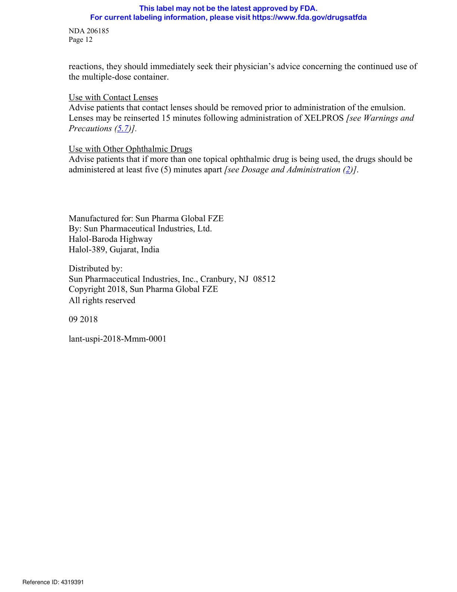

# Page 1

NDA 206185 
Page 4 
HIGHLIGHTS OF PRESCRIBING INFORMATION 
These highlights do not include all the information needed to use 
XELPROS 0.005% safely and effectively. See full prescribing 
information for XELPROS. 
XELPROS™ (latanoprost ophthalmic emulsion) 0.005%, for 
topical ophthalmic use 
Initial U.S. Approval:  1996 
-----------------------INDICATIONS AND USAGE-----------------------­
XELPROS is a prostaglandin F2α analog indicated for reduction of 
elevated intraocular pressure in patients with open-angle glaucoma, or 
ocular hypertension. (1) 
--------------------DOSAGE AND ADMINISTRATION-----------------­
One drop in the affected eye(s) once daily in the evening. (2) 
-------------------DOSAGE FORMS AND STRENGTHS---------------­
Ophthalmic emulsion containing latanoprost 50 mcg/mL (0.005%). (3) 
-------------------------CONTRAINDICATIONS--------------------------­
Known hypersensitivity to latanoprost or any other ingredients in this 
product. (4) 
--------------------WARNINGS AND PRECAUTIONS---------------­
  
Pigmentation: Pigmentation of the iris, periorbital tissue (eyelid) 
and eyelashes can occur. Iris pigmentation likely to be permanent. 
(5.1) 
  
Eyelash Changes: Gradual change to eyelashes including increased 
length, thickness and number of lashes. Usually reversible. (5.2) 
-------------------------ADVERSE REACTIONS-----------------------­
Most common ocular adverse reactions (incidence ≥5%) for 
XELPROS are: eye pain/stinging, ocular hyperemia, conjunctival 
hyperemia, eye discharge, growth of eyelashes, and eyelash 
thickening.  (6.1) 
To report SUSPECTED ADVERSE REACTIONS, contact Sun 
Pharmaceutical Industries, Inc. at 1-800-818-4555 or FDA at 1­
800-FDA-1088 or www.fda.gov/medwatch. 
--------------------------DRUG INTERACTIONS-----------------------
Thimerosal: Precipitation may occur if drugs containing thimerosal 
are used concomitantly with XELPROS.  If such drugs are used, 
they should be administered at least five (5) minutes apart. (7) 
See 17 for PATIENT COUNSELING INFORMATION  
Revised: 09/2018 
FULL PRESCRIBING INFORMATION: CONTENTS* 
1 INDICATIONS AND USAGE 
2 DOSAGE AND ADMINISTRATION 
3 DOSAGE FORMS AND STRENGTHS 
4 CONTRAINDICATIONS 
5 WARNINGS AND PRECAUTIONS 
5.1 Pigmentation 
5.2 Eyelash Changes 
5.3 Intraocular Inflammation 
5.4 Macular Edema 
5.5 Herpetic Keratitis 
5.6 Bacterial Keratitis 
5.7 Use with Contact Lens 
6 ADVERSE REACTIONS 
6.1 Clinical Trials Experience 
6.2 Postmarketing Experience 
7 DRUG INTERACTIONS 
8 USE IN SPECIFIC POPULATIONS 
8.1 Pregnancy 
8.3 Nursing Mothers 
8.4 Pediatric Use 
8.5 Geriatric Use 
10 OVERDOSAGE 
11 DESCRIPTION 
12 CLINICAL PHARMACOLOGY 
12.1 Mechanism of Action 
12.2 Pharmacodynamics 
12.3 Pharmacokinetics 
13 NONCLINICAL TOXICOLOGY 
13.1 Carcinogenesis, Mutagenesis, Impairment of Fertility 
14 CLINICAL STUDIES 
14.1 Elevated Baseline IOP 
16 HOW SUPPLIED/STORAGE AND HANDLING 
17 PATIENT COUNSELING INFORMATION 
*Sections or subsections omitted from the full prescribing information 
are not listed. 
Reference ID: 4319391 
This label may not be the latest approved by FDA.  
For current labeling information, please visit https://www.fda.gov/drugsatfda

# Page 2

NDA 206185 
Page 5 
FULL PRESCRIBING INFORMATION 
1 
INDICATIONS AND USAGE 
XELPROS® (latanoprost ophthalmic emulsion) 0.005% is indicated for the reduction of elevated 
intraocular pressure (IOP) in patients with open-angle glaucoma or ocular hypertension. 
2 
DOSAGE AND ADMINISTRATION 
The recommended dosage is one drop in the affected eye(s) once daily in the evening. If one 
dose is missed, treatment should continue with the next dose as normal. 
The dosage of XELPROS should not exceed once daily; the combined use of two or more 
prostaglandins, or prostaglandin analogs including XELPROS is not recommended. It has been 
shown that administration of these prostaglandin drug products more than once daily may 
decrease the intraocular pressure (IOP) lowering effect or cause paradoxical elevations in IOP. 
Reduction of the intraocular pressure starts approximately 3 to 4 hours after administration and 
the maximum effect is reached after 8 to 12 hours. 
XELPROS may be used concomitantly with other topical ophthalmic drug products to lower 
intraocular pressure. If more than one topical ophthalmic drug is being used, the drugs should be 
administered at least five (5) minutes apart. Contact lenses should be removed prior to the 
administration of XELPROS, and may be reinserted 15 minutes after administration. 
3 
DOSAGE FORMS AND STRENGTHS 
Ophthalmic emulsion containing latanoprost 50 mcg/mL (0.005%). 
4 
CONTRAINDICATIONS 
Known hypersensitivity to latanoprost, or any other ingredients in this product. 
5 
WARNINGS AND PRECAUTIONS 
5.1 
Pigmentation 
Topical latanoprost ophthalmic products, including XELPROS, have been reported to cause 
changes to pigmented tissues. The most frequently reported changes have been increased 
pigmentation of the iris, periorbital tissue (eyelid) and eyelashes. Pigmentation is expected to 
increase as long as latanoprost is administered. 
The pigmentation change is due to increased melanin content in the melanocytes rather than to 
an increase in the number of melanocytes. After discontinuation of latanoprost, pigmentation of 
the iris is likely to be permanent, while pigmentation of the periorbital tissue and eyelash 
changes have been reported to be reversible in some patients. Patients who receive treatment 
should be informed of the possibility of increased pigmentation. The long-term effects of 
increased pigmentation are not known. 
Iris color change may not be noticeable for several months to years. Typically, the brown 
Reference ID: 4319391 
This label may not be the latest approved by FDA.  
For current labeling information, please visit https://www.fda.gov/drugsatfda

# Page 3

NDA 206185 
Page 6 
pigmentation around the pupil spreads concentrically towards the periphery of the iris and the 
entire iris or parts of the iris become more brownish. Neither nevi nor freckles of the iris appear 
to be affected by treatment. While treatment with XELPROS can be continued in patients who 
develop noticeably increased iris pigmentation, these patients should be examined regularly. [see 
Patient Counseling Information (17)]. 
5.2 
Eyelash Changes 
Latanoprost ophthalmic products, including XELPROS, may gradually change eyelashes and 
vellus hair in the treated eye; these changes include increased length, thickness, pigmentation, 
the number of lashes or hairs, and misdirected growth of eyelashes. Eyelash changes are usually 
reversible upon discontinuation of treatment. [see Patient Counseling Information (17)]. 
5.3 
Intraocular Inflammation 
XELPROS should be used with caution in patients with a history of intraocular inflammation 
(iritis/uveitis) and should generally not be used in patients with active intraocular inflammation 
because inflammation may be exacerbated. 
5.4 
Macular Edema 
Macular edema, including cystoid macular edema, has been reported during treatment with 
latanoprost ophthalmic products, including XELPROS. XELPROS should be used with caution 
in aphakic patients, in pseudophakic patients with a torn posterior lens capsule, or in patients 
with known risk factors for macular edema. 
5.5 
Herpetic Keratitis 
Reactivation of herpes simplex keratitis has been reported during treatment with latanoprost.  
XELPROS should be used with caution in patients with a history of herpetic keratitis. XELPROS 
should be avoided in cases of active herpes simplex keratitis because inflammation may be 
exacerbated. 
5.6 
Bacterial Keratitis 
There have been reports of bacterial keratitis associated with the use of multiple-dose containers 
of topical ophthalmic products. These containers had been inadvertently contaminated by 
patients who, in most cases, had a concurrent corneal disease or a disruption of the ocular 
epithelial surface [see Patient Counseling Information (17)]. 
5.7 
Use with Contact Lens 
Contact lenses should be removed prior to the administration of XELPROS and may be 
reinserted 15 minutes after administration [see Patient Counseling Information (17)]. 
6 
ADVERSE REACTIONS 
The following adverse reactions were reported in postmarketing experience and are discussed in 
greater detail in other sections of the label: 
Reference ID: 4319391 
This label may not be the latest approved by FDA.  
For current labeling information, please visit https://www.fda.gov/drugsatfda

# Page 4

NDA 206185 
Page 7 
 Iris pigmentation changes [see Warnings and Precautions (5.1)]  
 Eyelid skin darkening [see Warnings and Precautions (5.1)]  
 Eyelash changes (increased length, thickness, pigmentation, and number of lashes) [see  
Warnings and Precautions (5. 2)] 
 Intraocular inflammation (iritis/uveitis) [see Warnings and Precautions (5.3)] 
 Macular edema, including cystoid macular edema [see Warnings and Precautions (5.4)] 
6.1 
Clinical Trials Experience 
Because clinical trials are conducted under widely varying conditions, adverse reaction rates 
observed in the clinical studies of a drug cannot be directly compared to rates in the clinical 
studies of another drug and may not reflect the rates observed in clinical practice. 
Across multiple clinical trials conducted with XELPROS (latanoprost ophthalmic emulsion) 
0.005%, the most frequently reported ocular adverse reactions were eye pain/stinging upon 
instillation and ocular hyperemia, reported in 55% and 41% of XELPROS treated patients, 
respectively (Table 1).  Less than 1% of patients discontinued therapy because of intolerance to 
the eye pain/stinging or to the ocular hyperemia. 
Table 1. Ocular Adverse Reactions Reported by ≥ 1% of Subjects Receiving XELPROS 
System Organ Class/
     Preferred Term 
XELPROS 
(N = 448) 
Eye disorders 
325 (73%) 
Eye pain / stinging 
246 (55%) 
Ocular hyperemia 
185 (41%) 
Conjunctival hyperemia 
65 (15%) 
Eye discharge 
53 (12%) 
Growth of eyelashes 
47 (11%) 
Eyelash thickening 
35 (8%) 
Ocular Itching 
20 (5%) 
Visual acuity reduced 
16 (4%) 
Dry eye 
13 (3%) 
Erythema of eyelid 
14 (3%) 
Foreign body sensation in eyes 
9 (2%) 
Punctate keratitis 
6 (1%) 
Eyelash discoloration 
5 (1%) 
Eyelid edema 
7 (2%) 
Conjunctival edema 
5 (1%) 
Reference ID: 4319391 
This label may not be the latest approved by FDA.  
For current labeling information, please visit https://www.fda.gov/drugsatfda

# Page 5

NDA 206185 
Page 8 
6.2 
Postmarketing Experience 
The following reactions have been identified during postmarketing use of topical latanoprost 
products in clinical practice.  Because they are reported voluntarily from a population of 
unknown size, it is not always possible to reliably estimate their frequency or establish a causal 
relationship to drug exposure.  
The reactions, which have been chosen for inclusion due to either their seriousness, frequency of 
reporting, possible causal connection to latanoprost ophthalmic emulsion or a combination of 
these factors, include: 
  Nervous System Disorders: Dizziness, headache, toxic epidermal necrolysis 
  Eye Disorders: Corneal edema and erosions; intraocular inflammation (iritis/uveitis); 
macular edema, including cystoid macular edema; trichiasis; periorbital and lid changes 
resulting in deepening of the eyelid sulcus; iris cyst; eyelid skin darkening; localized skin 
reaction on the eyelids; conjunctivitis; pseudopemphigoid of the ocular conjunctiva 
  Respiratory, Thoracic and Mediastinal Disorders:  Asthma and exacerbation of asthma; 
dyspnea 
 Skin and Subcutaneous Tissue Disorders:  Pruritus 
 Infections and Infestations:  Herpes keratitis 
 Cardiac Disorders:  Angina; palpitations; angina unstable 
 General Disorders and Administration Site Conditions:  Chest pain 
7 
DRUG INTERACTIONS 
In vitro studies have shown that precipitation occurs when eye drops containing thimerosal are 
mixed with XELPROS.  If such drugs are used, they should be administered at least five (5) 
minutes apart. 
The combined use of two or more prostaglandins, or prostaglandin analogs including XELPROS 
is not recommended. It has been shown that administration of these prostaglandin drug products 
more than once daily may decrease the IOP lowering effect or cause paradoxical elevations in 
IOP. 
8 
USE IN SPECIFIC POPULATIONS 
8.1 
Pregnancy 
Pregnancy Category C 
Reproduction studies have been performed in rats and rabbits. In rabbits, an incidence of 4 of 16 
dams had no viable fetuses at a dose that was approximately 80 times the maximum human dose, 
and the highest nonembryocidal dose in rabbits was approximately 15 times the maximum 
human dose. There are no adequate and well-controlled studies in pregnant women. XELPROS 
should be used during pregnancy only if the potential benefit justifies the potential risk to the 
fetus. 
Reference ID: 4319391 
This label may not be the latest approved by FDA.  
For current labeling information, please visit https://www.fda.gov/drugsatfda

# Page 6

NDA 206185 
Page 9 
8.3 
Nursing Mothers 
It is not known whether latanoprost or its metabolites are excreted in human milk. Because many 
drugs are excreted in human milk, caution should be exercised when XELPROS is administered 
to a nursing woman. 
8.4 
Pediatric Use 
Safety and effectiveness in pediatric patients have not been established. 
8.5 
Geriatric Use 
No overall differences in safety or effectiveness have been observed between elderly and 
younger patients. 
10 
OVERDOSAGE 
Intravenous infusion of up to 3 mcg/kg in healthy volunteers produced mean plasma 
concentrations 200 times higher than during clinical treatment and no adverse reactions were 
observed. Intravenous dosages of 5.5 to 10 mcg/kg caused abdominal pain, dizziness, fatigue, hot 
flashes, nausea, and sweating. 
If overdosage with XELPROS occurs, treatment should be symptomatic. 
11 
DESCRIPTION 
Latanoprost is a prostaglandin F2α analogue. Its chemical name is isopropyl-(Z)­
7[(1R,2R,3R,5S)3,5-dihydroxy-2-[(3R)-3-hydroxy-5-phenylpentyl]cyclopentyl]-5­
heptenoate. Its molecular formula is C26H40O5 and its chemical structure is: 
Latanoprost is a pale yellow to yellow viscous oil that is very soluble in acetonitrile and freely 
soluble in acetone, ethanol, ethyl acetate, isopropanol, methanol, and octanol. It is practically 
insoluble in water. 
XELPROS (latanoprost ophthalmic emulsion) 0.005% is a sterile, isotonic, buffered aqueous 
emulsion of latanoprost with a pH approximately 7.0 and an osmolality of approximately 
375mOsmol/kg. Each mL of XELPROS contains 50 micrograms of latanoprost. Potassium 
sorbate 0.47% is added as a preservative. The inactive ingredients are: castor oil, sodium borate, 
boric acid, propylene glycol, edetate disodium, polyoxyl 15 hydroxystearate, sodium hydroxide, 
hydrochloric acid, and water for injection. One drop contains approximately 1.5 mcg of 
latanoprost. 
Reference ID: 4319391 
This label may not be the latest approved by FDA.  
For current labeling information, please visit https://www.fda.gov/drugsatfda

# Page 7

NDA 206185 
Page 10 
12 
CLINICAL PHARMACOLOGY 
12.1 
Mechanism of Action 
Latanoprost is a prostaglandin F2α analogue that is believed to reduce the intraocular pressure 
(IOP) by increasing the outflow of aqueous humor. Studies in animals and man suggest that the 
main mechanism of action is increased uveoscleral outflow. Elevated IOP represents a major risk 
factor for glaucomatous field loss. The higher the level of IOP, the greater the likelihood of optic 
nerve damage and visual field loss. 
12.2 
Pharmacodynamics 
Reduction of the IOP in man starts about 3-4 hours after administration and maximum effect is 
reached after 8-12 hours. IOP reduction is present for at least 24 hours. 
12.3 
Pharmacokinetics 
Absorption: Latanoprost is absorbed through the cornea where the isopropyl ester prodrug is 
hydrolyzed to the acid form to become biologically active. 
Distribution: The distribution volume in humans is 0.16 ± 0.02 L/kg. The acid of latanoprost 
can be measured in aqueous humor during the first 4 hours and in plasma only during the first 
hour after local administration. Studies in man indicate that the peak concentration in the 
aqueous humor is reached about 2 hours after topical administration. 
Metabolism: Latanoprost, an isopropyl ester prodrug, is hydrolyzed by esterases in the cornea to 
the biologically active acid. The active acid of latanoprost reaching the systemic circulation is 
primarily metabolized by the liver to the 1,2-dinor and 1,2,3,4- tetranor metabolites via fatty acid 
β-oxidation. 
Excretion: The elimination of the acid of latanoprost from human plasma is rapid (t1/2 =17 min) 
after both intravenous and topical administration. Systemic clearance is approximately 7 
mL/min/kg. Following hepatic β-oxidation, the metabolites are mainly eliminated via the 
kidneys. Approximately 88% and 98% of the administered dose are recovered in the urine after 
topical and intravenous dosing, respectively. 
13 
NONCLINICAL TOXICOLOGY 
13.1 
Carcinogenesis, Mutagenesis, Impairment of Fertility 
Latanoprost was not carcinogenic in either mice or rats when administered by oral gavage at 
doses of up to 170 mcg/kg/day (approximately 2,800 times the recommended maximum human 
dose) for up to 20 and 24 months, respectively. 
Latanoprost was not mutagenic in bacteria, in mouse lymphoma, or in mouse micronucleus tests. 
Chromosome aberrations were observed in vitro with human lymphocytes. Additional in vitro 
and in vivo studies on unscheduled DNA synthesis in rats were negative. 
Latanoprost has not been found to have any effect on male or female fertility in animal studies. 
Reference ID: 4319391 
This label may not be the latest approved by FDA.  
For current labeling information, please visit https://www.fda.gov/drugsatfda

# Page 8

NDA 206185 
Page 11 
14 
CLINICAL STUDIES 
14.1 
Elevated Baseline IOP 
In randomized, controlled clinical trials of patients with open angle glaucoma or ocular 
hypertension with mean baseline IOP of 23 - 26 mmHg, the mean IOP-lowering effect of 
XELPROS administered once daily in the evening was up to 6 - 8 mmHg. 
16 
HOW SUPPLIED/STORAGE AND HANDLING 
XELPROS (latanoprost ophthalmic emulsion) is supplied as an off-white to pale yellow, 
translucent, isotonic, sterile, buffered emulsion of latanoprost 0.005% (50 mcg/mL). It is 
supplied as a 2.5 mL emulsion filled in a 5-mL clear low density polyethylene bottle with a 
clear low density polyethylene dropper tip, and a turquoise high density polyethylene pilfer-
proof cap. Each mL contains 50 mcg of latanoprost. 
2.5 mL fill, 0.005% (50 mcg/mL) 
Package of 1 bottle 
NDC 47335-317-90 
Multi-Pack of 3 bottles 
NDC 47335-317-92 
Storage: Protect from light. Store at 2°C to 25°C (36°F to 77°F).  During shipment to the 
patient, the bottle may be maintained at temperatures up to 40°C (104°F) for a period not 
exceeding 8 days.  After opening, XELPROS can be used until the expiration date stamped on 
bottle and then discarded. 
17 
PATIENT COUNSELING INFORMATION 
Potential for Pigmentation 
Advise patients about the potential for increased brown pigmentation of the iris, which may be 
permanent. Patients should also be informed about the possibility of eyelid skin darkening, which 
may be reversible after discontinuation of XELPROS [see Warnings and Precautions (5.1)]. 
Potential for Eyelash Changes 
Inform patients of the possibility of eyelash and vellus hair changes in the treated eye during 
treatment with latanoprost ophthalmic emulsion. These changes may result in a disparity 
between eyes in length, thickness, pigmentation, number of eyelashes or vellus hairs, and/or 
direction of eyelash growth. Eyelash changes are usually reversible upon discontinuation of 
treatment [see Warnings and Precautions (5.2)]. 
Handling the Container 
Instruct patients to avoid allowing the tip of the dispensing container to contact the eye or 
surrounding structures because this could cause the tip to become contaminated by common 
bacteria known to cause ocular infections. Serious damage to the eye and subsequent loss of 
vision may result from using contaminated emulsions [see Warnings and Precautions (5.6)]. 
When to Seek Physician Advice 
Advise patients that if they develop an intercurrent ocular condition (e.g., trauma or infection) or 
have ocular surgery, or develop any ocular reactions, particularly conjunctivitis and eyelid 
Reference ID: 4319391 
This label may not be the latest approved by FDA.  
For current labeling information, please visit https://www.fda.gov/drugsatfda

# Page 9

NDA 206185 
Page 12 
reactions, they should immediately seek their physician’s advice concerning the continued use of  
the multiple-dose container.  
Use with Contact Lenses  
Advise patients that contact lenses should be removed prior to administration of the emulsion.  
Lenses may be reinserted 15 minutes following administration of XELPROS [see Warnings and  
Precautions (5.7)].  
Use with Other Ophthalmic Drugs 
Advise patients that if more than one topical ophthalmic drug is being used, the drugs should be 
administered at least five (5) minutes apart [see Dosage and Administration (2)]. 
Manufactured for: Sun Pharma Global FZE 
By: Sun Pharmaceutical Industries, Ltd. 
Halol-Baroda Highway 
Halol-389, Gujarat, India 
Distributed by: 
Sun Pharmaceutical Industries, Inc., Cranbury, NJ  08512 
Copyright 2018, Sun Pharma Global FZE 
All rights reserved 
09 2018 
lant-uspi-2018-Mmm-0001 
Reference ID: 4319391 
This label may not be the latest approved by FDA.  
For current labeling information, please visit https://www.fda.gov/drugsatfda

