# Page 1

NDA 216472 
Page 6 
HIGHLIGHTS OF PRESCRIBING INFORMATION 
These highlights do not include all the information needed to use 
IYUZEH safely and effectively. See full prescribing information for 
IYUZEH. 
IYUZEH (latanoprost ophthalmic solution) 0.005%, for topical 
ophthalmic use 
Initial U.S. Approval: 1996 
----------------------------INDICATIONS AND USAGE---------------------------­
IYUZEH is a prostaglandin F2α analogue indicated for the reduction 
of elevated intraocular pressure in patients with open-angle 
glaucoma or ocular hypertension. (1) 
------------------------DOSAGE AND ADMINISTRATION----------------------­
One drop in the affected eye(s) once daily in the evening. (2) 
-----------------------DOSAGE FORMS AND STRENGTHS---------------------­
Ophthalmic solution containing latanoprost 0.005% (50 mcg/mL). (3) 
-------------------------------CONTRAINDICATIONS-----------------------------­
Known hypersensitivity to latanoprost or any other ingredients in 
this product. (4) 
------------------------WARNINGS AND PRECAUTIONS-----------------------­
 Pigmentation: Pigmentation of the iris, periorbital tissue (eyelid) 
and eyelashes can occur. Iris pigmentation likely to be 
permanent. (5.1) 
 Eyelash Changes: Gradual change to eyelashes including 
increased length, thickness and number of lashes. Usually, 
reversible. (5.2) 
--------------------------------ADVERSE REACTIONS-----------------------------­
Most common adverse reactions (5% to 35%) for IYUZEH are: 
conjunctival hyperemia, eye irritation, eye pruritus, abnormal 
sensation in eye, foreign body sensation in eyes, vision blurred and 
lacrimation increased. (6.1) 
To report SUSPECTED ADVERSE REACTIONS, contact Thea Pharma 
Inc. at 1-833-838-4028 or FDA at 1-800-FDA-1088 or 
www.fda.gov/medwatch. 
See 17 for PATIENT COUNSELING INFORMATION. 
Revised: 12/2022 
FULL PRESCRIBING INFORMATION: CONTENTS* 
1 
INDICATIONS AND USAGE 
2 
DOSAGE AND ADMINISTRATION 
3 
DOSAGE FORMS AND STRENGTHS 
4 
CONTRAINDICATIONS 
5 
WARNINGS AND PRECAUTIONS 
5.1 
Pigmentation 
5.2 
Eyelash Changes 
5.3 
Intraocular Inflammation 
5.4 
Macular Edema 
5.5 
Herpetic Keratitis 
5.6 
Contact Lens Use 
6 
ADVERSE REACTIONS 
6.1 
Clinical Trials Experience 
6.2 
Postmarketing Experience 
7 
DRUG INTERACTIONS 
8 
USE IN SPECIFIC POPULATIONS 
8.1 Pregnancy 
8.2 Lactation 
8.4 Pediatric Use 
8.5 Geriatric Use 
10 
OVERDOSAGE 
11 
DESCRIPTION 
12 
CLINICAL PHARMACOLOGY 
12.1  Mechanism of Action 
12.2  Pharmacodynamics 
12.3  Pharmacokinetics 
13 
NONCLINICAL TOXICOLOGY 
13.1 Carcinogenesis, Mutagenesis, Impairment of Fertility 
14 CLINICAL STUDIES 
16 HOW SUPPLIED/STORAGE AND HANDLING 
17 PATIENT COUNSELING INFORMATION 
*Sections or subsections omitted from the full prescribing 
information are not listed. 
Reference ID: 5093217 
This label may not be the latest approved by FDA.  
For current labeling information, please visit https://www.fda.gov/drugsatfda

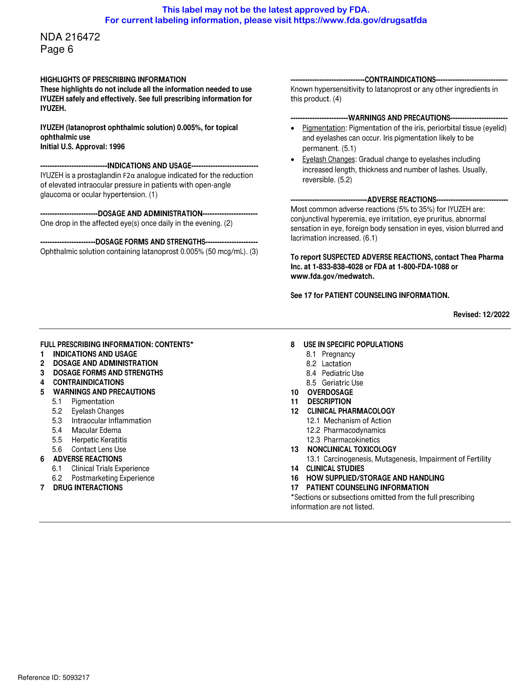

# Page 2

NDA 216472 
Page 7 
FULL PRESCRIBING INFORMATION 
1 
INDICATIONS AND USAGE 
IYUZEH™ (latanoprost ophthalmic solution) 0.005% is indicated for the reduction of elevated intraocular pressure (IOP) 
in patients with open-angle glaucoma or ocular hypertension. 
2 
DOSAGE AND ADMINISTRATION 
The recommended dosage is one drop in the affected eye(s) once daily in the evening. If one dose is missed, treatment 
should continue with the next dose as normal. 
The dosage of IYUZEH should not exceed once daily; the combined use of two or more prostaglandins, or prostaglandin 
analogs including IYUZEH is not recommended. It has been shown that administration of these prostaglandin drug 
products more than once daily may decrease the IOP lowering effect or cause paradoxical elevations in IOP. 
Reduction of the IOP starts approximately 3 to 4 hours after administration and the maximum effect is reached after 8 
to 12 hours. 
IYUZEH may be used concomitantly with other topical ophthalmic drug products to lower IOP. In vitro studies have 
shown that precipitation occurs when eye drops containing thimerosal are mixed with the preserved 0.005% latanoprost 
reference product. If more than one topical ophthalmic drug is being used, the drugs should be administered at least 
five (5) minutes apart. Contact lenses should be removed prior to the administration of IYUZEH and may be reinserted 
15 minutes after administration. 
The solution from one individual unit is to be used immediately after opening for administration to one or both eyes. 
Since sterility cannot be maintained after the individual unit is opened, the remaining contents should be discarded 
immediately after administration. 
3 
DOSAGE FORMS AND STRENGTHS 
Ophthalmic solution: opalescent, white to slightly yellow solution containing latanoprost 0.005% (50 mcg/mL). 
4 
CONTRAINDICATIONS 
Known hypersensitivity to latanoprost or any other ingredients in this product. 
5 
WARNINGS AND PRECAUTIONS 
5.1 
Pigmentation 
Topical latanoprost ophthalmic products, including IYUZEH have been reported to cause changes to pigmented tissues. 
The most frequently reported changes have been increased pigmentation of the iris, periorbital tissue (eyelid), and 
eyelashes. Pigmentation is expected to increase as long as latanoprost is administered. 
The pigmentation change is due to increased melanin content in the melanocytes rather than to an increase in the 
number of melanocytes. After discontinuation of latanoprost, pigmentation of the iris is likely to be permanent, while 
pigmentation of the periorbital tissue and eyelash changes have been reported to be reversible in some patients. 
Patients who receive treatment should be informed of the possibility of increased pigmentation. The long-term effects 
of increased pigmentation are not known. 
Iris color change may not be noticeable for several months to years. Typically, the brown pigmentation around the pupil 
spreads concentrically towards the periphery of the iris and the entire iris or parts of the iris become more brownish. 
Neither nevi nor freckles of the iris appear to be affected by treatment. While treatment with IYUZEH can be continued 
in patients who develop noticeably increased iris pigmentation, these patients should be examined regularly. 
Reference ID: 5093217 
This label may not be the latest approved by FDA.  
For current labeling information, please visit https://www.fda.gov/drugsatfda

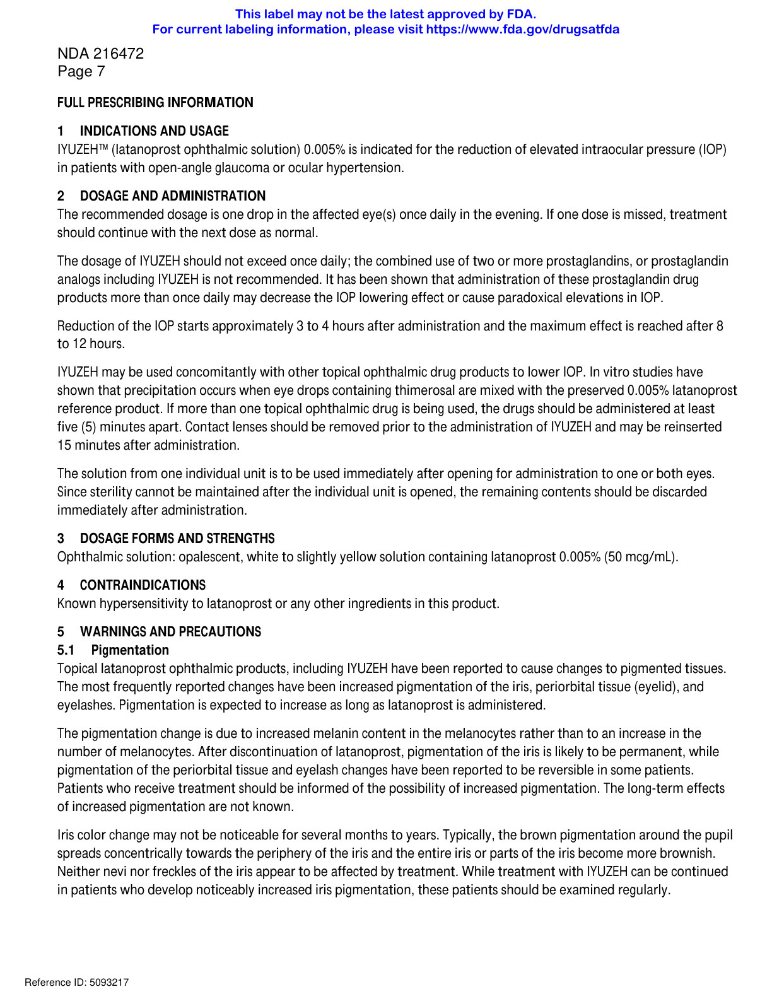

# Page 3

NDA 216472 
Page 8 
5.2 Eyelash Changes 
Latanoprost ophthalmic products, including IYUZEH may gradually change eyelashes and vellus hair in the treated eye; 
these changes include increased length, thickness, pigmentation, the number of lashes or hairs, and misdirected growth 
of eyelashes. Eyelash changes are usually reversible upon discontinuation of treatment. 
5.3 Intraocular Inflammation 
IYUZEH should be used with caution in patients with a history of intraocular inflammation (iritis/uveitis) and should 
generally not be used in patients with active intraocular inflammation because inflammation may be exacerbated. 
5.4 
Macular Edema 
Macular edema, including cystoid macular edema, has been reported during treatment with latanoprost ophthalmic 
products, including IYUZEH. IYUZEH should be used with caution in aphakic patients, in pseudophakic patients with a 
torn posterior lens capsule, or in patients with known risk factors for macular edema. 
5.5 
Herpetic Keratitis 
Reactivation of herpes simplex keratitis has been reported during treatment with latanoprost. IYUZEH should be used 
with caution in patients with a history of herpetic keratitis. IYUZEH should be avoided in cases of active herpes simplex 
keratitis because inflammation may be exacerbated. 
5.6 
Contact Lens Use 
Contact lenses should be removed prior to the administration of IYUZEH and may be reinserted 15 minutes after 
administration. 
6 
ADVERSE REACTIONS 
The following adverse reactions have been reported with the use of topical latanoprost products and are discussed in 
greater detail in other sections of the label: 
 
Iris pigmentation changes [see Warnings and Precautions (5.1)] 
 
Eyelid skin darkening [see Warnings and Precautions (5.1)] 
 
Eyelash changes (increased length, thickness, pigmentation, and number of lashes) [see Warnings and 
Precautions (5.2)] 
 
Intraocular inflammation (iritis/uveitis) [see Warnings and Precautions (5.3)] 
 
Macular edema, including cystoid macular edema [see Warnings and Precautions (5.4)] 
6.1 
Clinical Trials Experience 
Because clinical trials are conducted under widely varying conditions, adverse reaction rates observed in the clinical 
trials of a drug cannot be directly compared to rates in the clinical trials of another drug and may not reflect the rates 
observed in practice. 
In the two clinical trials conducted with IYUZEH (latanoprost ophthalmic solution) 0.005% comparing it to XALATAN the 
preserved 0.005% latanoprost reference product, the most frequently reported ocular adverse reactions were 
conjunctival hyperemia and eye irritation (Table 1). 
Table 1. Ocular Adverse Reactions Reported by ≥ 1% of Subjects Receiving IYUZEH 
Symptom/Finding 
Adverse Reactions (incidence (%)) 
IYUZEH 
(n=378) 
XALATAN 
(n=358) 
Conjunctival hyperemia 
129 (34) 
133 (37) 
Eye irritation 
72 (19) 
112 (31) 
Reference ID: 5093217 
This label may not be the latest approved by FDA.  
For current labeling information, please visit https://www.fda.gov/drugsatfda

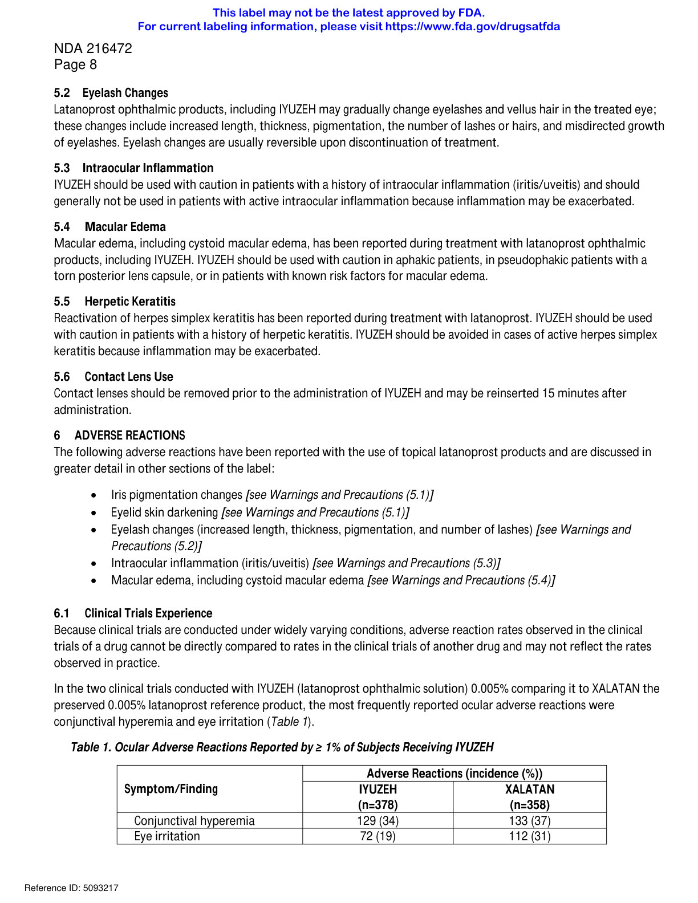

# Page 4

NDA 216472 
Page 9 
Eye pruritus 
57 (15) 
58 (16) 
Abnormal sensation in eye 
51 (14) 
52 (15) 
Foreign body sensation in eyes 
44 (12) 
36 (10) 
Vision blurred 
28 (7) 
30 (8) 
Lacrimation increased 
19 (5) 
14 (4) 
Photophobia 
13 (3) 
17 (5) 
6.2 
Postmarketing Experience 
The following adverse reactions have been identified during post-approval use of topical latanoprost products. Because 
these reactions are reported voluntarily from a population of uncertain size, it is not always possible to reliably estimate 
their frequency or establish a causal relationship to drug exposure. The reactions, which have been chosen for inclusion 
due to either their seriousness, frequency of reporting, possible causal connection to ophthalmic latanoprost products, 
or a combination of these factors, include: 
 
Nervous System Disorders: Dizziness; headache; toxic epidermal necrolysis 
 
Eye Disorders: Eyelash and vellus hair changes of the eyelid (increased length, thickness, pigmentation, and number 
of eyelashes); keratitis; corneal edema and erosions; intraocular inflammation (iritis/uveitis); macular edema, 
including cystoid macular edema; trichiasis; periorbital and lid changes resulting in deepening of the eyelid sulcus; 
iris cyst; eyelid skin darkening; localized skin reaction on the eyelids; conjunctivitis; pseudopemphigoid of the 
ocular conjunctiva. 
 
Respiratory, Thoracic and Mediastinal Disorders: Asthma and exacerbation of asthma; dyspnea 
 
Skin and Subcutaneous Tissue Disorders: Pruritis 
 
Infections and Infestations: Herpes keratitis 
 
Cardiac Disorders: Angina; palpitations; angina unstable 
 
General Disorders and Administration Site Conditions: Chest pain 
7 
DRUG INTERACTIONS 
The combined use of two or more prostaglandins, or prostaglandin analogs including IYUZEH is not recommended. It has 
been shown that administration of these prostaglandin drug products more than once daily may decrease the IOP lowering 
effect or cause paradoxical elevations in IOP. 
8 
USE IN SPECIFIC POPULATIONS 
8.1 
Pregnancy 
Risk Summary 
There are no adequate and well-controlled studies of IYUZEH administration in pregnant women to inform drug-associated 
risks. 
In animal reproduction studies, intravenous (IV) administration of latanoprost to pregnant rabbits and rats throughout the 
period of organogenesis produced malformations, embryofetal lethality and spontaneous abortion at clinically relevant 
doses (equivalent to 1.3 – 324 times the maximum recommended human ophthalmic dose, on a mg/m2 basis, assuming 
100% absorption) (see Data). 
Reference ID: 5093217 
This label may not be the latest approved by FDA.  
For current labeling information, please visit https://www.fda.gov/drugsatfda

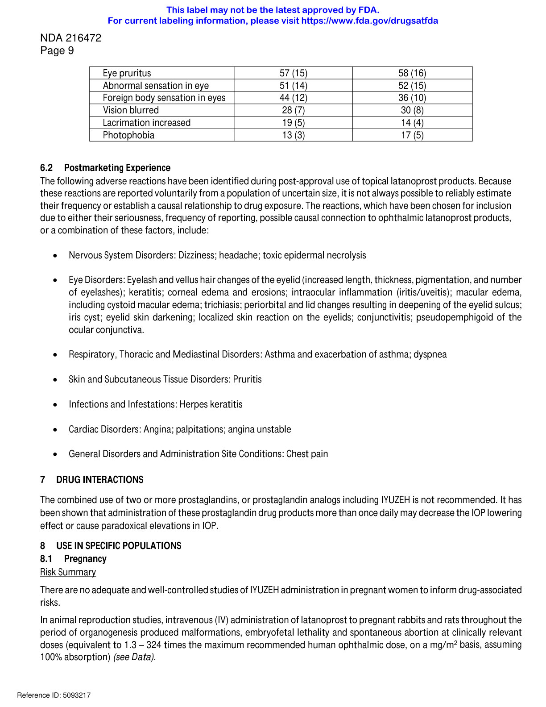

# Page 5

NDA 216472 
Page 10 
The background risk of major birth defects and miscarriage for the indicated population is unknown. However, the 
background risk in the U.S. general population of major birth defects is 2 to 4%, and of miscarriage is 15 to 20% of clinically 
recognized pregnancies. 
Data 
Animal Data 
Embryofetal studies were conducted in pregnant rabbits administered latanoprost daily by IV injection on gestation days 
6 through 18, to target the period of organogenesis. A no observed adverse effect level (NOAEL) was not established for 
rabbit developmental toxicity. Post-implantation loss due to late resorption was shown as doses ≥0.2 mcg/kg/day 
(equivalent to 1.3 times the maximum recommended human ophthalmic dose [RHOD], on a mg/m2 basis, assuming 100% 
absorption). Spina bifida and abortion occurred at 5 mcg/kg/day (equivalent to 32 times the maximum RHOD). Total litter 
loss due to early resorption was observed at doses ≥50 mcg/kg/day (324 times the maximum RHOD). Transient signs of 
maternal toxicity were observed after IV dosing (increased breathing, muscle tremors, slight motor incoordination) at 300 
mcg/kg/day (1946 times the maximum RHOD). No maternal toxicity was observed at doses up to 50 mcg/kg/day. 
Embryofetal studies were conducted in pregnant rats administered latanoprost daily by IV injection on gestation days 6 
through 15, to target the period of organogenesis. A NOAEL for rat developmental toxicity was not established. Cleft palate 
was observed at 1 mcg/kg (equivalent to 3.2 times the maximum RHOD, on a mg/m2 basis, assuming 100% absorption). 
Brain porencephalic cyst(s) were observed ≥50 mcg/kg (162 times the maximum RHOD). Skeletal anomalies were observed 
at 250 mcg/kg (811 times the maximum RHOD). No maternal toxicity was detectable at 250 mcg/kg/day. 
Prenatal and postnatal development was assessed in rats. Pregnant rats were administered latanoprost daily by IV 
injection from gestation day 15, through delivery, until weaning (lactation Day 21). No adverse effects on rat offspring 
were observed at doses up to 10 mcg/kg/day (32 times the maximum RHOD, on a mg/m2 basis, assuming 100% 
absorption). At 100 mcg/kg/day (324 times the maximum RHOD), maternal deaths and pup mortality occurred. 
8.2 
Lactation 
Risk Summary 
It is not known whether this drug or its metabolites are excreted in human milk. Because many drugs are excreted in 
human milk, caution should be exercised when IYUZEH is administered to a nursing woman. 
The developmental and health benefits of breastfeeding should be considered along with the mother’s clinical need 
for IYUZEH and any potential adverse effects on the breastfed child from IYUZEH. 
8.4 
Pediatric Use 
The safety and effectiveness of IYUZEH have not been established in pediatric patients. 
8.5 
Geriatric Use 
No overall differences in safety or effectiveness have been observed between elderly and younger adult patients. 
10 OVERDOSAGE 
Intravenous infusion of up to 3 mcg/kg of latanoprost in healthy volunteers produced mean plasma concentrations 200 
times higher than during clinical treatment with latanoprost ophthalmic solution and no adverse reactions were 
observed. IV dosages of 5.5 to 10 mcg/kg caused abdominal pain, dizziness, fatigue, hot flushes, nausea, and sweating. 
Reference ID: 5093217 
This label may not be the latest approved by FDA.  
For current labeling information, please visit https://www.fda.gov/drugsatfda

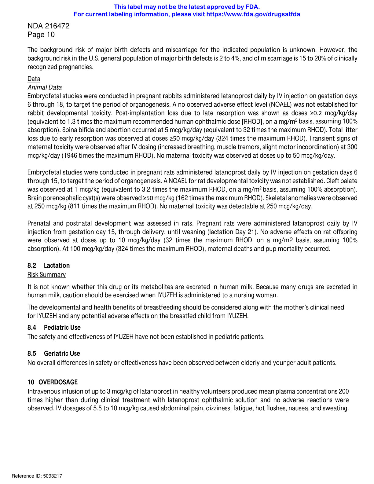

# Page 6

NDA 216472 
Page 11 
11 DESCRIPTION 
Latanoprost is a prostaglandin F2α analogue. Its chemical name is isopropyl-(Z)-7[(1R,2R,3R,5S)3,5dihydroxy-2-[(3R)-3­
hydroxy-5-phenylpentyl]cyclopentyl]-5-heptenoate. Its molecular formula is C26H40O5 and its chemical structure is: 
Latanoprost is a colorless to yellow oil that is very soluble in acetonitrile and freely soluble in ethanol, ethyl acetate, 
and methanol. It is practically insoluble in water and hexanes. 
IYUZEH (latanoprost ophthalmic solution) 0.005% is supplied as a sterile, isotonic, aqueous solution of latanoprost with a 
pH of approximately 7 and an osmolality of approximately 280 mOsmol/kg. Each mL of IYUZEH contains 50 mcg of 
latanoprost. The inactive ingredients are: polyoxyl 40 hydrogenated castor oil, sorbitol, carbomer 974P, polyethylene 
glycol 4000, disodium edetate, sodium hydroxide (for pH-adjustment) and water for injections. One drop contains 
approximately 1.5 mcg of latanoprost. 
IYUZEH does not contain a preservative. 
12 CLINICAL PHARMACOLOGY 
12.1 Mechanism of Action 
Latanoprost is a prostaglandin F2α analogue that is believed to reduce the IOP by increasing the outflow of aqueous humor. 
Studies in animals and man suggest that the main mechanism of action is increased uveoscleral outflow. Elevated IOP 
represents a major risk factor for glaucomatous field loss. The higher the level of IOP, the greater the likelihood of optic 
nerve damage and visual field loss. 
12.2 Pharmacodynamics 
Reduction of the IOP in man starts about 3-4 hours after administration and maximum effect is reached after 8-12 hours. 
IOP reduction is present for at least 24 hours. 
12.3 Pharmacokinetics 
Absorption 
Latanoprost is absorbed through the cornea where the isopropyl ester prodrug is hydrolyzed to the acid form to become 
biologically active. 
Distribution 
The distribution volume in humans is 0.16 ± 0.02 L/kg. The acid of latanoprost can be measured in aqueous humor during 
the first 4 hours, and in plasma only during the first hour after local administration. Studies in man indicate that the peak 
concentration in the aqueous humor is reached about two hours after topical administration. 
Elimination 
Metabolism 
Latanoprost, an isopropyl ester prodrug, is hydrolyzed by esterases in the cornea to the biologically active acid. The active 
acid of latanoprost reaching the systemic circulation is primarily metabolized by the liver to the 1,2-dinor and 1,2,3,4­
tetranor metabolites via fatty acid β-oxidation. 
Reference ID: 5093217 
This label may not be the latest approved by FDA.  
For current labeling information, please visit https://www.fda.gov/drugsatfda

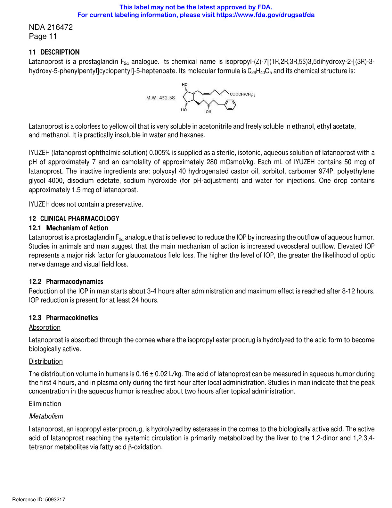

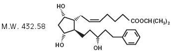

# Page 7

NDA 216472 
Page 12 
Excretion 
The elimination of the acid of latanoprost from human plasma is rapid (t1/2 = 17 min) after both IV and topical 
administration. Systemic clearance is approximately 7 mL/min/kg. Following hepatic β-oxidation, the metabolites are 
mainly eliminated via the kidneys. Approximately 88% and 98% of the administered dose are recovered in the urine after 
topical and IV dosing, respectively. 
13 NONCLINICAL TOXICOLOGY 
13.1 Carcinogenesis, Mutagenesis, Impairment of Fertility 
Carcinogenesis 
Latanoprost was not carcinogenic in either mice or rats when administered by oral gavage at doses of up to 170 
mcg/kg/day (approximately 2800 times the recommended maximum human dose) for up to 20 and 24 months, 
respectively. 
Mutagenesis 
Latanoprost was not mutagenic in bacteria, in mouse lymphoma, or in mouse micronucleus tests. Chromosome 
aberrations were observed in vitro with human lymphocytes. Additional in vitro and in vivo studies on unscheduled DNA 
synthesis in rats were negative. 
Impairment of Fertility 
Latanoprost has not been found to have any effect on male or female fertility in rat studies at IV doses up to 250 
mcg/kg/day (811 times the maximum RHOD, on a mg/m2 basis, assuming 100% absorption). 
14 CLINICAL STUDIES 
14.1 Elevated Baseline IOP 
In randomized, controlled clinical trials of patients with open angle glaucoma or ocular hypertension with mean baseline 
IOP of 19 - 24 mmHg, IYUZEH lowered IOP by 3 – 8 mmHg versus 4 – 8 mmHg by latanoprost ophthalmic solution 
preserved with benzalkonium chloride. Latanoprost ophthalmic solution preserved with benzalkonium chloride was 
approximately 1 mmHg more effective than IYUZEH. 
16 HOW SUPPLIED/STORAGE AND HANDLING 
IYUZEH (latanoprost ophthalmic solution) is an opalescent, isotonic, white to slightly yellow solution of latanoprost 50 
mcg/mL (0.005%) practically free from foreign particles. 
It is supplied as a sterile solution in translucent low-density polyethylene single-dose container packaged in foil pouches 
(5 single-dose containers per pouch). 
NDC 82584-003-30; Unit-of-Use Carton of 30 
Storage: 
Store at 15°C to 25°C (59°F to 77°F). 
Store in the original pouch. After the pouch is opened, the single-dose containers may be stored in the opened foil 
pouch for up to 30 days at room temperature 15°C to 25°C (59°F to 77°F). 
Patient should be advised to write down the date the foil pouch is opened in the space provided on the pouch. 
Discard any unused containers 30 days after first opening the pouch. 
Reference ID: 5093217 
This label may not be the latest approved by FDA.  
For current labeling information, please visit https://www.fda.gov/drugsatfda

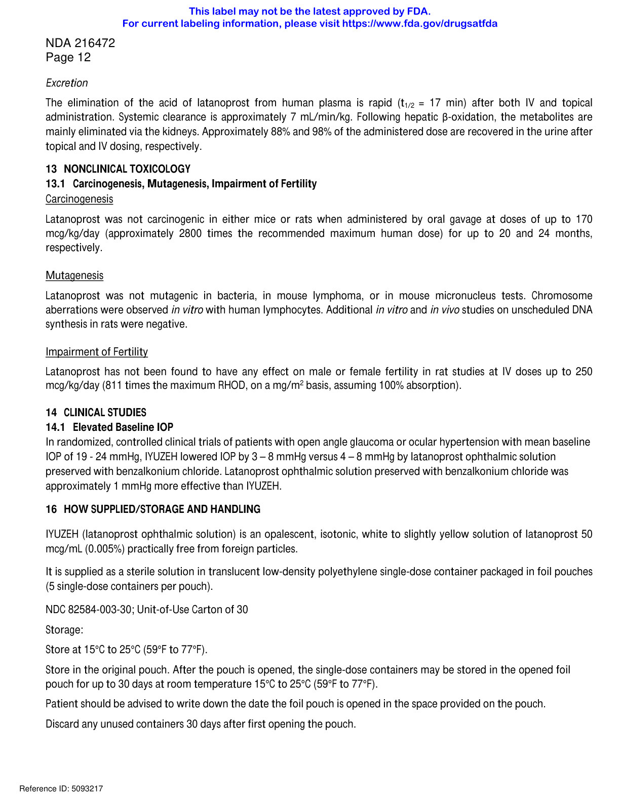

# Page 8

NDA 216472 
Page 13 
17 PATIENT COUNSELING INFORMATION 
Potential for Pigmentation 
Advise patients about the potential for increased brown pigmentation of the iris, which may be permanent. Inform 
patients about the possibility of eyelid skin darkening, which may be reversible after discontinuation of IYUZEH. 
Potential for Eyelash Changes 
Inform patients of the possibility of eyelash and vellus hair changes in the treated eye during treatment with latanoprost 
ophthalmic solution. These changes may result in a disparity between eyes in length, thickness, pigmentation, number of 
eyelashes or vellus hairs, and/or direction of eyelash growth. Eyelash changes are usually reversible upon discontinuation 
of treatment. 
Handling the Container 
Advise patients that IYUZEH is a sterile solution that does not contain a preservative. The drops are supplied in single-dose 
container. The solution from one individual container is to be used immediately after opening for administration to one 
or both eyes. Since sterility cannot be maintained after the individual container is opened, the remaining contents should 
be discarded immediately after administration. Open a new single-dose container every time you use IYUZEH. 
When to Seek Physician Advice 
Advise patients that if they develop an intercurrent ocular condition (e.g., trauma or infection) or have ocular surgery, or 
develop any ocular reactions, particularly conjunctivitis and eyelid reactions, they should immediately seek their 
physician’s advice concerning the continued use of IYUZEH. 
Contact Lens Use 
Advise patients that contact lenses should be removed prior to administration of the solution. Lenses may be reinserted 
15 minutes following administration of IYUZEH. 
Use with Other Ophthalmic Drugs 
Advise patients that if more than one topical ophthalmic drug is being used, the drugs should be administered at least five 
(5) minutes apart. 
If a Dose is Missed 
Advise patients that if one dose is missed, treatment should continue with the next dose as normal. 
Manufactured for: Thea Pharma Inc. Lexington, MA. 
All rights reserved. 
U.S. Patent N°. 8,637,054. ©2021, Laboratoires Théa. All rights reserved. IYUZEH™ is a trademark of Laboratoires Théa. 
Reference ID: 5093217 
This label may not be the latest approved by FDA.  
For current labeling information, please visit https://www.fda.gov/drugsatfda

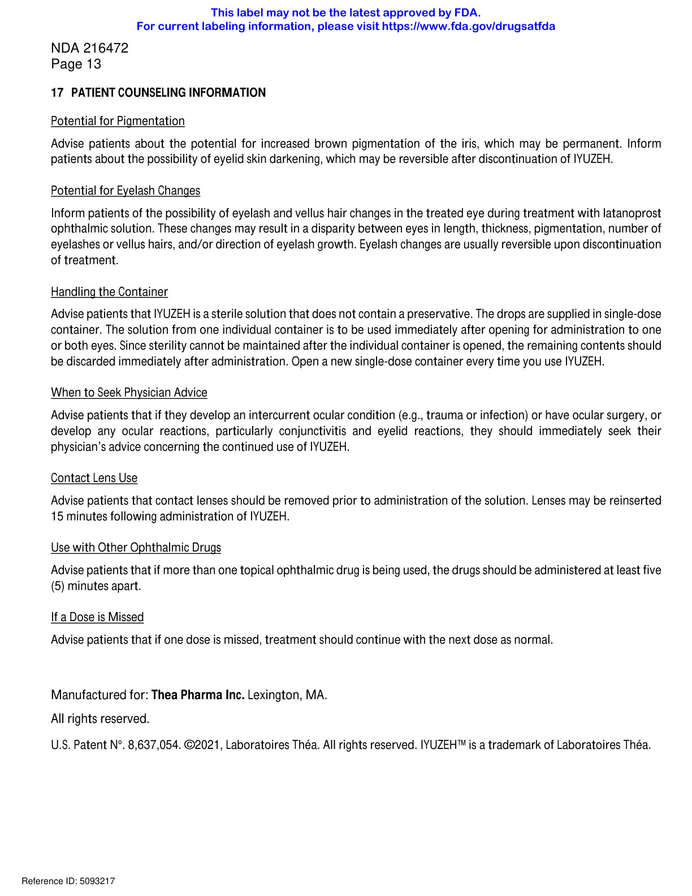

# Page 9

NDA 216472 
Page 14 
PATIENT INFORMATION 
IYUZEH™ (eye yoo’ zeh) 
(latanoprost ophthalmic solution) 0.005% 
For topical ophthalmic use 
What is IYUZEH? 
IYUZEH is a prescription sterile eye drop solution which does not contain a preservative. IYUZEH is used to lower the 
pressure in the eye (intraocular pressure) in people with open-angle glaucoma or ocular hypertension when their eye 
pressure is too high. IYUZEH belongs to a group of medicines called prostaglandin analogs. 
It is not known if IYUZEH is safe and effective in children. 
Do not use IYUZEH if you are allergic latanoprost or any of the ingredients in IYUZEH. See the end of this Patient 
Information leaflet for a complete list of ingredients in IYUZEH. 
Before you use IYUZEH, tell your doctor if you: 
 
have or have had eye problems including any surgery on your eye or eyes 
 
are using any other eye medicines 
 
have any other medical problems 
 
are pregnant or plan to become pregnant. It is not known if IYUZEH will harm your unborn baby. If you become 
pregnant while using IYUZEH talk to your doctor right away. 
 
are breastfeeding or plan to breastfeed. It is not known if IYUZEH passes into your breast milk. Talk to your doctor 
about the best way to feed your baby if you use IYUZEH. 
Tell your doctor about all the medicines you take, including prescription and over-the-counter medicines, vitamins, 
and herbal supplements. 
Know the medicines you take. Keep a list of them to show your doctor and pharmacist when you get a new medicine. 
How should I take IYUZEH? 
Read the Instructions for Use at the end of this Patient Information leaflet for additional instructions about the right 
way to use IYUZEH. 
 
Use 1 drop of IYUZEH in your eye (or eyes) each evening. Talk to your doctor or pharmacist if you are not sure 
how to use IYUZEH. 
 
Your IYUZEH may not work as well if you use it more than 1 time each evening. 
 
If you miss a dose of IYUZEH, skip the missed dose and take the next dose at your regular time. 
 
If you use other medicines in your eye, wait at least 5 minutes between using IYUZEH and your other eye 
medicines. 
 
Contact lenses should be taken out before using IYUZEH and you should wait at least 15 minutes after giving the 
dose of IYUZEH before putting the contact lenses back into your eyes. 
 
Use your IYUZEH right away after opening. Each IYUZEH single-dose container is sterile and is to be used 1 time 
then thrown away. Do not save any IYUZEH that may be left over after you use your medicine. Using IYUZEH that 
is not sterile may cause other eye problems. 
What are the possible side effects of IYUZEH? 
IYUZEH may cause serious side effects including: 
 
changes in the color of your eye (iris). Your iris may become more brown in color while using IYUZEH. This color 
change may not go away when you stop using IYUZEH. If IYUZEH is used in 1 eye only, the color of that eye may 
always be a different color from the color of your other eye. 
 
darkening of the color of the skin around your eye (eyelid). These skin changes usually go away when you stop 
using IYUZEH. 
 
increasing the length, thickness, color, or number of your eyelashes. These eyelash changes usually go away 
when you stop using IYUZEH. 
 
hair growth on your eyelids. This hair growth usually goes away when you stop using IYUZEH. 
The most common side effects of IYUZEH include: 
 
redness of and around the eye (conjunctival 
 
abnormal sensation in the eye 
hyperemia) 
 
foreign body sensation in the eye 
 
eye irritation 
 
blurry vision 
Reference ID: 5093217 
This label may not be the latest approved by FDA.  
For current labeling information, please visit https://www.fda.gov/drugsatfda

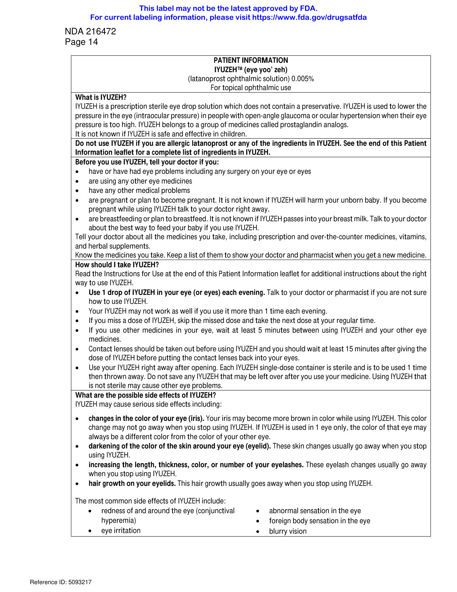

# Page 10

NDA 216472 
Page 15 
 
eye itching 
 
increase of tears in the eye (increased lacrimation) 
Tell your doctor right away if you have any new eye problems while using IYUZEH, including: 
 
an eye injury 
 
an eye infection 
 
a sudden loss of vision 
 
eye surgery 
 
swelling and redness of and around your eye (conjunctivitis) 
 
problems with your eyelids 
Additionally, the following side effects have been reported in other latanoprost medicines like IYUZEH, when used in 
the eye (topical use): 
 
dizziness 
 
headache 
 
peeling skin over much of the body (toxic epidermal necrolysis) 
 
worsening of asthma 
 
shortness of breath (dyspnea) 
 
itching 
 
viral infection of the cornea (herpes keratitis) 
 
chest pain caused by interruptions in the heart’s blood supply, that can occur at rest (angina, unstable angina) 
 
awareness of heart rhythm (palpitations) 
 
chest pain 
Tell your doctor if you have any side effect that bothers you or does not go away. 
These are not all the possible side effects of IYUZEH. For more information, ask your doctor or pharmacist. 
Call your doctor for medical advice about side effects. You may report side effects to FDA at 1-800-FDA-1088. 
How should I store IYUZEH? 
Before opening the foil pouches: 
 
Store the unopened foil pouches between 59°F to 77°F (15°C to 25°C). 
 
Do not open the foil pouch containing IYUZEH until you are ready to use the eye drops. 
After opening the foil pouch: 
 
Store the opened foil pouch between 59°F to 77°F (15°C to 25°C), for up to 30 days. 
 
Write down the date of first opening the foil pouch in the space provided on the pouch. 
 
Throw away all unused IYUZEH single-dose containers in the opened foil pouch after 30 days. 
 
Keep the IYUZEH single-dose containers in their original foil pouch. 
Keep IYUZEH and all medicines out of the reach of children. 
General information about the safe and effective use of IYUZEH. 
Medicines are sometimes prescribed for purposes other than those listed in a Patient Information leaflet. Do not use 
IYUZEH for a condition for which it was not prescribed. Do not give IYUZEH to other people, even if they have the 
same symptoms that you have. It may harm them. 
You can ask your pharmacist or doctor for information about IYUZEH that is written for health professionals. 
What are the ingredients in IYUZEH? 
Active ingredients: latanoprost 
Reference ID: 5093217 
This label may not be the latest approved by FDA.  
For current labeling information, please visit https://www.fda.gov/drugsatfda

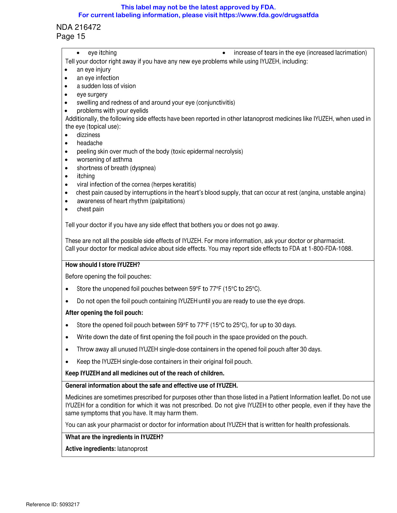

# Page 11

NDA 216472 
Page 16 
Inactive ingredients: polyoxyl 40 hydrogenated castor oil, sorbitol, carbomer 974P, polyethylene glycol 4000, 
disodium edetate, sodium hydroxide (for pH-adjustment) and water. 
Manufactured for: Thea Pharma Inc. Lexington, MA. 
All rights reserved. 
U.S. Patent N°. 8,637,054. ©2021, Laboratoires Théa. All rights reserved. IYUZEH™ is a trademark of Laboratoires 
Théa. 
This Patient Information has been approved by the U.S. Food and Drug Administration             Revised: 12/2022 
Reference ID: 5093217 
This label may not be the latest approved by FDA.  
For current labeling information, please visit https://www.fda.gov/drugsatfda

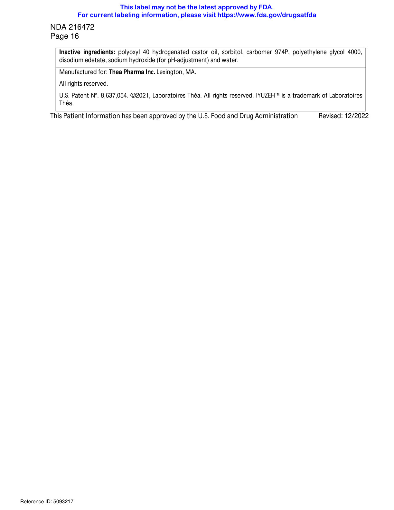

# Page 12

NDA 216472 
Page 17 
Instructions for Use 
Read these Instructions for Use before using your IYUZEH™ and each time you get a refill. There may be 
new information. This leaflet does not take the place of talking with your doctor about your medical 
condition or your treatment. 
Important: 
 
IYUZEH is for the eye. Do not swallow IYUZEH. 
 
IYUZEH single-dose containers are packaged in a foil pouch. 
 
Do not dose the IYUZEH single-dose containers if the foil pouch is opened. 
 
Write down the date you open the foil pouch in the space provided on the pouch. 
 
Do not open the IYUZEH single-dose container until you are ready to use the eye drops. 
Please follow these instructions to use IYUZEH: 
Step 1. 
Wash your hands and sit or stand 
comfortably. 
Step 2. 
Open the foil pouch containing a strip of 
5 single-dose containers. 
Write down the date of first opening on 
the foil pouch. 
Step 3. 
Take the strip of single-dose containers 
from the foil pouch 
Break off one single-dose container from 
the strip 
Place 
the 
unopened 
single-dose 
containers back in the foil pouch and fold 
the edge to close the pouch. 
 
 
 
 
 
 
 
 
 
 
 
 
 
 
 
 
 
 
 
 
 
 
 
 
 
 
 
 
 
 
 
 
 
 
  
 
 
 
 
 
 
 
Step 4. 
Hold the single-dose container upright. 
Make sure that your IYUZEH medicine is 
in the bottom part of the single-dose 
container. 
Twist open the top of the single-dose 
container as shown. Do not touch the tip 
after opening the container. 
Reference ID: 5093217 
This label may not be the latest approved by FDA.  
For current labeling information, please visit https://www.fda.gov/drugsatfda

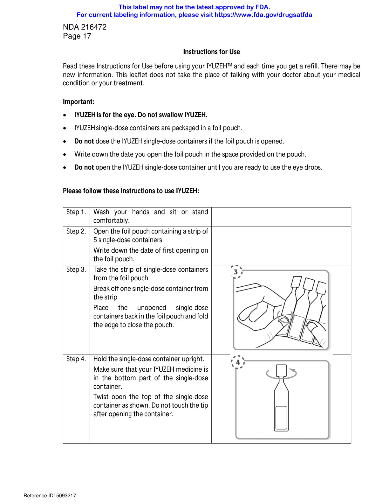

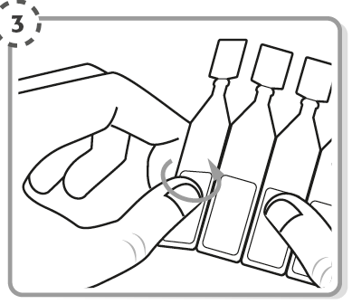

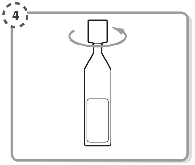

# Page 13

NDA 216472 
Page 18 
Step 5. 
Tilt your head backwards. If you are 
unable to tilt your head, lie down. 
Use your finger to gently pull down the 
lower eyelid of your affected eye. 
 
 
 
 
 
 
 
 
 
 
 
 
 
 
 
 
 
 
 
 
 
 
 
 
 
 
 
 
 
 
 
 
 
 
 
 
 
 
 
 
Step 6. 
Place the tip of the single-dose container 
close to, but not touching your eye. 
Step 7. 
Squeeze 
the 
single-dose 
container 
gently so that only one drop goes into 
your eye, then release the lower eyelid. 
If the drop misses your eye completely, 
try again. 
 
If your doctor has told you to use IYUZEH drops in both eyes, repeat Steps 5 to Step 7 for your other 
eye. 
 
Each single-dose container contains enough solution for both eyes. 
 
Throw away the single-dose container after use. Do not keep it to use it again. To lessen the chance 
of an infection, a new single-dose container must be opened each time you are ready to use IYUZEH. 
 
Place the unopened foil pouch with the unopened single-dose containers back in the carton. The 
unopened single-dose containers must be used within 30 days after opening the foil pouch. 
Rx 
Manufactured for: Thea Pharma Inc. Lexington, MA. 
All rights reserved. 
U.S. Patent N°. 8,637,054. ©2021, Laboratoires Théa. All rights reserved. IYUZEH™ is a trademark of 
Laboratoires Théa. 
This Patient Information and Instructions for Use have been approved by the U.S. Food and 
Drug Administration. 
Approved: 12/2022 
Reference ID: 5093217 
This label may not be the latest approved by FDA.  
For current labeling information, please visit https://www.fda.gov/drugsatfda

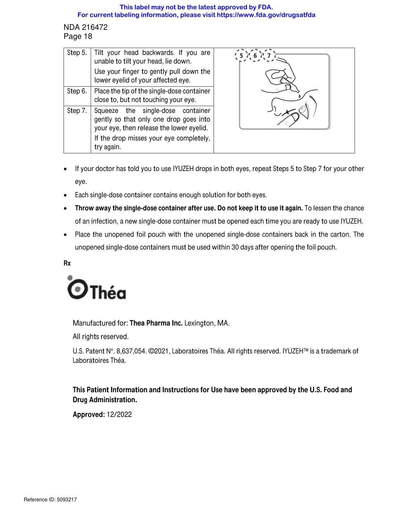

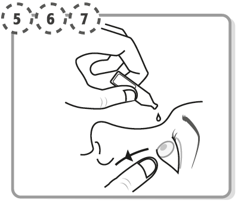

